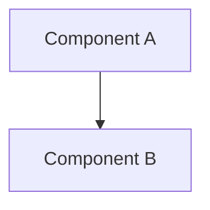

# 技術設計書テンプレート (Design Doc)

このドキュメントは `.sdd/specification/` 配下の技術設計書（Design Doc）を作成する際のテンプレートです。
ファイル名は `{機能名}_design.md` となります。

> **本プロジェクト向けの補足**: 本リポジトリは Claude Code プラグインのマーケットプレイスです。
> 設計対象は主にスキル・エージェント・フック・スクリプト（Bash/Python）の構成であり、
> 一般的なアプリケーションコードではありません。

## 抽象仕様書との違い

抽象仕様書（`xxx_spec.md`）が「何を作るか・なぜ作るか」を定義するのに対し、
本ドキュメントは「どのように実現するか」を定義します（詳細な比較表は `SPECIFICATION_TEMPLATE.md` を参照）。

---

# {機能名} `<MUST>`

**関連 Spec:** [xxx_spec.md へのリンク]
**関連 PRD:** [requirement/{機能名}.md へのリンク]
**準拠する原則:** [CONSTITUTION.md](../CONSTITUTION.md) の該当原則ID（例: A-001, T-001）を記載

---

# 1. 実装ステータス `<MUST>`

**ステータス:** 🟢 実装済み / 🟡 部分実装 / 🔴 未実装

## 1.1. 実装進捗 `<OPTIONAL>`

| モジュール/機能 | ステータス    | 備考   |
|----------|----------|------|
| [モジュール]  | 🟢/🟡/🔴 | [備考] |

---

# 2. 設計目標 `<MUST>`

本設計が達成すべき主要な技術目標を記述します。

---

# 3. 実装方式 `<MUST>`

**なぜその実装方式を選んだのか** という判断の根拠を明確に残します。
（例: Markdown プロンプト / Bash スクリプト / Python スクリプト / hooks.json のいずれで実現するか）

| 領域（skill/agent/hook/script） | 採用方式                       | 選定理由 |
|-----------------------------|----------------------------|------|
| [領域]                        | [例: Bash スクリプト + 2フェーズ実行]  | [理由] |

---

# 4. アーキテクチャ `<MUST>`

## 4.1. システム構成図



## 4.2. モジュール分割

| モジュール名 | 責務   | 依存関係 | 配置場所 |
|--------|------|------|------|
| [名前]   | [責務] | [依存] | [パス] |

---

# 5. データ構造 `<OPTIONAL>`

設定ファイル・front matter・スクリプト間で受け渡す JSON 等の構造を記載します。

```json
{
  "example-field": "value"
}
```

---

# 6. ファイル構成 `<OPTIONAL>`

追加・変更するファイルの配置を記載します。

```
plugins/sdd-workflow/
├── skills/{name}/
│   ├── SKILL.md
│   ├── scripts/
│   └── templates/{en,ja}/
└── .claude-plugin/plugin.json   # 登録を忘れない（T-002）
```

---

# 7. 非機能要件実現方針 `<OPTIONAL>`

| 要件   | 実現方針 |
|------|------|
| [要件] | [方針] |

---

# 8. テスト戦略 `<OPTIONAL>`

| テストレベル | 対象   | カバレッジ目標 |
|--------|------|---------|
| [レベル]  | [対象] | [目標]    |

---

# 9. 設計判断 `<MUST>`

## 9.1. 決定事項

| 決定事項 | 選択肢 | 決定内容 | 理由   |
|------|-----|------|------|
| [事項] | [肢] | [決定] | [理由] |

## 9.2. 未解決の課題 `<OPTIONAL>`

| 課題   | 影響度 | 対応方針 |
|------|-----|------|
| [課題] | [度] | [方針] |

---

# 10. 原則準拠チェックリスト `<RECOMMENDED>`

[CONSTITUTION.md](../CONSTITUTION.md) の原則に対する準拠状況を確認します。

| 原則ID  | 原則名 | 準拠状況 | 備考   |
|-------|-----|------|------|
| [A-XXX/T-XXX等] | [原則名] | ✅/⚠️/❌ | [備考] |

**原則から逸脱する場合**: 理由を「9.1. 決定事項」に明記し、CONSTITUTION.md の例外プロセスに従うこと。

---

# 11. 変更履歴 `<OPTIONAL>`

## vX.X

**変更内容:**

- 変更1

**移行ガイド:**

```
# ❌ 旧構成・旧手順
# ✅ 新構成・新手順
```

---

# セクション必須度の凡例

| マーク             | 意味 | 説明                   |
|-----------------|----|----------------------|
| `<MUST>`        | 必須 | すべての技術設計書で必ず記載してください |
| `<RECOMMENDED>` | 推奨 | 可能な限り記載することを推奨します    |
| `<OPTIONAL>`    | 任意 | 必要に応じて記載してください       |

---

# ガイドライン

## 含めるべき内容

- ✅ 実装ステータス・進捗
- ✅ 実装方式の選定理由
- ✅ アーキテクチャ・モジュール構成
- ✅ 実装パターン・デザインパターンの適用
- ✅ ディレクトリ構造・ファイル配置
- ✅ テスト戦略・カバレッジ目標
- ✅ 設計判断の記録
- ✅ 変更履歴・移行ガイド
- ✅ CONSTITUTION.md の原則準拠チェック

## 含めないべき内容（→ Spec へ）

- ❌ 機能の目的と背景
- ❌ ユーザーストーリー・ユースケース
- ❌ 提供コンポーネント（スキル・エージェント・フック等）の定義
- ❌ データモデルの論理構造
- ❌ 振る舞いの抽象的な記述
- ❌ 機能要件・非機能要件
- ❌ 用語集

---

# Pseudocode の完全性ルール

Design Doc に記載する pseudocode（データ構造・スクリプトの処理フロー等のコード例）は、
**verbatim でコピーしても動作する完全性**を維持してください。
実装への転記段階で細部が乖離すると、レビュー指摘や実行時エラーの原因になります。

本リポジトリで使用する言語（Python / Bash）に合わせたルールを記載します。
言語が増えた場合は sub-section を追加してください。

## Python 共通

- すべての import 文を明示する（型注釈で参照する型も含む）
- `isinstance` チェックは BaseException 階層に注意（`asyncio.CancelledError` は Python 3.8+ で
  `Exception` のサブクラスではない）
- `x if x else fallback` の `x` が `""` / `[]` / `0` を取りうる場合は
  `x if x is not None else fallback` で明示する

## Bash / POSIX sh

- shebang とオプション（`set -e` 等）を含めて記載し、POSIX 互換要件（macOS bash 3.2 / dash）を明示する
- 外部コマンド（`jq` 等）への依存はコード例に含めて明示する

---

**この Design Docは、AIエージェントが実装（Implement）フェーズで参照する、具体的なコード生成のための指針となります。**
