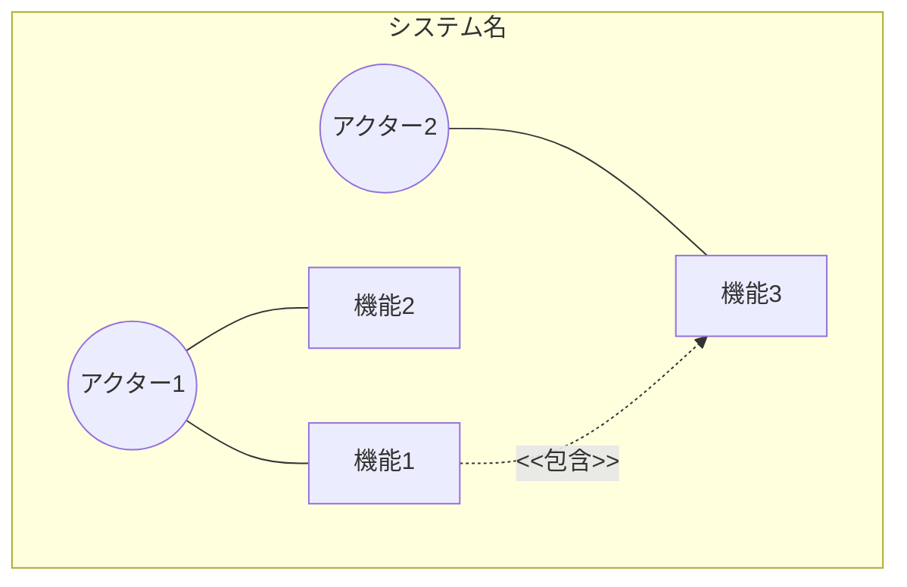
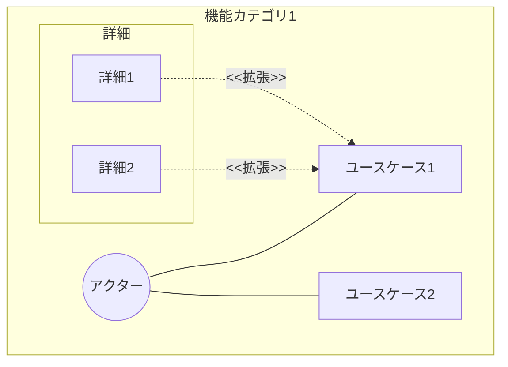
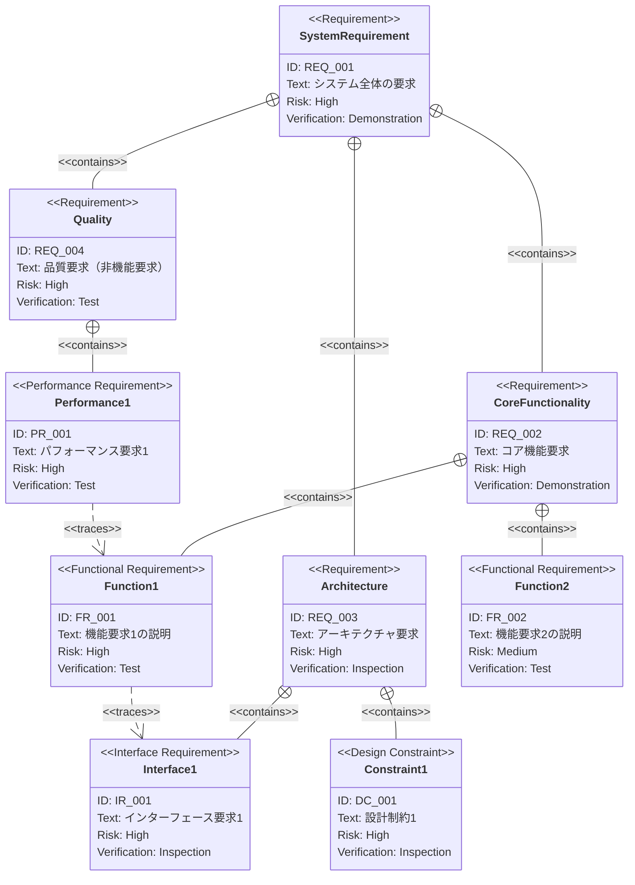
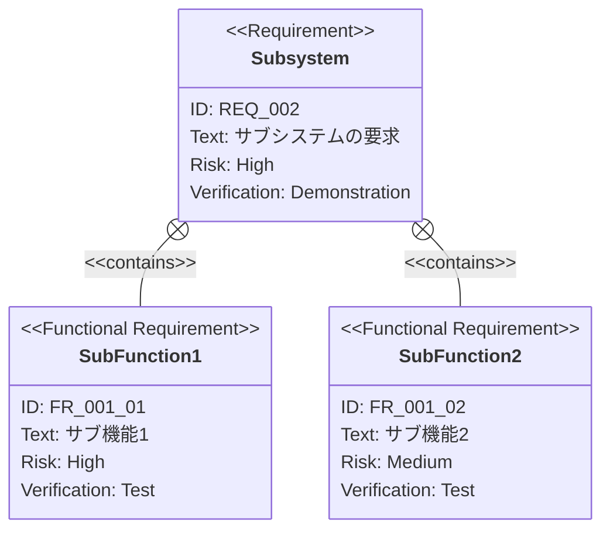

# PRD（要求仕様書）テンプレート

このドキュメントは `.sdd/requirement/` 配下のPRD（要求仕様書）を作成する際のテンプレートです。
ファイル名は `{機能名}.md` となります。

> **本プロジェクト向けの補足**: 本リポジトリは Claude Code プラグインのマーケットプレイスです。
> PRD の対象は主にプラグイン機能（スキル・エージェント・フック）への要求であり、
> アクターはプラグイン利用者（開発者）と Claude Code 本体が中心となります。

## 仕様書・設計書との違い

| ドキュメント             | SDDフェーズ          | 役割と焦点                                               | 抽象度      |
|--------------------|------------------|-----------------------------------------------------|----------|
| `requirement/*.md` | **Specify（仕様化）** | **「何を作るか」「なぜ作るか」** - ビジネス要求を定義。技術詳細は含めない            | 最高（抽象的）  |
| `xxx_spec.md`      | **Specify（仕様化）** | **「何を作るか」** - システムの抽象的な構造と振る舞いを定義。技術的詳細は含めない        | 高（抽象的）   |
| `xxx_design.md`    | **Plan（計画/設計）**  | **「どのように実現するか」** - 抽象仕様を実現するための具体的な技術設計。設計判断の透明性を確保 | 中〜低（具体的） |

---

# {機能名} 要求仕様書 `<MUST>`

**準拠する原則:** [CONSTITUTION.md](../CONSTITUTION.md)（参照した版: `vX.Y.Z` を記載）のうち、本 PRD の要求が前提とする原則ID（例: B-001, B-002）を記載します。`prd-reviewer` エージェントが CONSTITUTION 準拠をレビューするため、SPEC/DESIGN と同様に明記して 3 層（PRD → spec → design）の一貫性を保ちます。

## 概要 `<MUST>`

このドキュメントの目的と対象範囲を簡潔に説明します。

---

# 1. 要求図の読み方 `<RECOMMENDED>`

SysML 要求図の記法（要求タイプ・リスクレベル・検証方法・関係タイプ）の凡例です。
各PRDに繰り返し記載せず、本テンプレートを参照してください。

| 分類     | 値                                                                                              |
|--------|------------------------------------------------------------------------------------------------|
| 要求タイプ  | `requirement`（一般） / `functionalRequirement`（機能） / `performanceRequirement`（性能） / `interfaceRequirement`（IF） / `designConstraint`（設計制約） |
| リスクレベル | `High`（クリティカル・実装困難） / `Medium`（重要だが代替可能） / `Low`（Nice to have）                                 |
| 検証方法   | `Analysis`（分析） / `Test`（テスト） / `Demonstration`（デモ） / `Inspection`（レビュー）                         |
| 関係タイプ  | `contains`（包含） / `derives`（派生） / `satisfies`（満足） / `verifies`（検証） / `refines`（詳細化） / `traces`（トレース） |

**本プロジェクトの記法規約**（レビュー時の解釈ブレを防ぐための統一ルール）:

- 機能要求からユーザー要求への派生は `FR - derives -> UR` の方向で記載する
- 制約・非機能要求（NFR / IR / DC）から対象要求への関連は `制約 - traces -> 要求` の方向で記載する
  （制約を起点として「どの要求に効くか」を示す本プロジェクトの統一方向。SysML の厳密な traces 意味論より一貫性を優先する）
- 非機能要求の ID プレフィックスは `NFR` に統一する（要求タイプは内容に応じて `requirement` / `performanceRequirement` 等を選択してよい）
- Mermaid requirementDiagram に `nonfunctionalRequirement` タイプは存在しないため使用しない
- 要求 ID（`UR_001` 等）のスコープは各 PRD ファイル内とする。PRD をまたいで参照する場合はファイル名と ID を併記する

---

# 2. 要求一覧 `<MUST>`

## 2.1. ユースケース図（概要） `<RECOMMENDED>`

主要機能とアクターの関係を示す概要図です。

## 2.2. ユースケース図（詳細） `<OPTIONAL>`

### {機能カテゴリ1}

## 2.3. 機能一覧（テキスト形式） `<MUST>`

- 機能カテゴリ1
    - サブ機能1-1
        - 詳細1-1-1
        - 詳細1-1-2
    - サブ機能1-2
- 機能カテゴリ2
    - サブ機能2-1

---

# 3. 要求図（SysML Requirements Diagram） `<MUST>`

## 3.1. 全体要求図

## 3.2. 主要サブシステム詳細図 `<OPTIONAL>`

### {サブシステム名}

---

# 4. 要求の詳細説明 `<MUST>`

## 4.1. 機能要求

### FR_001: {機能要求名}

{機能の詳細な説明}

**含まれる機能:**

- FR_001_01: {サブ機能1}
- FR_001_02: {サブ機能2}

**検証方法:** テストによる検証

### FR_002: {機能要求名}

{機能の詳細な説明}

**検証方法:** テストによる検証

## 4.2. パフォーマンス要求 `<OPTIONAL>`

### PR_001: {パフォーマンス要求名}

{パフォーマンス要求の詳細な説明と目標値}

**検証方法:** テストによる検証

## 4.3. インターフェース要求 `<OPTIONAL>`

### IR_001: {インターフェース要求名}

{インターフェース要求の詳細な説明}

**検証方法:** インスペクションによる検証

## 4.4. 設計制約 `<OPTIONAL>`

### DC_001: {設計制約名}

{設計制約の詳細な説明}

**検証方法:** インスペクションによる検証

---

# 5. 制約事項 `<OPTIONAL>`

## 5.1. 技術的制約

- 技術的な制約

## 5.2. ビジネス的制約

- ビジネス的な制約（スケジュール、予算など）

---

# 6. 前提条件 `<OPTIONAL>`

- この機能が動作するための前提
- 依存する他システム・機能

---

# 7. スコープ外 `<OPTIONAL>`

以下は本PRDのスコープ外とします：

- この機能に含まれないこと
- 将来的に検討する可能性があるが、今回は対象外

---

# 8. 用語集 `<RECOMMENDED>`

> **注意**: 用語集が大きくなる場合は、別ファイル（`glossary.md`）として管理することを推奨します。

| 用語   | 定義   |
|------|------|
| [用語] | [定義] |

---

# セクション必須度の凡例

| マーク             | 意味 | 説明                 |
|-----------------|----|--------------------|
| `<MUST>`        | 必須 | すべてのPRDで必ず記載してください |
| `<RECOMMENDED>` | 推奨 | 可能な限り記載することを推奨します  |
| `<OPTIONAL>`    | 任意 | 必要に応じて記載してください     |

---

# ガイドライン

## 含めるべき内容

- ✅ 概要と目的
- ✅ ユースケース図（概要・詳細）
- ✅ SysML要求図（requirementDiagram構文）
- ✅ 要求の詳細説明（機能要求、パフォーマンス要求、インターフェース要求、設計制約）
- ✅ 要求間の関係（contains, derives, satisfies, verifies, refines, traces）
- ✅ 制約事項・前提条件
- ✅ スコープ外の明示
- ✅ 用語集

## 含めないべき内容（→ Spec / Design Doc へ）

- ❌ 技術的な実装詳細
- ❌ アーキテクチャ・モジュール構成
- ❌ 技術スタックの選定
- ❌ API定義・型定義
- ❌ データベーススキーマ

## 新規要件追加時の下流伝播チェックリスト

新規要件 ID（FR/PR/IR/DC 等）の追加・リネーム時に以下をすべて満たすこと：

- [ ] PRD 内の ID が昇順（`XX_001`, `XX_002`, ...）を保っている
- [ ] spec のトレーサビリティ表に対応行を追加した
- [ ] design のトレーサビリティ表に対応行を追加した
- [ ] ID 命名規約（プロジェクトで定義した規則。例: `FR_001`）を守っている
- [ ] requirement-analyzer エージェントを実行して整合確認した
- [ ] 3 層（PRD / spec / design）のトレース行が同一 PR に含まれている

---

**このPRDは、AIエージェントが仕様化（Specify）フェーズで参照する、ビジネス要求の真実の源となります。**
