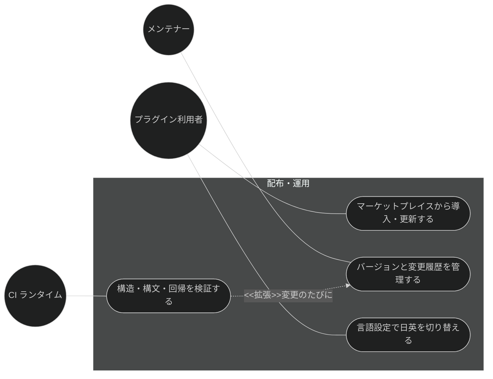
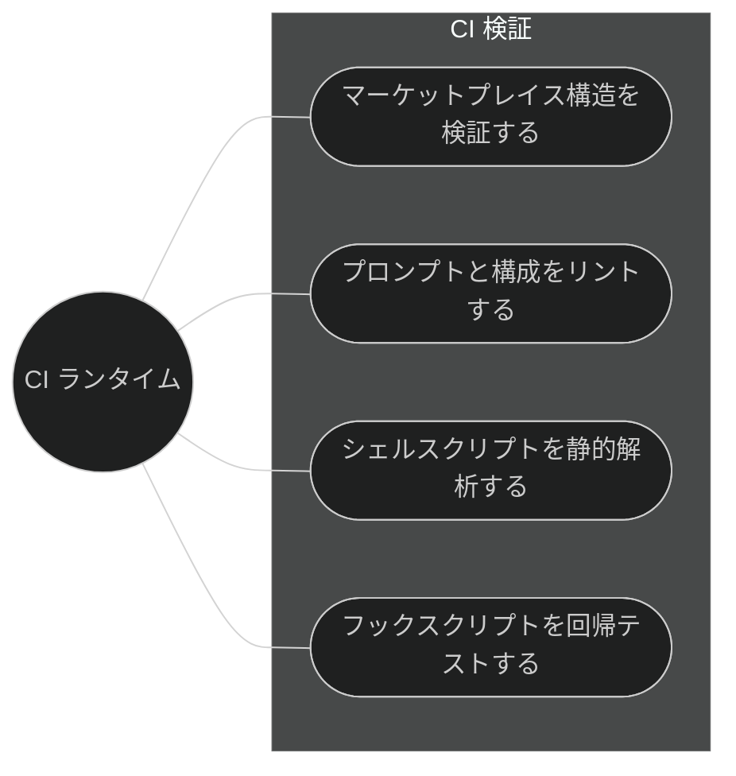
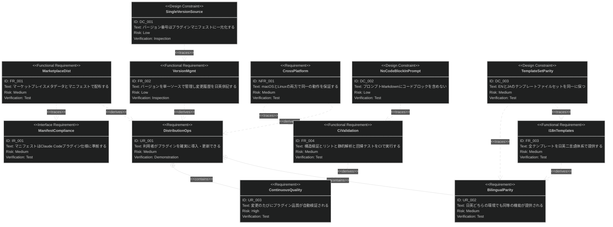
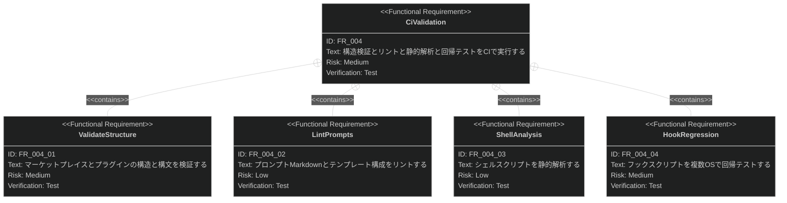

# 配布・運用 要求仕様書

## 概要

本ドキュメントは、Claude Code プラグイン「sdd-workflow」の配布・運用に関する要求仕様書である。

プラグインの機能価値は、利用者が確実に導入・更新でき、日英どちらの環境でも同等に動作し、
変更のたびに品質が継続検証されることで初めて成立する。本 PRD は、マーケットプレイス経由の配布、
バージョンの一元管理、多言語テンプレート体系、クロスプラットフォーム対応、CI による継続検証という、
プラグインのプロダクトとしての非機能・運用要求を定義する。

**対象範囲:**

- マーケットプレイスによる配布（marketplace.json / plugin.json マニフェスト）
- バージョンの一元管理と変更履歴
- 多言語（EN/JA）テンプレート体系
- クロスプラットフォーム対応（macOS / Linux）
- CI による構造・構文・回帰の継続検証

---

# 1. 要求図の読み方

SysML 要求図の記法（要求タイプ・リスクレベル・検証方法・関係タイプ）の凡例は
[PRD_TEMPLATE.md](../PRD_TEMPLATE.md) のセクション 1 を参照。

---

# 2. 要求一覧

## 2.1. ユースケース図（概要）

## 2.2. ユースケース図（詳細）

### CI 検証フロー

## 2.3. 機能一覧（テキスト形式）

- 配布
    - マーケットプレイスメタデータ（marketplace.json）の提供
    - プラグインマニフェスト（plugin.json）によるスキル・エージェント・フックの登録
- バージョン管理
    - plugin.json を単一ソースとするバージョン一元管理
    - 変更履歴（CHANGELOG）の日英併記
- 多言語対応
    - templates/{en,ja} による全スキル・エージェントのテンプレート二言語体系
    - EN/JA のファイルセット同一性の維持
- 継続検証（CI）
    - マーケットプレイス・プラグイン構造の検証
    - プロンプト Markdown・構成のリント
    - シェルスクリプトの静的解析
    - フックスクリプトの回帰テスト（複数 OS）

---

# 3. 要求図（SysML Requirements Diagram）

## 3.1. 全体要求図

## 3.2. 主要サブシステム詳細図

### CI 検証

---

# 4. 要求の詳細説明

## 4.1. ユーザー要求

### UR_001: 確実な導入・更新

プラグイン利用者は、マーケットプレイスの標準的な手順でプラグインを導入・更新でき、
バージョンと変更内容を変更履歴から把握できること。

**検証方法:** デモンストレーションによる検証

### UR_002: 日英の機能同等性

利用者は、言語設定（EN/JA）にかかわらず、同一のスキル・エージェント・テンプレート構成による
同等の機能を利用できること。

**検証方法:** テストによる検証

### UR_003: 継続的な品質検証

メンテナーによる変更は、マージ前に CI によって構造・構文・回帰の観点で自動検証され、
壊れたプラグインが配布されることを防止すること。

**検証方法:** テストによる検証

## 4.2. 機能要求

### FR_001: マーケットプレイス配布

マーケットプレイスメタデータ（marketplace.json）とプラグインマニフェスト（plugin.json）を提供し、
スキル・エージェント・フックを登録して配布可能にする。UR_001 から派生。

**トリガー方式:** リポジトリへの変更マージにより自動反映

**検証方法:** テストによる検証（CI の構造検証）

### FR_002: バージョン一元管理と変更履歴

バージョン番号を plugin.json を単一ソースとして管理し、marketplace.json との一貫性を保つ。
変更履歴は CHANGELOG として英語・日本語の両方で提供する。UR_001 から派生。

**トリガー方式:** 手動（リリース準備時のメンテナー操作）

**検証方法:** インスペクションによる検証（CI のバージョン一貫性チェックを含む）

### FR_003: 多言語テンプレート体系

すべてのスキル・エージェントの出力テンプレートを `templates/{en,ja}/` の二言語体系で提供し、
実行時に言語設定に応じたテンプレートが選択されるようにする。UR_002 から派生。

**トリガー方式:** 実行時（各スキルが言語設定に応じて自動選択）

**検証方法:** テストによる検証（EN/JA ファイルセット同一性の lint）

### FR_004: CI による継続検証

リポジトリへの変更に対し、以下の検証を CI で自動実行する。UR_003 から派生。

**トリガー方式:** 自動（pull request / push イベント）

**含まれる機能:**

- FR_004_01: マーケットプレイス・プラグイン構造の検証（JSON 構文・必須フィールド・バージョン一貫性）
- FR_004_02: プロンプト Markdown・テンプレート構成のリント（コードブロック検出・EN/JA 同一性）
- FR_004_03: シェルスクリプトの静的解析
- FR_004_04: フックスクリプトの回帰テスト（複数 OS で実行）

**検証方法:** テストによる検証

## 4.3. 非機能要求

### NFR_001: クロスプラットフォーム対応

プラグインのスクリプト・フック・スキルは macOS と Linux の両方で同一の動作を保証すること。
CI の静的解析・回帰テストは両 OS のランナーで実行すること。

**検証方法:** テストによる検証

## 4.4. インターフェース要求

### IR_001: プラグインマニフェスト仕様への準拠

marketplace.json / plugin.json は Claude Code のマーケットプレイス・プラグインマニフェスト仕様に
準拠し、Claude CLI による検証を通過すること。

**検証方法:** テストによる検証

## 4.5. 設計制約

### DC_001: バージョンの単一ソース

バージョン番号は plugin.json に一元化し、個々のスキル・エージェントのファイルには
バージョンを重複記載しないこと。

**根拠:** バージョン情報の分散は更新漏れによる不整合を招くため、真実の源を一つに限定する。

**検証方法:** インスペクションによる検証

### DC_002: プロンプト Markdown のコードブロック禁止

スキル・エージェントのプロンプト Markdown にはコードブロックを含めないこと
（プロンプトとしての解釈の安定性を確保するためのリポジトリ規約）。

**根拠:** T-001 原則（JSON/Markdown 構文の正当性）の実運用規約。

**検証方法:** テストによる検証（plugin-lint）

### DC_003: EN/JA テンプレートセットの同一性

`templates/en/` と `templates/ja/` のファイルセット（ファイル名の集合）は常に同一に保つこと。
片方のみへのファイル追加・削除を許容しない。

**検証方法:** テストによる検証（plugin-lint）

---

# 5. 制約事項

## 5.1. 技術的制約

- 配布は Claude Code のプラグインマーケットプレイス機構に依存し、その仕様変更への追随が必要である
- CI は GitHub Actions 上で実行され、利用可能なランナー OS（ubuntu / macos）に制約される
- Windows は現時点のサポート対象外である

## 5.2. ビジネス的制約

- B-002 原則（多言語対応の一貫性）に従い、EN/JA の機能差を生む変更は認めない
- T-002 原則（plugin.json 登録の徹底）に従い、新規スキル・エージェント追加時はマニフェスト登録を必須とする
- T-003 原則（日本語出力の文字化け防止）に従い、ja テンプレート・日本語ドキュメントに文字化け
  （U+FFFD・mojibake パターン・不完全なマルチバイト文字）を混入させないこと

---

# 6. 前提条件

- GitHub リポジトリと GitHub Actions が利用可能であること
- 利用者側で Claude Code のプラグイン機構（marketplace 追加・plugin インストール）が利用可能であること

---

# 7. スコープ外

以下は本 PRD のスコープ外とします：

- プラグインの個々の機能仕様（workflow-foundation / prd-generation / spec-design / task-implementation / quality-guardrails の各カテゴリで扱う）
- Windows 対応（将来検討）
- マーケットプレイスの利用統計・テレメトリ収集
- 有償配布・ライセンス管理（MIT ライセンスによる無償配布のみ）

---

# 8. 用語集

| 用語               | 定義                                                          |
|------------------|----------------------------------------------------------------|
| marketplace.json | マーケットプレイスのメタデータ。登録プラグインの一覧と参照先を定義する               |
| plugin.json      | プラグインマニフェスト。名前・バージョン・スキル・エージェント・フックを登録する         |
| CHANGELOG        | バージョンごとの変更履歴。英語版と日本語版を併記する                              |
| plugin-lint      | プロンプト Markdown・テンプレート構成のリポジトリ規約を検証するリントスクリプト        |
| 回帰テスト            | フックスクリプトの既存挙動が変更で壊れていないことを確認する自動テスト                 |
