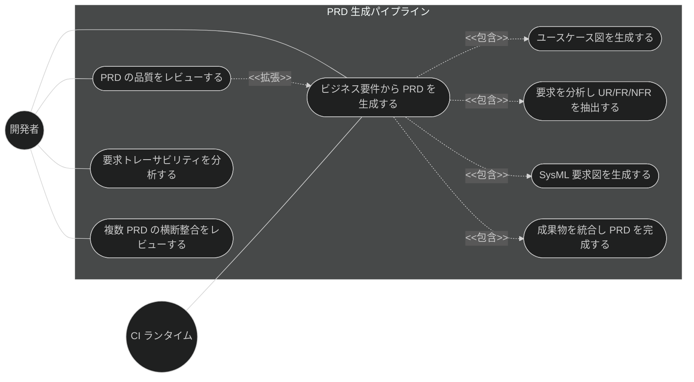
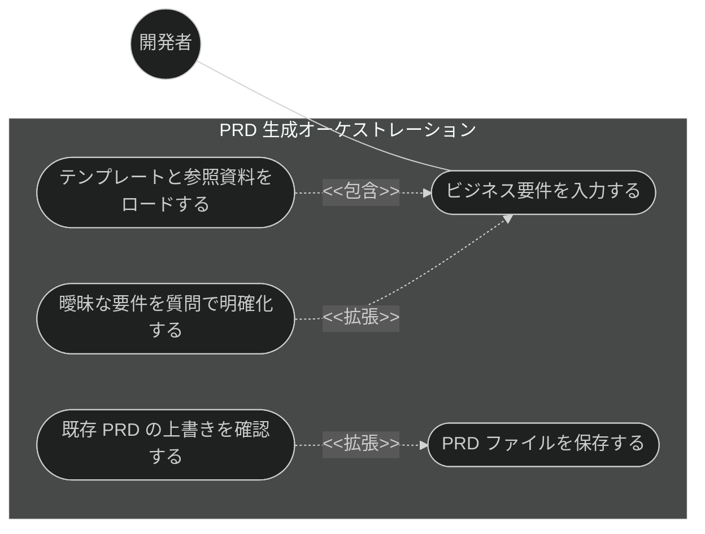
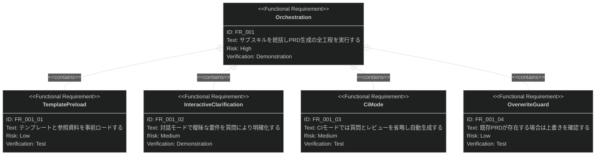

# PRD 生成パイプライン 要求仕様書

## 概要

本ドキュメントは、Claude Code プラグイン「sdd-workflow」の PRD 生成パイプライン機能群に対する要求仕様書である。

AI-SDD ワークフローの Specify フェーズでは、ビジネス要件を「何を作るか」「なぜ作るか」として構造化した
PRD（要求仕様書）が真実の源となる。しかし PRD の手作業での作成は、要求の抽出漏れ・トレーサビリティの欠落・
記法の不統一を招きやすい。本機能群は、ビジネス要件の入力から完全な PRD ファイルの保存までを
サブスキルのオーケストレーションにより自動化し、構造化された要求（UR/FR/NFR）と視覚的表現
（ユースケース図・SysML 要求図）を備えたレビュー可能な PRD を一貫した品質で生成する。

**対象範囲:**

- PRD 生成のオーケストレーション（対話モード / CI モード）
- ユースケース図の生成（Mermaid flowchart）
- 要求分析（UR/FR/NFR の抽出・分類）
- SysML 要求図の生成（Mermaid requirementDiagram）
- PRD の統合・完成と保存
- 生成後の品質レビュー（CONSTITUTION 準拠・front matter 検証）
- 要求トレーサビリティ分析

---

# 1. 要求図の読み方

SysML 要求図の記法（要求タイプ・リスクレベル・検証方法・関係タイプ）の凡例は
[PRD_TEMPLATE.md](../PRD_TEMPLATE.md) のセクション 1 を参照。

---

# 2. 要求一覧

## 2.1. ユースケース図（概要）

## 2.2. ユースケース図（詳細）

### PRD 生成オーケストレーション

## 2.3. 機能一覧（テキスト形式）

- PRD 生成オーケストレーション
    - テンプレート・参照資料の事前ロード（プロジェクトテンプレート優先）
    - 対話モードでの曖昧要件の明確化質問
    - CI モード（質問・レビューの省略、上書き自動承認）
    - 既存 PRD の上書き確認
    - PRD ファイルの保存
- PRD 構成要素の生成
    - ユースケース図生成（アクター・ユースケース・システム境界）
    - 要求分析（UR/FR/NFR 抽出、優先度・リスク・検証方法の付与）
    - SysML 要求図生成（要求間関係の可視化）
    - PRD 統合・完成（front matter 付与を含む）
- 生成後の品質保証
    - PRD 品質レビュー（CONSTITUTION 準拠・修正提案）
    - 要求トレーサビリティ分析（カバレッジ・依存関係・分類付き提案）
    - PRD 横断整合レビュー（複数 PRD 間の境界・用語・スタイル・原則参照の整合）

---

# 3. 要求図（SysML Requirements Diagram）

## 3.1. 全体要求図

```mermaid
%%{init: {'theme': 'dark'}}%%
requirementDiagram
    requirement PrdGenerationPipeline {
        id: UR_001
        text: "ビジネス要件から完全なPRDを一貫した品質で生成できる"
        risk: high
        verifymethod: demonstration
    }

    requirement StructuredRequirements {
        id: UR_002
        text: "要求はUR/FR/NFRに構造化されトレーサビリティが確保される"
        risk: high
        verifymethod: inspection
    }

    requirement VisualRepresentation {
        id: UR_003
        text: "PRDはユースケース図と要求図による視覚的表現を含む"
        risk: medium
        verifymethod: inspection
    }

    requirement AutomationSupport {
        id: UR_004
        text: "非対話環境でも人手の介在なしにPRDを生成できる"
        risk: medium
        verifymethod: test
    }

    functionalRequirement Orchestration {
        id: FR_001
        text: "サブスキルを統括しPRD生成の全工程を実行する"
        risk: high
        verifymethod: demonstration
    }

    functionalRequirement UsecaseDiagram {
        id: FR_002
        text: "ビジネス要件からユースケース図を生成する"
        risk: medium
        verifymethod: inspection
    }

    functionalRequirement RequirementsAnalysis {
        id: FR_003
        text: "ユースケースからURとFRとNFRを抽出し分類する"
        risk: high
        verifymethod: inspection
    }

    functionalRequirement RequirementsDiagram {
        id: FR_004
        text: "要求分析からSysML要求図を生成する"
        risk: medium
        verifymethod: inspection
    }

    functionalRequirement FinalizePrd {
        id: FR_005
        text: "全成果物を統合しfront matter付きPRDとして完成する"
        risk: medium
        verifymethod: test
    }

    functionalRequirement PrdReview {
        id: FR_006
        text: "生成PRDのCONSTITUTION準拠と品質をレビューする"
        risk: medium
        verifymethod: demonstration
    }

    functionalRequirement TraceabilityAnalysis {
        id: FR_007
        text: "要求のカバレッジと依存関係を分析し提案を分類する"
        risk: medium
        verifymethod: demonstration
    }

    functionalRequirement CrossPrdReview {
        id: FR_008
        text: "複数PRD間の境界と用語とスタイルと原則参照の整合をレビューする"
        risk: medium
        verifymethod: demonstration
    }

    interfaceRequirement TemplateCompliance {
        id: IR_001
        text: "生成PRDはPRDテンプレート構造とfront matterスキーマに準拠する"
        risk: medium
        verifymethod: inspection
    }

    interfaceRequirement MermaidCompliance {
        id: IR_002
        text: "生成図はMermaidのflowchartとrequirementDiagram構文に準拠する"
        risk: medium
        verifymethod: test
    }

    requirement GenerationQuality {
        id: NFR_001
        text: "生成されるPRDは後続の仕様書生成に十分な情報量を含む"
        risk: medium
        verifymethod: inspection
    }

    designConstraint SubskillIsolation {
        id: DC_001
        text: "書き込み権限を持つ主体を単一に制限する"
        risk: medium
        verifymethod: inspection
    }

    designConstraint TemplatePrecedence {
        id: DC_002
        text: "プロジェクトテンプレートをプラグイン既定より優先する"
        risk: low
        verifymethod: test
    }

    designConstraint LanguageConsistency {
        id: DC_003
        text: "出力言語は言語設定に従い単一文書内で混在させない"
        risk: medium
        verifymethod: inspection
    }

    PrdGenerationPipeline - contains -> StructuredRequirements
    PrdGenerationPipeline - contains -> VisualRepresentation
    PrdGenerationPipeline - contains -> AutomationSupport
    Orchestration - derives -> PrdGenerationPipeline
    Orchestration - contains -> UsecaseDiagram
    Orchestration - contains -> RequirementsAnalysis
    Orchestration - contains -> RequirementsDiagram
    Orchestration - contains -> FinalizePrd
    RequirementsAnalysis - derives -> StructuredRequirements
    TraceabilityAnalysis - derives -> StructuredRequirements
    CrossPrdReview - derives -> StructuredRequirements
    UsecaseDiagram - derives -> VisualRepresentation
    RequirementsDiagram - derives -> VisualRepresentation
    FinalizePrd - derives -> PrdGenerationPipeline
    PrdReview - derives -> PrdGenerationPipeline
    GenerationQuality - derives -> PrdGenerationPipeline
    GenerationQuality - traces -> FinalizePrd
    FinalizePrd - traces -> TemplateCompliance
    UsecaseDiagram - traces -> MermaidCompliance
    RequirementsDiagram - traces -> MermaidCompliance
    SubskillIsolation - traces -> Orchestration
    TemplatePrecedence - traces -> Orchestration
    LanguageConsistency - traces -> FinalizePrd
```

## 3.2. 主要サブシステム詳細図

### PRD 生成オーケストレーション

---

# 4. 要求の詳細説明

## 4.1. ユーザー要求

### UR_001: 完全な PRD の一貫した生成

開発者は、ビジネス要件のテキスト入力のみから、必須セクション（概要・要求一覧・要求図・詳細説明）を
すべて備えた PRD ファイルの保存までを、一貫した品質で完了できること。

**検証方法:** デモンストレーションによる検証

### UR_002: 要求の構造化とトレーサビリティ

生成される要求はユーザー要求（UR）・機能要求（FR）・非機能要求（NFR）に構造化され、
一意な要求 ID を持ち、FR は少なくとも 1 つの UR にトレースされること。

**検証方法:** インスペクションによる検証

### UR_003: 視覚的表現の包含

生成される PRD は、アクターとシステム境界を示すユースケース図、および要求間の関係
（contains / derives / traces 等）を示す SysML 要求図を含み、レビュアーが構造を視覚的に把握できること。

**検証方法:** インスペクションによる検証

### UR_004: 非対話環境での自動生成

CI 等の非対話環境でも、人手の介在（質問応答・上書き確認）なしに PRD を生成できること。

**検証方法:** テストによる検証

## 4.2. 機能要求

### FR_001: PRD 生成オーケストレーション

ビジネス要件を入力として、サブスキル（FR_002〜FR_005）を所定の順序で統括実行し、
完全な PRD ファイルの保存までを行う。UR_001 から派生。

**トリガー方式:** 手動（開発者による `/generate-prd` スキル呼び出し。CI からの呼び出しも可）

**含まれる機能:**

- FR_001_01: テンプレート・参照資料の事前ロード（準備スクリプトによるキャッシュ展開）
- FR_001_02: 対話モードでの曖昧要件の明確化質問（Vibe Coding リスク評価を含む）
- FR_001_03: CI モード（`--ci` フラグ。質問・生成後レビューを省略し、以下のデフォルト方針で自動生成する）
    - 要求の優先度が入力から判断できない場合のデフォルト: must
    - リスクが判断できない場合のデフォルト: medium
    - 検証方法が判断できない場合のデフォルト: inspection
    - 既存 PRD の上書き: 自動承認（確認なし）
- FR_001_04: 既存 PRD の上書きガード（対話モードでは確認、CI モードでは自動承認）

**検証方法:** デモンストレーションによる検証

### FR_002: ユースケース図生成

ビジネス要件からアクター・ユースケース・システム境界を抽出し、Mermaid flowchart 形式の
ユースケース図とアクター・ユースケースの一覧表を生成する。UR_003 から派生。

**トリガー方式:** 手動（単体呼び出し）または FR_001 からの自動呼び出し

**検証方法:** インスペクションによる検証

### FR_003: 要求分析

ユースケース図とビジネスコンテキストから要求を抽出し、UR / FR / NFR に分類する。
各要求には一意な ID、優先度、リスク、検証方法を付与し、FR には派生元の UR を明示する。UR_002 から派生。

**トリガー方式:** 手動（単体呼び出し）または FR_001 からの自動呼び出し

**検証方法:** インスペクションによる検証

### FR_004: SysML 要求図生成

要求分析の結果から、要求間の関係（contains / derives / traces 等)を可視化する
Mermaid requirementDiagram 形式の SysML 要求図を生成する。UR_003 から派生。

**トリガー方式:** 手動（単体呼び出し）または FR_001 からの自動呼び出し

**検証方法:** インスペクションによる検証

### FR_005: PRD 統合・完成

ユースケース図・要求分析・要求図の全成果物を PRD テンプレート構造に統合し、
YAML front matter（id / type / status / priority / risk 等）を付与した完全な PRD として完成する。UR_001 から派生。

**トリガー方式:** 手動（単体呼び出し）または FR_001 からの自動呼び出し

**検証方法:** テストによる検証

### FR_006: PRD 品質レビュー

生成された PRD に対し、CONSTITUTION.md 準拠・SysML 要求図の形式妥当性・必須セクションの網羅性・
要求 ID トレーサビリティを検証し、修正提案を生成する。front matter の形式検証も含む。UR_001 から派生。

**トリガー方式:** 自動（対話モードの生成後に実行。CI モードでは省略）。手動呼び出しも可

**検証方法:** デモンストレーションによる検証

### FR_007: 要求トレーサビリティ分析

既存 PRD の要求図を分析し、カバレッジギャップ・依存関係の衝突・実装トレーサビリティを検出する。
検出結果は重要度で分類（must = 必須修正 / recommend = 推奨改善 / nits = 軽微）した提案として報告する。
UR_002 から派生。

**トリガー方式:** 手動（開発者による要求分析・影響分析の依頼時）

**検証方法:** デモンストレーションによる検証

### FR_008: PRD 横断整合レビュー

複数の PRD を対象として、PRD 間の横方向の整合性をレビューし、重要度分類
（must = 必須修正 / recommend = 推奨改善 / nits = 軽微）付きの指摘として報告する。UR_002 から派生。

**トリガー方式:** 手動（開発者による複数 PRD レビューの依頼時、または PRD の追加・更新後の任意実行）。
本機能は PRD 生成オーケストレーション（FR_001）から独立しており、複数 PRD が存在する状態での任意実行機能である。

**入力:** requirement ディレクトリ配下の全 PRD ファイル（既定）、または開発者が指定した PRD ファイルのリスト。
横断比較には 2 ファイル以上を要し、対象が 1 ファイル以下の場合は横断レビュー不能である旨を報告して
単体レビュー（FR_006）を案内する。

**出力形式:** 各レビュー観点の指摘を重要度分類付きで列挙し、原則参照カバレッジは原則 × PRD の
マトリクスとして提示する。

**レビュー観点:**

- カテゴリ境界の整合 — 各 PRD の「スコープ外」セクションの相互参照に矛盾がないか
  （他 PRD へ委譲した責務が実際にカバーされているか、双方がスコープ外にして宙に浮く機能や責務の重複がないか）
- 用語の横断統一 — 用語集セクション間で同一概念の定義が食い違っていないか
- 構成・記法スタイルの一貫性 — セクション構成、要求図における関係（derives / contains / traces）の
  使い分け、トリガー方式の記載有無が PRD 間でばらついていないか
- プロジェクト原則参照のカバレッジ — どの原則がどの PRD で参照されているかをマトリクスとして提示し、
  関係するはずの PRD での参照漏れを検出する
- front matter の横断整合 — id / category / tags の付け方の不統一を検出する
  （形式・一意性・依存方向の検証自体は front matter 検証機能に委譲し、本機能は付け方の一貫性のみを扱う）

**責務境界:** 単一 PRD の品質レビューは FR_006、単一機能の縦方向（PRD ↔ 仕様 ↔ 設計）の整合は
quality-guardrails カテゴリのドキュメント間整合性チェックが担い、本機能は PRD ↔ PRD の横方向のみを対象とする。

**検証方法:** デモンストレーションによる検証

## 4.3. 非機能要求

### NFR_001: 生成 PRD の情報充足性

生成される PRD は、後続の仕様書生成（`/generate-spec`）の入力として十分な情報量
（必須セクションの実質的な内容、全要求への優先度・リスク・検証方法の付与、トレース関係）を含むこと。
セクション見出しのみの空欄や、プレースホルダーの残存は許容しない。

**検証方法:** インスペクションによる検証

## 4.4. インターフェース要求

### IR_001: PRD テンプレート・front matter スキーマへの準拠

生成される PRD は、プロジェクトの PRD テンプレート構造（必須セクション構成）および
front matter スキーマ（`type: "prd"`、`id: "prd-{name}"` パターン、有効な status / priority / risk 値）に準拠すること。

**検証方法:** インスペクションによる検証

### IR_002: Mermaid 構文への準拠

生成される図は Mermaid の `flowchart`（ユースケース図）および `requirementDiagram`（要求図）構文に
準拠し、レンダリング可能であること。要求図では ID にアンダースコアを使用し、属性値は小文字とすること。

**検証方法:** テストによる検証

## 4.5. 設計制約

### DC_001: 書き込み権限を持つ主体の限定

構成要素生成機能（FR_002〜FR_005 に対応する単体スキル）の誤動作が PRD ファイルを破壊しないよう、
ファイルへの書き込み権限を持つ主体はオーケストレーター（FR_001）のみに限定すること。

**根拠:** 生成ロジックと永続化の責務を分離し、構成要素生成の誤動作によるファイル破壊を構造的に防止するため。
具体的な実現方式（コンテキスト分離・ツール権限の制限等）は技術設計書で定義する。

**検証方法:** インスペクションによる検証

### DC_002: プロジェクトテンプレートの優先

PRD テンプレートは、対象プロジェクトの `.sdd/PRD_TEMPLATE.md` が存在する場合はそれを優先し、
存在しない場合のみプラグイン既定テンプレート（言語設定に対応）にフォールバックすること。

**検証方法:** テストによる検証

### DC_003: 言語の一貫性

生成される PRD の言語は `SDD_LANG` 環境変数（en / ja）に従い、単一ドキュメント内で言語を混在させないこと。

**検証方法:** インスペクションによる検証

---

# 5. 制約事項

## 5.1. 技術的制約

- 本機能群は Claude Code のスキル・エージェント機構上で動作し、生成品質は基盤モデルの能力に依存する
- Mermaid requirementDiagram の構文制約（ID のアンダースコア、属性値の小文字等）に従う必要がある
- 要求抽出は入力されたビジネス要件の情報量に依存し、入力にない要求を補完的に創出することは保証しない

## 5.2. ビジネス的制約

- CONSTITUTION.md の B-001 原則（Vibe Coding 防止）に従い、対話モードでは曖昧な要件を推測で補完せず、
  明確化質問を優先すること（CI モードは例外として合理的仮定を許容する）
- B-002 原則（多言語対応の一貫性）に従い、テンプレート・出力は EN/JA の両言語で同等の構成を維持すること

---

# 6. 前提条件

- 対象プロジェクトで sdd-workflow プラグインが有効化され、`.sdd/` ディレクトリが初期化済みであること（sdd-init）
- `SDD_ROOT` / `SDD_LANG` / `SDD_REQUIREMENT_PATH` 等の環境変数がセッション開始時に設定されていること
- 生成後レビュー（FR_006）の CONSTITUTION 準拠チェックは、対象プロジェクトに CONSTITUTION.md が存在する場合にのみ機能する

---

# 7. スコープ外

以下は本 PRD のスコープ外とします：

- PRD からの下流展開（抽象仕様書・技術設計書の生成は spec-design カテゴリで扱う）
- 仕様の明確化質問の体系（clarify / clarification-assistant は spec-design カテゴリで扱う）
- 生成 PRD とドキュメント群の継続的な整合性維持（quality-guardrails カテゴリで扱う）
- ビジネス要件そのものの発見・収集（インタビュー・要求開発プロセスは対象外）
- PRD の承認ワークフロー（status 遷移の運用ルールはプロジェクト運用に委ねる）

---

# 8. 用語集

| 用語               | 定義                                                             |
|------------------|----------------------------------------------------------------|
| PRD              | Product Requirements Document（要求仕様書）。「何を・なぜ作るか」を定義する最上流ドキュメント |
| UR / FR / NFR    | ユーザー要求 / 機能要求 / 非機能要求。要求の 3 階層分類                               |
| オーケストレーション       | 複数のサブスキルを所定の順序で統括実行し、単一の成果物にまとめる制御方式                           |
| CI モード           | `--ci` フラグによる非対話実行モード。質問・レビューを省略し自動生成する                        |
| SysML 要求図        | 要求間の関係（contains / derives / traces 等）を表す図。Mermaid requirementDiagram で記述 |
| トレーサビリティ         | 要求 ID を介して UR → FR → 仕様 → 実装の対応関係を追跡できる性質                      |
| front matter     | ドキュメント冒頭の YAML メタデータ（id / type / status / priority / risk 等）    |
