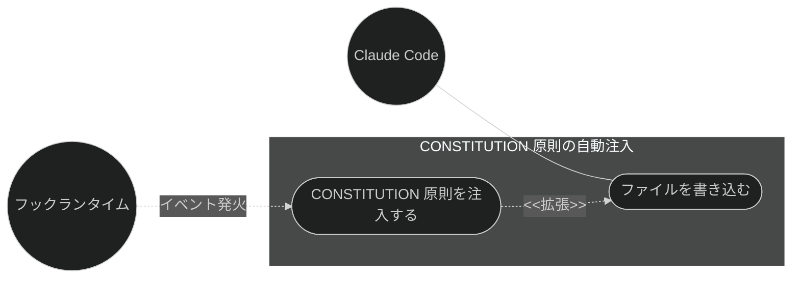
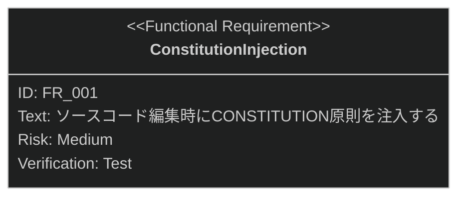

# CONSTITUTION 原則の自動注入 要求仕様書

## 概要

本ドキュメントは、品質ガードレール機能群のうち **CONSTITUTION 原則の自動注入**に対する要求仕様書である。
親 PRD は [index.md](index.md) を参照。

[CONSTITUTION.md](../../CONSTITUTION.md) に定義されたプロジェクト原則が AI 実装者に参照されないまま
実装が進むと、原則違反が発生しても気づけない。本機能は実装ソースコードの編集時に原則を追加コンテキストとして
自動注入し、原則違反を構造的に抑止する。

---

# 1. 要求図の読み方

SysML 要求図の記法（要求タイプ・リスクレベル・検証方法・関係タイプ）の凡例は
[PRD_TEMPLATE.md](../../PRD_TEMPLATE.md) のセクション 1 を参照。

---

# 2. 要求一覧

## 2.1. ユースケース図

## 2.2. 機能一覧（テキスト形式）

- CONSTITUTION 原則の自動注入
    - CONSTITUTION 原則のコンテキスト自動注入

---

# 3. 要求図（SysML Requirements Diagram）

本ファイルの FR_001 は [index.md](index.md) の UR_004（プロジェクト原則の自動遵守）から派生する
（親 PRD の全体要求図では FR_003 として定義）。
関連する横断要求・制約として、index.md の NFR_001（フック処理の軽量性）・IR_001（フックイベント仕様への準拠）・
DC_002（コンテキスト肥大の防止。注入はセッション 1 回かつ 3,000 文字上限）・
DC_004（クロスプラットフォーム対応）が本機能に trace する。

---

# 4. 要求の詳細説明

## 4.1. 機能要求

### FR_001: CONSTITUTION 原則の自動注入

実装ソースコードの編集時に、プロジェクトの CONSTITUTION.md の内容を追加コンテキストとして AI 実装者に注入する。
[index.md](index.md) の UR_004 から派生。CONSTITUTION.md が存在しない場合は何もしない。

**トリガー方式:** 自動（実装ソースコード編集前のフック）

**検証方法:** テストによる検証

注入量の上限とセッションあたりの注入回数は index.md の DC_002 に従う
（コンテキストを恒常的に消費するため、原則の要点が収まる最小限の予算とする根拠も同制約を参照）。

---

# 5. 前提条件

- Claude Code のプラグイン機構・フックイベントシステムが利用可能であること
- 対象プロジェクトで sdd-workflow プラグインが有効化されていること
- 対象プロジェクトに CONSTITUTION.md が存在する場合にのみ機能する

---

# 6. スコープ外

以下は本 PRD のスコープ外とします：

- CONSTITUTION.md 自体の生成・管理（workflow-foundation カテゴリで扱う）
- ファイル命名規則の検証・ブロック（[naming-enforcement.md](naming-enforcement.md) で扱う）
- 編集後のドキュメント更新漏れ検知（[stale-doc-detection.md](stale-doc-detection.md) で扱う）
