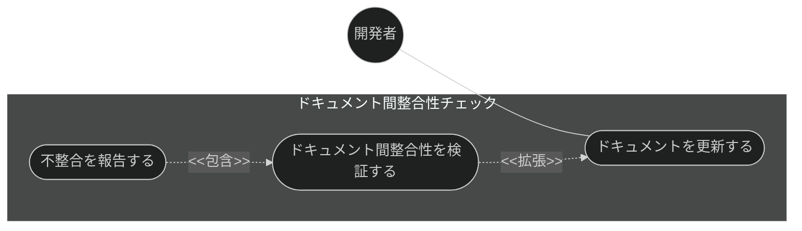
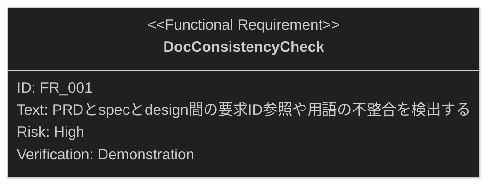

# ドキュメント間整合性チェック 要求仕様書

## 概要

本ドキュメントは、品質ガードレール機能群のうち **ドキュメント間整合性チェック**に対する要求仕様書である。
親 PRD は [index.md](index.md) を参照。

PRD・抽象仕様書（`*_spec.md`）・技術設計書（`*_design.md`）の 3 層のドキュメント間で
要求 ID 参照の欠落や用語の不統一が発生すると、真実の源としてのドキュメント体系が崩れる。
本機能はドキュメント更新時・実装前に層間の不整合を自動検出し、整合性の維持を支援する。

---

# 1. 要求図の読み方

SysML 要求図の記法（要求タイプ・リスクレベル・検証方法・関係タイプ）の凡例は
[PRD_TEMPLATE.md](../../PRD_TEMPLATE.md) のセクション 1 を参照。

---

# 2. 要求一覧

## 2.1. ユースケース図

## 2.2. 機能一覧（テキスト形式）

- ドキュメント間整合性チェック
    - PRD ↔ 抽象仕様書 ↔ 技術設計書間の整合性チェック
    - 要求 ID 参照・データモデル・API 定義・用語の不整合検出

---

# 3. 要求図（SysML Requirements Diagram）

本ファイルの FR_001 は [index.md](index.md) の UR_003（ドキュメント・実装間の整合性維持）から派生する
（親 PRD の全体要求図では FR_006 として定義）。
関連する制約として、index.md の DC_004（クロスプラットフォーム対応）・
DC_005（多言語対応。`SDD_LANG` による EN/JA 出力切替に対応）が本機能に trace する。

---

# 4. 要求の詳細説明

## 4.1. 機能要求

### FR_001: ドキュメント間整合性チェック

PRD ↔ `*_spec.md` ↔ `*_design.md` 間の以下の不整合を検出する。
[index.md](index.md) の UR_003 から派生。

**トリガー方式:** 自動（ドキュメント更新時・実装前に AI が自動実行する。ユーザー呼び出し不可）

- 要求 ID（UR/FR/NFR 等）の参照欠落
- データモデルの不一致
- API 定義の齟齬
- 用語の不統一

**検証方法:** デモンストレーションによる検証

---

# 5. 前提条件

- 対象プロジェクトで sdd-workflow プラグインが有効化されていること
- `.sdd/` ディレクトリ構造（sdd-init による初期化）を前提とする

---

# 6. スコープ外

以下は本 PRD のスコープ外とします：

- 実装コードと技術設計書の整合性チェック（[impl-spec-check.md](impl-spec-check.md) で扱う）
- front matter の形式・依存関係検証（[front-matter-validation.md](front-matter-validation.md) で扱う）
- 検知した不整合の自動修正（検出までを責務とし、修正は開発者と AI の対話に委ねる）
