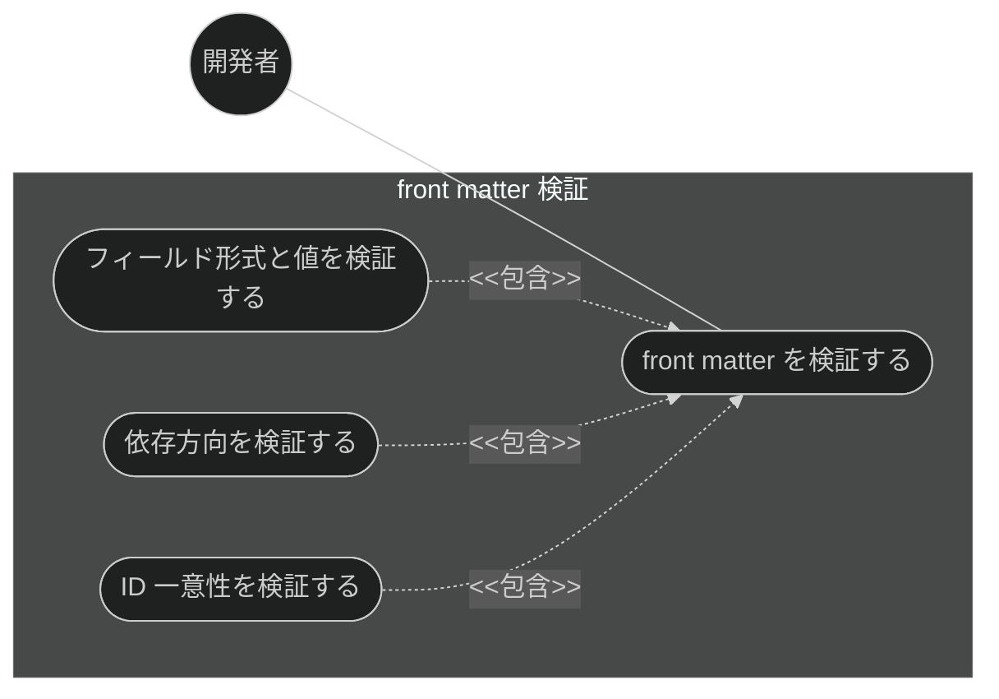
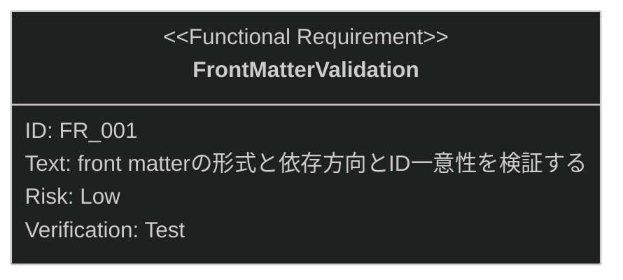

# front matter 検証 要求仕様書

## 概要

本ドキュメントは、品質ガードレール機能群のうち **YAML front matter 検証**に対する要求仕様書である。
親 PRD は [index.md](index.md) を参照。

AI-SDD ドキュメントの YAML front matter（id / type / status / depends-on 等）は機械的な検索・
フィルタリングと依存関係追跡の基盤である。形式不正・依存方向の逆転・ID 重複が混入すると
ドキュメント体系の整合性が損なわれるため、本機能は front matter を検証し不備を検出する。

---

# 1. 要求図の読み方

SysML 要求図の記法（要求タイプ・リスクレベル・検証方法・関係タイプ）の凡例は
[PRD_TEMPLATE.md](../../PRD_TEMPLATE.md) のセクション 1 を参照。

---

# 2. 要求一覧

## 2.1. ユースケース図

## 2.2. 機能一覧（テキスト形式）

- front matter 検証
    - YAML front matter の形式・値の妥当性検証
    - 依存方向（`depends-on` は上流方向のみ）の検証
    - ID 一意性の検証

---

# 3. 要求図（SysML Requirements Diagram）

本ファイルの FR_001 は [index.md](index.md) の UR_003（ドキュメント・実装間の整合性維持）から派生する
（親 PRD の全体要求図では FR_007 として定義）。
関連する制約として、index.md の DC_003（検証コストの最適化。ルール基盤の軽量検証には低コストモデルを使用）が
本機能に trace する。

---

# 4. 要求の詳細説明

## 4.1. 機能要求

### FR_001: front matter 検証

AI-SDD ドキュメントの YAML front matter に対し、フィールド形式・値の妥当性・依存方向
（`depends-on` は上流方向のみ）・ID 一意性を検証する。[index.md](index.md) の UR_003 から派生。

**トリガー方式:** 自動（ドキュメント生成後・整合性チェック時のレビューとして実行）。手動呼び出しも可

**検証方法:** テストによる検証

---

# 5. 前提条件

- 対象プロジェクトで sdd-workflow プラグインが有効化されていること
- `.sdd/` ディレクトリ構造（sdd-init による初期化）を前提とする
- front matter なしの既存ドキュメントも引き続き有効（後方互換）

---

# 6. スコープ外

以下は本 PRD のスコープ外とします：

- ドキュメント本文の整合性チェック（[doc-consistency-check.md](doc-consistency-check.md) で扱う）
- ファイル名の命名規則検証（[naming-enforcement.md](naming-enforcement.md) で扱う）
- 検出した不備の自動修正（検出・報告までを責務とし、修正は開発者と AI の対話に委ねる）
