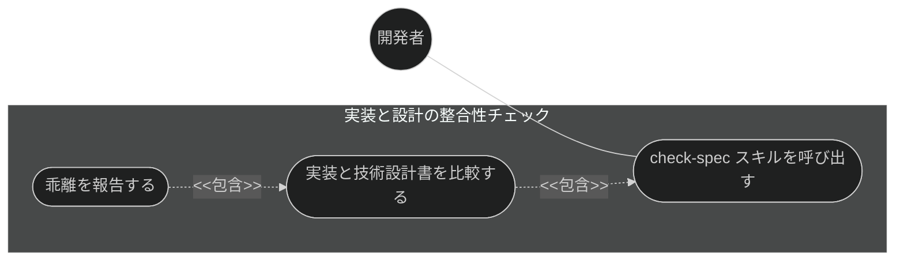
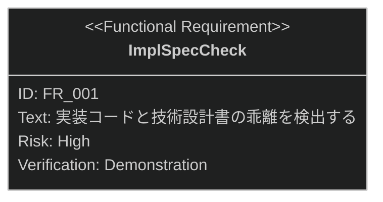

# 実装と設計の整合性チェック 要求仕様書

## 概要

本ドキュメントは、品質ガードレール機能群のうち **実装と設計の整合性チェック**に対する要求仕様書である。
親 PRD は [index.md](index.md) を参照。

技術設計書（`*_design.md`)は「どのように実現するか」の真実の源だが、実装が進むにつれて設計書との乖離が
発生し得る。本機能は開発者の任意のタイミングで実装コードと技術設計書を比較し、乖離を検出・報告することで、
設計判断の透明性と仕様駆動の開発サイクルを維持する。

---

# 1. 要求図の読み方

SysML 要求図の記法（要求タイプ・リスクレベル・検証方法・関係タイプ）の凡例は
[PRD_TEMPLATE.md](../../PRD_TEMPLATE.md) のセクション 1 を参照。

---

# 2. 要求一覧

## 2.1. ユースケース図

## 2.2. 機能一覧（テキスト形式）

- 実装と設計の整合性チェック
    - 実装コードと技術設計書（design）の整合性チェック
    - 乖離の検出・報告

---

# 3. 要求図（SysML Requirements Diagram）

本ファイルの FR_001 は [index.md](index.md) の UR_003（ドキュメント・実装間の整合性維持）から派生する
（親 PRD の全体要求図では FR_005 として定義）。

---

# 4. 要求の詳細説明

## 4.1. 機能要求

### FR_001: 実装と設計の整合性チェック

実装コードと技術設計書（`*_design.md`）を比較し、乖離を検出・報告する。
[index.md](index.md) の UR_003 から派生。

**トリガー方式:** 手動（開発者による `/check-spec` スキル呼び出し）

**検証方法:** デモンストレーションによる検証

---

# 5. 前提条件

- 対象プロジェクトで sdd-workflow プラグインが有効化されていること
- `.sdd/` ディレクトリ構造（sdd-init による初期化）を前提とする
- チェック対象の技術設計書（`*_design.md`）が存在すること

---

# 6. スコープ外

以下は本 PRD のスコープ外とします：

- ドキュメント間（PRD ↔ spec ↔ design）の整合性チェック（[doc-consistency-check.md](doc-consistency-check.md) で扱う）
- 編集後の更新漏れリマインド（[stale-doc-detection.md](stale-doc-detection.md) で扱う）
- 検出した乖離の自動修正（検出・報告までを責務とし、修正は開発者と AI の対話に委ねる）
