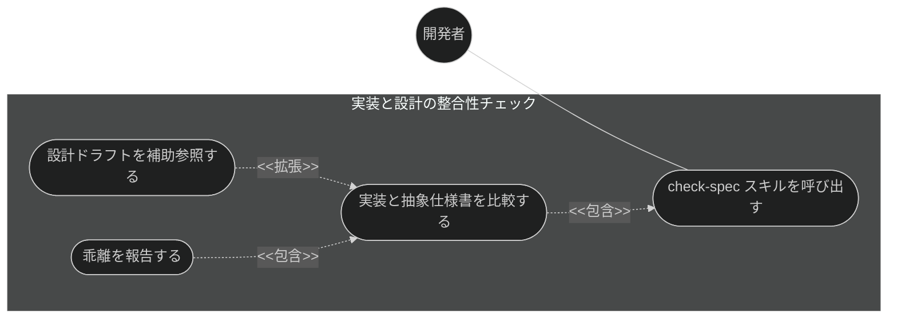
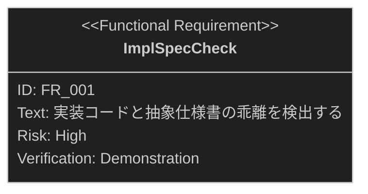

# 実装と仕様の整合性チェック 要求仕様書

## 概要

本ドキュメントは、品質ガードレール機能群のうち **実装と仕様の整合性チェック**に対する要求仕様書である。
親 PRD は [index.md](index.md) を参照。

抽象仕様書（`specification/` 配下の spec）は「何を実現するか」の永続的な真実の源だが、実装が進むにつれて
仕様書との乖離が発生し得る。本機能は開発者の任意のタイミングで実装コードと抽象仕様書を比較し、乖離を
検出・報告することで、設計判断の透明性と仕様駆動の開発サイクルを維持する。

技術設計書（Design Doc）は `task/{ticket-number}/design-draft.md` の一時ドラフトであり実装完了後に削除される
ため、恒久的な比較基準にはできない。ドラフトが存在する実装期間中に限り、詳細を補う**任意の補助入力**として
扱う。

本機能はプロジェクト原則（[CONSTITUTION.md](../../CONSTITUTION.md) の B-001: Vibe Coding 防止、
D-001: Specification-Driven）を、実装が仕様書から乖離していないことの検証によって支える。

---

# 1. 要求図の読み方

SysML 要求図の記法（要求タイプ・リスクレベル・検証方法・関係タイプ）の凡例は
[PRD_TEMPLATE.md](../../PRD_TEMPLATE.md) のセクション 1 を参照。

---

# 2. 要求一覧

## 2.1. ユースケース図

```mermaid
%%{init: {'theme': 'dark'}}%%
flowchart LR
    Developer((開発者))

    subgraph ImplSpecCheck["実装と設計の整合性チェック"]
        InvokeCheckSpec([check-spec スキルを呼び出す])
        CompareImplSpec([実装と抽象仕様書を比較する])
        ReferDraft([設計ドラフトを補助参照する])
        ReportGap([乖離を報告する])
    end

    Developer --- InvokeCheckSpec
    CompareImplSpec -.->|"<<包含>>"| InvokeCheckSpec
    ReferDraft -.->|"<<拡張>>"| CompareImplSpec
    ReportGap -.->|"<<包含>>"| CompareImplSpec
```

## 2.2. 機能一覧（テキスト形式）

- 実装と仕様の整合性チェック
    - 実装コードと抽象仕様書（spec）の整合性チェック
    - 設計ドラフト（`task/{ticket-number}/design-draft.md`）が存在する場合の補助参照
    - 乖離の検出・報告

---

# 3. 要求図（SysML Requirements Diagram）

```mermaid
%%{init: {'theme': 'dark'}}%%
requirementDiagram
    functionalRequirement ImplSpecCheck {
        id: FR_001
        text: "実装コードと抽象仕様書の乖離を検出する"
        risk: high
        verifymethod: demonstration
    }
```

本ファイルの FR_001 は [index.md](index.md) の UR_003（ドキュメント・実装間の整合性維持）から派生する
（親 PRD の全体要求図では FR_005 として定義）。
関連する横断要求・制約として、index.md の DC_004（クロスプラットフォーム対応）・
DC_005（`SDD_LANG` による EN/JA 出力切り替え。本機能はレポート出力テンプレートを `templates/{en,ja}/` の
両方で提供する）が本機能に trace する。

---

# 4. 要求の詳細説明

## 4.1. 機能要求

### FR_001: 実装と仕様の整合性チェック

実装コードと抽象仕様書（`specification/` 配下の spec）を比較し、乖離を検出・報告する。
[index.md](index.md) の UR_003 から派生。

比較の第一級の基準は spec である。spec は抽象仕様であり技術詳細を持たないため、比較対象は spec から
読み取れる粒度（公開 API・データモデル・振る舞い・リテラル値）に限定する。
`task/{ticket-number}/design-draft.md` が存在する場合はモジュール構成・技術スタック等の詳細を補う補助入力
として参照し、存在しないことは正常系として扱う（実装完了後の通常状態）。

**トリガー方式:** 手動（開発者による `/check-spec` スキル呼び出し）

**検証方法:** デモンストレーションによる検証

---

# 5. 前提条件

- 対象プロジェクトで sdd-workflow プラグインが有効化されていること
- `.sdd/` ディレクトリ構造（sdd-init による初期化）を前提とする
- チェック対象の抽象仕様書（`specification/` 配下の spec）が存在すること。技術設計書
  （`task/{ticket-number}/design-draft.md`）の存在は前提としない
- 対象の spec が 0 件の場合は「対象なし」を報告し、エラーとしない（設計ドラフト不在も同様に正常系）

---

# 6. スコープ外

以下は本 PRD のスコープ外とします：

- ドキュメント間（PRD ↔ spec ↔ adr）の整合性チェック（[doc-consistency-check.md](doc-consistency-check.md) で扱う）
- 編集後の更新漏れリマインド（[stale-doc-detection.md](stale-doc-detection.md) で扱う）
- 検出した乖離の自動修正（検出・報告までを責務とし、修正は開発者と AI の対話に委ねる）
