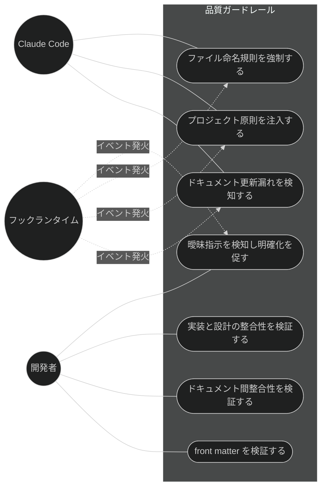

# 品質ガードレール 要求仕様書

## 概要

本ドキュメントは、Claude Code プラグイン「sdd-workflow」の品質ガードレール機能群に対する要求仕様書（親 PRD）である。
各機能の詳細要求は「機能一覧」に示す子 PRD で定義する。

AI 駆動開発では、ユーザーの曖昧な指示（「いい感じに」「よしなに」等）により AI が未定義の要求を推測して実装する
**Vibe Coding 問題**が発生し、仕様と実装の乖離・技術的負債・設計判断の不透明化を招く。
本機能群は、開発ワークフローの各タイミング（プロンプト送信時・ファイル編集前・ファイル編集後・レビュー時）に
自動的な品質ゲートを設け、曖昧性の検出、ドキュメント整合性の維持、プロジェクト原則の遵守を構造的に強制する。

本 PRD は [CONSTITUTION.md](../../CONSTITUTION.md) の最上位原則 B-001（Vibe Coding 防止）に直結する領域を対象とする。

**対象範囲:**

- プロンプト曖昧性の検知と明確化の促進（Vibe Coding 兆候検知）
- `.sdd/` 配下のファイル命名規則の強制
- プロジェクト原則（CONSTITUTION.md）のコンテキスト自動注入
- ドキュメント更新漏れの検知
- 実装コードと設計書の整合性チェック
- ドキュメント間（PRD ↔ spec ↔ design）の整合性チェック
- YAML front matter の検証

---

# 1. 要求図の読み方

SysML 要求図の記法（要求タイプ・リスクレベル・検証方法・関係タイプ）の凡例は
[PRD_TEMPLATE.md](../../PRD_TEMPLATE.md) のセクション 1 を参照。

---

# 2. 要求一覧

## 2.1. ユースケース図（概要）

## 2.2. 機能一覧

各機能の詳細要求（ユースケース詳細・機能要求の再採番・詳細説明）は以下の子 PRD を参照。

| 機能                    | 子 PRD                                                    | 概要                                        |
|-----------------------|----------------------------------------------------------|-------------------------------------------|
| Vibe Coding 兆候検知      | [vibe-detection.md](vibe-detection.md)                   | プロンプト曖昧表現の検知と明確化促進コンテキストの注入               |
| ファイル命名規則の強制           | [naming-enforcement.md](naming-enforcement.md)           | `.sdd/` 配下の命名規則違反の書き込みブロック                |
| CONSTITUTION 原則の自動注入  | [constitution-injection.md](constitution-injection.md)   | ソースコード編集時のプロジェクト原則コンテキスト注入                |
| ドキュメント更新漏れ検知          | [stale-doc-detection.md](stale-doc-detection.md)         | 編集後の整合性確認・design 同期の促し                    |
| 実装と設計の整合性チェック         | [impl-spec-check.md](impl-spec-check.md)                 | 実装コードと技術設計書の乖離検出（`/check-spec`）           |
| ドキュメント間整合性チェック        | [doc-consistency-check.md](doc-consistency-check.md)     | PRD ↔ spec ↔ design 間の不整合検出               |
| front matter 検証       | [front-matter-validation.md](front-matter-validation.md) | YAML front matter の形式・依存方向・ID 一意性の検証      |

---

# 3. 要求図（SysML Requirements Diagram）

## 3.1. 全体要求図

FR ノード（FR_001〜FR_007）の詳細（サブ機能・トリガー方式・詳細説明）は各子 PRD を参照。
子 PRD 内では要求 ID をファイル内スコープで FR_001 として再採番している。

```mermaid
%%{init: {'theme': 'dark'}}%%
requirementDiagram
    requirement QualityGuardrails {
        id: UR_001
        text: "開発ワークフローの各段階で品質ゲートが自動適用される"
        risk: high
        verifymethod: demonstration
    }

    requirement AmbiguityPrevention {
        id: UR_002
        text: "曖昧な指示は実装前に検知され明確化が促される"
        risk: high
        verifymethod: demonstration
    }

    requirement ConsistencyAssurance {
        id: UR_003
        text: "PRD・仕様書・設計書・実装の整合性が維持される"
        risk: high
        verifymethod: test
    }

    requirement PrincipleCompliance {
        id: UR_004
        text: "プロジェクト原則が実装時に自動的に遵守される"
        risk: medium
        verifymethod: inspection
    }

    functionalRequirement VibeDetection {
        id: FR_001
        text: "プロンプト中の曖昧表現を検知し明確化コンテキストを注入する"
        risk: high
        verifymethod: test
    }

    functionalRequirement NamingEnforcement {
        id: FR_002
        text: "sdd配下の命名規則違反の書き込みをブロックする"
        risk: medium
        verifymethod: test
    }

    functionalRequirement ConstitutionInjection {
        id: FR_003
        text: "ソースコード編集時にCONSTITUTION原則を注入する"
        risk: medium
        verifymethod: test
    }

    functionalRequirement StaleDocDetection {
        id: FR_004
        text: "ドキュメント編集後に整合性確認とdesign同期を促す"
        risk: medium
        verifymethod: test
    }

    functionalRequirement ImplSpecCheck {
        id: FR_005
        text: "実装コードと技術設計書の乖離を検出する"
        risk: high
        verifymethod: demonstration
    }

    functionalRequirement DocConsistencyCheck {
        id: FR_006
        text: "PRDとspecとdesign間の要求ID参照や用語の不整合を検出する"
        risk: high
        verifymethod: demonstration
    }

    functionalRequirement FrontMatterValidation {
        id: FR_007
        text: "front matterの形式と依存方向とID一意性を検証する"
        risk: low
        verifymethod: test
    }

    performanceRequirement HookLightweight {
        id: NFR_001
        text: "フック処理は軽量でプロンプト応答性を阻害しない"
        risk: medium
        verifymethod: test
    }

    interfaceRequirement HookEventCompliance {
        id: IR_001
        text: "Claude Codeフックイベント仕様とJSON Decision Controlに準拠する"
        risk: medium
        verifymethod: inspection
    }

    designConstraint MinimalBlocking {
        id: DC_001
        text: "ブロッキングは命名違反のみとし他は警告に留める"
        risk: medium
        verifymethod: inspection
    }

    designConstraint ContextBudget {
        id: DC_002
        text: "原則注入はセッション1回かつ3000文字上限とする"
        risk: low
        verifymethod: test
    }

    designConstraint CostOptimization {
        id: DC_003
        text: "ルール基盤の軽量検証には低コストモデルを使用する"
        risk: low
        verifymethod: inspection
    }

    designConstraint CrossPlatform {
        id: DC_004
        text: "macOSとLinuxの両方で動作する"
        risk: medium
        verifymethod: test
    }

    designConstraint Multilingual {
        id: DC_005
        text: "SDD_LANGによる日英の言語設定と出力に対応し出力テンプレートやレポートのEN/JA切替と曖昧表現パターンの日英カバーを含む"
        risk: medium
        verifymethod: test
    }

    QualityGuardrails - contains -> AmbiguityPrevention
    QualityGuardrails - contains -> ConsistencyAssurance
    QualityGuardrails - contains -> PrincipleCompliance
    VibeDetection - derives -> AmbiguityPrevention
    NamingEnforcement - derives -> PrincipleCompliance
    ConstitutionInjection - derives -> PrincipleCompliance
    StaleDocDetection - derives -> ConsistencyAssurance
    ImplSpecCheck - derives -> ConsistencyAssurance
    DocConsistencyCheck - derives -> ConsistencyAssurance
    FrontMatterValidation - derives -> ConsistencyAssurance
    VibeDetection - traces -> HookEventCompliance
    NamingEnforcement - traces -> HookEventCompliance
    StaleDocDetection - traces -> HookEventCompliance
    ConstitutionInjection - traces -> HookEventCompliance
    HookLightweight - traces -> VibeDetection
    HookLightweight - traces -> NamingEnforcement
    HookLightweight - traces -> ConstitutionInjection
    HookLightweight - traces -> StaleDocDetection
    MinimalBlocking - traces -> NamingEnforcement
    ContextBudget - traces -> ConstitutionInjection
    CostOptimization - traces -> FrontMatterValidation
    CrossPlatform - traces -> VibeDetection
    CrossPlatform - traces -> NamingEnforcement
    CrossPlatform - traces -> ConstitutionInjection
    CrossPlatform - traces -> StaleDocDetection
    Multilingual - traces -> VibeDetection
    Multilingual - traces -> FrontMatterValidation
    Multilingual - traces -> DocConsistencyCheck
```

---

# 4. 要求の詳細説明

## 4.1. ユーザー要求

### UR_001: 品質ゲートの自動適用

開発者は、開発ワークフローの各タイミング（プロンプト送信時・ファイル編集前・ファイル編集後・レビュー時）で、
明示的な操作なしに品質ゲートが自動適用されることを求める。品質保証が開発者の記憶や注意力に依存しない構造とする。

**検証方法:** デモンストレーションによる検証

### UR_002: 曖昧指示の実装前検知

開発者が曖昧な指示（「いい感じに」「よしなに」「somehow」等）を出した場合、AI が要求を推測して実装する前に
検知され、明確化のための対話が促されること。

**検証方法:** デモンストレーションによる検証

### UR_003: ドキュメント・実装間の整合性維持

PRD・抽象仕様書・技術設計書・実装コードの 4 層の間で不整合（要求 ID 参照欠落、データモデル不一致、
API 定義齟齬、用語不統一、実装乖離）が発生した場合、検出可能であること。

**検証方法:** テストによる検証

### UR_004: プロジェクト原則の自動遵守

CONSTITUTION.md に定義されたプロジェクト原則が、AI 実装者の実装時コンテキストに自動的に提供され、
原則違反が構造的に抑止されること。

**検証方法:** インスペクションによる検証

## 4.2. 非機能要求

### NFR_001: フック処理の軽量性

フック処理（曖昧性検知・命名検証・原則注入・更新漏れ検知）は軽量に実装し、
プロンプト送信やファイル編集の応答性を阻害しないこと。

**定量基準:**

- フックスクリプト単体の実行時間は 500ms 以内とする（計測対象: スクリプト起動から終了までの wall clock time）
- ユーザー体感として操作の遅延が目立たない水準とし、レビュー時にデモンストレーションで確認する

**検証方法:** テストによる検証

## 4.3. インターフェース要求

### IR_001: Claude Code フックイベント仕様への準拠

品質ゲートは Claude Code のフックイベントシステム（SessionStart / UserPromptSubmit / PreToolUse / PostToolUse）
および JSON Decision Control 仕様に準拠して実装すること。

**検証方法:** インスペクションによる検証

## 4.4. 設計制約

### DC_001: ブロッキングの最小化

開発フローを停止させるブロッキング動作（deny）は命名規則違反のみに限定し、
その他の品質ゲートは警告・促し（非ブロッキングなコンテキスト注入）に留めること。

**検証方法:** インスペクションによる検証

### DC_002: コンテキスト肥大の防止

CONSTITUTION 原則の注入はセッションあたり 1 回限りとし、注入テキストは 3,000 文字を上限に切り詰めること。

**根拠:** 注入テキストはすべてのソースコード編集で AI 実装者のコンテキストを恒常的に消費するため、
原則の要点（原則 ID と要約）が収まる最小限の予算としてこの上限を設ける。全文が必要な場合は
切り詰め末尾の案内に従い CONSTITUTION.md 本体を参照する運用とする。

**検証方法:** テストによる検証

### DC_003: 検証コストの最適化

ルール基盤の軽量検証（front matter 検証等）には低コストモデル（haiku）を使用し、
複雑な推論を要する検証（仕様レビュー等）とコスト階層を分離すること。

**検証方法:** インスペクションによる検証

### DC_004: クロスプラットフォーム対応

macOS / Linux の両方で動作すること。

**検証方法:** テストによる検証

### DC_005: 多言語対応

`SDD_LANG` 環境変数による日英の言語設定・出力に対応すること（出力テンプレート／レポートの EN/JA 切替、曖昧表現パターンの日英カバーを含む）。

**検証方法:** テストによる検証

---

# 5. 制約事項

## 5.1. 技術的制約

- フックスクリプトは Claude Code のフックランタイムから起動される Python 3 スクリプトとして実装する
- フックからの制御は Claude Code が提供するインターフェース（exit code / JSON Decision Control / additionalContext）に限定される
- 曖昧性検知はパターンマッチングベースであり、意味論的な曖昧性の完全検知は保証しない

## 5.2. ビジネス的制約

- CONSTITUTION.md の最上位原則 B-001（Vibe Coding 防止）に違反する仕様変更（曖昧指示を許容するデフォルト動作等）は認めない
- B-002 原則（多言語対応の一貫性）に従い、曖昧性検知の出力メッセージ・フック出力・additionalContext は
  `SDD_LANG` 環境変数に応じた EN/JA 切り替えに対応すること
  （スキル・エージェント側の多言語対応は各カテゴリの PRD で定義するが、フック出力は本機能群の責務とする）

---

# 6. 前提条件

- Claude Code のプラグイン機構・フックイベントシステムが利用可能であること
- 対象プロジェクトで sdd-workflow プラグインが有効化されていること
- 整合性チェック機能（FR_004〜FR_007）は `.sdd/` ディレクトリ構造（sdd-init による初期化）を前提とする
- FR_003 は対象プロジェクトに CONSTITUTION.md が存在する場合にのみ機能する

---

# 7. スコープ外

以下は本 PRD のスコープ外とします：

- PRD・仕様書・設計書の生成機能（prd-generation / spec-design カテゴリで扱う）
- タスク分解・TDD 実装機能（task-implementation カテゴリで扱う）
- プロジェクト初期化・設定管理（workflow-foundation カテゴリで扱う）
- 検知した不整合の自動修正（検出・促しまでを責務とし、修正は開発者と AI の対話に委ねる）
- 意味論的解析による曖昧性の完全検知（パターンベース検知の高度化は将来検討）

---

# 8. 用語集

| 用語                    | 定義                                                                       |
|-----------------------|--------------------------------------------------------------------------|
| Vibe Coding           | 曖昧な指示により AI が仕様を暗黙的に推測して実装してしまう問題（CONSTITUTION.md B-001 の定義に従う）        |
| 品質ゲート                 | 開発ワークフローの特定タイミングで自動実行される検証・警告・ブロック処理                                     |
| フック                   | Claude Code のイベント（SessionStart / UserPromptSubmit / PreToolUse / PostToolUse）に応じて実行されるスクリプト |
| JSON Decision Control | フックがツール実行の許可・拒否を JSON 出力（`permissionDecision`）で制御する Claude Code の仕組み      |
| additionalContext     | フックが AI のコンテキストに追加情報を注入する Claude Code の仕組み                               |
| CONSTITUTION.md       | プロジェクトの最上位原則を定義するドキュメント                                                  |
| front matter          | ドキュメント冒頭の YAML メタデータ（id / type / status / depends-on 等）                  |
| 自動実行スキル               | ユーザーが直接呼び出せず（`user-invocable: false`）、特定条件で AI が自動実行するスキル                |
