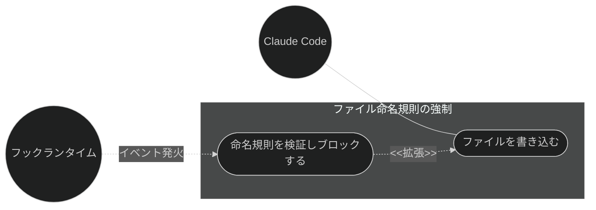
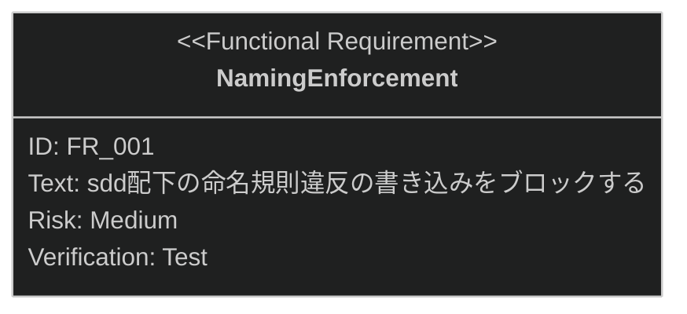

# ファイル命名規則の強制 要求仕様書

## 概要

本ドキュメントは、品質ガードレール機能群のうち **`.sdd/` 配下のファイル命名規則の強制**に対する要求仕様書である。
親 PRD は [index.md](index.md) を参照。

`.sdd/` 配下のドキュメントは命名規則（`requirement/` はサフィックスなし、`specification/` は
`_spec.md` / `_design.md` サフィックス必須）によって種別が識別される。命名規則違反はワークフロー全体の
整合性を損なうため、違反ファイルの書き込みをフックで構造的にブロックし、プロジェクト原則の遵守を強制する。

---

# 1. 要求図の読み方

SysML 要求図の記法（要求タイプ・リスクレベル・検証方法・関係タイプ）の凡例は
[PRD_TEMPLATE.md](../../PRD_TEMPLATE.md) のセクション 1 を参照。

---

# 2. 要求一覧

## 2.1. ユースケース図

## 2.2. 機能一覧（テキスト形式）

- ファイル命名規則の強制
    - `.sdd/` ファイル命名規則の検証とブロック

---

# 3. 要求図（SysML Requirements Diagram）

本ファイルの FR_001 は [index.md](index.md) の UR_004（プロジェクト原則の自動遵守）から派生する
（親 PRD の全体要求図では FR_002 として定義）。
関連する横断要求・制約として、index.md の NFR_001（フック処理の軽量性）・IR_001（フックイベント仕様への準拠）・
DC_001（ブロッキングの最小化。deny によるブロックは本機能の命名規則違反のみに限定）・
DC_004（クロスプラットフォーム対応）が本機能に trace する。

---

# 4. 要求の詳細説明

## 4.1. 機能要求

### FR_001: ファイル命名規則の強制

`.sdd/` 配下へのファイル書き込み・編集時に命名規則を検証し、違反時は書き込みをブロックする。
[index.md](index.md) の UR_004 から派生。

**トリガー方式:** 自動（`.sdd/` 配下へのファイル書き込み・編集前のフック）

- `requirement/` 配下: `_spec` / `_design` サフィックスの付与を禁止
- `specification/` 配下: `_spec.md` または `_design.md` サフィックスを必須とする
- 違反時は JSON Decision Control（`permissionDecision: deny`）により理由付きでブロックする

**検証方法:** テストによる検証

---

# 5. 前提条件

- Claude Code のプラグイン機構・フックイベントシステムが利用可能であること
- 対象プロジェクトで sdd-workflow プラグインが有効化されていること

---

# 6. スコープ外

以下は本 PRD のスコープ外とします：

- プロンプト曖昧性の検知（[vibe-detection.md](vibe-detection.md) で扱う）
- 編集時のコンテキスト注入・編集後のリマインド（[constitution-injection.md](constitution-injection.md) /
  [stale-doc-detection.md](stale-doc-detection.md) で扱う）
- front matter の内容検証（[front-matter-validation.md](front-matter-validation.md) で扱う。本機能はファイル名のみを対象とする）
