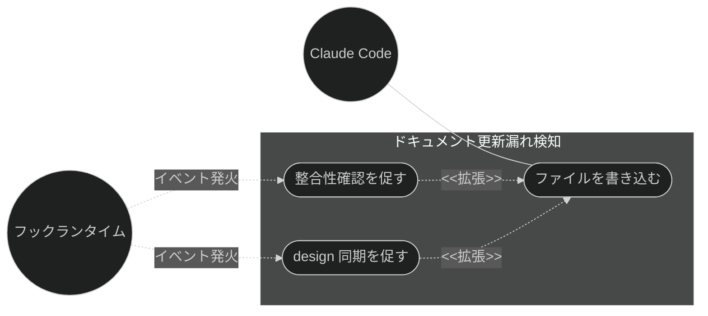
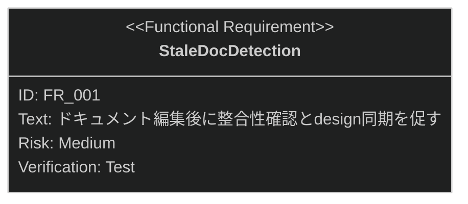

# ドキュメント更新漏れ検知 要求仕様書

## 概要

本ドキュメントは、品質ガードレール機能群のうち **ドキュメント更新漏れ検知**に対する要求仕様書である。
親 PRD は [index.md](index.md) を参照。

`.sdd/` ドキュメントやソースコードの編集後に、関連ドキュメント（PRD ↔ spec ↔ design、
対応する技術設計書）の更新が漏れると、仕様と実装の乖離が静かに進行する。本機能はファイル編集後に
更新漏れの可能性を検知し、開発者と AI に確認・同期を促すことで整合性の維持に寄与する。

---

# 1. 要求図の読み方

SysML 要求図の記法（要求タイプ・リスクレベル・検証方法・関係タイプ）の凡例は
[PRD_TEMPLATE.md](../../PRD_TEMPLATE.md) のセクション 1 を参照。

---

# 2. 要求一覧

## 2.1. ユースケース図

## 2.2. 機能一覧（テキスト形式）

- ドキュメント更新漏れ検知
    - `.sdd/` ドキュメント編集後の整合性確認リマインド
    - ソースコード編集時の design 同期リマインド

---

# 3. 要求図（SysML Requirements Diagram）

本ファイルの FR_001 は [index.md](index.md) の UR_003（ドキュメント・実装間の整合性維持）から派生する
（親 PRD の全体要求図では FR_004 として定義）。
関連する横断要求・制約として、index.md の NFR_001（フック処理の軽量性）・IR_001（フックイベント仕様への準拠）・
DC_001（ブロッキングの最小化。本機能はブロックせず警告・促しに留める）・
DC_004（クロスプラットフォーム対応）が本機能に trace する。

---

# 4. 要求の詳細説明

## 4.1. 機能要求

### FR_001: ドキュメント更新漏れ検知

ファイル編集後に更新漏れの可能性を検知し、確認を促す。[index.md](index.md) の UR_003 から派生。

**トリガー方式:** 自動（ファイル編集後のフック）

- `.sdd/` ドキュメント編集後: PRD ↔ spec ↔ design の整合性確認を促す
- ソースコード編集時: 対応する `{stem}_design.md` が存在する場合、設計書の同期を促す

**検証方法:** テストによる検証

---

# 5. 前提条件

- Claude Code のプラグイン機構・フックイベントシステムが利用可能であること
- 対象プロジェクトで sdd-workflow プラグインが有効化されていること
- `.sdd/` ディレクトリ構造（sdd-init による初期化）を前提とする

---

# 6. スコープ外

以下は本 PRD のスコープ外とします：

- 整合性の実際の検証（本機能はリマインドまでを責務とし、検証は
  [impl-spec-check.md](impl-spec-check.md) / [doc-consistency-check.md](doc-consistency-check.md) で扱う）
- 検知した更新漏れの自動修正（修正は開発者と AI の対話に委ねる）
- 編集前のガード（[naming-enforcement.md](naming-enforcement.md) /
  [constitution-injection.md](constitution-injection.md) で扱う）
