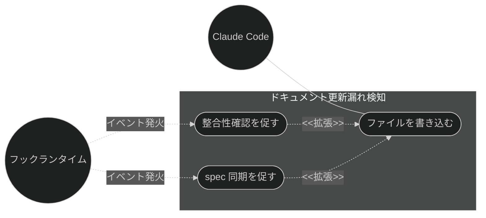
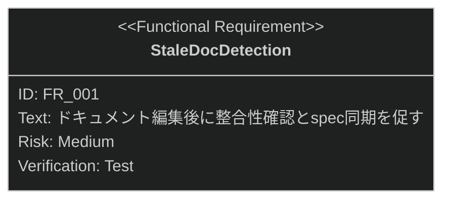

# ドキュメント更新漏れ検知 要求仕様書

## 概要

本ドキュメントは、品質ガードレール機能群のうち **ドキュメント更新漏れ検知**に対する要求仕様書である。
親 PRD は [index.md](index.md) を参照。

`.sdd/` ドキュメントやソースコードの編集後に、関連ドキュメント（PRD ↔ spec ↔ adr、対応する抽象仕様書）の
更新が漏れると、仕様と実装の乖離が静かに進行する。本機能はファイル編集後に更新漏れの可能性を検知し、
開発者と AI に確認・同期を促すことで整合性の維持に寄与する。

技術設計書は `task/{ticket-number}/design-draft.md` の一時ドラフトとなり実装完了後に削除されるため、
ソースコード編集時に追随を促す対象は永続ドキュメントである抽象仕様書（spec）とする。

本機能はプロジェクト原則（[CONSTITUTION.md](../../CONSTITUTION.md) の B-001: Vibe Coding 防止、
D-001: Specification-Driven）を、更新漏れによる乖離を編集直後に可視化することで支える。

---

# 1. 要求図の読み方

SysML 要求図の記法（要求タイプ・リスクレベル・検証方法・関係タイプ）の凡例は
[PRD_TEMPLATE.md](../../PRD_TEMPLATE.md) のセクション 1 を参照。

---

# 2. 要求一覧

## 2.1. ユースケース図

```mermaid
%%{init: {'theme': 'dark'}}%%
flowchart LR
    ClaudeCode((Claude Code))
    HookRuntime((フックランタイム))

    subgraph StaleDocDetection["ドキュメント更新漏れ検知"]
        WriteFile([ファイルを書き込む])
        RemindConsistency([整合性確認を促す])
        RemindSpecSync([spec 同期を促す])
    end

    ClaudeCode --- WriteFile
    RemindConsistency -.->|"<<拡張>>"| WriteFile
    RemindSpecSync -.->|"<<拡張>>"| WriteFile
    HookRuntime -.->|"イベント発火"| RemindConsistency
    HookRuntime -.->|"イベント発火"| RemindSpecSync
```

## 2.2. 機能一覧（テキスト形式）

- ドキュメント更新漏れ検知
    - `.sdd/` ドキュメント（PRD / spec / adr）編集後の整合性確認リマインド
    - ソースコード編集時の spec 同期リマインド

---

# 3. 要求図（SysML Requirements Diagram）

```mermaid
%%{init: {'theme': 'dark'}}%%
requirementDiagram
    functionalRequirement StaleDocDetection {
        id: FR_001
        text: "ドキュメント編集後に整合性確認とspec同期を促す"
        risk: medium
        verifymethod: test
    }
```

本ファイルの FR_001 は [index.md](index.md) の UR_003（ドキュメント・実装間の整合性維持）から派生する
（親 PRD の全体要求図では FR_004 として定義）。
関連する横断要求・制約として、index.md の NFR_001（フック処理の軽量性）・IR_001（フックイベント仕様への準拠）・
DC_001（ブロッキングの最小化。本機能はブロックせず警告・促しに留める）・
DC_004（クロスプラットフォーム対応）が本機能に trace する。

---

# 4. 要求の詳細説明

## 4.1. 機能要求

### FR_001: ドキュメント更新漏れ検知

ファイル編集後に更新漏れの可能性を検知し、確認を促す。[index.md](index.md) の UR_003 から派生。

**トリガー方式:** 自動（ファイル編集後のフック）

- `.sdd/` 仕様書・要求仕様の編集後: PRD ↔ spec ↔ adr の整合性確認・下流への変更伝播を促す
- `.sdd/` 決定ログ（`adr/`）の編集後: 追記専用の原則と、決定が spec に反映されているかの確認を促す
  （`adr/` は単一種別ディレクトリでサフィックスが任意。命名規則の定義元は
  [naming-enforcement.md](naming-enforcement.md)）
- ソースコード編集時: 対応する spec（`{stem}.md` / `{stem}_spec.md`）が存在する場合、仕様書の同期を促す

**検証方法:** テストによる検証

---

# 5. 前提条件

- Claude Code のプラグイン機構・フックイベントシステムが利用可能であること
- 対象プロジェクトで sdd-workflow プラグインが有効化されていること
- `.sdd/` ディレクトリ構造（sdd-init による初期化）を前提とする

---

# 6. スコープ外

以下は本 PRD のスコープ外とします：

- 整合性の実際の検証（本機能はリマインドまでを責務とし、検証は
  [impl-spec-check.md](impl-spec-check.md) / [doc-consistency-check.md](doc-consistency-check.md) で扱う）
- 一時ドラフト（`task/{ticket-number}/design-draft.md`）の更新漏れ検知（実装期間中のみ存在する一時
  ドキュメントであり、永続ドキュメントの乖離を防ぐ本機能の目的と合致しない）
- 検知した更新漏れの自動修正（修正は開発者と AI の対話に委ねる）
- 編集前のガード（[naming-enforcement.md](naming-enforcement.md) /
  [constitution-injection.md](constitution-injection.md) で扱う）
