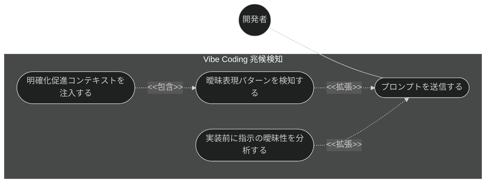
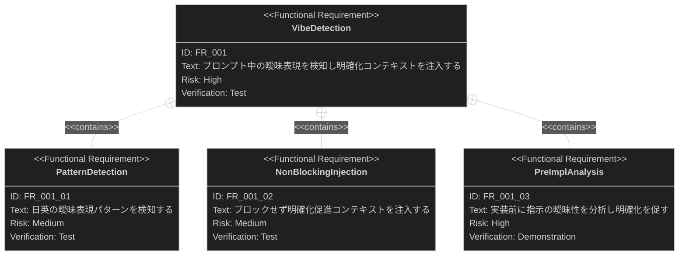

# Vibe Coding 兆候検知 要求仕様書

## 概要

本ドキュメントは、品質ガードレール機能群のうち **Vibe Coding 兆候検知**に対する要求仕様書である。
親 PRD は [index.md](index.md) を参照。

ユーザーの曖昧な指示（「いい感じに」「よしなに」等）により AI が未定義の要求を推測して実装する
Vibe Coding 問題を防ぐため、プロンプト送信時に曖昧表現を検知し、AI が実装に着手する前に
明確化のための対話を促す。[CONSTITUTION.md](../../CONSTITUTION.md) の最上位原則 B-001（Vibe Coding 防止）に直結する機能である。

---

# 1. 要求図の読み方

SysML 要求図の記法（要求タイプ・リスクレベル・検証方法・関係タイプ）の凡例は
[PRD_TEMPLATE.md](../../PRD_TEMPLATE.md) のセクション 1 を参照。

---

# 2. 要求一覧

## 2.1. ユースケース図

## 2.2. 機能一覧（テキスト形式）

- Vibe Coding 兆候検知
    - プロンプト曖昧表現パターン検知（日英対応）
    - 非ブロッキングでの明確化促進コンテキスト注入
    - 実装前の指示曖昧性分析（自動実行スキル）

---

# 3. 要求図（SysML Requirements Diagram）

本ファイルの FR_001 は [index.md](index.md) の UR_002（曖昧指示の実装前検知）から派生する
（親 PRD の全体要求図では FR_001 として定義）。
関連する横断要求・制約として、index.md の NFR_001（フック処理の軽量性）・IR_001（フックイベント仕様への準拠）・
DC_004（クロスプラットフォーム・多言語対応）が本機能に trace する。

---

# 4. 要求の詳細説明

## 4.1. 機能要求

### FR_001: Vibe Coding 兆候検知

ユーザープロンプト送信時に曖昧表現を検知し、明確化を促す。[index.md](index.md) の UR_002 から派生。

**トリガー方式:** 自動（プロンプト送信イベントのフック、および実装前の自動実行スキル）

**含まれる機能:**

- FR_001_01: 日英の曖昧表現パターン検知（例:「いい感じ」「よしなに」「なんとなく」「make it nice」「somehow」）
- FR_001_02: 非ブロッキングでの明確化促進コンテキスト注入（プロンプト自体は拒否しない）
- FR_001_03: 実装前の指示曖昧性分析（ユーザー呼び出し不可の自動実行スキルとして提供）

**検証方法:** テストによる検証

---

# 5. 前提条件

- Claude Code のプラグイン機構・フックイベントシステムが利用可能であること
- 対象プロジェクトで sdd-workflow プラグインが有効化されていること

---

# 6. スコープ外

以下は本 PRD のスコープ外とします：

- ファイル編集時のガード（[naming-enforcement.md](naming-enforcement.md) /
  [constitution-injection.md](constitution-injection.md) / [stale-doc-detection.md](stale-doc-detection.md) で扱う）
- ドキュメント・実装間の整合性チェック（[impl-spec-check.md](impl-spec-check.md) /
  [doc-consistency-check.md](doc-consistency-check.md) で扱う）
- 意味論的解析による曖昧性の完全検知（パターンベース検知の高度化は将来検討）
