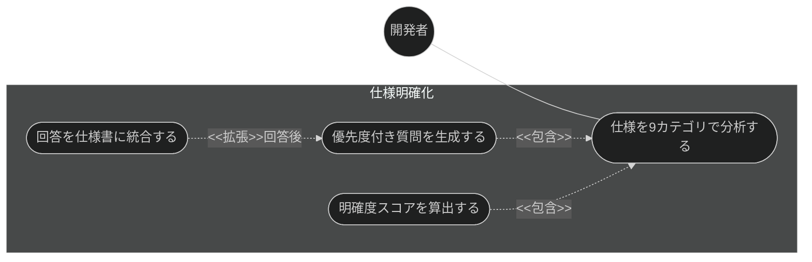
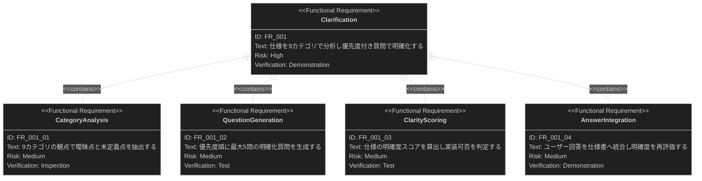

# 仕様明確化 要求仕様書

## 概要

本ドキュメントは、仕様・設計機能群（親 PRD: [index.md](index.md)）のうち、
仕様明確化機能に対する要求仕様書である。

実装に着手する前に、対象仕様（またはユーザー要件）の曖昧点・未定義点を体系的に洗い出し、
優先度付きの質問と回答統合を通じて、実装可能な明確度に到達させる。

**対象範囲:**

- 9 カテゴリ（機能範囲・データモデル・フロー・非機能・統合・エッジケース・制約・用語・完了基準）での分析
- 優先度付き明確化質問の生成（最大 5 問）
- 明確度スコアの算出と実装可否判定
- ユーザー回答の仕様書への統合

要求図の記法凡例は [PRD_TEMPLATE.md](../../PRD_TEMPLATE.md) のセクション 1 を参照。

---

# 1. 要求一覧

## 1.1. ユースケース図（仕様明確化フロー）

## 1.2. 機能一覧（テキスト形式）

- 仕様明確化
    - 9 カテゴリ（機能範囲・データモデル・フロー・非機能・統合・エッジケース・制約・用語・完了基準）での分析
    - 優先度付き明確化質問の生成（最大 5 問）
    - 明確度スコアの算出と実装可否判定
    - ユーザー回答の仕様書への統合

---

# 2. 要求図（SysML Requirements Diagram）

本機能の FR_001 は、親 PRD [index.md](index.md) の UR_002（実装前の曖昧さ解消）から派生する
（親 PRD の全体要求図では FR_002: Clarification として定義）。
また、親 PRD の NFR_001（明確度の判定基準）が本機能にトレースする。

---

# 3. 要求の詳細説明

## 3.1. 機能要求

### FR_001: 仕様明確化

対象仕様（またはユーザー要件）を分析し、曖昧点を質問により解消する。
[index.md](index.md) の UR_002 から派生。

**トリガー方式:** 手動（開発者による `/clarify` スキル呼び出し）。仕様生成前の事前明確化としても利用する

**含まれる機能:**

- FR_001_01: 9 カテゴリ（機能範囲・データモデル・フロー・非機能要求・統合・エッジケース・制約・用語・完了基準）での曖昧点抽出
- FR_001_02: 優先度付き明確化質問の生成（最大 5 問）
- FR_001_03: 明確度スコアの算出と実装可否判定
- FR_001_04: ユーザー回答の仕様書への統合と再評価

**検証方法:** デモンストレーションによる検証

**関連する非機能要求（[index.md](index.md) の NFR_001）:**

明確度スコアは 80% 以上を実装可能（implementation-ready）と判定し、
基準未満の仕様に対しては実装への進行ではなく追加の明確化を推奨すること。
これは B-001 原則（Vibe Coding 防止）にも基づく。

---

# 4. 前提条件

- 対象プロジェクトで sdd-workflow プラグインが有効化され、`.sdd/` ディレクトリが初期化済みであること

---

# 5. スコープ外

以下は本 PRD のスコープ外とします：

- 仕様書・設計書の生成そのもの（兄弟機能 [generate-spec.md](generate-spec.md) が扱う）
- 仕様書・設計書の品質レビュー（兄弟機能 [spec-review.md](spec-review.md) が扱う）
- プロンプト曖昧性の自動検知（quality-guardrails カテゴリの vibe-detector が扱う。本機能は仕様文書の明確化）
