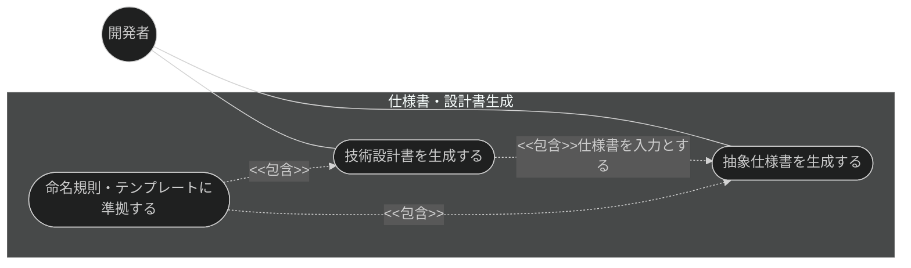
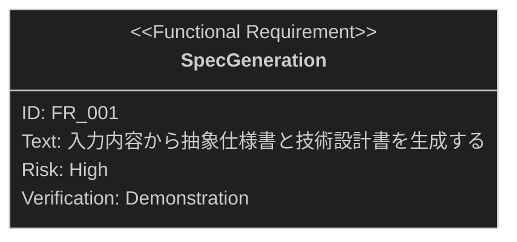

# 仕様書・設計書生成 要求仕様書

## 概要

本ドキュメントは、仕様・設計機能群（親 PRD: [index.md](index.md)）のうち、
仕様書・設計書生成機能に対する要求仕様書である。

入力内容（PRD・要件記述）から「何を作るか」を定義する抽象仕様書（`*_spec.md`）と
「どのように実現するか」を定義する技術設計書（`*_design.md`）を生成し、
AI 実装者へのガードレールとなる 2 層のドキュメントを構築する。

**対象範囲:**

- 入力内容（PRD・要件記述）からの抽象仕様書（`*_spec.md`）生成
- 抽象仕様書からの技術設計書（`*_design.md`）生成
- 命名規則・テンプレート・front matter への準拠

要求図の記法凡例は [PRD_TEMPLATE.md](../../PRD_TEMPLATE.md) のセクション 1 を参照。

---

# 1. 要求一覧

## 1.1. ユースケース図

## 1.2. 機能一覧（テキスト形式）

- 仕様書・設計書生成
    - 入力内容（PRD・要件記述）からの抽象仕様書（`*_spec.md`）生成
    - 抽象仕様書からの技術設計書（`*_design.md`）生成
    - 命名規則・テンプレート・front matter への準拠

---

# 2. 要求図（SysML Requirements Diagram）

本機能の FR_001 は、親 PRD [index.md](index.md) の UR_001（段階的な具体化）から派生する
（親 PRD の全体要求図では FR_001: SpecGeneration として定義）。
また、親 PRD の IR_001（命名規則・テンプレート・front matter への準拠）、
DC_001（抽象度の分離）、DC_002（言語の一貫性）が本機能にトレースする。

---

# 3. 要求の詳細説明

## 3.1. 機能要求

### FR_001: 仕様書・設計書生成

入力内容（PRD・要件記述）から抽象仕様書（`{feature-name}_spec.md`）と技術設計書
（`{feature-name}_design.md`）を生成し、specification ディレクトリに保存する。
[index.md](index.md) の UR_001 から派生。

生成にあたっては、生成前に入力の曖昧性（Vibe Coding リスク）を評価し、高リスク時は不足情報を確認したうえで
生成へ進む（vibe-detector 機能との連携。曖昧性検知そのものは vibe-detector が正典）。また非対話（CI）モードでは、
曖昧性評価・レビューを省略して既存ファイルの上書きを自動承認する運用にも対応する。

**トリガー方式:** 手動（開発者による `/generate-spec` スキル呼び出し）

**検証方法:** デモンストレーションによる検証

**関連する制約（[index.md](index.md) で定義）:**

- IR_001: 生成物は命名規則（`_spec.md` / `_design.md` サフィックス必須）・テンプレート構造・
  front matter スキーマに準拠すること
- DC_001: 抽象仕様書には技術的実装詳細を含めず、技術設計書には設計判断の理由を明示すること
- DC_002: 生成物の言語は `SDD_LANG` 環境変数に従い、単一ドキュメント内で混在させないこと

---

# 4. 前提条件

- 対象プロジェクトで sdd-workflow プラグインが有効化され、`.sdd/` ディレクトリが初期化済みであること
- 上流の PRD が存在する場合、仕様書の front matter から `depends-on` で参照できること

---

# 5. スコープ外

以下は本 PRD のスコープ外とします：

- 生成前の仕様明確化（兄弟機能 [clarify.md](clarify.md) が扱う）
- 生成後の品質レビュー（兄弟機能 [spec-review.md](spec-review.md) が扱う）
- 既存実装からの設計書逆算（兄弟機能 [plan-refactor.md](plan-refactor.md) が扱う）
- PRD 自体の生成（prd-generation カテゴリで扱う）
