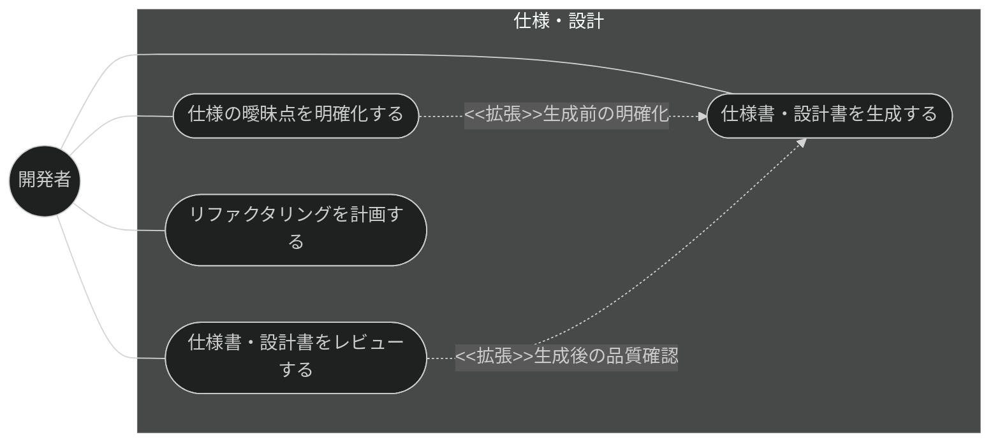
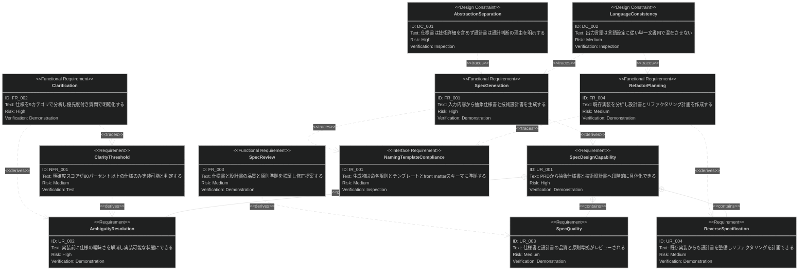

# 仕様・設計 要求仕様書

## 概要

本ドキュメントは、Claude Code プラグイン「sdd-workflow」の仕様・設計機能群に対する要求仕様書である。

AI-SDD ワークフローでは、PRD（何を・なぜ）から抽象仕様書（`*_spec.md`: 何を）と技術設計書
（`*_design.md`: どのように）へ段階的に具体化することで、AI 実装者へのガードレールを構築する。
本機能群は、この Specify / Plan フェーズの中核として、仕様書・設計書の生成、実装前の曖昧さ解消、
品質レビュー、および既存実装からの仕様逆算（リファクタリング計画）を提供する。

**対象範囲:**

- 抽象仕様書・技術設計書の生成
- 仕様の明確化（曖昧点の分析・質問生成・回答統合）
- 仕様書・設計書の品質レビュー
- 既存機能のリファクタリング計画（実装からの設計書逆算）

本 PRD は階層構造で管理する。各機能要求の詳細は「2.2. 機能一覧」に示す子 PRD を参照。

---

# 1. 要求図の読み方

SysML 要求図の記法（要求タイプ・リスクレベル・検証方法・関係タイプ）の凡例は
[PRD_TEMPLATE.md](../../PRD_TEMPLATE.md) のセクション 1 を参照。

---

# 2. 要求一覧

## 2.1. ユースケース図（概要）

## 2.2. 機能一覧

各機能の要求詳細（トリガー方式・サブ機能・検証方法）は以下の子 PRD で定義する。

| 機能         | 子 PRD                                    | 概要                                     |
|:-----------|:-----------------------------------------|:---------------------------------------|
| 仕様書・設計書生成  | [generate-spec.md](generate-spec.md)     | 入力内容から抽象仕様書と技術設計書を生成する         |
| 仕様明確化      | [clarify.md](clarify.md)                 | 仕様を 9 カテゴリで分析し優先度付き質問で明確化する    |
| 仕様・設計レビュー  | [spec-review.md](spec-review.md)         | 仕様書・設計書の品質と原則準拠を検証し修正提案する      |
| リファクタリング計画 | [plan-refactor.md](plan-refactor.md)     | 既存実装を分析し設計書とリファクタリング計画を作成する    |

---

# 3. 要求図（SysML Requirements Diagram）

## 3.1. 全体要求図

FR ノード（FR_001〜FR_004）の詳細説明・サブ機能分解は各子 PRD を参照。

---

# 4. 要求の詳細説明

機能要求（FR_001〜FR_004）の詳細説明は各子 PRD に移設した。「2.2. 機能一覧」を参照。

**粒度方針:** 子 PRD は高レベルの機能要求（FR）のみを定義し、詳細な要件分解は spec 層（`*_spec.md`）で行う。
例外として仕様明確化（clarify）のみ、その性質上 PRD 層で先行的に分解する。

## 4.1. ユーザー要求

### UR_001: 段階的な具体化

開発者は、PRD または要件記述を入力として、「何を作るか」を定義する抽象仕様書と
「どのように実現するか」を定義する技術設計書を、抽象度を分離した 2 層のドキュメントとして生成できること。

**検証方法:** デモンストレーションによる検証

### UR_002: 実装前の曖昧さ解消

開発者は、実装に着手する前に仕様の曖昧点・未定義点を体系的に洗い出し、
対話を通じて解消して、実装可能な明確度に到達できること。

**検証方法:** デモンストレーションによる検証

### UR_003: 仕様・設計の品質保証

生成・更新された仕様書・設計書は、プロジェクト原則への準拠・曖昧表現の有無・必須セクションの
網羅性・上流ドキュメントとのトレーサビリティの観点でレビュー可能であること。

**検証方法:** デモンストレーションによる検証

### UR_004: 既存実装からの仕様整備

仕様書が存在しない既存機能に対しても、実装コードの分析から設計書を逆算・整備し、
リファクタリング計画を立案できること。

**検証方法:** デモンストレーションによる検証

## 4.2. 非機能要求

### NFR_001: 明確度の判定基準

仕様の明確度はスコアとして定量化し、80% 以上を実装可能（implementation-ready）と判定すること。
基準未満の仕様に対しては、実装への進行ではなく追加の明確化を推奨すること。

**検証方法:** テストによる検証

## 4.3. インターフェース要求

### IR_001: 命名規則・テンプレート・front matter への準拠

生成される仕様書・設計書は、命名規則（`_spec.md` / `_design.md` サフィックス必須）、
プロジェクトのテンプレート構造、および front matter スキーマ（`type: "spec"` は `sdd-phase: "specify"`、
`type: "design"` は `sdd-phase: "plan"`、depends-on は上流方向のみ）に準拠すること。

**検証方法:** インスペクションによる検証

## 4.4. 設計制約

### DC_001: 抽象度の分離

抽象仕様書（`*_spec.md`）には技術的実装詳細（アーキテクチャ・技術スタック・API 定義・スキーマ）を
含めず、技術設計書（`*_design.md`）には設計判断の理由（なぜその設計か）を明示すること。

**根拠:** AI-SDD 原則の Design Decision Transparency（設計判断の透明性）および
仕様をガードレールとして機能させるための抽象度管理による。

**検証方法:** インスペクションによる検証

### DC_002: 言語の一貫性

生成される仕様書・設計書の言語は `SDD_LANG` 環境変数（en / ja）に従い、
単一ドキュメント内で言語を混在させないこと。

**検証方法:** インスペクションによる検証

---

# 5. 制約事項

## 5.1. 技術的制約

- 本機能群は Claude Code のスキル・エージェント機構上で動作し、分析・生成品質は基盤モデルの能力に依存する
- リファクタリング計画の実装分析は静的なコード読解に基づき、実行時挙動の解析は含まない

## 5.2. ビジネス的制約

- B-001 原則（Vibe Coding 防止）に従い、明確度が基準未満の仕様で実装に進むことを推奨してはならない
- B-002 原則（多言語対応の一貫性）に従い、テンプレート・出力は EN/JA の両言語で同等の構成を維持すること

---

# 6. 前提条件

- 対象プロジェクトで sdd-workflow プラグインが有効化され、`.sdd/` ディレクトリが初期化済みであること
- 上流の PRD が存在する場合、仕様書の front matter から `depends-on` で参照できること
- レビューの CONSTITUTION 準拠チェックは、対象プロジェクトに CONSTITUTION.md が存在する場合にのみ機能する

---

# 7. スコープ外

以下は本 PRD のスコープ外とします：

- PRD 自体の生成（prd-generation カテゴリで扱う）
- 設計書からのタスク分解・実装（task-implementation カテゴリで扱う）
- 実装コードと設計書の継続的な整合性チェック（quality-guardrails カテゴリの check-spec が扱う）
- プロンプト曖昧性の自動検知（quality-guardrails カテゴリの vibe-detector が扱う。本カテゴリは仕様文書の明確化）

---

# 8. 用語集

| 用語         | 定義                                                                 |
|------------|--------------------------------------------------------------------|
| 抽象仕様書      | `{name}_spec.md`。「何を作るか」を技術詳細抜きで定義する Specify フェーズの成果物         |
| 技術設計書      | `{name}_design.md`。「どのように実現するか」と設計判断の理由を定義する Plan フェーズの成果物   |
| 明確度スコア     | 仕様の曖昧さの少なさを定量化した指標。80% 以上で実装可能と判定する                          |
| 9 カテゴリ分析   | 機能範囲・データモデル・フロー・非機能・統合・エッジケース・制約・用語・完了基準の観点による曖昧点分析 |
| リファクタリング計画 | 既存実装の分析に基づく設計書整備と改善手順の立案                                       |
