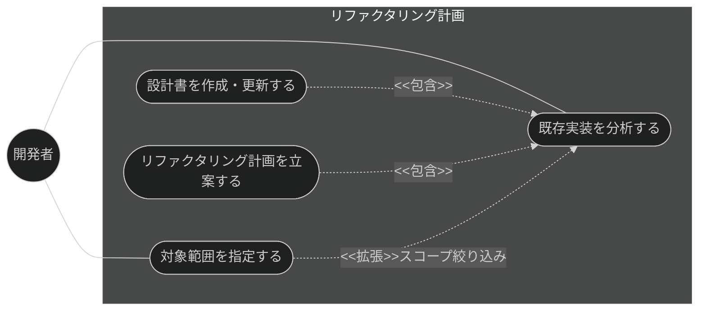
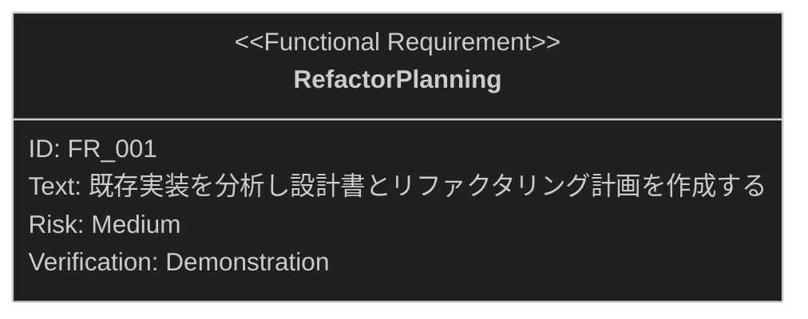

# リファクタリング計画 要求仕様書

## 概要

本ドキュメントは、仕様・設計機能群（親 PRD: [index.md](index.md)）のうち、
リファクタリング計画機能に対する要求仕様書である。

仕様書が存在しない既存機能に対しても、実装コードの分析から技術設計書を逆算・整備し、
リファクタリング計画を立案できるようにする。

**対象範囲:**

- 既存実装の分析と設計書の作成・更新
- 対象範囲の指定（スコープ絞り込み）

要求図の記法凡例は [PRD_TEMPLATE.md](../../PRD_TEMPLATE.md) のセクション 1 を参照。

---

# 1. 要求一覧

## 1.1. ユースケース図

## 1.2. 機能一覧（テキスト形式）

- リファクタリング計画
    - 既存実装の分析と設計書の作成・更新
    - 対象範囲の指定（スコープ絞り込み）

---

# 2. 要求図（SysML Requirements Diagram）

本機能の FR_001 は、親 PRD [index.md](index.md) の UR_004（既存実装からの仕様整備）から派生する
（親 PRD の全体要求図では FR_004: RefactorPlanning として定義）。
また、親 PRD の IR_001（命名規則・テンプレート・front matter への準拠）と
DC_002（言語の一貫性）が本機能にトレースする。

---

# 3. 要求の詳細説明

## 3.1. 機能要求

### FR_001: リファクタリング計画

既存機能の実装コードを分析し、技術設計書の作成・更新とリファクタリング計画の立案を行う。
分析対象はディレクトリ指定で絞り込める。開発者は任意で改善目標（context）を入力でき、
目標に沿った焦点を絞ったリファクタリング計画を立案できる。
大規模実装（20+ ファイル）を検出した場合は確認ダイアログを表示し、対話的にスコープを絞り込む。
[index.md](index.md) の UR_004 から派生。

**トリガー方式:** 手動（開発者による `/plan-refactor` スキル呼び出し）

**検証方法:** デモンストレーションによる検証

**関連する制約（[index.md](index.md) で定義）:**

- IR_001: 生成される設計書は命名規則（`_design.md` サフィックス必須）・テンプレート構造・
  front matter スキーマに準拠すること
- DC_002: 生成物の言語は `SDD_LANG` 環境変数に従い、単一ドキュメント内で混在させないこと
- 技術的制約: 実装分析は静的なコード読解に基づき、実行時挙動の解析は含まない

---

# 4. 前提条件

- 対象プロジェクトで sdd-workflow プラグインが有効化され、`.sdd/` ディレクトリが初期化済みであること
- 分析対象の実装コードがリポジトリ内で読解可能であること

---

# 5. スコープ外

以下は本 PRD のスコープ外とします：

- PRD・要件記述を入力とする順方向の仕様書・設計書生成（兄弟機能 [generate-spec.md](generate-spec.md) が扱う）
- 生成された設計書の品質レビュー（兄弟機能 [spec-review.md](spec-review.md) が扱う）
- リファクタリングの実装そのもの（task-implementation カテゴリで扱う）
