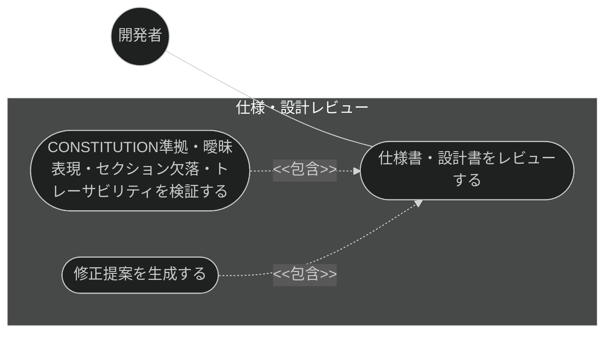
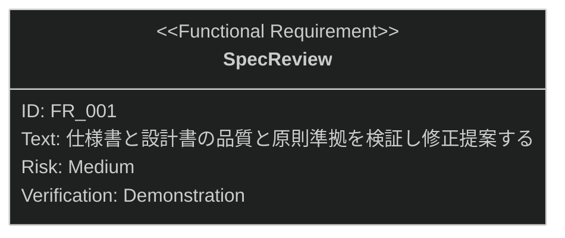

# 仕様・設計レビュー 要求仕様書

## 概要

本ドキュメントは、仕様・設計機能群（親 PRD: [index.md](index.md)）のうち、
仕様・設計レビュー機能に対する要求仕様書である。

生成・更新された仕様書・設計書に対し、プロジェクト原則への準拠・曖昧表現の有無・
必須セクションの網羅性・上流ドキュメントとのトレーサビリティを検証し、修正提案を生成する。

**対象範囲:**

- CONSTITUTION 準拠・曖昧表現・セクション欠落・トレーサビリティの検証
- 修正提案の生成

要求図の記法凡例は [PRD_TEMPLATE.md](../../PRD_TEMPLATE.md) のセクション 1 を参照。

---

# 1. 要求一覧

## 1.1. ユースケース図

## 1.2. 機能一覧（テキスト形式）

- 品質レビュー
    - CONSTITUTION 準拠・曖昧表現・セクション欠落・トレーサビリティの検証
    - 修正提案の生成

---

# 2. 要求図（SysML Requirements Diagram）

本機能の FR_001 は、親 PRD [index.md](index.md) の UR_003（仕様・設計の品質保証）から派生する
（親 PRD の全体要求図では FR_003: SpecReview として定義）。

---

# 3. 要求の詳細説明

## 3.1. 機能要求

### FR_001: 仕様・設計レビュー

仕様書・設計書に対し、CONSTITUTION 準拠・曖昧表現・必須セクションの欠落・SysML 記法の妥当性・
PRD / 仕様 / 設計間のトレーサビリティを検証し、修正提案を生成する。
[index.md](index.md) の UR_003 から派生。

**トリガー方式:** 手動（レビュー依頼時）または仕様生成後の品質確認として自動実行

**検証方法:** デモンストレーションによる検証

---

# 4. 前提条件

- 対象プロジェクトで sdd-workflow プラグインが有効化され、`.sdd/` ディレクトリが初期化済みであること
- CONSTITUTION 準拠チェックは、対象プロジェクトに [CONSTITUTION.md](../../CONSTITUTION.md) に相当する
  プロジェクト原則ドキュメントが存在する場合にのみ機能する
- トレーサビリティ検証には、上流の PRD・仕様書が front matter の `depends-on` で参照可能であること

---

# 5. スコープ外

以下は本 PRD のスコープ外とします：

- 仕様書・設計書の生成そのもの（兄弟機能 [generate-spec.md](generate-spec.md) が扱う）
- 仕様の曖昧点の対話的な解消（兄弟機能 [clarify.md](clarify.md) が扱う。本機能は文書品質の検証と修正提案）
- 実装コードと設計書の継続的な整合性チェック（quality-guardrails カテゴリの check-spec が扱う）
