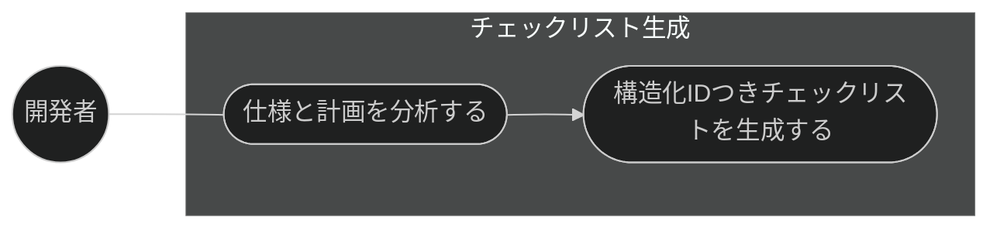
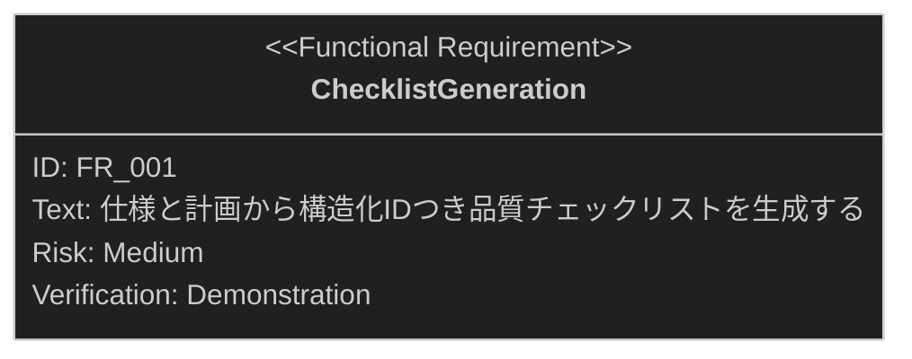

# チェックリスト生成 要求仕様書

## 概要

本ドキュメントは、タスク・実装機能群（親 PRD: [index.md](index.md)）のうち、
仕様書・計画から品質保証チェックリストを生成する「チェックリスト生成」機能に対する要求仕様書である。

生成されたチェックリストは、チェックリスト自動検証（[run-checklist.md](run-checklist.md)）の入力となり、
実装品質の体系的な検証を支える。

SysML 要求図の記法（要求タイプ・リスクレベル・検証方法・関係タイプ）の凡例は
[PRD_TEMPLATE.md](../../PRD_TEMPLATE.md) のセクション 1 を参照。

---

# 1. 要求一覧

## 1.1. ユースケース図

## 1.2. 機能一覧（テキスト形式）

- チェックリスト生成
    - 仕様・計画からの品質チェックリスト生成（構造化 ID・カテゴリ付き）

---

# 2. 要求図（SysML Requirements Diagram）

要求 ID は本ファイル内スコープで採番する。本ファイルの FR_001 は、
[index.md](index.md) の UR_003（体系的な品質検証）から派生する。
また、[run-checklist.md](run-checklist.md) の FR_001（チェックリスト自動検証）が本機能の成果物に
トレースされる（親 PRD の全体要求図を参照。本図には自ファイル内のノードのみを定義する）。

---

# 3. 要求の詳細説明

## 3.1. 機能要求

### FR_001: チェックリスト生成

仕様書・計画から、構造化 ID とカテゴリを持つ品質保証チェックリストを生成する。
[index.md](index.md) の UR_003 から派生。

**トリガー方式:** 手動（開発者による `/checklist` スキル呼び出し）

**検証方法:** デモンストレーションによる検証

---

# 4. 前提条件

- チェックリスト生成の入力となる仕様書・計画（tasks.md 等）が存在すること
- 対象プロジェクトで sdd-workflow プラグインが有効化され、`.sdd/` ディレクトリが初期化済みであること

---

# 5. スコープ外

以下は本 PRD のスコープ外とします：

- チェックリスト項目の自動検証（[run-checklist.md](run-checklist.md) で扱う）
- タスク分解・TDD 実装そのもの（[task-breakdown.md](task-breakdown.md) /
  [implement.md](implement.md) で扱う）
- 仕様書・設計書の生成・明確化（spec-design カテゴリで扱う）
