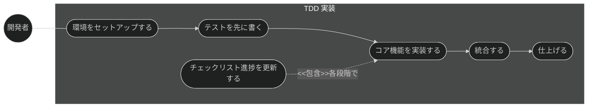
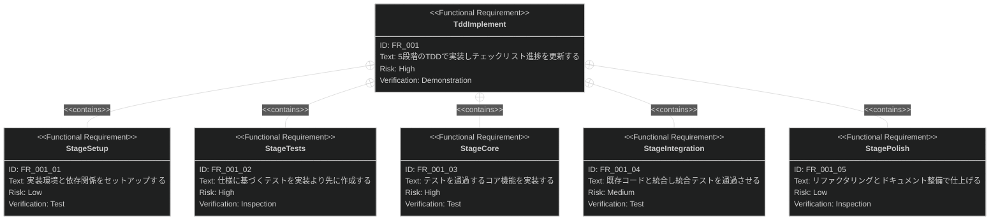

# TDD 実装 要求仕様書

## 概要

本ドキュメントは、タスク・実装機能群（親 PRD: [index.md](index.md)）のうち、
tasks.md のタスクを 5 段階の TDD プロセスで実装する「TDD 実装」機能に対する要求仕様書である。

TDD 実装は、タスク分解（[task-breakdown.md](task-breakdown.md)）の成果物 tasks.md を入力とし、
各段階の完了に応じてチェックリストの進捗を逐次更新することで、
実装が常に仕様（真実の源）にトレースされた状態を維持する。

SysML 要求図の記法（要求タイプ・リスクレベル・検証方法・関係タイプ）の凡例は
[PRD_TEMPLATE.md](../../PRD_TEMPLATE.md) のセクション 1 を参照。

---

# 1. 要求一覧

## 1.1. ユースケース図（TDD 実装フロー）

## 1.2. 機能一覧（テキスト形式）

- TDD 実装
    - 5 段階（Setup → Tests → Core → Integration → Polish）の段階的実装
    - tasks.md のチェックリスト進捗の逐次更新

---

# 2. 要求図（SysML Requirements Diagram）

要求 ID は本ファイル内スコープで採番する。本ファイルの FR_001 は、
[index.md](index.md) の UR_002（仕様準拠とテストの裏付け）から派生し、
同 DC_001（テストファースト）にトレースされる
（親 PRD の全体要求図を参照。本図には自ファイル内のノードのみを定義する）。

---

# 3. 要求の詳細説明

## 3.1. 機能要求

### FR_001: TDD 実装

tasks.md のタスクを、5 段階の TDD プロセスで実装し、各段階の完了に応じて
チェックリストの進捗を逐次更新する。
[index.md](index.md) の UR_002 から派生。

**トリガー方式:** 手動（開発者による `/implement` スキル呼び出し）

**含まれる機能:**

- FR_001_01: Setup — 実装環境・依存関係のセットアップ
- FR_001_02: Tests — 仕様に基づくテストの先行作成
- FR_001_03: Core — テストを通過するコア機能の実装
- FR_001_04: Integration — 既存コードとの統合と統合テスト
- FR_001_05: Polish — リファクタリング・ドキュメント整備

**関連する親制約:**

- [index.md](index.md) の DC_001（テストファースト）: 実装（Core 段階）に先立ちテスト（Tests 段階）を
  作成する順序をプロセスとして強制すること。テストのない実装段階への進行を許容しない

**テスト失敗時のフロー:**

- FR_001_02（Tests）で作成したテストが失敗している間は、FR_001_03（Core）以降の次段階へ進行しない。
- テストが失敗している間は当該タスクを完了として扱わず、対応するチェックリスト項目の進捗更新も行わない。
- テスト失敗時は、実装を修正するか、仕様の理解が誤っていた場合はテストを更新し、テストが成功してから次段階へ進む。

**検証方法:** デモンストレーションによる検証

---

# 4. 前提条件

- タスク分解の成果物（tasks.md）が `task/{ticket-number}/` 配下に存在すること
- 対象プロジェクトで sdd-workflow プラグインが有効化され、`.sdd/` ディレクトリが初期化済みであること
- TDD 実装の品質は基盤モデルの能力および仕様書・設計書の明確度に依存する（[index.md](index.md) の技術的制約）

---

# 5. スコープ外

以下は本 PRD のスコープ外とします：

- タスク分解そのもの（[task-breakdown.md](task-breakdown.md) で扱う）
- 品質チェックリストの生成・自動検証（[checklist-generation.md](checklist-generation.md) /
  [run-checklist.md](run-checklist.md) で扱う）
- 実装完了後のタスクログ整理（[task-cleanup.md](task-cleanup.md) で扱う）
- 実装と設計書の乖離検出（quality-guardrails カテゴリの check-spec が扱う）
- バージョン管理操作（コミット・PR 作成等はプロジェクト運用・他ツールに委ねる）
