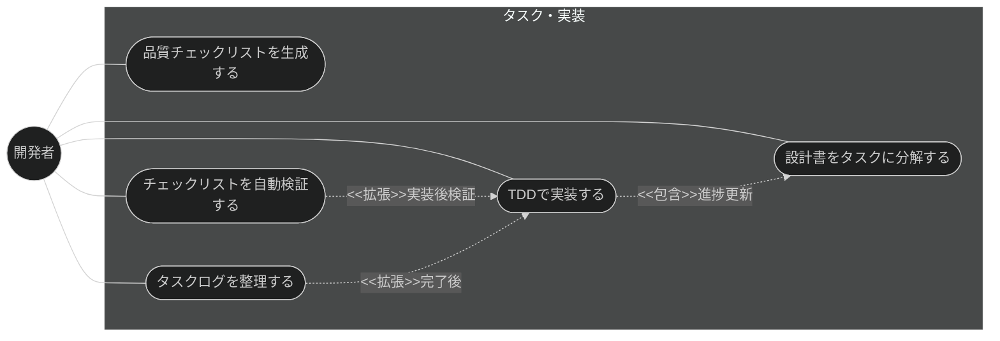

# タスク・実装 要求仕様書（親機能概要）

## 概要

本ドキュメントは、Claude Code プラグイン「sdd-workflow」のタスク・実装機能群に対する要求仕様書である。

AI-SDD ワークフローの Tasks / Implement & Review フェーズでは、技術設計書を独立してテスト可能な
小タスクに分解し、TDD に基づいて仕様準拠の実装を進め、品質チェックリストで検証する。
本機能群は、この分解 → 実装 → 検証 → 後片付けのサイクルを提供し、
実装が常に仕様（真実の源）にトレースされた状態を維持する。

**対象範囲:**

- 技術設計書からのタスク分解
- TDD に基づく段階的実装とチェックリスト進捗管理
- 品質チェックリストの生成
- チェックリストの自動検証（テスト・リンター・セキュリティ・整合性）
- 実装完了後のタスクログ整理（設計知見の永続化）

本 PRD は親機能概要であり、各機能要求（FR）の詳細は子 PRD に分割されている（「2.2. 機能一覧」参照）。

---

# 1. 要求図の読み方

SysML 要求図の記法（要求タイプ・リスクレベル・検証方法・関係タイプ）の凡例は
[PRD_TEMPLATE.md](../../PRD_TEMPLATE.md) のセクション 1 を参照。

---

# 2. 要求一覧

## 2.1. ユースケース図（概要）

## 2.2. 機能一覧（子 PRD）

| 機能 | 子 PRD | 概要 |
|:---|:---|:---|
| タスク分解 | [task-breakdown.md](task-breakdown.md) | 技術設計書から独立テスト可能な小タスク一覧（tasks.md）を生成し、task ディレクトリに保存する |
| TDD 実装 | [implement.md](implement.md) | 5 段階（Setup → Tests → Core → Integration → Polish）の TDD で実装し、チェックリスト進捗を逐次更新する |
| チェックリスト生成 | [checklist-generation.md](checklist-generation.md) | 仕様・計画から構造化 ID・カテゴリ付きの品質チェックリストを生成する |
| チェックリスト自動検証 | [run-checklist.md](run-checklist.md) | チェックリスト項目をテスト・リンター・セキュリティスキャン・仕様整合性チェックで自動検証する |
| タスククリーンアップ | [task-cleanup.md](task-cleanup.md) | 重要な設計決定を技術設計書へ統合したうえで task ディレクトリを削除する |

---

# 3. 要求図（SysML Requirements Diagram）

## 3.1. 全体要求図

各 FR ノード（FR_001〜FR_005）の詳細説明・サブ機能は、対応する子 PRD（「2.2. 機能一覧」参照）に記載する。

```mermaid
%%{init: {'theme': 'dark'}}%%
requirementDiagram
    requirement TaskImplementation {
        id: UR_001
        text: "設計書から検証可能な実装までを段階的に進められる"
        risk: high
        verifymethod: demonstration
    }

    requirement SpecCompliantImpl {
        id: UR_002
        text: "実装は常に仕様にトレースされテストで裏付けられる"
        risk: high
        verifymethod: test
    }

    requirement QualityVerification {
        id: UR_003
        text: "実装品質がチェックリストにより体系的に検証される"
        risk: medium
        verifymethod: demonstration
    }

    requirement KnowledgePersistence {
        id: UR_004
        text: "実装中の設計知見が失われず設計書に永続化される"
        risk: medium
        verifymethod: inspection
    }

    functionalRequirement TaskBreakdown {
        id: FR_001
        text: "技術設計書から独立テスト可能な小タスク一覧を生成する"
        risk: high
        verifymethod: demonstration
    }

    functionalRequirement TddImplement {
        id: FR_002
        text: "5段階のTDDで実装しチェックリスト進捗を更新する"
        risk: high
        verifymethod: demonstration
    }

    functionalRequirement ChecklistGeneration {
        id: FR_003
        text: "仕様と計画から構造化IDつき品質チェックリストを生成する"
        risk: medium
        verifymethod: demonstration
    }

    functionalRequirement ChecklistVerification {
        id: FR_004
        text: "チェックリスト項目をテストとリンターと整合性チェックで自動検証する"
        risk: medium
        verifymethod: test
    }

    functionalRequirement TaskCleanup {
        id: FR_005
        text: "設計決定を設計書へ統合してからタスクログを削除する"
        risk: medium
        verifymethod: demonstration
    }

    requirement TaskGranularity {
        id: NFR_001
        text: "分解されたタスクは独立してテスト可能な粒度である"
        risk: medium
        verifymethod: inspection
    }

    interfaceRequirement TaskDirLayout {
        id: IR_001
        text: "タスクログはチケット番号ごとのtaskディレクトリ配下に保存する"
        risk: low
        verifymethod: inspection
    }

    interfaceRequirement ChecklistLayout {
        id: IR_002
        text: "チェックリストはtaskディレクトリ配下のchecklist.mdに保存し構造化IDはカテゴリ番号と連番から成るCHK形式とする"
        risk: low
        verifymethod: inspection
    }

    designConstraint TestFirst {
        id: DC_001
        text: "実装より先にテストを作成する順序を強制する"
        risk: high
        verifymethod: inspection
    }

    designConstraint PersistBeforeDelete {
        id: DC_002
        text: "タスクログは設計書への統合完了後にのみ削除できる"
        risk: medium
        verifymethod: inspection
    }

    TaskBreakdown - derives -> TaskImplementation
    TddImplement - derives -> SpecCompliantImpl
    ChecklistGeneration - derives -> QualityVerification
    ChecklistVerification - derives -> QualityVerification
    TaskCleanup - derives -> KnowledgePersistence
    TaskGranularity - derives -> TaskImplementation
    TaskImplementation - contains -> SpecCompliantImpl
    TaskImplementation - contains -> QualityVerification
    TaskImplementation - contains -> KnowledgePersistence
    TaskBreakdown - traces -> TaskDirLayout
    TaskCleanup - traces -> TaskDirLayout
    TaskBreakdown - traces -> TaskGranularity
    TaskDirLayout - derives -> TaskImplementation
    ChecklistLayout - derives -> QualityVerification
    TestFirst - derives -> SpecCompliantImpl
    PersistBeforeDelete - derives -> KnowledgePersistence
    TestFirst - traces -> TddImplement
    PersistBeforeDelete - traces -> TaskCleanup
    ChecklistVerification - traces -> ChecklistGeneration
    ChecklistGeneration - traces -> ChecklistLayout
```

---

# 4. 要求の詳細説明

## 4.1. ユーザー要求

### UR_001: 設計から実装への段階的進行

開発者は、技術設計書を入力として、タスク分解 → 実装 → 検証 → 後片付けの一連のサイクルを
段階的に進められること。各段階の成果物（tasks.md・実装コード・チェックリスト）が明確であること。

**検証方法:** デモンストレーションによる検証

### UR_002: 仕様準拠とテストの裏付け

実装は対応するタスク・設計書・仕様に常にトレース可能であり、テストによって裏付けられること。
テストのない実装や、仕様にない機能の実装を防ぐ構造であること。

**検証方法:** テストによる検証

### UR_003: 体系的な品質検証

実装の品質は、仕様・計画から生成されたチェックリストに基づいて体系的に検証され、
検証結果（合否・根拠）が記録されること。

**検証方法:** デモンストレーションによる検証

### UR_004: 設計知見の永続化

実装過程で行われた設計判断・トレードオフの記録は、一時的なタスクログの削除によって失われず、
技術設計書に統合されて永続化されること。

**検証方法:** インスペクションによる検証

## 4.2. 非機能要求

### NFR_001: タスクの粒度

分解されたタスクは、それぞれ独立してテスト可能であり、単一タスクの完了が
他タスクの未完了に依存しない粒度であること。

**インスペクション基準:**

- 各タスクに完了を判定できるテストまたは検証手順が対応づいていること
- あるタスクの実施が、他の未完了タスクの成果物を前提としないこと（依存がある場合は順序を明示すること）

**検証方法:** インスペクションによる検証

## 4.3. インターフェース要求

### IR_001: task ディレクトリのレイアウト

タスクログは `task/{ticket-number}/` 配下に保存し、front matter スキーマ
（`type: "task"`、`sdd-phase: "tasks"`、`ticket` フィールド）に準拠すること。

**検証方法:** インスペクションによる検証

### IR_002: チェックリストの保存場所と構造化 ID

チェックリスト生成（[checklist-generation.md](checklist-generation.md)）が出力するチェックリストは、
対象チケットの task ディレクトリ配下の `task/{ticket-number}/checklist.md` に保存すること。
各チェックリスト項目に付与する構造化 ID は、カテゴリ番号（1〜9）と 2 桁連番から成る
`CHK-{category}{nn}` 形式（例: `CHK-101`、`CHK-201`）とし、更新をまたいで安定であること。

**検証方法:** インスペクションによる検証

## 4.4. 設計制約

### DC_001: テストファースト

実装（Core 段階）に先立ちテスト（Tests 段階）を作成する順序を、プロセスとして強制すること。
テストのない実装段階への進行を許容しない。テストが失敗している間は次段階へ進行させず、
テストが成功するまで当該タスクを完了として扱わない。

**検証方法:** インスペクションによる検証

### DC_002: 統合前削除の禁止

task ディレクトリの削除は、重要な設計決定の技術設計書への統合が完了した後にのみ許可すること。

**根拠:** D-003 原則（ドキュメント永続性ルール）。task/ は一時ログであり、
設計知見は永続ドキュメントである `*_design.md` に集約する。

**検証方法:** インスペクションによる検証

---

# 5. 制約事項

## 5.1. 技術的制約

- チェックリスト自動検証が実行するテスト・リンター・セキュリティスキャナーは、
  対象プロジェクトに導入済みのツールに依存する（本機能群はツール自体を提供しない）
- TDD 実装の品質は基盤モデルの能力および仕様書・設計書の明確度に依存する

## 5.2. ビジネス的制約

- B-001 原則（Vibe Coding 防止）に従い、仕様・設計書に定義のない機能を実装過程で推測により追加してはならない
- D-003 原則（ドキュメント永続性ルール）に従い、task/ 配下は一時ログとして扱い、恒久的な設計情報を残置しない
- B-002 原則（多言語対応の一貫性）に従い、本機能群の出力テンプレートは EN/JA の両言語で同等の構成を維持すること

---

# 6. 前提条件

- 対象機能の技術設計書（`*_design.md`）が存在すること（タスク分解の入力）
- 対象プロジェクトで sdd-workflow プラグインが有効化され、`.sdd/` ディレクトリが初期化済みであること
- チケット番号の採番規則はプロジェクト運用に委ねる（本機能群は指定された番号を使用する）

---

# 7. スコープ外

以下は本 PRD のスコープ外とします：

- 仕様書・設計書の生成・明確化（spec-design カテゴリで扱う）
- 実装と設計書の乖離検出（quality-guardrails カテゴリの check-spec が扱う）
- バージョン管理操作（コミット・PR 作成等はプロジェクト運用・他ツールに委ねる）
- CI 環境でのテスト実行基盤の提供（対象プロジェクトの CI 構成に委ねる）

---

# 8. 用語集

| 用語        | 定義                                                              |
|-----------|-------------------------------------------------------------------|
| tasks.md  | タスク分解の成果物。チェックリスト形式のタスク一覧                                  |
| TDD 5 段階  | Setup → Tests → Core → Integration → Polish の段階的実装プロセス           |
| 構造化 ID    | チェックリスト項目に付与する一意な識別子。カテゴリと連番で構成                          |
| タスクログ     | `task/{ticket-number}/` 配下の一時的な作業記録。完了後は設計書へ統合して削除する      |
| チケット番号    | タスクを外部の課題管理と紐づける識別子                                          |
