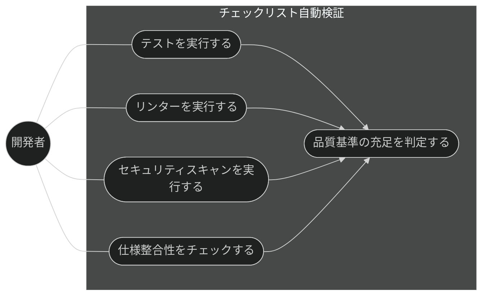
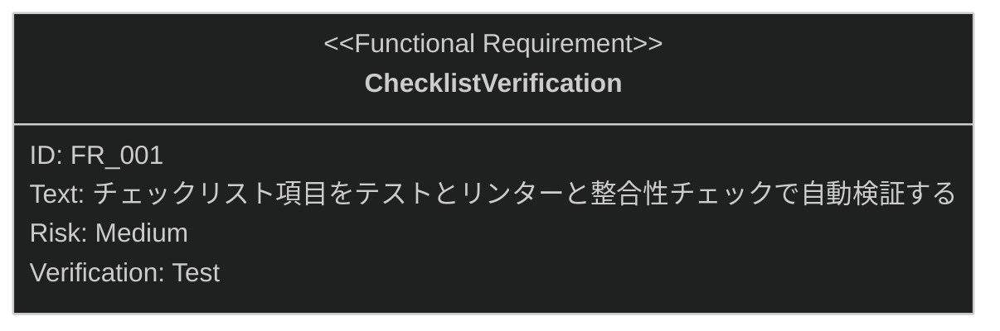

# チェックリスト自動検証 要求仕様書

## 概要

本ドキュメントは、タスク・実装機能群（親 PRD: [index.md](index.md)）のうち、
生成されたチェックリスト項目を自動検証する「チェックリスト自動検証」機能に対する要求仕様書である。

チェックリスト生成（[checklist-generation.md](checklist-generation.md)）の成果物を入力とし、
テスト実行・リンター・セキュリティスキャナー・仕様整合性チェックにより、
実装が品質基準を満たすかを判定して、検証結果（合否・根拠）を記録する。

SysML 要求図の記法（要求タイプ・リスクレベル・検証方法・関係タイプ）の凡例は
[PRD_TEMPLATE.md](../../PRD_TEMPLATE.md) のセクション 1 を参照。

---

# 1. 要求一覧

## 1.1. ユースケース図

## 1.2. 機能一覧（テキスト形式）

- チェックリスト自動検証
    - チェックリスト項目の自動検証（テスト・リンター・セキュリティスキャン・仕様整合性）
    - 品質基準の充足判定と検証結果（合否・根拠）の記録

---

# 2. 要求図（SysML Requirements Diagram）

要求 ID は本ファイル内スコープで採番する。本ファイルの FR_001 は、
[index.md](index.md) の UR_003（体系的な品質検証）から派生し、
[checklist-generation.md](checklist-generation.md) の FR_001（チェックリスト生成）にトレースされる
（親 PRD の全体要求図を参照。本図には自ファイル内のノードのみを定義する）。

---

# 3. 要求の詳細説明

## 3.1. 機能要求

### FR_001: チェックリスト自動検証

生成されたチェックリスト項目を、テスト実行・リンター・セキュリティスキャナー・
仕様整合性チェックにより自動検証し、実装が品質基準を満たすか判定する。
[index.md](index.md) の UR_003 から派生。

**トリガー方式:** 手動（開発者による `/run-checklist` スキル呼び出し）

**検証方法:** テストによる検証

---

# 4. 前提条件

- チェックリスト生成の成果物（構造化 ID・カテゴリ付きチェックリスト）が存在すること
- 検証に用いるテスト・リンター・セキュリティスキャナーは、対象プロジェクトに導入済みの
  ツールに依存する（本機能はツール自体を提供しない。[index.md](index.md) の技術的制約）
- 対象プロジェクトで sdd-workflow プラグインが有効化され、`.sdd/` ディレクトリが初期化済みであること

---

# 5. スコープ外

以下は本 PRD のスコープ外とします：

- チェックリストの生成そのもの（[checklist-generation.md](checklist-generation.md) で扱う）
- TDD 実装そのもの（[implement.md](implement.md) で扱う）
- 実装と設計書の乖離検出（quality-guardrails カテゴリの check-spec が扱う）
- CI 環境でのテスト実行基盤の提供（対象プロジェクトの CI 構成に委ねる）
