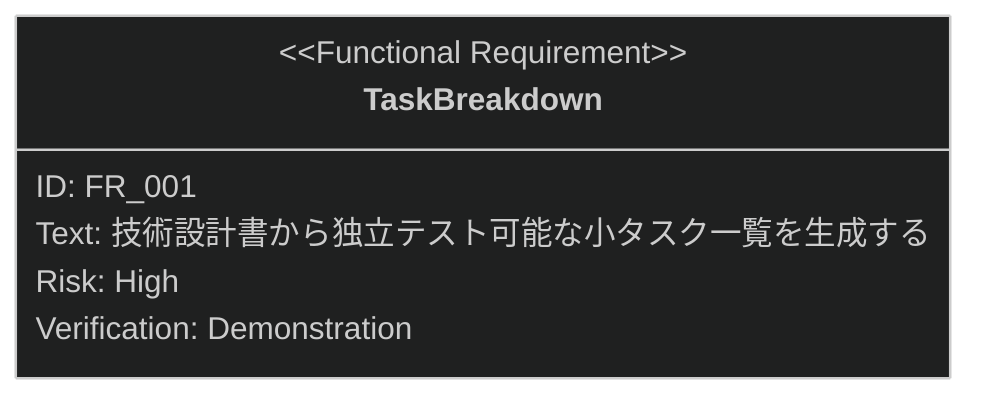

# タスク分解 要求仕様書

## 概要

本ドキュメントは、タスク・実装機能群（親 PRD: [index.md](index.md)）のうち、
技術設計書から独立してテスト可能な小タスクの一覧を生成する「タスク分解」機能に対する要求仕様書である。

タスク分解は、AI-SDD ワークフローの Tasks フェーズの入口であり、
後続の TDD 実装（[implement.md](implement.md)）の入力となる tasks.md を生成する。

SysML 要求図の記法（要求タイプ・リスクレベル・検証方法・関係タイプ）の凡例は
[PRD_TEMPLATE.md](../../PRD_TEMPLATE.md) のセクション 1 を参照。

---

# 1. 要求一覧

## 1.1. ユースケース図

## 1.2. 機能一覧（テキスト形式）

- タスク分解
    - 技術設計書（`*_design.md`）の分析
    - 独立テスト可能な小タスク一覧（tasks.md）の生成
    - チケット番号に紐づく task ディレクトリへの保存

---

# 2. 要求図（SysML Requirements Diagram）

要求 ID は本ファイル内スコープで採番する。本ファイルの FR_001 は、
[index.md](index.md) の UR_001（設計から実装への段階的進行）から派生し、
同 NFR_001（タスクの粒度）・IR_001（task ディレクトリのレイアウト）にトレースされる
（親 PRD の全体要求図を参照。本図には自ファイル内のノードのみを定義する）。

---

# 3. 要求の詳細説明

## 3.1. 機能要求

### FR_001: タスク分解

技術設計書（`*_design.md`）を分析し、独立してテスト可能な小タスクの一覧（tasks.md）を生成して、
チケット番号に対応する task ディレクトリに保存する。
[index.md](index.md) の UR_001 から派生。

**トリガー方式:** 手動（開発者による `/task-breakdown` スキル呼び出し）

**関連する親要求・制約:**

- [index.md](index.md) の NFR_001（タスクの粒度）: 分解されたタスクは独立してテスト可能な粒度であること
- [index.md](index.md) の IR_001（task ディレクトリのレイアウト）: tasks.md は `task/{ticket-number}/`
  配下に保存し、front matter スキーマ（`type: "task"`、`sdd-phase: "tasks"`、`ticket` フィールド）に準拠すること

**検証方法:** デモンストレーションによる検証

---

# 4. 前提条件

- 対象機能の技術設計書（`*_design.md`）が存在すること（タスク分解の入力）
- 対象プロジェクトで sdd-workflow プラグインが有効化され、`.sdd/` ディレクトリが初期化済みであること
- チケット番号の採番規則はプロジェクト運用に委ねる（本機能は指定された番号を使用する）

---

# 5. スコープ外

以下は本 PRD のスコープ外とします：

- 分解されたタスクの実装（[implement.md](implement.md) で扱う）
- 品質チェックリストの生成・検証（[checklist-generation.md](checklist-generation.md) /
  [run-checklist.md](run-checklist.md) で扱う）
- 実装完了後のタスクログ整理（[task-cleanup.md](task-cleanup.md) で扱う）
- 技術設計書そのものの生成（spec-design カテゴリで扱う）
