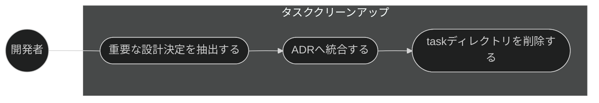
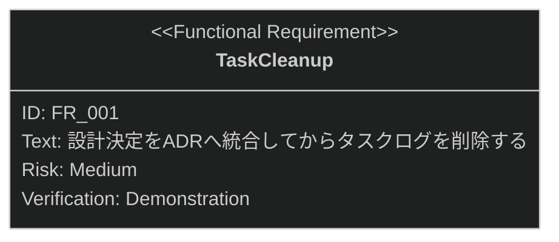

# タスククリーンアップ 要求仕様書

## 概要

本ドキュメントは、タスク・実装機能群（親 PRD: [index.md](index.md)）のうち、
実装完了後にタスクログを整理する「タスククリーンアップ」機能に対する要求仕様書である。

タスククリーンアップは、タスクログ（`task/{ticket-number}/design-draft.md` を含む一時ドラフト）内の
重要な設計決定を ADR（`adr/{feature}.md`）へ統合したうえで task ディレクトリを削除し、
実装中の設計知見が失われずに永続化される状態を保証する（各ドキュメントの永続性区分は
`AI-SDD-PRINCIPLES.md` § Document Persistence Rules を正典とする）。

SysML 要求図の記法（要求タイプ・リスクレベル・検証方法・関係タイプ）の凡例は
[PRD_TEMPLATE.md](../../PRD_TEMPLATE.md) のセクション 1 を参照。

---

# 1. 要求一覧

## 1.1. ユースケース図

```mermaid
%%{init: {'theme': 'dark'}}%%
flowchart LR
    Developer((開発者))

    subgraph TaskCleanup["タスククリーンアップ"]
        ExtractDecisions([重要な設計決定を抽出する])
        MergeToAdr([ADRへ統合する])
        DeleteTaskDir([taskディレクトリを削除する])
    end

    Developer --- ExtractDecisions
    ExtractDecisions --> MergeToAdr --> DeleteTaskDir
```

## 1.2. 機能一覧（テキスト形式）

- タスククリーンアップ
    - 重要な設計決定のADR（`adr/{feature}.md`）への統合
    - 統合後の task ディレクトリ削除

---

# 2. 要求図（SysML Requirements Diagram）

要求 ID は本ファイル内スコープで採番する。本ファイルの FR_001 は、
[index.md](index.md) の UR_004（設計知見の永続化）から派生し、
同 DC_002（統合前削除の禁止）にトレースされる
（親 PRD の全体要求図を参照。本図には自ファイル内のノードのみを定義する）。

```mermaid
%%{init: {'theme': 'dark'}}%%
requirementDiagram
    functionalRequirement TaskCleanup {
        id: FR_001
        text: "設計決定をADRへ統合してからタスクログを削除する"
        risk: medium
        verifymethod: demonstration
    }
```

---

# 3. 要求の詳細説明

## 3.1. 機能要求

### FR_001: タスククリーンアップ

実装完了後、タスクログ（`task/{ticket-number}/design-draft.md` を含む）内の重要な設計決定を
対応する ADR（`adr/{feature}.md`）へ統合したうえで、task ディレクトリを削除する。
[index.md](index.md) の UR_004 から派生。

**トリガー方式:** 手動（開発者による `/task-cleanup` スキル呼び出し）

**関連する親制約:**

- [index.md](index.md) の DC_002（統合前削除の禁止）: task ディレクトリの削除は、重要な設計決定の
  ADR への統合が完了した後にのみ許可すること。
  根拠は D-003 原則（ドキュメント永続性ルール）であり、task/ は一時ログとして扱い、
  設計知見は永続ドキュメントである ADR（`adr/{feature}.md`）に集約する

**検証方法:** デモンストレーションによる検証

---

# 4. 前提条件

- 対象チケットの実装が完了しており、`task/{ticket-number}/` 配下にタスクログ
  （`design-draft.md` を含む）が存在すること
- 統合先となる ADR（`adr/{feature}.md`）が存在すること、または新規作成できること
- 対象プロジェクトで sdd-workflow プラグインが有効化され、`.sdd/` ディレクトリが初期化済みであること

---

# 5. スコープ外

以下は本 PRD のスコープ外とします：

- タスク分解・TDD 実装・チェックリスト検証そのもの（[task-breakdown.md](task-breakdown.md) /
  [implement.md](implement.md) / [run-checklist.md](run-checklist.md) で扱う）
- 技術設計書（`task/{ticket-number}/design-draft.md`）の新規生成（spec-design カテゴリで扱う。
  本機能は既存の一時ドラフトから ADR への統合のみを行う）
- バージョン管理操作（コミット・PR 作成等はプロジェクト運用・他ツールに委ねる）
