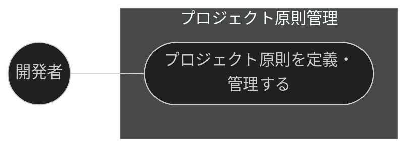
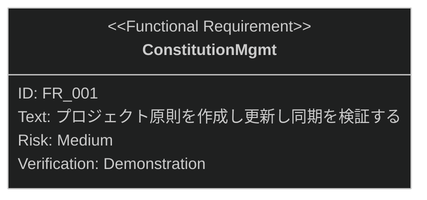

# プロジェクト原則管理 要求仕様書

## 概要

本ドキュメントは、ワークフロー基盤機能群（親 PRD: [index.md](index.md)）のうち、
プロジェクト原則（Constitution）管理機能に対する要求仕様書である。

プロジェクトの譲れない原則を定義する CONSTITUTION.md の作成・更新・参照と、
原則と他ドキュメント（PRD / 仕様書 / 設計書）との同期検証を提供する。

要求図の記法凡例は [PRD_TEMPLATE.md](../../PRD_TEMPLATE.md) のセクション 1 を参照。

---

# 1. 要求一覧

## 1.1. ユースケース図

プロジェクト初期化（[sdd-init.md](sdd-init.md)）のフローは本機能を包含する。

## 1.2. 機能一覧（テキスト形式）

- プロジェクト原則管理
    - CONSTITUTION.md の作成・更新
    - 他ドキュメントとの同期検証

---

# 2. 要求図（SysML Requirements Diagram）

要求 ID は本ファイル内スコープで採番する。親 PRD 側の要求は本文でファイル名 + ID を併記して参照する。

**親 PRD との関係**（[index.md](index.md) 参照）:

- FR_001 は index.md の UR_002（プロジェクト原則のガバナンス）から派生

---

# 3. 要求の詳細説明

## 3.1. 機能要求

### FR_001: プロジェクト原則管理

サブコマンドにより CONSTITUTION.md の作成・更新・参照を行い、原則と他ドキュメントの
同期状態を検証する。index.md の UR_002 から派生。

**トリガー方式:** 手動（開発者による `/constitution` スキル呼び出し）

**検証方法:** デモンストレーションによる検証

---

# 4. 前提条件

- Claude Code のプラグイン機構が利用可能であること
- 対象プロジェクトのルートに書き込み権限があること

---

# 5. スコープ外

- `.sdd/` 構造・テンプレートの生成そのもの（[sdd-init.md](sdd-init.md) が扱う）
- AI-SDD 原則ドキュメント（AI-SDD-PRINCIPLES.md）のバージョン追随更新
  （[session-config.md](session-config.md) が扱う。本機能の対象はプロジェクト固有原則 CONSTITUTION.md）
- 原則違反の実装検出（quality-guardrails カテゴリで扱う。本機能はドキュメント間の同期検証まで）
