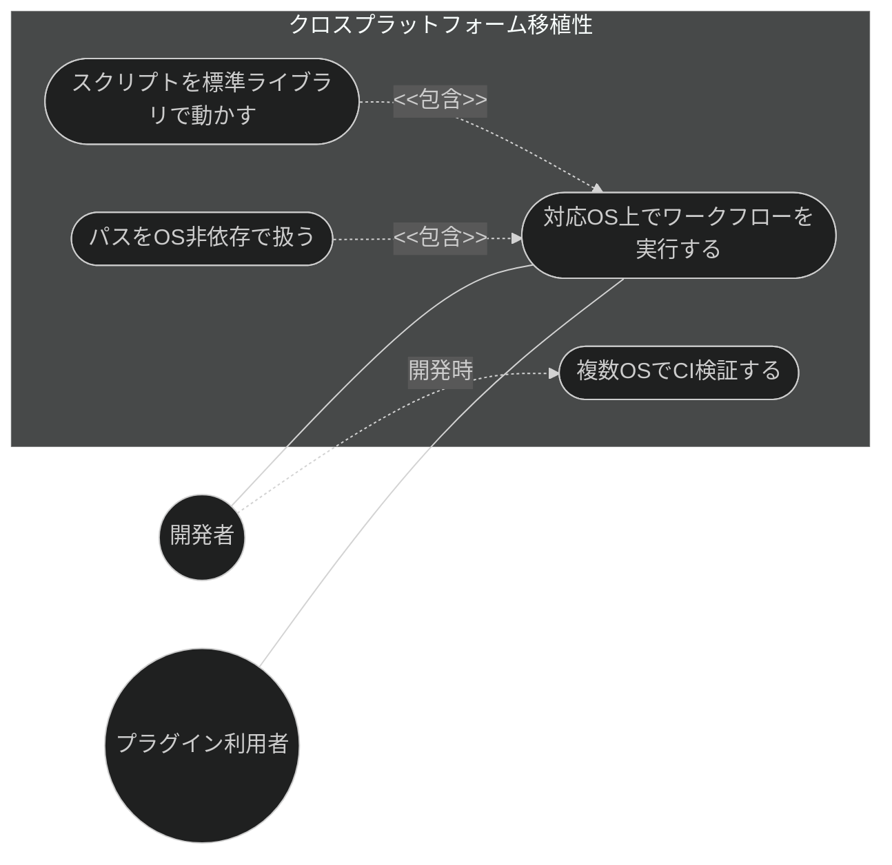

# クロスプラットフォーム移植性 要求仕様書

## 概要

本ドキュメントは、ワークフロー基盤機能群（親 PRD: [index.md](index.md)）のうち、
プラグインのスキルヘルパー・フックスクリプトの **クロスプラットフォーム移植性** に対する要求仕様書である。

AI-SDD プラグインは、スキルの補助処理（ドキュメント走査・キャッシュ生成・構造初期化など）や
フック処理をスクリプトで実行する。これらが特定 OS 固有の外部コマンドに依存すると、対応 OS が
実質的に限定され、利用者・開発者の実行環境を狭める。本機能は、スクリプトを OS 非依存で動作する
形に保つことを **非機能要求（移植性）** として明文化し、対応 OS 上で AI-SDD ワークフローが
一貫して動作することを保証する。

本 PRD は、既に実現済みで確定した移植性範囲（OS 固有 CLI への非依存・OS 非依存なパス処理・
複数 OS での CI 検証）を対象とする。Windows ネイティブサポートの完全な作り込み（インストーラ・
シェル統合など未確定範囲）は本 PRD のスコープ外とし、親エピック側で別途扱う。

要求図の記法凡例は [PRD_TEMPLATE.md](../../PRD_TEMPLATE.md) のセクション 1 を参照。

---

# 1. 要求一覧

## 1.1. ユースケース図



## 1.2. 機能一覧（テキスト形式）

- クロスプラットフォーム移植性
    - スキルヘルパー・フックスクリプトを OS 固有の外部 CLI に依存せず実行する
    - ファイル・ディレクトリのパス処理を OS 非依存で行う
    - 複数 OS（Linux / macOS）での動作を CI で継続的に検証する

---

# 2. 要求図（SysML Requirements Diagram）

要求 ID は本ファイル内スコープで採番する。親 PRD 側の要求は本文でファイル名 + ID を併記して参照する。

```mermaid
%%{init: {'theme': 'dark'}}%%
requirementDiagram
    requirement CrossPlatformPortability {
        id: UR_001
        text: "利用者と開発者が対応OS上でAI-SDDワークフローを一貫して実行できる"
        risk: medium
        verifymethod: test
    }

    requirement StdlibOnlyScripts {
        id: NFR_001
        text: "スクリプトはOS固有の外部CLIに依存せずPython標準ライブラリで動作する"
        risk: medium
        verifymethod: test
    }

    requirement OSAgnosticPaths {
        id: NFR_002
        text: "パス処理はOS非依存である"
        risk: medium
        verifymethod: test
    }

    requirement MultiOSCIVerification {
        id: NFR_003
        text: "CIで複数OS上の動作を検証する"
        risk: medium
        verifymethod: test
    }

    designConstraint RealizedScopeOnly {
        id: DC_001
        text: "対象は実現済みの移植性範囲に限定しWindowsネイティブ完全対応は含まない"
        risk: low
        verifymethod: inspection
    }

    NFR_001 - traces -> CrossPlatformPortability
    NFR_002 - traces -> CrossPlatformPortability
    NFR_003 - traces -> CrossPlatformPortability
    DC_001 - traces -> CrossPlatformPortability
```

**親 PRD との関係**（[index.md](index.md) 参照）:

- UR_001（対応 OS での一貫実行）は index.md の NFR_002（クロスプラットフォーム移植性）を詳細化する
- NFR_001〜NFR_003 は index.md の NFR_002 の具体要求であり、ワークフロー基盤の全機能
  （初期化・原則管理・セッション設定・front matter 推奨・ドキュメントインデックス）に横断的にかかる
- DC_001 により、Windows ネイティブサポートの完全対応は本 PRD のスコープ外であることを明示する

---

# 3. 要求の詳細説明

## 3.1. ユーザー要求

### UR_001: 対応 OS 上でのワークフロー一貫実行

プラグイン利用者・開発者は、対応 OS（少なくとも Linux / macOS）上で、スキル・フックを含む
AI-SDD ワークフローを OS の違いによる差異なく一貫して実行できること。スクリプトの補助処理が
特定 OS 固有の環境に依存して失敗しないこと。

**検証方法:** テストによる検証（複数 OS の CI で同一挙動を確認）

## 3.2. 非機能要求

### NFR_001: 標準ライブラリによる OS 非依存スクリプト

スキルヘルパー・フックスクリプトは、OS 固有の外部 CLI（`find` / `sed` / `jq` / `grep` / `awk` 等）に
依存せず、Python 標準ライブラリ（`pathlib` / `json` / `re` 等）のみで動作すること。外部コマンドの
有無や差異により挙動が変わらないこと。

**カテゴリ:** 移植性（Portability）

**検証方法:** テストによる検証（ユニットテスト・スキルスクリプト回帰テストを CI で実行）

### NFR_002: OS 非依存なパス処理

ファイル・ディレクトリのパス操作は、パス区切り文字やルート表現の差異を含め OS 非依存で行うこと
（`pathlib` 等の利用）。ハードコードされた OS 固有パス表現に依存しないこと。

**カテゴリ:** 移植性（Portability）

**検証方法:** テストによる検証

### NFR_003: 複数 OS での CI 検証

スクリプト・フックの動作は、複数 OS（少なくとも Linux / macOS）を対象とした CI で継続的に
検証されること。移植性の退行を CI で検知できること。

**カテゴリ:** 移植性（Portability）

**検証方法:** テストによる検証（CI マトリクスでの複数 OS 実行）

## 3.3. 設計制約

### DC_001: 実現済み移植性範囲への限定

本 PRD が対象とする移植性は、実現済みで確定した範囲（NFR_001〜NFR_003）に限定する。
Windows ネイティブサポートの完全な作り込み（インストーラ、シェル統合、Windows 固有の
パス・権限対応の網羅など未確定範囲）は含まない。これらは親エピック（Windows ネイティブサポート）で
要求が固まった段階で別途詳細化する。

**検証方法:** インスペクションによる検証

---

# 4. 制約事項

- 本 PRD は非機能要求（移植性）を中心とし、特定機能の新規追加を目的としない。対象はワークフロー
  基盤配下の既存スクリプト・フックの品質特性である
- スクリプトの実行には Python が利用可能であることを前提とする（Python 処理系そのものの同梱・
  インストールは本 PRD のスコープ外）
- 移植性の担保が、既存の各機能の挙動・出力を変更してはならない（移植は挙動等価であること）

---

# 5. 前提条件

- 対応 OS 上で Python 処理系が利用可能であること
- CI 環境で複数 OS のランナーが利用可能であること

---

# 6. スコープ外

以下は本 PRD のスコープ外とします：

- Windows ネイティブサポートの完全対応（インストーラ・シェル統合・Windows 固有対応の網羅）
  — 親エピックで要求が固まった段階で別途扱う
- Python 処理系そのものの配布・同梱・バージョン管理
- 各スクリプトの機能追加・仕様変更（本 PRD は移植性という品質特性のみを対象とする）
