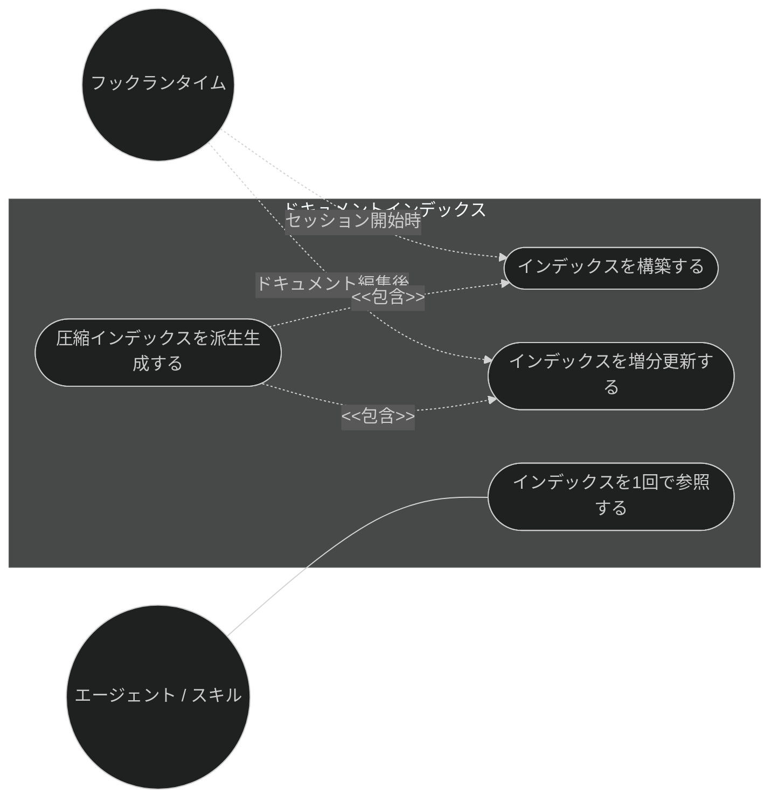
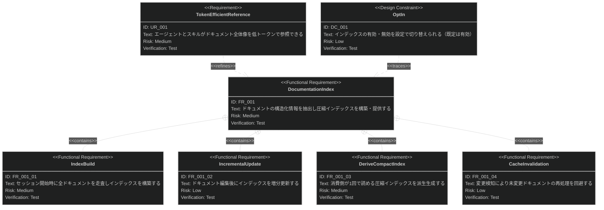

# ドキュメントインデックス 要求仕様書

## 概要

本ドキュメントは、ワークフロー基盤機能群（親 PRD: [index.md](index.md)）のうち、
ドキュメントインデックス機能に対する要求仕様書である。

各エージェント・スキルが `.sdd/` の要求仕様書・仕様書を参照する際、従来は複数回の
Glob / Grep / Read を要し、トークン消費が大きかった。本機能は、セッション開始時に
`.sdd/` ドキュメントから構造化情報（front matter・要求 ID・SysML 関係・データモデル・
API シグネチャ）を抽出して圧縮インデックスを構築し、消費側が **1 回の Read** で
全体像を把握できるようにすることで、参照精度を保ちつつトークン消費を削減する。

要求図の記法凡例は [PRD_TEMPLATE.md](../../PRD_TEMPLATE.md) のセクション 1 を参照。

---

# 1. 要求一覧

## 1.1. ユースケース図

## 1.2. 機能一覧（テキスト形式）

- ドキュメントインデックス
    - セッション開始時の全ドキュメント走査とインデックス構築（`index` 設定が有効な場合）
    - ドキュメント編集後の増分更新（インデックス既存時のみ）
    - 圧縮インデックス（消費側が読むテーブル形式ドキュメント）の派生生成
    - 変更検知によるキャッシュ無効化（未変更ドキュメントの再処理回避）

---

# 2. 要求図（SysML Requirements Diagram）

要求 ID は本ファイル内スコープで採番する。親 PRD 側の要求は本文でファイル名 + ID を併記して参照する。

**親 PRD との関係**（[index.md](index.md) 参照）:

- UR_001（トークン効率的な参照）は index.md の UR_005（トークン効率的なドキュメント参照）から派生
- FR_001 は index.md の FR_005（ドキュメントインデックスの構築・提供）に対応
- FR_001 は index.md の IR_001（設定スキーマ・環境変数の共通契約）にトレースされる
  （`.sdd-config.json` の `index` 設定・`SDD_INDEX` 環境変数）
- FR_001 は [session-config.md](session-config.md) の FR_001_04（セッション開始時のインデックス構築）と連携する

---

# 3. 要求の詳細説明

## 3.1. ユーザー要求

### UR_001: トークン効率的なドキュメント参照

エージェント・スキルは、`.sdd/` の要求仕様書・仕様書の全体像（メタデータ・要求 ID・
依存関係・SysML 関係・データモデル・API シグネチャ）を、多数の Glob / Grep / Read を
行わずに参照できること。参照精度を落とさずにトークン消費を削減すること。

**検証方法:** テストによる検証（A/B ハーネスでトークン量と検出精度を比較）

## 3.2. 機能要求

### FR_001: ドキュメントインデックスの構築・提供

`.sdd/` ドキュメントから構造化情報を抽出し、消費側が低コストで参照できる圧縮インデックスを
構築・提供する。index.md の UR_005 から派生。

**トリガー方式:** 自動（セッション開始イベント／ドキュメント編集イベント）

**含まれる機能:**

- FR_001_01: セッション開始時に要求仕様書・仕様書ディレクトリ配下を走査し、抽出した構造化情報を
  インデックスへ格納する。`.sdd-config.json` の `index` が有効な場合に実行する
- FR_001_02: ドキュメント編集後、当該ドキュメントの構造化情報を増分更新する。インデックスが
  既に構築済みの場合にのみ動作し、無効時（未構築時）は何もしない
- FR_001_03: 消費側（エージェント・スキル）が 1 回の Read で参照できる圧縮インデックス
  （テーブル形式）を派生生成する。`SDD_INDEX` 環境変数が有効なとき消費側はこれを優先して参照する
- FR_001_04: ドキュメント内容の変更を検知し、未変更のドキュメントはインデックス再処理をスキップする

**検証方法:** テストによる検証（ユニットテストを CI で実行、A/B ハーネスで効果測定）

## 3.3. 設計制約

### DC_001: オプトイン切り替え（既定は有効）

インデックスの構築有無は `.sdd-config.json` の `index`（真偽値）で切り替えられること。
既定は有効（`true`）。無効時はインデックスを構築せず、消費側は従来の Glob / Grep / Read に
フォールバックすること。設定不備（真偽値以外）は既定（有効）にフォールバックする
（親 PRD [index.md](index.md) の DC_002）。

**検証方法:** テストによる検証

---

# 4. 制約事項

- インデックス構築・増分更新はセッション設定初期化（[session-config.md](session-config.md)）と
  ドキュメント編集フックに接続され、フックランタイムの提供するインターフェースに依存する
- インデックスの構築失敗（不正データ・I/O エラー等）がワークフロー全体を停止させてはならない。
  失敗時は警告に留め、消費側は従来フローにフォールバックすること（index.md の DC_002）
- インデックスは派生成果物であり、真実の源はあくまで各 `.sdd/` ドキュメント本文である

---

# 5. 前提条件

- Claude Code のフックイベントシステム（SessionStart / PostToolUse フック）が利用可能であること
- セッション設定初期化により `SDD_*` 環境変数が解決済みであること（[session-config.md](session-config.md)）

---

# 6. スコープ外

- `.sdd-config.json` の読み込み・`SDD_INDEX` を含む環境変数の設定そのもの
  （[session-config.md](session-config.md) が扱う。本機能はインデックスの構築・派生・提供を扱う）
- 各エージェント・スキルがインデックスをどう解釈・活用するか（各機能カテゴリの spec / design が扱う）
- ドキュメントの整合性検証（quality-guardrails カテゴリの doc-consistency-check 等が扱う）
