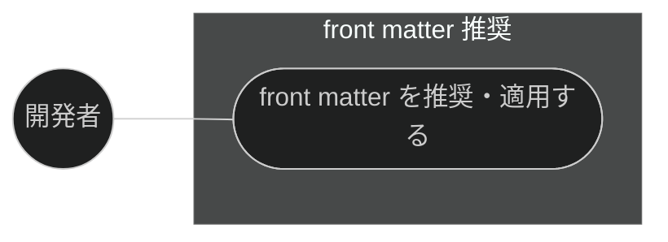
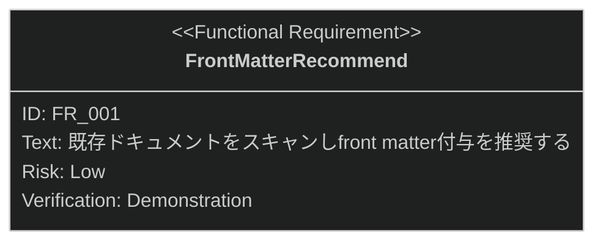

# front matter 推奨 要求仕様書

## 概要

本ドキュメントは、ワークフロー基盤機能群（親 PRD: [index.md](index.md)）のうち、
front matter 推奨機能に対する要求仕様書である。

front matter を持たない既存の AI-SDD ドキュメントをスキャンし、ドキュメント種別に応じた
YAML front matter の付与を推奨・適用することで、機械的な検索・フィルタリング・整合性検証を可能にする。

要求図の記法凡例は [PRD_TEMPLATE.md](../../PRD_TEMPLATE.md) のセクション 1 を参照。

---

# 1. 要求一覧

## 1.1. ユースケース図

## 1.2. 機能一覧（テキスト形式）

- メタデータ整備
    - 既存ドキュメントのスキャンと front matter 推奨
    - 推奨内容の一括適用（`--apply`）

---

# 2. 要求図（SysML Requirements Diagram）

要求 ID は本ファイル内スコープで採番する（親 PRD の FR_004 を本ファイルでは FR_001 として再採番）。
親 PRD 側の要求は本文でファイル名 + ID を併記して参照する。

**親 PRD との関係**（[index.md](index.md) 参照）:

- FR_001 は index.md の UR_004（メタデータによる検索・検証可能性）から派生
- 本機能には index.md の NFR_001（後方互換性: front matter のない既存ドキュメントも
  引き続き有効である）が適用される

---

# 3. 要求の詳細説明

## 3.1. 機能要求

### FR_001: front matter 推奨

既存の AI-SDD ドキュメントをスキャンし、ドキュメント種別に応じた YAML front matter の付与を
推奨する。`--apply` 指定時は推奨内容を一括適用する。index.md の UR_004 から派生。

**トリガー方式:** 手動（開発者による `/recommend-front-matter` スキル呼び出し）

**検証方法:** デモンストレーションによる検証

---

# 4. 制約事項

- front matter の導入が既存ワークフローを破壊しないこと。front matter を持たない
  既存ドキュメントも引き続き有効として扱う（index.md の NFR_001）

---

# 5. 前提条件

- Claude Code のプラグイン機構が利用可能であること
- 対象プロジェクトの `.sdd/` 配下に読み書き権限があること

---

# 6. スコープ外

- front matter の検証（quality-guardrails カテゴリの front-matter-reviewer が扱う。本機能は推奨・適用まで）
- `.sdd/` 構造・テンプレートの初期化（[sdd-init.md](sdd-init.md) が扱う）
- セッション設定・環境変数の初期化（[session-config.md](session-config.md) が扱う）
