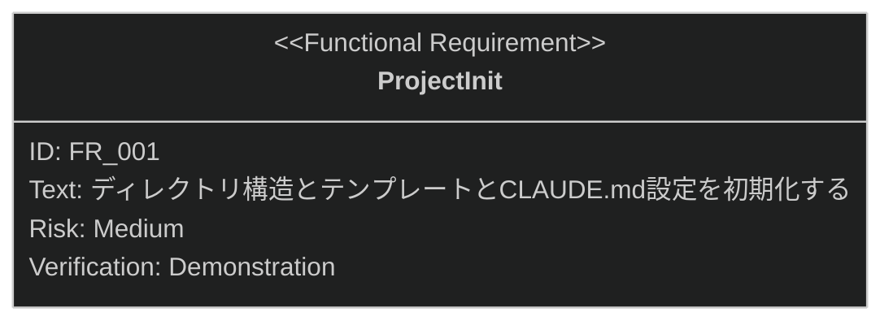

# プロジェクト初期化 要求仕様書

## 概要

本ドキュメントは、ワークフロー基盤機能群（親 PRD: [index.md](index.md)）のうち、
プロジェクト初期化機能に対する要求仕様書である。

対象プロジェクトに `.sdd/` ディレクトリ構造とテンプレートを生成し、CLAUDE.md に
AI-SDD Instructions を設定することで、AI-SDD ワークフロー導入の前提を最小限の操作で整える。

要求図の記法凡例は [PRD_TEMPLATE.md](../../PRD_TEMPLATE.md) のセクション 1 を参照。

---

# 1. 要求一覧

## 1.1. ユースケース図

プロジェクト原則の定義・管理は兄弟機能
[constitution-management.md](constitution-management.md) が担う（初期化フローに包含される）。

## 1.2. 機能一覧（テキスト形式）

- プロジェクト初期化
    - `.sdd/` ディレクトリ構造の生成
    - テンプレート（PRD / 仕様書 / 設計書）の配置
    - CLAUDE.md への AI-SDD Instructions 設定

---

# 2. 要求図（SysML Requirements Diagram）

要求 ID は本ファイル内スコープで採番する。親 PRD 側の要求は本文でファイル名 + ID を併記して参照する。

**親 PRD との関係**（[index.md](index.md) 参照）:

- FR_001 は index.md の UR_001（ワークフローの容易な導入）から派生
- FR_001 は index.md の IR_001（設定スキーマ・環境変数の共通契約）にトレースされる
- FR_001 には index.md の DC_001（フラット構造と階層構造の両サポート）が適用される

---

# 3. 要求の詳細説明

## 3.1. 機能要求

### FR_001: プロジェクト初期化

対象プロジェクトに `.sdd/` ディレクトリ構造（requirement / specification / task）とテンプレート
（PRD / 抽象仕様書 / 技術設計書）を生成し、CLAUDE.md に AI-SDD Instructions を設定する。
index.md の UR_001 から派生。

**トリガー方式:** 手動（開発者による `/sdd-init` スキル呼び出し。`--ci` で確認省略）

**検証方法:** デモンストレーションによる検証

---

# 4. 制約事項

- CLAUDE.md への設定はプロジェクト側の既存記述と共存する必要があり、既存内容を破壊してはならない
- B-002 原則（多言語対応の一貫性）に従い、テンプレートは EN/JA で同等の構成を維持すること
- D-002 原則（ファイル命名規則の厳守）に従い、初期化で生成する構造・テンプレートは命名規則に準拠すること

---

# 5. 前提条件

- Claude Code のプラグイン機構が利用可能であること
- 対象プロジェクトのルートに書き込み権限があること

---

# 6. スコープ外

- CONSTITUTION.md の作成・更新・同期検証（[constitution-management.md](constitution-management.md) が扱う）
- セッション開始時の設定ロード・環境変数初期化（[session-config.md](session-config.md) が扱う）
- 既存ドキュメントへの front matter 推奨（[front-matter-recommend.md](front-matter-recommend.md) が扱う）
