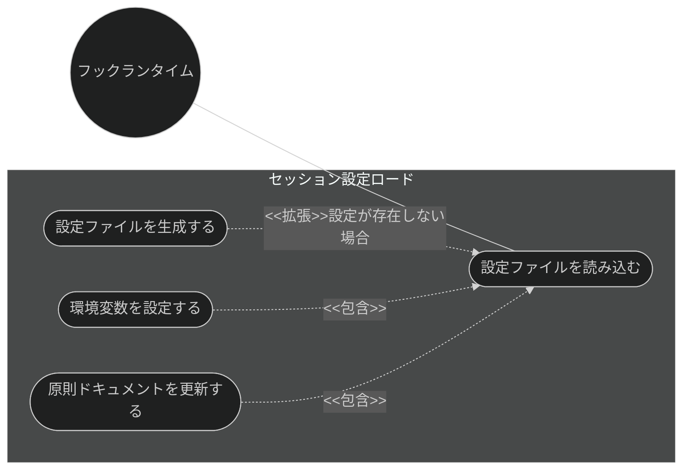
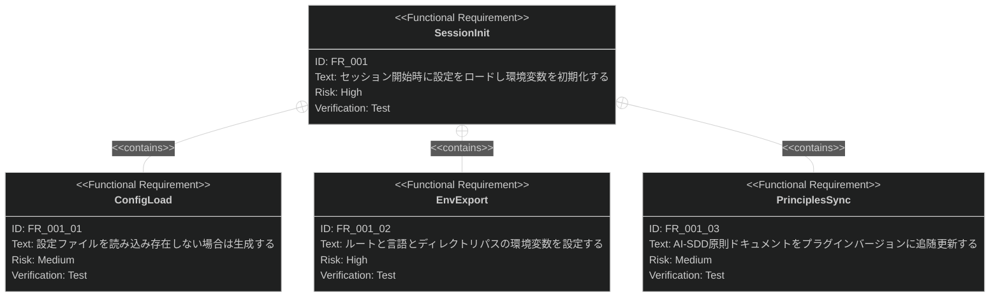

# セッション設定初期化 要求仕様書

## 概要

本ドキュメントは、ワークフロー基盤機能群（親 PRD: [index.md](index.md)）のうち、
セッション設定初期化機能に対する要求仕様書である。

セッション開始時に自動実行され、設定ファイルの読み込み（存在しない場合は生成）、
環境変数の設定、AI-SDD 原則ドキュメントのバージョン追随更新を行い、
以降の全スキル・エージェント・フックが参照する一貫した設定を初期化する。

要求図の記法凡例は [PRD_TEMPLATE.md](../../PRD_TEMPLATE.md) のセクション 1 を参照。

---

# 1. 要求一覧

## 1.1. ユースケース図

## 1.2. 機能一覧（テキスト形式）

- セッション設定
    - `.sdd-config.json` の読み込み（存在しない場合は生成）
    - `SDD_ROOT` / `SDD_LANG` / ディレクトリパス系環境変数の設定
    - AI-SDD 原則ドキュメントのバージョン追随更新

---

# 2. 要求図（SysML Requirements Diagram）

要求 ID は本ファイル内スコープで採番する（親 PRD の FR_003 を本ファイルでは FR_001 として再採番）。
親 PRD 側の要求は本文でファイル名 + ID を併記して参照する。

**親 PRD との関係**（[index.md](index.md) 参照）:

- FR_001 は index.md の UR_003（セッションの一貫性）から派生
- FR_001 は index.md の IR_001（設定スキーマ・環境変数の共通契約）にトレースされる
- FR_001 には index.md の DC_002（既定値へのフォールバック）および
  DC_003（言語設定による切り替え）が適用される

---

# 3. 要求の詳細説明

## 3.1. 機能要求

### FR_001: セッション設定初期化

セッション開始時に自動実行され、以降の全機能が参照する設定を初期化する。index.md の UR_003 から派生。

**トリガー方式:** 自動（セッション開始イベント）

**含まれる機能:**

- FR_001_01: 設定ファイル（`.sdd-config.json`）の読み込み。存在しない場合は既定値で生成する
- FR_001_02: `SDD_ROOT` / `SDD_LANG` / requirement・specification・task の各ディレクトリ名とパスの環境変数設定
- FR_001_03: AI-SDD 原則ドキュメント（AI-SDD-PRINCIPLES.md）のプラグインバージョンへの追随更新

**検証方法:** テストによる検証（ユニットテストを CI で実行）

---

# 4. 制約事項

- セッション設定初期化は Claude Code の SessionStart フックとして実装され、フックランタイムの
  提供するインターフェース（環境変数エクスポート等）に依存する
- 設定ファイルの欠落・不正（不正 JSON・空値等）があっても、既定値にフォールバックして
  セッション初期化を継続すること（index.md の DC_002）

---

# 5. 前提条件

- Claude Code のフックイベントシステム（SessionStart フック）が利用可能であること
- 対象プロジェクトのルートに書き込み権限があること

---

# 6. スコープ外

- `.sdd/` 構造・テンプレート・CLAUDE.md の初期化（[sdd-init.md](sdd-init.md) が扱う）
- プロジェクト固有原則 CONSTITUTION.md の管理
  （[constitution-management.md](constitution-management.md) が扱う。本機能が更新するのは AI-SDD-PRINCIPLES.md）
- 既存ドキュメントへの front matter 推奨（[front-matter-recommend.md](front-matter-recommend.md) が扱う）
