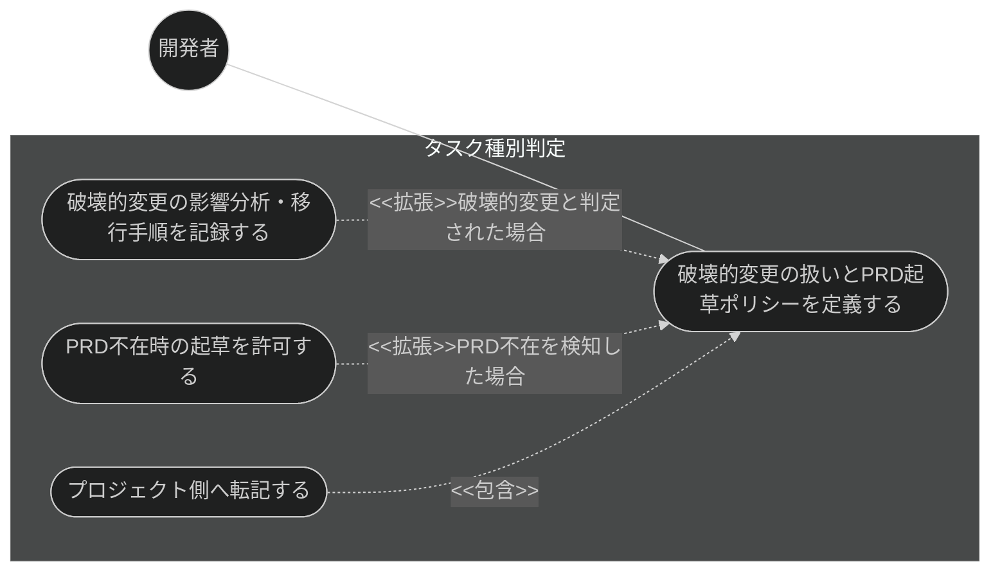
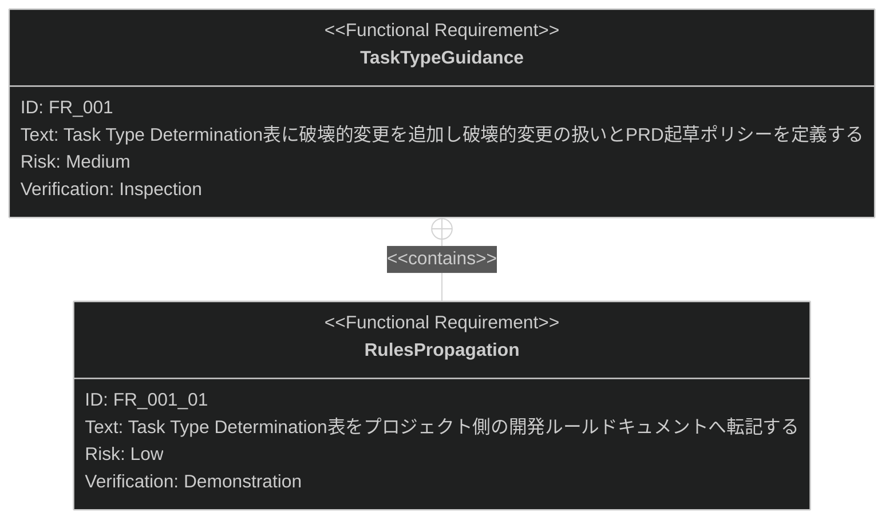

# タスク種別判定と破壊的変更・PRD起草ポリシー 要求仕様書

**準拠する原則:** [CONSTITUTION.md](../../CONSTITUTION.md)（参照した版: `v2.0.0`）のうち、B-001（Vibe Coding防止）、
D-001（Specification-Driven）、D-003（ドキュメント永続性ルールの遵守）。

## 概要

本ドキュメントは、ワークフロー基盤機能群（親 PRD: [index.md](index.md)）のうち、
**タスク種別判定の導線**に対する要求仕様書である。

`AI-SDD-PRINCIPLES.md` の Task Type Determination 表は、タスクの性質に応じて必要なフェーズと成果物を
定義するが、これまで（1）表に「破壊的変更」の受け皿がなく、（2）PRD が存在しないケースの新規起草の
可否が未定義という 2 つの空白があった。本機能は、原則ドキュメント側の定義を拡張し、プロジェクト側の
開発ルールドキュメントへ転記することで、開発者が原則ドキュメントを開かずに「このタスクはどこから
始めるべきか」を判断できるようにする。

本機能が定義する PRD 起草ポリシーは、下流の機能（`plan-refactor` の PRD 不在検知、`vibe-detector` の
推奨開始フェーズ出力）から利用されるが、それらの機能自体の振る舞い要求は、それぞれの既存 PRD
（[plan-refactor.md](../spec-design/plan-refactor.md)、[vibe-detection.md](../quality-guardrails/vibe-detection.md)）
が所有する。本 PRD は原則ドキュメントの定義と、その内容をプロジェクト側へ転記する導線のみを対象とする。

**対象範囲:**

- Task Type Determination 表・Task Scale Criteria への破壊的変更の追加
- 破壊的変更の扱い（影響範囲の洗い出し・後方互換性の方針決定・移行手順の記録先）の定義
- PRD が存在しない場合の新規起草ポリシー（許可条件・承認ゲート）の明記
- プロジェクト側の開発ルールドキュメントへの Task Type Determination 表の転記

要求図の記法凡例は [PRD_TEMPLATE.md](../../PRD_TEMPLATE.md) のセクション 1 を参照。

---

# 1. 要求一覧

## 1.1. ユースケース図

## 1.2. 機能一覧（テキスト形式）

- タスク種別判定
    - Task Type Determination 表・Task Scale Criteria への破壊的変更の追加
    - 破壊的変更の扱い（影響範囲の洗い出し・後方互換性の方針決定・移行手順の記録先）の定義
    - PRD 不在時の新規起草ポリシー（許可条件・承認ゲート）の明記
    - プロジェクト側の開発ルールドキュメントへの表の転記

---

# 2. 要求図（SysML Requirements Diagram）

要求 ID は本ファイル内スコープで採番する。親 PRD 側の要求は本文でファイル名 + ID を併記して参照する。

**親 PRD との関係**（[index.md](index.md) 参照）:

- FR_001 は index.md の UR_002（プロジェクト原則のガバナンス）から派生する（親 PRD の全体要求図では
  FR_006: TaskTypeGuidance として定義）

---

# 3. 要求の詳細説明

## 3.1. 機能要求

### FR_001: タスク種別判定の導線整備

`AI-SDD-PRINCIPLES.md` の Task Type Determination 表に「Breaking Change」行を追加し、Task Scale Criteria
にも判定基準を追加する。同ドキュメントに、破壊的変更の扱い（影響範囲の洗い出し・後方互換性の方針決定・
移行手順の記録先）を新設の節として定義する。移行手順は一時ドラフトではなく永続的な決定記録に残す。

また、「Updating `requirement/` (PRD) — Never Automated」節に、PRD 不在時の新規起草を明記する。
「Never Automated」は既存 PRD の書き換えを禁じるものであり、存在しない PRD をゼロから起草する行為は別の
操作として許可する。起草した PRD は、人間が承認するまで承認済み PRD として扱わないレビュー前提の状態で
管理する。

[index.md](index.md) の UR_002 から派生。プロジェクト側への伝播は FR_001_01 が担う。

**トリガー方式:** 該当なし（原則ドキュメントの記述そのものが成果物であり、実行時トリガーを持たない）

**検証方法:** インスペクションによる検証（該当する表・節が `AI-SDD-PRINCIPLES.md` に存在することを確認する）

### FR_001_01: プロジェクト側開発ルールへの転記

Task Type Determination 表と Task Scale Criteria を、プロジェクト側の開発ルールドキュメント
（セッション開始時に自動反映される）へ転記する。これにより、プラグイン利用プロジェクトは原則ドキュメントを
開かずに判断材料を得られる。

**トリガー方式:** 自動（セッション開始時に配布）

**検証方法:** デモンストレーションによる検証

---

# 4. 制約事項

- プロジェクト側の既存の開発ルールドキュメントを破壊しないこと（転記は追記であり、既存記述と共存する）
- 破壊的変更の移行手順は、一時的な作業ログではなく永続的な決定記録に残すこと（D-003）

---

# 5. 前提条件

- 対象プロジェクトで sdd-workflow プラグインが有効化され、`.sdd/` ディレクトリが初期化済みであること
- 破壊的変更の移行手順を永続的に記録するための決定記録の仕組みが整備済みであること
  （前提 issue #92 に依存。マージ済み）

---

# 6. スコープ外

以下は本 PRD のスコープ外とします：

- `plan-refactor` の Case B における PRD 不在時の起草提案の振る舞い（[plan-refactor.md](../spec-design/plan-refactor.md)
  が扱う。本 PRD が定義するのは提案の根拠となるポリシーのみ）
- `vibe-detector` の出力への推奨開始フェーズの追加（[vibe-detection.md](../quality-guardrails/vibe-detection.md)
  が扱う。本 PRD が定義するのは分類基準となる Task Type Determination 表のみ）
- `generate-spec` / `implement` / `plan-refactor` の各テンプレート（`refactor_plan_section.md` の
  Migration Plan、`final_verification_checklist.md`、`design_template.md` の Migration Guide 欄）への
  破壊的変更向けの詳細ガイダンス追記。原則ドキュメントへの定義が本 PRD のスコープであり、各テンプレートへの
  展開は必要になった時点で別途対応する
- `generate-prd` スキル自体への、PRD 起草提案を受けて実際に draft PRD を書き込む新機能の追加。
  本 PRD が定義するのは「起草してよい」というポリシーまでであり、提案を受けた人間がどのスキル・手順で
  起草するかは対象外
- CONSTITUTION.md の原則本文（D-003 等）の文言更新。本 PRD の変更は既存原則の適用範囲内であり、
  原則自体の改訂は不要と判断する

---

# 7. 用語集

| 用語                          | 定義                                                                                  |
|-------------------------------|---------------------------------------------------------------------------------------|
| Task Type Determination      | タスクの性質から必要なフェーズと成果物を決定する `AI-SDD-PRINCIPLES.md` の表           |
| Breaking Change               | 既存の公開 API・振る舞いを変更し既存利用者が対応を要する変更                            |
| 逆生成 draft PRD               | 実装・spec から逆算して起草する、人間承認前提の PRD（`status: "draft"`, `tags: ["reverse-engineered"]`） |
