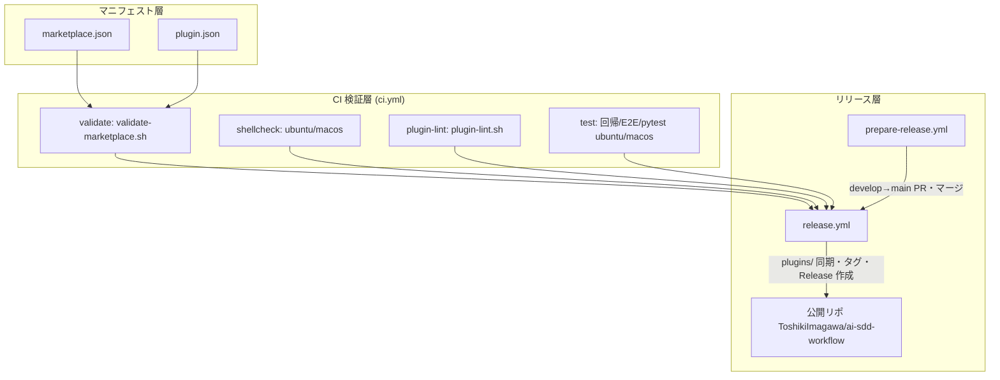

# 配布・運用

**関連 Spec:** [distribution_spec.md](distribution_spec.md)
**関連 PRD:** [distribution.md](../requirement/distribution.md)
**準拠する原則:** [CONSTITUTION.md](../CONSTITUTION.md) B-002（多言語対応の一貫性）, D-002（ファイル命名規則の厳守）, T-001（JSON/Markdown 構文の正当性）, T-002（plugin.json 登録の徹底）, T-003（日本語出力の文字化け防止）

---

# 1. 実装ステータス

**ステータス:** 🟢 実装済み

本設計書は、既に稼働しているマーケットプレイス配布・CI 検証・リリースワークフロー
（`.claude-plugin/marketplace.json` / `plugins/sdd-workflow/.claude-plugin/plugin.json` /
`.github/workflows/*.yml` / `scripts/*.sh` / `CHANGELOG.md` / `CHANGELOG.ja.md`）を
真実の源として、その配布・運用の設計を逆算して記述したものである。

> **逆算記述の経緯（正当化）**: マーケットプレイス配布基盤・CI・リリースワークフローは、
> プラグイン本体の開発と並行して運用の必要から先行整備され、本 spec/design はその後に配布・運用の
> 非機能要求を明文化した逆算記述である。D-001（Specification-Driven）の原則に対し、運用基盤が
> 実装先行で確立された経緯を、CONSTITUTION.md の例外プロセス（1. 文書化 / 2. 正当化 / 3. レビュー /
> 4. 追跡）に沿って本節に記録する。本 spec/design の追加により、以後の配布・運用変更は仕様を
> 真実の源として管理される。

## 1.1. 実装進捗

| モジュール/機能              | ステータス | 備考                                                                       |
|----------------------------|--------|----------------------------------------------------------------------------|
| マーケットプレイス配布         | 🟢     | `marketplace.json` が `./plugins/sdd-workflow` を登録（version 4.0.0）          |
| プラグインマニフェスト         | 🟢     | `plugin.json` が agents（6件）・skills（`./skills`）・hooks を登録              |
| バージョン一元管理            | 🟢     | plugin.json を単一ソースとし、release.yml がタグとの整合を検証（DC_001）          |
| 多言語テンプレート体系         | 🟢     | 各スキル・エージェントが `templates/{en,ja}/` を保持。CHANGELOG は日英併記         |
| CI 継続検証                  | 🟢     | `ci.yml` が validate / shellcheck / plugin-lint / test の 4 ジョブを実行         |
| クロスプラットフォーム検証      | 🟢     | shellcheck・test ジョブが `ubuntu-latest` / `macos-latest` マトリクスで実行       |
| リリースワークフロー          | 🟢     | prepare-release.yml（PR 自動化）と release.yml（公開リポ同期・リリース作成）        |

---

# 2. 設計目標

- Claude Code 標準のマーケットプレイス機構に準拠して配布し、利用者の標準導入・更新手順を成立させる（FR-001 / FR-005）
- バージョンをマニフェストに一元化し、タグ・marketplace.json・plugin.json の不整合を配布前に機械検知する（FR-002 / DC_001）
- 全スキル・エージェントのテンプレートを EN/JA で提供し、ファイルセット同一性を自動検証する（FR-003 / DC_003）
- 構造・構文・リント・回帰の各検証を CI で自動化し、壊れたプラグインの配布を防止する（FR-004）
- スクリプト・フックの動作を macOS / Linux の CI マトリクスで検証し、移植性の退行を検知する（NFR-001）

---

# 3. 実装方式

| 領域（config/ci/script/docs） | 採用方式                                             | 選定理由                                                                                     |
|-----------------------------|------------------------------------------------------|--------------------------------------------------------------------------------------------|
| config                      | JSON マニフェスト（marketplace.json / plugin.json）     | Claude Code のマーケットプレイス・プラグイン仕様が JSON マニフェストを要求するため（FR-005 / T-001）    |
| ci（検証）                    | GitHub Actions ワークフロー（`ci.yml`、4 ジョブ）        | PR / push で自動実行し、マージ前に品質を強制する。ジョブ分割で失敗箇所を特定しやすくする（FR-004）        |
| ci（クロスプラットフォーム）     | matrix `[ubuntu-latest, macos-latest]`（shellcheck / test） | 単一 OS では OS 依存の混入を検知できない。両 OS 実行で移植性の退行を検知する（NFR-001）                 |
| ci（リリース）                | 2 段構え（prepare-release.yml → 手動タグ → release.yml） | GITHUB_TOKEN で push したタグは release.yml をトリガーしないため、タグ打ちを人手に残す運用とする（FR-002） |
| script                      | POSIX sh / bash（validate-marketplace.sh / plugin-lint.sh） | `jq` による JSON 検証と find/grep によるファイル走査で構造・規約を検査する。CI とローカルで共用する（FR-004 / FR-006） |
| docs                        | Keep a Changelog 準拠の CHANGELOG.md / CHANGELOG.ja.md   | バージョンごとの変更を日英併記し、release.yml が該当バージョン節を抽出してリリースノートにする（FR-002 / B-002） |

---

# 4. アーキテクチャ

## 4.1. システム構成図



## 4.2. モジュール分割

| モジュール名                | 責務                                                       | 依存関係              | 配置場所                                          |
|---------------------------|------------------------------------------------------------|---------------------|-------------------------------------------------|
| marketplace.json          | マーケットプレイスメタデータとプラグイン登録・バージョン定義          | -                   | `.claude-plugin/marketplace.json`               |
| plugin.json               | プラグインマニフェスト（agents / skills / hooks / version）        | -                   | `plugins/sdd-workflow/.claude-plugin/plugin.json` |
| ci.yml                    | 構造検証・shellcheck・plugin-lint・回帰テストの実行             | 検証スクリプト群 / GitHub Actions | `.github/workflows/ci.yml`             |
| prepare-release.yml       | develop → main の release ブランチ作成・PR・CI 待機・マージ       | ci.yml / gh CLI     | `.github/workflows/prepare-release.yml`         |
| release.yml               | バージョン整合検証・公開リポ同期・タグ・Release 作成               | ci.yml（再利用）/ jq / rsync / gh | `.github/workflows/release.yml`       |
| validate-marketplace.sh   | JSON 構文・必須フィールド・バージョン整合の検証                    | jq                  | `scripts/validate-marketplace.sh`               |
| plugin-lint.sh            | コードブロック検出・EN/JA 同一性・パストークン検査                 | find / grep         | `scripts/plugin-lint.sh`                        |
| CHANGELOG.md / .ja.md     | バージョンごとの変更履歴（日英）                                | -                   | `plugins/sdd-workflow/CHANGELOG*.md`            |

---

# 5. データ構造

`marketplace.json` は `metadata.version` と `plugins[].version` を持ち、いずれも `plugin.json` の
`version` と一致する必要がある（DC_001 の単一ソース制約）。release.yml はタグ（`v{VERSION}`）を
含めた 3 者の一致を検証する。

```json
// .claude-plugin/marketplace.json（抜粋）
{
  "name": "ai-sdd-workflow",
  "metadata": { "version": "4.0.0" },
  "plugins": [
    { "name": "sdd-workflow", "source": "./plugins/sdd-workflow", "version": "4.0.0" }
  ]
}
```

```json
// plugins/sdd-workflow/.claude-plugin/plugin.json（抜粋）
{
  "name": "sdd-workflow",
  "version": "4.0.0",
  "agents": ["./agents/clarification-assistant.md", "..."],
  "skills": "./skills",
  "hooks": "./hooks/hooks.json"
}
```

---

# 6. ファイル構成

```
ai-sdd-workflow-dev/
├── .claude-plugin/
│   └── marketplace.json                    # マーケットプレイスメタデータ・バージョン
├── plugins/sdd-workflow/
│   ├── .claude-plugin/plugin.json          # プラグインマニフェスト（agents/skills/hooks/version）
│   ├── skills/*/templates/{en,ja}/         # 多言語テンプレート（EN/JA 同一セット）
│   ├── CHANGELOG.md                        # 変更履歴（英語）
│   └── CHANGELOG.ja.md                     # 変更履歴（日本語）
├── scripts/
│   ├── validate-marketplace.sh             # 構造・バージョン整合検証
│   └── plugin-lint.sh                      # プロンプト・構成リント
├── dist/README.md                          # 公開リポ向け README（release.yml が同期）
└── .github/workflows/
    ├── ci.yml                              # 検証（validate/shellcheck/plugin-lint/test）
    ├── prepare-release.yml                 # リリース準備（PR 自動化）
    └── release.yml                         # 配布（公開リポ同期・Release 作成）
```

---

# 7. 非機能要件実現方針

| 要件                          | 実現方針                                                                                       |
|-------------------------------|------------------------------------------------------------------------------------------------|
| NFR-001 クロスプラットフォーム    | shellcheck / test ジョブを `[ubuntu-latest, macos-latest]` マトリクスで実行。フック・スキルは Python 標準ライブラリ実装（cross-platform-portability 参照） |
| NFR-002 退行検知（保守性）        | release.yml がタグ・marketplace.json・plugin.json の 3 者バージョン一致を検証し、不一致で `exit 1`。CI 各ジョブがマージをブロック |
| NFR-003 一貫性（EN/JA）          | plugin-lint.sh の Check 2 が `templates/en` と `templates/ja` のファイルセット差分を検出し、片側欠落で `log_error` |

---

# 8. テスト戦略

| テストレベル      | 対象                                                   | カバレッジ目標                          |
|--------------|--------------------------------------------------------|----------------------------------------|
| 構造検証        | marketplace.json / plugin.json（validate-marketplace.sh）    | JSON 正当性・必須フィールド・バージョン整合    |
| 静的解析（lint） | プロンプト Markdown・テンプレート構成（plugin-lint.sh）           | コードブロック不在・EN/JA 同一性・パストークン健全性 |
| 静的解析（shell） | 全 `.sh`（shellcheck -S warning）                          | OS 依存・構文問題の検知（ubuntu/macos）      |
| 回帰・E2E      | フック・スキルスクリプト（test-*.sh）・pytest（tests/）           | 移植前後で挙動等価（複数 OS）                 |
| リリース検証     | タグ vs マニフェストのバージョン整合（release.yml）                | 不一致で配布を中止                          |

---

# 9. 設計判断

## 9.1. 決定事項

| 決定事項                  | 選択肢                                                          | 決定内容                          | 理由                                                                                          |
|-------------------------|----------------------------------------------------------------|---------------------------------|-----------------------------------------------------------------------------------------------|
| バージョンの管理方法        | (a) 各コンポーネントに記載 / (b) マニフェストに一元化               | **(b) マニフェスト一元化**          | 分散記載は更新漏れで不整合を招く。plugin.json / marketplace.json / タグの 3 者一致を CI で検証する（DC_001） |
| リリースの実行方式          | (a) タグ push で全自動 / (b) prepare（PR 自動）+ 手動タグ + release | **(b) 2 段構え**                  | GITHUB_TOKEN で push したタグは release.yml をトリガーしないため、タグ打ちを人手に残し誤配布を防ぐ（FR-002）  |
| develop → main の統合方式  | (a) squash merge / (b) マージコミット                            | **(b) マージコミット**             | 長命ブランチ統合のため main と develop の履歴を共有させ、分岐・back-merge を防ぐ（prepare-release.yml のコメント準拠） |
| 検証スクリプトの実装        | (a) CI 専用の inline / (b) 共用 `.sh` スクリプト                   | **(b) 共用スクリプト**             | CI とローカルで同一検証を実行でき、開発者が事前に品質確認できる（FR-004）                                  |
| 配布先の分離               | (a) dev リポで直接公開 / (b) dev → 公開リポへ同期                  | **(b) 公開リポへ同期**             | 開発履歴・内部資材を分離し、公開リポには配布物のみを配置する（release.yml が rsync で同期）                  |

## 9.2. 未解決の課題

| 課題                                   | 影響度 | 対応方針                                            |
|--------------------------------------|-----|-----------------------------------------------------|
| Windows ランナーの CI マトリクス追加         | 中   | ネイティブサポート要求が固まった段階で検討。現状は Linux/macOS で担保 |
| validate ジョブが単一 OS（ubuntu）           | 低   | jq/JSON 検証は OS 非依存のため単一 OS で十分。必要時にマトリクス化 |
| リリースノート抽出の CHANGELOG 節依存         | 低   | release.yml は該当バージョン節が無いと `exit 1`。CHANGELOG 更新を prepare-release スキルで補完 |

---

# 10. 原則準拠チェックリスト

| 原則ID  | 原則名                   | 準拠状況 | 備考                                                          |
|-------|-------------------------|------|---------------------------------------------------------------|
| B-002 | 多言語対応（EN/JA）の一貫性  | ✅   | plugin-lint.sh が EN/JA テンプレート同一性を検査。CHANGELOG を日英併記        |
| D-002 | ファイル命名規則の厳守       | ✅   | plugin-lint.sh の Check 3 が `.sdd/` パストークンの健全性を検査              |
| T-001 | JSON/Markdown 構文の正当性 | ✅   | validate-marketplace.sh が jq で JSON 正当性・必須フィールドを検証           |
| T-002 | plugin.json 登録の徹底     | ✅   | agents / skills / hooks を plugin.json に登録。構造検証で欠落を検知         |
| T-003 | 日本語出力の文字化け防止     | ✅   | ja テンプレート・日本語 CHANGELOG を UTF-8 で維持し mojibake を防止           |

**原則から逸脱する場合**: D-001（Specification-Driven）に対する実装先行の経緯は「1. 実装ステータス」の
逆算記述の経緯に文書化し、CONSTITUTION.md の例外プロセスに従っている。

---

# 11. 変更履歴

## v4.0.0

**変更内容:**

- 既存の配布・運用基盤（マーケットプレイス配布・CI・リリースワークフロー）を逆算し、
  配布・運用の spec/design として明文化した

**移行ガイド:** なし（新規の逆算ドキュメント。既存の配布物・CI 構成に変更はない）
