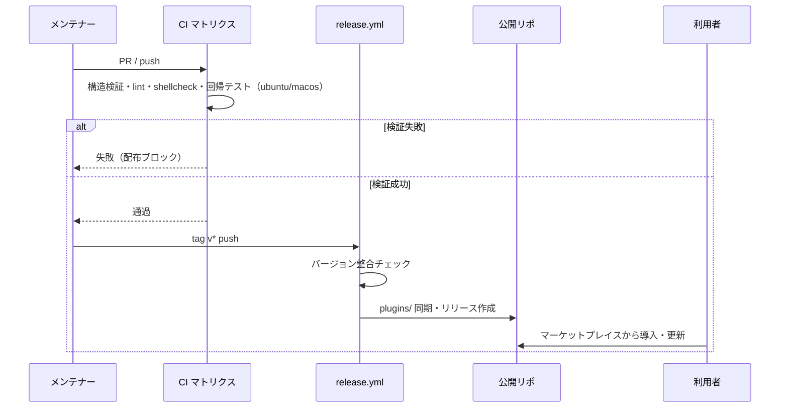

# 配布・運用

**関連 Design Doc:** [distribution_design.md](distribution_design.md)
**関連 PRD:** [distribution.md](../requirement/distribution.md)
**準拠する原則:** [CONSTITUTION.md](../CONSTITUTION.md) B-002（多言語対応の一貫性）, T-001（JSON/Markdown 構文の正当性）, T-002（plugin.json 登録の徹底）, T-003（日本語出力の文字化け防止）

---

# 1. 背景

Claude Code プラグイン「sdd-workflow」の機能価値は、利用者が確実に導入・更新でき、日英どちらの
環境でも同等に動作し、変更のたびに品質が継続検証されることで初めて成立する。個々のスキル・
エージェントの機能仕様（workflow-foundation / prd-generation / spec-design / task-implementation /
quality-guardrails の各カテゴリ）とは別に、プロダクトとしての配布・運用の非機能・運用要求を
横断的に定義する必要がある。

本仕様は、既に実現済みのマーケットプレイス配布・バージョン一元管理・多言語テンプレート体系・
クロスプラットフォーム対応・CI 継続検証という配布運用基盤を、検証可能な要件として明文化し、
退行を防ぐことを目的とする。

# 2. 概要

本機能は、プラグインを「作る」機能ではなく、プラグインを「届け、壊さずに保つ」ための運用基盤を
定義する。主要な設計原則は以下のとおり。

- **標準機構による配布**: Claude Code のマーケットプレイス機構（`marketplace.json` /
  `plugin.json` マニフェスト）に準拠して配布し、利用者が標準手順で導入・更新できる（FR_001 / IR_001）
- **バージョンの単一ソース**: バージョン番号をマニフェストに一元化し、分散した重複記載による
  不整合を防ぐ。変更履歴は日英併記で提供する（FR_002 / DC_001）
- **日英の機能同等性**: すべてのスキル・エージェントのテンプレートを `templates/{en,ja}/` の
  二言語体系で提供し、両言語のファイルセットを同一に保つ（FR_003 / DC_003 / B-002）
- **クロスプラットフォーム**: スクリプト・フックは macOS / Linux で同一の動作を保証する（NFR_001）
- **継続検証**: 変更のマージ前に、構造・構文・リント・静的解析・回帰テストを CI で自動実行し、
  壊れたプラグインの配布を防止する（FR_004 / UR_003）

具体的な実装方式（CI ジョブ構成・リリースワークフローの二段構え・検証スクリプトの実装言語）は
[distribution_design.md](distribution_design.md) に委ねる。

# 3. 要求定義

## 3.1. 機能要件 (Functional Requirements)

| ID     | 要件                                                                                   | 優先度 | 根拠（上流要求）        |
|--------|----------------------------------------------------------------------------------------|-----|----------------------|
| FR-001 | マーケットプレイスメタデータとプラグインマニフェストで配布し、スキル・エージェント・フックを登録する | 必須  | PRD FR_001 / UR_001   |
| FR-002 | バージョン番号を単一ソースで管理し、変更履歴（CHANGELOG）を日英併記で提供する                 | 必須  | PRD FR_002 / DC_001   |
| FR-003 | 全スキル・エージェントの出力テンプレートを日英二言語体系で提供する                            | 必須  | PRD FR_003 / UR_002   |
| FR-004 | 構造検証・プロンプトリント・シェル静的解析・フック回帰テストを CI で自動実行する                | 必須  | PRD FR_004 / UR_003   |
| FR-005 | マニフェスト（marketplace.json / plugin.json）を Claude Code プラグイン仕様に準拠させる      | 必須  | PRD IR_001            |
| FR-006 | プロンプト Markdown にコードブロックを含めず、EN/JA テンプレートのファイルセットを同一に保つ    | 必須  | PRD DC_002 / DC_003   |

## 3.2. 非機能要件 (Non-Functional Requirements)

| ID      | カテゴリ     | 要件                                                       | 目標値                              |
|---------|----------|------------------------------------------------------------|-------------------------------------|
| NFR-001 | 移植性     | スクリプト・フック・スキルが macOS / Linux で同一の動作を保証する    | 両 OS の CI ランナーで全テスト通過        |
| NFR-002 | 保守性     | バージョン不整合・構造不備・リント違反を CI で自動検知できること         | 不整合混入時にリリース／CI が失敗する      |
| NFR-003 | 一貫性     | EN/JA のスキル・エージェント・テンプレート構成が機能差を生まないこと     | EN/JA ファイルセット同一性 lint が通過   |

# 4. 提供コンポーネント

本機能は個別の機能スキルを追加するのではなく、プラグインを配布・運用するための基盤コンポーネントを
提供する。対象コンポーネントは以下のとおり。

| 種別（skill/agent/hook/template） | 配置場所                                                          | 名前                          | 概要                                                                    |
|------------------------------|-----------------------------------------------------------------|-----------------------------|-------------------------------------------------------------------------|
| config                       | `.claude-plugin/marketplace.json`                              | マーケットプレイスメタデータ       | 登録プラグイン一覧・参照先・バージョンを定義する（FR-001 / FR-005）              |
| config                       | `plugins/sdd-workflow/.claude-plugin/plugin.json`              | プラグインマニフェスト            | 名前・バージョン・エージェント・スキル・フックを登録する（FR-001 / FR-005 / DC_001） |
| ci                           | `.github/workflows/ci.yml`                                     | CI 検証ワークフロー             | 構造検証・shellcheck・plugin-lint・回帰テストを複数 OS で実行する（FR-004 / NFR-001） |
| ci                           | `.github/workflows/prepare-release.yml`                        | リリース準備ワークフロー          | develop → main の PR 作成・CI 待機・マージまでを自動化する（FR-002）             |
| ci                           | `.github/workflows/release.yml`                                | リリース配布ワークフロー          | タグ契機でバージョン整合を検証し、公開リポへ配布・リリースを作成する（FR-002 / FR-005） |
| script                       | `scripts/validate-marketplace.sh`                              | 構造・バージョン検証スクリプト     | JSON 構文・必須フィールド・バージョン整合を検証する（FR-004 / FR-005）             |
| script                       | `scripts/plugin-lint.sh`                                       | プロンプト・構成リント           | コードブロック検出・EN/JA 同一性・パストークン検査を行う（FR-006 / DC_002 / DC_003） |
| template                     | `plugins/sdd-workflow/skills/*/templates/{en,ja}/` 等            | 多言語テンプレート群             | 全スキル・エージェントの出力テンプレートを日英二言語で提供する（FR-003 / DC_003）    |
| docs                         | `plugins/sdd-workflow/CHANGELOG.md` / `CHANGELOG.ja.md`         | 変更履歴（日英併記）             | バージョンごとの変更内容を英語・日本語で提供する（FR-002）                        |

## 4.1. 入出力定義

配布・運用が満たすべき構造上の制約の観点は以下のとおり。

```
# 配布・運用制約の観点
- バージョン : marketplace.json の metadata.version / plugins[].version と plugin.json の version が一致する（単一ソース = DC_001）
- 配布契機   : tag（v*）push を契機にリリースワークフローが起動する
- 検証       : CI（PR / push）で構造検証・shellcheck・plugin-lint・回帰テストが全て通過する
- 多言語     : templates/en と templates/ja のファイルセット（ファイル名集合）が常に同一である
- プロンプト : スキル・エージェントのプロンプト Markdown にコードブロックを含めない
- 対応 OS    : CI マトリクスに ubuntu-latest / macos-latest を含める
```

# 5. 用語集

| 用語               | 説明                                                                       |
|------------------|----------------------------------------------------------------------------|
| marketplace.json | マーケットプレイスのメタデータ。登録プラグインの一覧と参照先・バージョンを定義する          |
| plugin.json      | プラグインマニフェスト。名前・バージョン・エージェント・スキル・フックを登録する            |
| CHANGELOG        | バージョンごとの変更履歴。英語版（CHANGELOG.md）と日本語版（CHANGELOG.ja.md）を併記する |
| plugin-lint      | プロンプト Markdown・テンプレート構成のリポジトリ規約を検証するリントスクリプト           |
| 回帰テスト          | フック・スキルスクリプトの既存挙動が変更で壊れていないことを確認する自動テスト             |
| 単一ソース          | バージョン等の情報を一箇所（マニフェスト）にのみ保持し、重複記載を排除する方針             |

# 6. 使用例

本機能は品質・運用制約であり、開発時・CI・リリース時に継続的に検証される。

```
# 開発・CI: PR / push で全検証ジョブが実行される
ci.yml → validate（構造検証） / shellcheck（ubuntu+macos） / plugin-lint / test（ubuntu+macos）

# ローカル検証: CI と同じ検証を手元で実行
bash scripts/validate-marketplace.sh
bash scripts/plugin-lint.sh

# リリース準備: develop から main への PR 作成・マージを自動化
prepare-release.yml（workflow_dispatch, version 入力）

# 配布: タグ push を契機に公開リポへ同期・リリース作成
git tag v4.0.0 && git push origin v4.0.0 → release.yml
```

# 7. 振る舞い図



# 8. 制約事項

- 配布は Claude Code のプラグインマーケットプレイス機構に依存し、その仕様変更への追随が必要である
- CI は GitHub Actions 上で実行され、利用可能なランナー OS（ubuntu / macos）に制約される
- Windows は現時点のサポート対象外であり、本仕様のスコープに含めない
- バージョン情報は plugin.json / marketplace.json に一元化し、個々のスキル・エージェントには
  バージョンを重複記載しない（DC_001）
- 有償配布・ライセンス管理はスコープ外（MIT ライセンスによる無償配布のみ）

# 9. 原則との整合性

| 原則ID  | 原則名                   | 本仕様への適用内容                                                        |
|-------|-------------------------|----------------------------------------------------------------------------|
| B-002 | 多言語対応（EN/JA）の一貫性  | 全テンプレートを EN/JA 二言語で提供し、ファイルセット同一性を要件化する（FR-003 / DC_003） |
| T-001 | JSON/Markdown 構文の正当性 | marketplace.json / plugin.json の JSON 正当性とドキュメントリンクの整合を CI で検証する |
| T-002 | plugin.json 登録の徹底     | 配布対象のスキル・エージェント・フックがマニフェストに登録されていることを配布の前提とする    |
| T-003 | 日本語出力の文字化け防止     | ja テンプレート・日本語 CHANGELOG・ドキュメントに文字化けを混入させない               |

---

# PRD 整合性レビュー結果

| 確認項目        | 結果                                                                                             |
|---------------|--------------------------------------------------------------------------------------------------|
| 要求カバレッジ   | PRD FR_001 を FR-001、FR_002 を FR-002、FR_003 を FR-003、FR_004 を FR-004、IR_001 を FR-005、DC_002/DC_003 を FR-006 でカバー |
| 要求 ID 参照    | 各 FR に対応する PRD の要求 ID（FR_00x / UR_00x / IR_001 / DC_00x）を「根拠」列に明記                    |
| 非機能要求の反映 | PRD NFR_001（クロスプラットフォーム）を NFR-001 に反映。退行検知・EN/JA 一貫性を NFR-002・003 に補完         |
| 用語整合性      | PRD 用語集（marketplace.json / plugin.json / CHANGELOG / plugin-lint / 回帰テスト）と整合              |
| スコープ整合性   | Windows 非対応・有償配布除外・機能スキル仕様の各カテゴリ委譲を PRD と一致させて明記                          |
