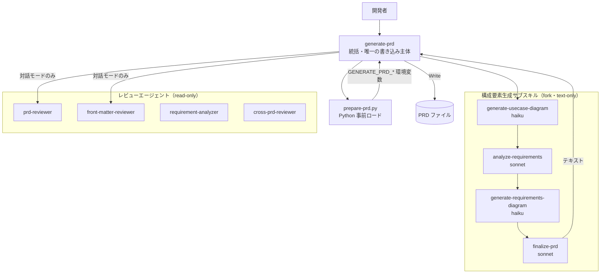

# PRD 生成パイプライン

**関連 Spec:** [prd-generation_spec.md](prd-generation_spec.md)
**関連 PRD:** [prd-generation.md](../requirement/prd-generation.md)
**準拠する原則:** [CONSTITUTION.md](../CONSTITUTION.md) B-001（Vibe Coding 防止）, B-002（多言語対応の一貫性）, A-001（Skills-First）, A-002（フックとスクリプトの責務分離）, T-002（plugin.json 登録の徹底）, T-003（日本語出力の文字化け防止）

---

# 1. 実装ステータス

**ステータス:** 🟢 実装済み

本設計書は、既に実装済みの PRD 生成スキル群（`skills/generate-prd/` および
`skills/generate-usecase-diagram/` / `analyze-requirements/` /
`generate-requirements-diagram/` / `finalize-prd/`）とレビューエージェント群
（`agents/prd-reviewer.md` / `front-matter-reviewer.md` / `requirement-analyzer.md` /
`cross-prd-reviewer.md`）を真実の源として、その設計を逆算して記述したものである。

> **逆算記述の経緯（正当化）**: PRD 生成パイプラインは、AI-SDD ワークフローの中核機能として
> スキル・エージェント・準備スクリプトが先行実装され、本 spec/design はその後に要求
> （オーケストレーション・書き込み主体の限定・多言語・CI モード）を明文化した逆算記述である。
> D-001（Specification-Driven）の原則に対し、実装先行の経緯を CONSTITUTION.md の例外プロセス
> （1. 文書化 / 2. 正当化 / 3. レビュー / 4. 追跡）に沿って本節に記録する。本 spec/design の
> 追加により、以後の変更は仕様を真実の源として管理される。

## 1.1. 実装進捗

| モジュール/機能                    | ステータス | 備考                                                                       |
|----------------------------------|--------|----------------------------------------------------------------------------|
| オーケストレーター（generate-prd）    | 🟢     | `allowed-tools` に Write/Edit/Bash を持つ唯一のスキル。10 ステップの生成フロー        |
| 事前ロード（prepare-prd.py）         | 🟢     | Python 2 フェーズ実行。プロジェクトテンプレート優先・参照キャッシュ・環境変数エクスポート    |
| ユースケース図生成                   | 🟢     | `context: fork` / `agent: haiku` / Write・Edit・Bash 不許可（テキスト返却のみ）      |
| 要求分析                           | 🟢     | `context: fork` / `agent: sonnet` / Write・Edit・Bash 不許可                      |
| 要求図生成                         | 🟢     | `context: fork` / `agent: haiku` / Write・Edit・Bash 不許可                       |
| PRD 統合・完成                     | 🟢     | `context: fork` / `agent: sonnet` / front matter 生成ルールを保持                  |
| レビューエージェント群               | 🟢     | prd-reviewer/requirement-analyzer/cross-prd-reviewer（sonnet）・front-matter-reviewer（haiku）。すべて read-only |
| 多言語テンプレート                   | 🟢     | generate-prd / finalize-prd が `templates/{en,ja}/` を保持                        |

---

# 2. 設計目標

- PRD 生成の全工程を単一オーケストレーターが統括し、構成要素生成を独立サブスキルへ委譲する（FR-001）
- ファイル書き込み権限をオーケストレーターに限定し、構成要素生成の誤動作による破壊を構造的に防ぐ（DC_001 / NFR-002）
- 準備（テンプレート・参照ロード）という機械的処理を Python スクリプトに委譲し、Claude を判断・生成に専念させる（A-002）
- 対話モードと CI モードを単一スキルで両立し、非対話環境でも自動生成できるようにする（FR-009 / UR_004）
- 出力言語を `SDD_LANG` に従わせ、単一文書内の言語混在を防ぐ（DC_003 / B-002 / NFR-003）
- 生成後の品質保証（CONSTITUTION 準拠・front matter・トレーサビリティ・横断整合）をエージェントに委譲する（FR-006〜008）

---

# 3. 実装方式

| 領域（skill/agent/script） | 採用方式                                                     | 選定理由                                                                                     |
|--------------------------|--------------------------------------------------------------|--------------------------------------------------------------------------------------------|
| skill（統括）              | Markdown スキル（`allowed-tools: Read, Write, Edit, Glob, Grep, AskUserQuestion, Bash`、メインコンテキスト） | 唯一の書き込み主体として永続化と統括を担う。A-001 に従い skill として実装（FR-001 / DC_001） |
| skill（構成要素生成）        | Markdown スキル（`context: fork` + `agent` + `disallowed-tools: Write, Edit, Bash`） | コンテキストを隔離してトークンを節約し、書き込み不可でファイル破壊を構造的に防ぐ（DC_001）        |
| agent（レビュー）           | サブエージェント（`model` 指定、`allowed-tools: Read, Glob, Grep, AskUserQuestion`） | 独立コンテキストで read-only にレビューし、生成物を汚さず修正提案を返す（FR-006〜008）           |
| script（準備）             | Python 3（`prepare-prd.py`、標準ライブラリ）                     | テンプレート・参照ロードという決定的処理をスクリプト化し Claude の判断と分離する（A-002）           |
| モデル選定                  | 図生成 = haiku、分析・統合・レビュー = sonnet                     | 図生成は定型で軽量なため haiku、要求抽出・統合・準拠レビューは判断を要するため sonnet。エイリアス表記で世代追従 |

---

# 4. アーキテクチャ

## 4.1. システム構成図



## 4.2. モジュール分割

| モジュール名                    | 責務                                              | 依存関係                     | 配置場所                                        |
|-------------------------------|---------------------------------------------------|----------------------------|-------------------------------------------------|
| generate-prd                  | 全工程の統括・PRD ファイルの保存（唯一の書き込み主体）      | サブスキル群 / prepare-prd.py | `skills/generate-prd/SKILL.md`                  |
| prepare-prd.py                | テンプレート・参照の事前ロードと環境変数エクスポート        | Python 標準ライブラリ         | `skills/generate-prd/scripts/prepare-prd.py`    |
| generate-usecase-diagram      | ユースケース図生成（テキスト返却）                       | 参照ガイド（fork）           | `skills/generate-usecase-diagram/SKILL.md`      |
| analyze-requirements          | UR/FR/NFR 抽出・分類（テキスト返却）                    | 参照ガイド（fork）           | `skills/analyze-requirements/SKILL.md`          |
| generate-requirements-diagram | SysML 要求図生成（テキスト返却）                        | 参照ガイド（fork）           | `skills/generate-requirements-diagram/SKILL.md` |
| finalize-prd                  | 成果物統合・front matter 生成（テキスト返却）            | PRD テンプレート（fork）      | `skills/finalize-prd/SKILL.md`                  |
| prd-reviewer                  | CONSTITUTION 準拠・必須セクション・トレーサビリティ検証     | 生成 PRD（read-only）        | `agents/prd-reviewer.md`                        |
| front-matter-reviewer         | front matter 形式・依存方向・id 一意性検証              | 生成 PRD（read-only）        | `agents/front-matter-reviewer.md`               |
| requirement-analyzer          | 要求図のカバレッジ・依存・トレーサビリティ分析             | 既存 PRD（read-only）        | `agents/requirement-analyzer.md`                |
| cross-prd-reviewer            | 複数 PRD 間の横断整合レビュー                          | 複数 PRD（read-only）        | `agents/cross-prd-reviewer.md`                  |

---

# 5. データ構造

`prepare-prd.py` は、プロジェクトテンプレート優先・キャッシュ展開の結果を環境変数として
`$CLAUDE_ENV_FILE` にエクスポートし、後続の Claude 処理（Phase 2）がキャッシュから読み取る。

```
# prepare-prd.py がエクスポートする環境変数（$CLAUDE_ENV_FILE 経由）
GENERATE_PRD_TEMPLATE   = <キャッシュ済み PRD テンプレートのパス>   # プロジェクト .sdd/PRD_TEMPLATE.md を優先、無ければ templates/${SDD_LANG}/prd_template.md
GENERATE_PRD_REFERENCES = <キャッシュ済み参照資料ディレクトリのパス>  # usecase_diagram_guide.md / mermaid_notation_rules.md / front_matter_prd.md 等
GENERATE_PRD_CACHE_DIR  = <キャッシュディレクトリのパス>
```

```yaml
# finalize-prd が生成する PRD front matter の主要フィールド（references/front_matter_prd.md 準拠）
id: "prd-{feature-name}"        # 階層時: "prd-{parent}-{feature-name}"
type: "prd"
status: "draft"
depends-on: []                    # 親 PRD がある場合のみ ["prd-{parent}"]
priority: "medium"                # 入力に明示が無ければ既定 medium
risk: "medium"                    # 入力に明示が無ければ既定 medium
```

---

# 6. ファイル構成

```
plugins/sdd-workflow/
├── skills/
│   ├── generate-prd/
│   │   ├── SKILL.md                         # オーケストレーター（Write/Edit/Bash 許可）
│   │   ├── scripts/prepare-prd.py           # Python 事前ロード
│   │   ├── references/*.md                  # 図・要求図・front matter ガイド
│   │   └── templates/{en,ja}/               # PRD テンプレート・出力・進捗チェックリスト
│   ├── generate-usecase-diagram/SKILL.md    # fork / haiku / text-only
│   ├── analyze-requirements/SKILL.md        # fork / sonnet / text-only
│   ├── generate-requirements-diagram/SKILL.md # fork / haiku / text-only
│   └── finalize-prd/
│       ├── SKILL.md                         # fork / sonnet / text-only
│       └── templates/{en,ja}/prd_template.md
├── agents/
│   ├── prd-reviewer.md                      # sonnet / read-only
│   ├── front-matter-reviewer.md             # haiku / read-only
│   ├── requirement-analyzer.md              # sonnet / read-only
│   └── cross-prd-reviewer.md                # sonnet / read-only
└── .claude-plugin/plugin.json               # agents 登録（skills はディレクトリ一括）（T-002）
```

---

# 7. 非機能要件実現方針

| 要件                          | 実現方針                                                                                       |
|-------------------------------|------------------------------------------------------------------------------------------------|
| NFR-001 生成 PRD の情報充足性    | generate-prd / finalize-prd の Quality Checks で必須セクション内容・全要求の属性・トレースを検証し、マーカー残存を排除 |
| NFR-002 ファイル破壊の防止       | サブスキルを `context: fork` + `disallowed-tools: Write, Edit, Bash` とし、書き込みを generate-prd に限定（DC_001） |
| NFR-003 言語の一貫性            | テンプレート選択・出力を `${SDD_LANG:-en}` に従わせ、finalize-prd で単一言語を強制（DC_003 / B-002） |

---

# 8. テスト戦略

| テストレベル      | 対象                                                    | カバレッジ目標                          |
|--------------|---------------------------------------------------------|----------------------------------------|
| 静的解析（lint） | 各 SKILL.md / agent.md のプロンプト構成（plugin-lint.sh）     | コードブロック不在・EN/JA テンプレート同一性     |
| 回帰          | prepare-prd.py の事前ロード・キャッシュ配置                     | プロジェクトテンプレート優先・custom root 対応 |
| インスペクション  | 生成 PRD の front matter スキーマ・トレーサビリティ（IR_001）      | id/type/status/priority/risk 準拠・FR→UR トレース |
| デモンストレーション | 対話 / CI モードの通し生成（generate-prd）                    | 保存までの全工程が成功                       |

---

# 9. 設計判断

## 9.1. 決定事項

| 決定事項                    | 選択肢                                                            | 決定内容                          | 理由                                                                                          |
|---------------------------|------------------------------------------------------------------|---------------------------------|-----------------------------------------------------------------------------------------------|
| 書き込み主体の限定           | (a) 全スキルが書き込む / (b) オーケストレーターのみ書き込む             | **(b) オーケストレーターのみ**      | 構成要素生成サブスキルを fork + `disallowed-tools: Write, Edit, Bash` とし、誤動作による PRD 破壊を構造的に防ぐ（DC_001） |
| サブスキルのコンテキスト       | (a) メインコンテキスト共有 / (b) `context: fork`                     | **(b) fork**                    | 生成の中間出力でメインコンテキストを汚さず、トークンを節約する（PLUGIN_AGENTS.md の方針）           |
| モデル選定                  | (a) 全て sonnet / (b) 用途別（図生成 haiku・分析/統合/レビュー sonnet） | **(b) 用途別**                    | 定型的な図生成は haiku で十分、判断を要する要求抽出・統合・準拠レビューは sonnet。コストと品質を両立     |
| 準備処理の実装              | (a) Claude が逐次ファイル読込 / (b) Python スクリプトで事前ロード       | **(b) prepare-prd.py**          | テンプレート・参照ロードは決定的処理。スクリプト化しトークンを節約、Claude を判断・生成に専念させる（A-002） |
| テンプレートの優先順位        | (a) プラグイン既定固定 / (b) プロジェクト優先・既定フォールバック         | **(b) プロジェクト優先**            | プロジェクト固有の PRD_TEMPLATE.md を尊重し、無い場合のみ言語別既定にフォールバック（DC_002）          |
| 対話 / CI モードの分離        | (a) 別スキル / (b) `--ci` フラグで単一スキル分岐                     | **(b) 単一スキル + フラグ**         | 生成ロジックを共有しつつ、非対話環境では質問・生成後レビューを省略する（FR-009 / UR_004）              |

## 9.2. 未解決の課題

| 課題                                   | 影響度 | 対応方針                                            |
|--------------------------------------|-----|-----------------------------------------------------|
| 生成品質の基盤モデル依存                    | 中   | Quality Checks とレビューエージェントで品質を担保。モデル世代更新は CI テストで退行検知 |
| requirement-analyzer/cross-prd-reviewer の任意実行 | 低   | FR-007/008 はオーケストレーションから独立した任意実行機能。呼び出しは開発者判断に委ねる |
| Mermaid 構文制約への追随                   | 低   | references の mermaid_notation_rules.md を単一ソースとし、構文規則を集中管理 |

---

# 10. 原則準拠チェックリスト

| 原則ID  | 原則名                   | 準拠状況 | 備考                                                          |
|-------|-------------------------|------|---------------------------------------------------------------|
| B-001 | Vibe Coding 防止          | ✅   | 対話モードで曖昧要件を AskUserQuestion で明確化。CI モードは合理的仮定を許容      |
| B-002 | 多言語対応（EN/JA）の一貫性  | ✅   | generate-prd / finalize-prd が `templates/{en,ja}/` を保持し出力言語を統一   |
| A-001 | Skills-First             | ✅   | 全機能を `skills/{name}/SKILL.md` として実装（legacy commands なし）        |
| A-002 | フックとスクリプトの責務分離   | ✅   | 準備処理を prepare-prd.py に委譲し、Claude は判断・生成に専念                 |
| T-002 | plugin.json 登録の徹底     | ✅   | 4 エージェントを plugin.json の agents に登録。skills は `./skills` で一括登録  |
| T-003 | 日本語出力の文字化け防止     | ✅   | ja テンプレートを UTF-8 で維持し mojibake を防止                            |

**原則から逸脱する場合**: D-001（Specification-Driven）に対する実装先行の経緯は「1. 実装ステータス」の
逆算記述の経緯に文書化し、CONSTITUTION.md の例外プロセスに従っている。

---

# 11. 変更履歴

## v4.0.0

**変更内容:**

- 既存の PRD 生成スキル群・レビューエージェント群を逆算し、PRD 生成パイプラインの
  spec/design として明文化した

**移行ガイド:** なし（新規の逆算ドキュメント。既存のスキル・エージェント構成に変更はない）
