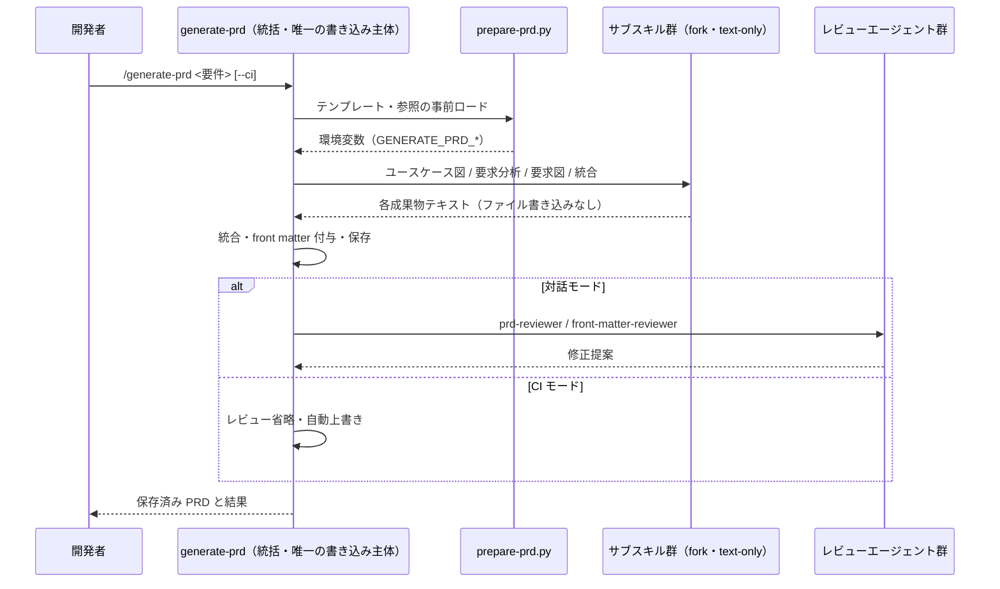

# PRD 生成パイプライン

**関連 Design Doc:** [prd-generation_design.md](prd-generation_design.md)
**関連 PRD:** [prd-generation.md](../requirement/prd-generation.md)
**準拠する原則:** [CONSTITUTION.md](../CONSTITUTION.md) B-001（Vibe Coding 防止）, B-002（多言語対応の一貫性）, A-002（フックとスクリプトの責務分離）, T-002（plugin.json 登録の徹底）

---

# 1. 背景

AI-SDD ワークフローの Specify フェーズでは、ビジネス要件を「何を作るか」「なぜ作るか」として
構造化した PRD（要求仕様書）が真実の源となる。しかし PRD の手作業での作成は、要求の抽出漏れ・
トレーサビリティの欠落・記法の不統一を招きやすい。

本機能群は、ビジネス要件の入力から完全な PRD ファイルの保存までを、複数のサブスキルの
オーケストレーションによって自動化し、構造化された要求（UR/FR/NFR）と視覚的表現
（ユースケース図・SysML 要求図）を備えたレビュー可能な PRD を一貫した品質で生成する。
本仕様は、既に実装済みの `generate-prd` スキル群とレビューエージェント群を真実の源として、
提供コンポーネントと満たすべき要件を明文化する。

# 2. 概要

本機能は、PRD 生成の全工程を単一のオーケストレーターが統括し、構成要素の生成を
コンテキスト独立なサブスキルに委譲する。主要な設計原則は以下のとおり。

- **オーケストレーションによる一貫生成**: 入力から保存までをオーケストレーター（`generate-prd`）が
  統括し、ユースケース図・要求分析・要求図・統合を所定順で実行する（FR_001）
- **書き込み主体の限定**: 構成要素生成サブスキルはファイルを書き込まず、永続化はオーケストレーター
  のみが行う。構成要素生成の誤動作による PRD ファイル破壊を構造的に防ぐ（DC_001）
- **対話モードと CI モードの両立**: 対話モードでは曖昧要件を質問で明確化し（B-001）、CI モードでは
  質問・生成後レビューを省略して合理的仮定で自動生成する（FR_001_02 / FR_001_03 / UR_004）
- **テンプレート優先とフォールバック**: プロジェクトの PRD テンプレートを優先し、無い場合のみ
  言語別のプラグイン既定テンプレートにフォールバックする（DC_002）
- **言語の一貫性**: 出力言語は `SDD_LANG` に従い、単一ドキュメント内で言語を混在させない（DC_003 / B-002）
- **生成後の品質保証**: 生成 PRD の CONSTITUTION 準拠・front matter 形式・トレーサビリティ・
  PRD 横断整合をレビューエージェントで検証する（FR_006 / FR_007 / FR_008）

具体的な実装方式（サブスキルのコンテキスト分離・モデル選定・準備スクリプトの 2 フェーズ実行）は
[prd-generation_design.md](prd-generation_design.md) に委ねる。

# 3. 要求定義

## 3.1. 機能要件 (Functional Requirements)

| ID     | 要件                                                                          | 優先度 | 根拠（上流要求）        |
|--------|-------------------------------------------------------------------------------|-----|----------------------|
| FR-001 | サブスキルを統括し、ビジネス要件入力から PRD ファイル保存までの全工程を実行する          | 必須  | PRD FR_001 / UR_001   |
| FR-002 | ビジネス要件からアクター・ユースケース・システム境界を抽出し、ユースケース図を生成する      | 必須  | PRD FR_002 / UR_003   |
| FR-003 | ユースケースとコンテキストから UR/FR/NFR を抽出・分類し、属性とトレースを付与する         | 必須  | PRD FR_003 / UR_002   |
| FR-004 | 要求分析結果から関係を可視化する SysML 要求図（requirementDiagram）を生成する          | 必須  | PRD FR_004 / UR_003   |
| FR-005 | 全成果物をテンプレート構造に統合し、front matter 付きの完全な PRD として完成する         | 必須  | PRD FR_005 / UR_001   |
| FR-006 | 生成 PRD の CONSTITUTION 準拠・必須セクション・トレーサビリティ・front matter を検証する | 必須  | PRD FR_006            |
| FR-007 | 既存 PRD の要求図を分析し、カバレッジ・依存・トレーサビリティを重要度分類で報告する        | 推奨  | PRD FR_007 / UR_002   |
| FR-008 | 複数 PRD 間の境界・用語・スタイル・原則参照・front matter の横断整合をレビューする        | 推奨  | PRD FR_008 / UR_002   |
| FR-009 | CI モード（`--ci`）で質問・生成後レビューを省略し、既存 PRD を自動上書きして生成する      | 必須  | PRD FR_001_03 / FR_001_04 / UR_004 |

## 3.2. 非機能要件 (Non-Functional Requirements)

| ID      | カテゴリ   | 要件                                                              | 目標値                              |
|---------|--------|-------------------------------------------------------------------|-------------------------------------|
| NFR-001 | 品質     | 生成 PRD が後続の仕様書生成に十分な情報量を含むこと                     | 必須セクションに実質内容・全要求に属性・トレースが揃う |
| NFR-002 | 保守性   | 構成要素生成の誤動作が PRD ファイルを破壊しないこと                     | 書き込み権限を持つ主体がオーケストレーターに限定される |
| NFR-003 | 一貫性   | 生成物の言語が `SDD_LANG` に一致し、単一文書内で混在しないこと            | 出力言語がテンプレート言語と一致            |

# 4. 提供コンポーネント

| 種別（skill/agent/hook/template） | 配置場所                                                  | 名前                      | 概要                                                                 |
|------------------------------|-----------------------------------------------------------|-------------------------|----------------------------------------------------------------------|
| skill                        | `skills/generate-prd/SKILL.md`                          | generate-prd            | PRD 生成のオーケストレーター。唯一のファイル書き込み主体（FR-001 / DC_001） |
| skill                        | `skills/generate-usecase-diagram/SKILL.md`              | generate-usecase-diagram | ユースケース図（Mermaid flowchart）を生成する（FR-002）                  |
| skill                        | `skills/analyze-requirements/SKILL.md`                  | analyze-requirements    | UR/FR/NFR を抽出・分類する（FR-003）                                    |
| skill                        | `skills/generate-requirements-diagram/SKILL.md`         | generate-requirements-diagram | SysML 要求図（requirementDiagram）を生成する（FR-004）             |
| skill                        | `skills/finalize-prd/SKILL.md`                          | finalize-prd            | 全成果物を統合し front matter 付き PRD テキストを生成する（FR-005）        |
| agent                        | `agents/prd-reviewer.md`                                | prd-reviewer            | PRD の CONSTITUTION 準拠・必須セクション・トレーサビリティをレビュー（FR-006） |
| agent                        | `agents/front-matter-reviewer.md`                       | front-matter-reviewer   | front matter の形式・依存方向・id 一意性を検証する（FR-006）              |
| agent                        | `agents/requirement-analyzer.md`                        | requirement-analyzer    | 要求図のカバレッジ・依存・トレーサビリティを分析する（FR-007）             |
| agent                        | `agents/cross-prd-reviewer.md`                          | cross-prd-reviewer      | 複数 PRD 間の横断整合をレビューする（FR-008）                            |
| script                       | `skills/generate-prd/scripts/prepare-prd.py`            | prepare-prd.py          | テンプレート・参照資料を事前ロードし環境変数へエクスポートする（FR_001_01 / DC_002） |

## 4.1. 入出力定義

オーケストレーター（generate-prd）の入出力と、準備スクリプトが公開する環境変数は以下のとおり。

```
# 入力（generate-prd）
- requirements : ビジネス要件テキスト（必須）
- --ci         : CI モードフラグ（任意。質問・prd-reviewer/front-matter-reviewer をスキップ）

# 出力
- 保存先 : ${CLAUDE_PROJECT_DIR}/${SDD_REQUIREMENT_PATH}/{feature-name}.md
- 内容   : ユースケース図・UR/FR/NFR・SysML 要求図・front matter を含む完全な PRD

# prepare-prd.py がエクスポートする環境変数（$CLAUDE_ENV_FILE 経由）
- GENERATE_PRD_TEMPLATE   : キャッシュ済み PRD テンプレートのパス（プロジェクト優先）
- GENERATE_PRD_REFERENCES : キャッシュ済み参照資料ディレクトリのパス
- GENERATE_PRD_CACHE_DIR  : キャッシュディレクトリのパス
```

# 5. 用語集

| 用語               | 説明                                                                       |
|------------------|----------------------------------------------------------------------------|
| PRD              | Product Requirements Document（要求仕様書）。「何を・なぜ作るか」を定義する最上流文書   |
| UR / FR / NFR    | ユーザー要求 / 機能要求 / 非機能要求。要求の 3 階層分類                              |
| オーケストレーション   | 複数サブスキルを所定順に統括実行し、単一成果物にまとめる制御方式                        |
| サブスキル          | オーケストレーターから呼び出され、テキストのみを返す構成要素生成スキル（ファイル書き込みなし） |
| CI モード           | `--ci` フラグによる非対話実行。質問・生成後レビューを省略し自動生成する                  |
| SysML 要求図        | 要求間の関係（contains / derives / traces 等）を表す Mermaid requirementDiagram    |
| front matter     | ドキュメント冒頭の YAML メタデータ（id / type / status / priority / risk 等）        |

# 6. 使用例

```
# 対話モード: 曖昧要件は質問で明確化し、生成後に prd-reviewer / front-matter-reviewer を実行
/generate-prd タスクを作成・編集・削除できる機能。担当者と期限を管理する。

# CI モード: 質問・生成後レビューを省略し、合理的仮定で自動生成・自動上書き
/generate-prd タスク管理機能。作成・編集・削除に対応。 --ci

# 単体呼び出し（構成要素生成サブスキル。テキストのみ返却）
/generate-usecase-diagram user-authentication
/analyze-requirements task-management --ci

# 生成後の横断・トレーサビリティレビュー
requirement-analyzer / cross-prd-reviewer エージェントを呼び出す
```

# 7. 振る舞い図



# 8. 制約事項

- 本機能群は Claude Code のスキル・エージェント機構上で動作し、生成品質は基盤モデルの能力に依存する
- Mermaid requirementDiagram の構文制約（ID のアンダースコア、属性値の小文字等）に従う（IR_002）
- 要求抽出は入力されたビジネス要件の情報量に依存し、入力にない要求の補完的創出は保証しない
- 対話モードでは曖昧要件を推測で補完せず、明確化質問を優先する（B-001。CI モードは合理的仮定を許容）
- PRD からの下流展開（仕様書・設計書生成）、仕様明確化質問の体系、継続的整合性維持は本仕様のスコープ外

# 9. 原則との整合性

| 原則ID  | 原則名                   | 本仕様への適用内容                                                        |
|-------|-------------------------|----------------------------------------------------------------------------|
| B-001 | Vibe Coding 防止          | 対話モードで曖昧要件を質問で明確化し、推測での補完を排除する（CI モードは例外）        |
| B-002 | 多言語対応（EN/JA）の一貫性  | テンプレート・出力を `SDD_LANG` に従い EN/JA 同等構成で提供する（DC_003）           |
| A-002 | フックとスクリプトの責務分離   | テンプレート・参照の事前ロードという機械的処理を prepare-prd.py に委譲する（FR_001_01） |
| T-002 | plugin.json 登録の徹底     | 生成スキル群・レビューエージェント群を plugin.json に登録する                       |

---

# PRD 整合性レビュー結果

| 確認項目        | 結果                                                                                             |
|---------------|--------------------------------------------------------------------------------------------------|
| 要求カバレッジ   | PRD FR_001〜FR_008 を FR-001〜FR-008、FR_001_03/04 を FR-009 でカバー。DC_001/002/003 を NFR-002・概要・NFR-003 に反映 |
| 要求 ID 参照    | 各 FR に対応する PRD の要求 ID（FR_00x / UR_00x / DC_00x）を「根拠」列に明記                            |
| 非機能要求の反映 | PRD NFR_001（情報充足性）を NFR-001、DC_001（書き込み主体限定）を NFR-002、DC_003（言語一貫性）を NFR-003 に反映 |
| 用語整合性      | PRD 用語集（PRD / UR-FR-NFR / オーケストレーション / CI モード / SysML 要求図 / front matter）と整合。サブスキルを補完 |
| スコープ整合性   | 下流展開・clarify・継続整合性維持の各カテゴリ委譲を PRD と一致させて明記                                    |
