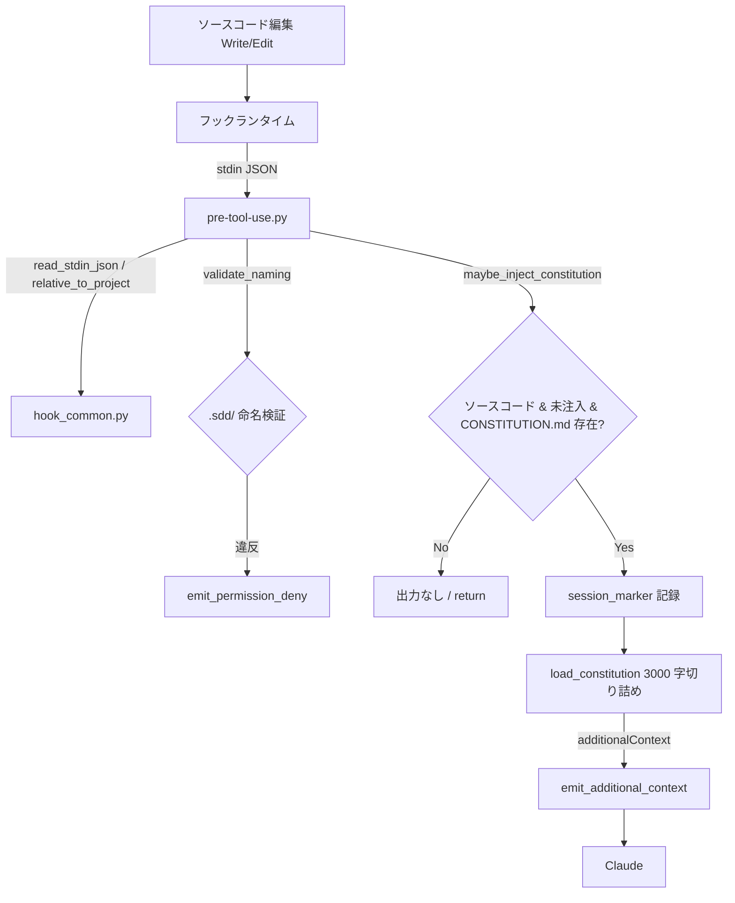

# CONSTITUTION 原則の自動注入

**関連 Spec:** [constitution-injection_spec.md](constitution-injection_spec.md)
**関連 PRD:** [constitution-injection.md](../../requirement/quality-guardrails/constitution-injection.md)（親: [quality-guardrails](../../requirement/quality-guardrails/index.md)）
**準拠する原則:** [CONSTITUTION.md](../../CONSTITUTION.md) A-002（フックとスクリプトの責務分離）, D-001（Specification-Driven）, T-003（日本語出力の文字化け防止）

---

# 1. 実装ステータス

**ステータス:** 🟢 実装済み

本設計書は既存実装（`plugins/sdd-workflow/scripts/pre-tool-use.py` および `hook_common.py`）の挙動を逆算して
記述したものである。対象拡張子・注入回数・切り詰め上限・注入内容は実装コードを真実の源とする。

## 1.1. 実装進捗

| モジュール/機能                  | ステータス | 備考                                                          |
|----------------------------|--------|-------------------------------------------------------------|
| PreToolUse フックスクリプト       | 🟢     | `scripts/pre-tool-use.py`（`maybe_inject_constitution`）        |
| フック共通ヘルパー                | 🟢     | `scripts/hook_common.py`（`SOURCE_EXTENSIONS`・additionalContext emit） |
| フック登録                      | 🟢     | `hooks/hooks.json` の `PreToolUse`（`Write\|Edit`）             |
| セッション単位の重複抑止           | 🟢     | 一時ディレクトリのマーカーファイル（`session_id` でキー化）              |
| 注入テキストの切り詰め             | 🟢     | `CONSTITUTION_MAX_CHARS = 3000` + 末尾案内                      |
| 回帰テスト                      | 🟢     | リポジトリルート `scripts/test-hook-scripts.sh`（注入・重複抑止・非ソース除外を検証。CI の `test` ジョブで実行） |

---

# 2. 設計目標

- ソースコード編集時に**軽量・決定的**に原則を注入し、応答性を阻害しない（NFR-001: 500ms 以内）
- 注入は**非ブロッキング**とし、`additionalContext` によって原則を提供するに留める（FR-006 / DC_001）
- **コンテキスト予算を守る**：セッション 1 回・3,000 文字上限で恒常的なコンテキスト消費を抑える（FR-003/004 / DC_002）
- 原則注入という機械的処理を**スクリプトへ委譲**し、Claude の推論を要さない（A-002）

---

# 3. 実装方式

| 領域       | 採用方式                                        | 選定理由                                                                                |
|----------|---------------------------------------------|-------------------------------------------------------------------------------------|
| hook     | Python 3 スクリプト（PreToolUse `Write\|Edit`）（※）  | 編集イベントに同期し決定的に注入。A-002 に従い機械的処理をスクリプトへ委譲し 500ms 要件を満たす |
| 注入方式   | `additionalContext` による非ブロッキング注入        | 編集を拒否せず AI へ原則を渡すのに適合（DC_001）。原則注入では `deny` を使わない               |
| 対象判定   | 拡張子ホワイトリスト（`SOURCE_EXTENSIONS`）+ `.sdd/` 除外 | ソースコード編集のみを対象とし、ドキュメント編集での無用な注入を避ける（FR-005）              |
| 重複抑止   | 一時ディレクトリのマーカーファイル（`session_id` キー） | セッション 1 回限りを OS 非依存に実現（DC_002）。ネットワーク・状態サーバー不要              |
| 切り詰め   | `CONSTITUTION_MAX_CHARS = 3000` + 末尾案内       | コンテキスト肥大を防止（DC_002）。超過時は全文参照へ誘導する                                |

（※）`pre-tool-use.py` の docstring 先頭には `(Write|Edit|MultiEdit)` と記載があるが、`hooks.json` の実登録は
`"matcher": "Write|Edit"` のみ（MultiEdit は未登録）。本設計書は実登録に合わせ `Write|Edit` を真実の源とする。

---

# 4. アーキテクチャ

## 4.1. システム構成図



命名検証（`validate_naming` → `emit_permission_deny`）は naming-enforcement の責務であり、本機能の関心は
`maybe_inject_constitution` 以降の非ブロッキング注入経路である。

## 4.2. モジュール分割

| モジュール名                        | 責務                                                                       | 依存関係              | 配置場所                                       |
|--------------------------------|--------------------------------------------------------------------------|--------------------|------------------------------------------------|
| pre-tool-use.py                | 編集対象を判定し、ソースコードなら CONSTITUTION 原則を additionalContext として emit | hook_common.py, os, re, tempfile | `plugins/sdd-workflow/scripts/pre-tool-use.py` |
| `maybe_inject_constitution`    | 拡張子判定・重複抑止・注入の制御                                                | os, tempfile        | 同上（関数）                                     |
| `load_constitution`            | CONSTITUTION.md の読み込みと 3,000 文字への切り詰め                             | os                  | 同上（関数）                                     |
| `session_marker_path`          | `session_id` を安全化しマーカーファイルパスを生成                                | os, re, tempfile    | 同上（関数）                                     |
| hook_common.py                 | stdin JSON 解析・プロジェクトルート解決・`SOURCE_EXTENSIONS`・additionalContext emit | json, sys, os       | `plugins/sdd-workflow/scripts/hook_common.py`  |
| hooks.json                     | `PreToolUse`（`Write\|Edit`）へのスクリプト登録                                 | -                  | `plugins/sdd-workflow/hooks/hooks.json`        |

---

# 5. データ構造

## 5.1. 注入対象の判定

**対象拡張子**は `hook_common.py` の `SOURCE_EXTENSIONS` タプルで定義する。

```python
SOURCE_EXTENSIONS = (
    ".py", ".ts", ".tsx", ".js", ".jsx", ".go", ".rs", ".java",
    ".kt", ".swift", ".cs", ".rb", ".php", ".c", ".cc", ".cpp", ".h",
)
```

判定条件（すべて満たす場合のみ注入）:

| 条件                     | 実装                                                        | 対応要件   |
|------------------------|-----------------------------------------------------------|----------|
| プロジェクト内のファイル      | `relative_to_project` が空文字を返さない                        | FR-005   |
| `.sdd/` 配下ではない        | `rel_path` が `sdd_root + os.sep` で始まらない                  | FR-005   |
| ソースコード拡張子          | `os.path.splitext(rel_path)[1] in SOURCE_EXTENSIONS`        | FR-005   |
| 当該セッションで未注入        | `session_marker_path(session_id)` が存在しない                 | FR-003   |
| CONSTITUTION.md が存在     | `<sdd_root>/CONSTITUTION.md` が `os.path.isfile`             | FR-002   |

## 5.2. セッションマーカー

```python
def session_marker_path(session_id: str) -> str:
    safe_id = re.sub(r"[^A-Za-z0-9_-]", "_", session_id)
    return os.path.join(tempfile.gettempdir(), f"sdd-constitution-injected-{safe_id}")
```

- `session_id` を安全な文字集合に正規化し、一時ディレクトリ配下のマーカーパスとする
- 注入前にマーカーの有無を確認し、存在すれば return（重複注入の抑止 / FR-003）
- 注入時にマーカーを書き込む（書き込み失敗は握りつぶし、注入自体は継続する）
- `session_id` が空の場合はマーカーを用いず、毎回注入し得る（フォールバック挙動）

## 5.3. 注入テキストの構築と切り詰め

```python
CONSTITUTION_MAX_CHARS = 3000

# load_constitution:
if len(text) > CONSTITUTION_MAX_CHARS:
    text = text[:CONSTITUTION_MAX_CHARS] + "\n... (truncated; see the full file)"
```

`additionalContext` 出力（`emit_additional_context`）:

```json
{
  "hookSpecificOutput": {
    "hookEventName": "PreToolUse",
    "additionalContext": "[AI-SDD] You are editing implementation code ('<rel_path>'). Follow the project principles defined in '<sdd_root>/CONSTITUTION.md':\n\n<CONSTITUTION 本文（切り詰め済み）>"
  }
}
```

`json.dumps(..., ensure_ascii=False)` で出力し、日本語を含む CONSTITUTION 本文を UTF-8 のまま保持する（T-003）。

---

# 6. ファイル構成

```
plugins/sdd-workflow/
├── scripts/
│   ├── pre-tool-use.py          # PreToolUse フック本体（命名検証 + 原則注入）
│   └── hook_common.py           # stdin 解析・SOURCE_EXTENSIONS・additionalContext emit 共通ヘルパー
└── hooks/
    └── hooks.json               # PreToolUse（Write|Edit）へフックを登録
```

本機能はプラグインルートの `hooks.json` にフックが登録済みであり、新規スキル追加ではないため
`plugin.json` の変更は不要（T-002）。

なお回帰テスト `scripts/test-hook-scripts.sh` は上記ツリー外の**リポジトリルート直下 `scripts/`** に配置され、
CI（`.github/workflows/ci.yml` の `test` ジョブ）から実行される。本設計書中の `scripts/` は文脈により
プラグイン配下（`plugins/sdd-workflow/scripts/`：フック本体）とリポジトリルート（テスト系）の 2 種を指すため注意する。

---

# 7. 非機能要件実現方針

| 要件                          | 実現方針                                                                                  |
|-----------------------------|-----------------------------------------------------------------------------------------|
| NFR-001（500ms 以内）          | 外部プロセス・ネットワーク・LLM 呼び出しを行わず、標準ライブラリ（`os` / `re` / `tempfile` / `json`）で同期処理する |
| NFR-002（クロスプラットフォーム）  | POSIX 準拠の Python 3。マーカーは `tempfile.gettempdir()` を用い OS 非依存                       |
| NFR-003（フックイベント仕様準拠）  | `hookSpecificOutput.additionalContext` 形式で emit。原則注入では `deny` を使わず exit code 0 で正常終了 |

---

# 8. テスト戦略

| テストレベル       | 対象                                          | カバレッジ目標                                          |
|----------------|---------------------------------------------|------------------------------------------------------|
| 回帰テスト（hook） | リポジトリルート `scripts/test-hook-scripts.sh`   | ソース編集での原則注入・同一セッション 2 回目の抑止・非ソース（README.md）の非注入 |
| CI 検証          | `.github/workflows/ci.yml` の `test` ジョブ     | フックスクリプト回帰テストが CI で実行される                    |
| 手動検証         | デモンストレーション                              | ソース編集時にコンテキストへ原則が現れ、体感遅延がない水準（NFR-001）   |

---

# 9. 設計判断

## 9.1. 決定事項

| 決定事項            | 選択肢                              | 決定内容                          | 理由                                                                 |
|------------------|-----------------------------------|---------------------------------|--------------------------------------------------------------------|
| 注入タイミング       | 編集後（Post）/ 編集前（Pre）          | 編集前（PreToolUse）               | 原則は実装着手時点で参照させる。編集後では手戻りになる                          |
| ブロッキング可否     | deny でブロック / 非ブロッキング注入     | 非ブロッキング（additionalContext）  | DC_001。編集拒否は開発フローを阻害し、注入の目的（原則の提示）に不要             |
| 重複抑止の方式       | 状態を持たない / セッションマーカー       | 一時ファイルのマーカー（session_id キー） | DC_002。全ソース編集で注入すると恒常的にコンテキストを消費する                 |
| 注入量の制御         | 全文注入 / 要約 / 上限切り詰め          | 3,000 文字上限で切り詰め + 案内       | DC_002。要約は LLM 呼び出しでコスト・遅延を招く。切り詰めは決定的で軽量           |
| 対象範囲            | 全ファイル / ソースコードのみ            | 拡張子ホワイトリスト + `.sdd/` 除外    | FR-005。ドキュメント編集での注入は不要でコンテキストを浪費する                 |
| 出力エンコーディング   | `ensure_ascii=True` / `False`      | `ensure_ascii=False`（UTF-8）      | T-003。日本語を含む CONSTITUTION 本文を文字化けなく注入する                    |

## 9.2. 未解決の課題

| 課題                               | 影響度 | 対応方針                                              |
|----------------------------------|-----|-----------------------------------------------------|
| 対象拡張子ホワイトリストの網羅性          | 低   | 主要言語を `SOURCE_EXTENSIONS` に列挙。未対応拡張子は将来追加      |
| マーカーの永続性（一時ディレクトリのクリア） | 低   | セッション内で有効なら十分。クリア時は再注入され得るが実害は軽微        |
| CONSTITUTION.md 全文が上限を超える場合   | 低   | 切り詰め末尾の案内で全文参照へ誘導（DC_002 の根拠に準拠）           |

---

# 10. 原則準拠チェックリスト

| 原則ID  | 原則名                       | 準拠状況 | 備考                                                        |
|-------|-----------------------------|--------|-----------------------------------------------------------|
| A-002 | フックとスクリプトの責務分離       | ✅     | 原則注入という決定的処理を Python フックへ委譲                        |
| D-001 | Specification-Driven          | ✅     | 実装コンテキストに原則を注入し、原則を真実の源とするフローを支える          |
| T-002 | plugin.json 登録の徹底         | ✅     | フックは `hooks.json` に登録済み。新規スキル追加なしのため plugin.json 変更不要 |
| T-003 | 日本語出力の文字化け防止          | ✅     | `ensure_ascii=False` で日本語を含む CONSTITUTION 本文を保持         |
