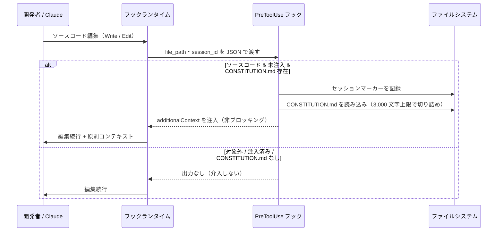

# CONSTITUTION 原則の自動注入

**関連 Design Doc:** [constitution-injection_design.md](constitution-injection_design.md)
**関連 PRD:** [constitution-injection.md](../../requirement/quality-guardrails/constitution-injection.md)（親: [quality-guardrails](../../requirement/quality-guardrails/index.md)）
**準拠する原則:** [CONSTITUTION.md](../../CONSTITUTION.md) A-002（フックとスクリプトの責務分離）, B-001（Vibe Coding 防止）, D-001（Specification-Driven）, T-003（日本語出力の文字化け防止）

---

# 1. 背景

[CONSTITUTION.md](../../CONSTITUTION.md) に定義されたプロジェクト原則が AI 実装者に参照されないまま実装が進むと、
原則違反が発生しても気づけない。原則の遵守が開発者や AI の記憶・注意力に依存する構造では、Vibe Coding 防止
（B-001）や命名規則厳守（D-002）といった原則が実装の現場で形骸化しやすい。

本機能は、実装ソースコードの編集という「原則が問われる瞬間」に、プロジェクト原則を追加コンテキストとして
自動注入することで、原則違反を構造的に抑止する。品質保証を後追いのレビューに委ねず、実装着手時点で
原則を可視化することを狙いとする。

# 2. 概要

本機能は、実装ソースコードの編集前（`Write` / `Edit`）に、プロジェクトの CONSTITUTION.md の内容を
追加コンテキストとして AI 実装者に注入する。主要な設計原則は以下のとおり。

- **編集時注入**: ソースコード編集イベント（PreToolUse）で原則コンテキストを注入する（実装着手前）
- **非ブロッキング**: 編集自体は拒否せず、原則を AI のコンテキストに追加するに留める
  （親 PRD の DC_001「ブロッキングの最小化」に準拠。命名規則違反のブロックは
  [naming-enforcement.md](../../requirement/quality-guardrails/naming-enforcement.md) の責務）
- **コンテキスト予算の遵守**: 注入はセッションあたり 1 回限りとし、注入テキストは 3,000 文字を上限に切り詰める
  （親 PRD の DC_002「コンテキスト肥大の防止」に準拠）
- **対象の限定**: 注入対象はプロジェクト内のソースコードに限り、`.sdd/` 配下のドキュメント編集は対象外とする

「何を・いつ・どこへ注入するか」を定義し、対象拡張子・マーカー方式・切り詰めロジックの具体は
[constitution-injection_design.md](constitution-injection_design.md) に委ねる。

# 3. 要求定義

## 3.1. 機能要件 (Functional Requirements)

| ID     | 要件                                                                          | 優先度 | 根拠（上流要求）                          |
|--------|-----------------------------------------------------------------------------|-----|----------------------------------------|
| FR-001 | 実装ソースコードの編集前に CONSTITUTION.md の内容を追加コンテキストとして注入する         | 必須  | 子 PRD FR_001 / 親 PRD UR_004・FR_003  |
| FR-002 | CONSTITUTION.md が存在しない場合は何も注入せず、開発フローに介入しない                   | 必須  | 子 PRD FR_001（前提条件） / 親 PRD 前提条件 |
| FR-003 | 注入はセッションあたり 1 回限りとし、繰り返し編集ではコンテキストを重複注入しない（※）        | 必須  | 子 PRD FR_001 / 親 PRD DC_002          |
| FR-004 | 注入テキストは 3,000 文字を上限に切り詰め、末尾に全文参照の案内を付与する                  | 必須  | 子 PRD FR_001 / 親 PRD DC_002          |
| FR-005 | 注入対象はプロジェクト内のソースコードに限り、`.sdd/` 配下・非ソースファイルは対象外とする      | 必須  | 子 PRD スコープ / 親 PRD DC_001         |
| FR-006 | 編集を拒否せず、非ブロッキングで原則コンテキストを注入する                                | 必須  | 子 PRD FR_001 / 親 PRD DC_001          |

## 3.2. 非機能要件 (Non-Functional Requirements)

| ID      | カテゴリ         | 要件                                                       | 目標値                                     |
|---------|--------------|----------------------------------------------------------|--------------------------------------------|
| NFR-001 | 性能           | フック処理は軽量でファイル編集の応答性を阻害しない                   | スクリプト単体の実行時間 500ms 以内（親 PRD NFR_001） |
| NFR-002 | 互換性         | macOS / Linux で動作する                                    | 親 PRD DC_004                              |
| NFR-003 | インターフェース | Claude Code フックイベント仕様・additionalContext 仕様に準拠する | 親 PRD IR_001                              |

NFR-003 について、本機能は JSON Decision Control 仕様に準拠しつつ、非ブロッキング方針（DC_001）のため
原則注入では `deny` を用いず `additionalContext` のみを注入する。

（※）FR-003 の重複抑止はセッション識別子（`session_id`）に依存する。`session_id` がフックランタイムから
取得できない場合は重複抑止が働かず、注入が繰り返され得る（縮退動作。実装詳細は design セクション 5.2 を参照）。

# 4. 提供コンポーネント

| 種別   | 配置場所                                        | 名前                | 概要                                                                        |
|------|---------------------------------------------|-------------------|---------------------------------------------------------------------------|
| hook | `scripts/pre-tool-use.py` + `hooks/hooks.json` | PreToolUse フック    | ソースコード編集前に CONSTITUTION.md を `additionalContext` として注入する（FR-001〜006） |

本機能のロジックは、ファイル命名規則の検証（[naming-enforcement.md](../../requirement/quality-guardrails/naming-enforcement.md)）と
同一スクリプト `scripts/pre-tool-use.py` に同居する。両者は PreToolUse（`Write` / `Edit`）という同一イベントで
発火するが、命名検証は `.sdd/` 配下を対象とするブロッキング、原則注入はソースコードを対象とする非ブロッキングという
異なる責務・対象・出力を持つ。

## 4.1. 入出力定義

### PreToolUse フック（原則注入部）

**入力**: フックランタイムから stdin 経由で渡される JSON。少なくとも編集対象の `tool_input.file_path` と、
セッションを識別する `session_id` を含む。

**出力**: 編集対象がプロジェクト内のソースコードであり、CONSTITUTION.md が存在し、当該セッションで未注入の
場合のみ、`additionalContext` を含む JSON を標準出力に emit する。上記を満たさない場合は何も出力しない
（FR-002 / FR-003 / FR-005）。

```json
{
  "hookSpecificOutput": {
    "hookEventName": "PreToolUse",
    "additionalContext": "[AI-SDD] You are editing implementation code ('<rel_path>'). Follow the project principles defined in '<sdd_root>/CONSTITUTION.md':\n\n<CONSTITUTION 本文（3,000 文字上限で切り詰め。超過時は末尾に truncated 案内を付与）>"
  }
}
```

切り詰め時に末尾へ付与される案内文言の具体は実装に従う（design セクション 5.3 の引用を参照）。

# 5. 用語集

| 用語                | 説明                                                                                  |
|-------------------|-------------------------------------------------------------------------------------|
| CONSTITUTION.md   | プロジェクトの最上位原則を定義するドキュメント                                                    |
| additionalContext | フックが AI のコンテキストに追加情報を注入する Claude Code の仕組み                                |
| 非ブロッキング        | ツール実行を拒否せず、警告・促し（コンテキスト注入）に留める動作                                       |
| セッションマーカー     | 同一セッションでの重複注入を防ぐため、注入済みかどうかを記録する一時ファイル                             |
| ソースコード          | 実装の対象となるプログラムファイル（拡張子で判定。`.sdd/` 配下のドキュメントは含まない）                  |
| コンテキスト予算       | AI に注入するテキスト量の上限。恒常的なコンテキスト消費を抑えるための制約（DC_002）                     |

# 6. 使用例

本機能はフックであり直接呼び出せない。以下はソースコード編集時に想定される動作。

```
# ソースコードを編集 → セッション初回のみ原則を注入
Edit: src/main.py
  → [AI-SDD] You are editing implementation code ('src/main.py').
    Follow the project principles defined in '.sdd/CONSTITUTION.md':
    <CONSTITUTION 本文>

# 同一セッションで別のソースコードを編集 → 重複注入せず何も出力しない
Edit: src/other.py
  → （出力なし）

# ドキュメント・非ソースファイルを編集 → 注入対象外
Edit: README.md
  → （出力なし）

# CONSTITUTION.md が存在しないプロジェクト → 何もしない
Edit: src/main.py
  → （出力なし）
```

# 7. 振る舞い図



# 8. 制約事項

- 注入は編集対象がソースコードのときのみ発火し、`.sdd/` 配下のドキュメント編集や非ソースファイルは対象外とする
- 注入内容は CONSTITUTION.md の生テキストであり、原則の要約・抽出は行わない（3,000 文字を超える場合は切り詰め、
  末尾の案内に従い全文を参照する運用とする）
- CONSTITUTION.md の生成・管理は本機能のスコープ外（workflow-foundation カテゴリで扱う）
- 原則遵守の判定・違反検出は本機能のスコープ外（注入までを責務とし、遵守は AI 実装者に委ねる）

# 9. 原則との整合性

| 原則ID  | 原則名                    | 本仕様への適用内容                                                              |
|-------|--------------------------|------------------------------------------------------------------------|
| A-002 | フックとスクリプトの責務分離   | 原則注入という決定的処理を Python フックに委譲し、Claude の推論を要さず軽量に実現する      |
| B-001 | Vibe Coding 防止           | 実装着手時点でプロジェクト原則を可視化し、原則違反を構造的に抑止する。B-001（Vibe Coding 防止）等の形骸化を防ぐ本機能の背景（§1）を構造的に支える |
| D-001 | Specification-Driven      | 実装コンテキストに原則を注入し、原則を真実の源として実装が進むフローを支える                |
| T-003 | 日本語出力の文字化け防止      | 日本語を含む CONSTITUTION 本文を `ensure_ascii=False` で文字化けなく注入する        |

---

# PRD 整合性レビュー結果

| 確認項目             | 結果                                                                     |
|--------------------|--------------------------------------------------------------------------|
| 要求カバレッジ        | 子 PRD FR_001 を FR-001〜006 に分解してカバー（前提条件・スコープ・DC_002 を spec 固有要求として明文化） |
| 要求 ID 参照         | 各 FR に対応する子 PRD FR_001・親 PRD UR_004（派生元）・FR_003 の要求 ID を「根拠」列に明記 |
| 非機能要求の反映      | 親 PRD NFR_001・IR_001・DC_001・DC_002・DC_004 を NFR-001〜003 および制約事項に反映 |
| 用語整合性           | 親 PRD 用語集の「CONSTITUTION.md」「additionalContext」「非ブロッキング」定義に統一 |
