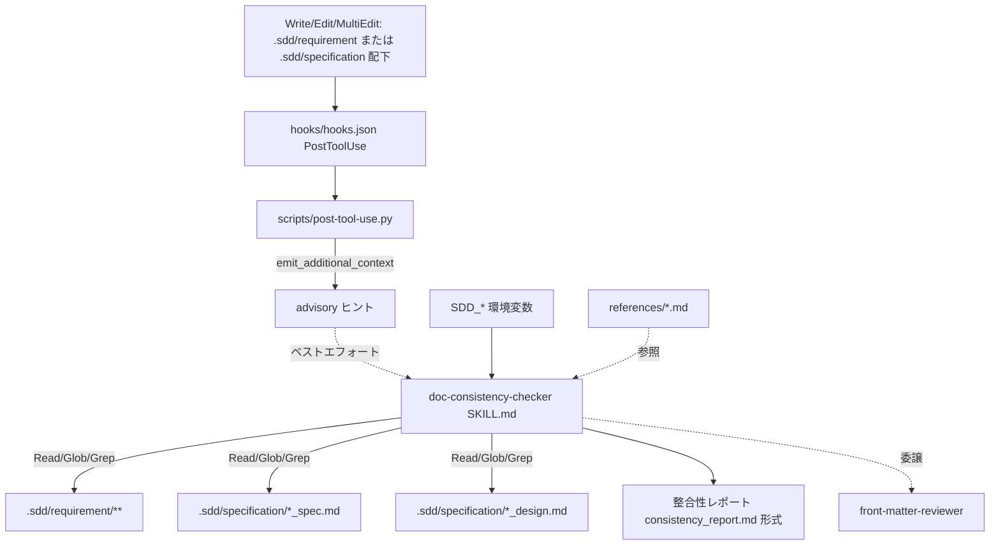

# ドキュメント間整合性チェック 技術設計書

**関連 Spec:** [doc-consistency-check_spec.md](doc-consistency-check_spec.md)
**関連 PRD:** [doc-consistency-check.md](../../requirement/quality-guardrails/doc-consistency-check.md)
**準拠する原則:** [CONSTITUTION.md](../../CONSTITUTION.md) の A-001（Skills-First）, A-002（責務分離）, B-001（Vibe Coding 防止）, B-002（多言語対応）, D-001（Specification-Driven）

---

# 1. 実装ステータス

**ステータス:** 🟢 実装済み

## 1.1. 実装進捗

| モジュール/機能                          | ステータス | 備考                                                       |
|-----------------------------------|--------|----------------------------------------------------------|
| SKILL.md（プロンプト本体）               | 🟢     | `skills/doc-consistency-checker/SKILL.md`                |
| 出力テンプレート（EN/JA）                 | 🟢     | `templates/{en,ja}/consistency_report.md`                |
| 参照資料（検出手法・依存関係・構造・パス解決） | 🟢     | `references/*.md` 4 ファイル（うち 2 ファイルは `shared/references/` への symlink） |
| front matter 検証の委譲              | 🟢     | `front-matter-reviewer` エージェントへ委譲（本スキルは内容整合性のみ）    |
| 自動起動トリガー（advisory hook）      | 🟡     | `hooks/hooks.json`（`PostToolUse`）→ `scripts/post-tool-use.py` が `${SDD_REQUIREMENT_PATH}` / `${SDD_SPECIFICATION_PATH}` 更新時にヒントを注入。強制起動ではなくベストエフォート（§9.2 参照） |

---

# 2. 設計目標

- 決定的操作を伴わない「読解・比較・分類・報告」タスクとして、Claude のプロンプト実行に最適な形で実装する。
- ドキュメント・実装コードへの副作用（書き込み）を構造的に排除し、検出専任の品質ゲートとする（spec NFR-001）。
- フラット構造・階層構造の両方に対応し、階層構造では親子関係も整合性チェックの対象とする（spec FR-005）。
- `SDD_LANG` に応じた EN/JA 出力を一貫させる（spec NFR-002 / B-002）。
- SKILL.md 本体を軽量に保ち、詳細手順は `references/` に外出しして参照時のみ読み込む。

---

# 3. 実装方式

| 領域（skill/agent/hook/script） | 採用方式                                   | 選定理由                                                                                     |
|-----------------------------|----------------------------------------|------------------------------------------------------------------------------------------|
| skill                       | Markdown プロンプト（`SKILL.md`）           | 「複数ドキュメントを読解し意味的に比較・分類する」判断タスクであり、決定的スクリプトでは表現できない。A-001（Skills-First）に準拠 |
| ツール制約                     | `allowed-tools: Read, Glob, Grep` のみ    | 読み取り専用に限定し、書き込み系（Write/Edit/Bash）を `disallowed-tools` で禁止。副作用なし＝spec NFR-001 を構造的に保証 |
| 起動方式                      | `user-invocable: false`（自動実行）         | PRD FR_001「トリガー方式: 自動」。ユーザー直接呼び出しを禁止し、フロー内・フック経由での自動起動に限定           |
| 出力フォーマット                | `templates/{en,ja}/consistency_report.md` | B-002 に従い EN/JA を用意。ユーザーのグローバル言語設定で上書きせず `SDD_LANG` に従う                     |
| 詳細手順の分割                  | `references/*.md`                        | SKILL.md 本体を軽量化し、検出手法・依存関係・構造・パス解決の詳細は参照時のみ読み込む                        |

**責務分離（A-002 / spec §2）:** front matter の形式・依存方向・ID 一意性の検証は `front-matter-reviewer`
エージェントに委譲し、本スキルはドキュメント本文の内容整合性に専念する。full な front matter 検証が必要な場合、
呼び出し側が `front-matter-reviewer --cross-ref` を別途起動する。

---

# 4. アーキテクチャ

## 4.1. システム構成図



> 図中のパス（`.sdd/requirement/**` 等）は既定値による簡略表記であり、実際のパスは `SDD_*`
> 環境変数（`SDD_REQUIREMENT_PATH` / `SDD_SPECIFICATION_PATH`）で解決される（§7 NFR-002 参照）。
> design ↔ 実装コードの整合性チェックは `impl-spec-check`（`/check-spec`）が専任で担うため、
> 本図には実装コードへの読み取り経路を含めない（§9.1 参照）。

## 4.2. モジュール分割

| モジュール名                              | 責務                                                     | 依存関係                          | 配置場所                                                          |
|-------------------------------------|--------------------------------------------------------|-------------------------------|---------------------------------------------------------------|
| SKILL.md                            | 前提読込・チェック項目定義・検出パターン定義・出力指示の統括                   | references, templates         | `skills/doc-consistency-checker/SKILL.md`                     |
| references/detection_method.md      | 検出手順（文書ロード→要素抽出→比較→分類）の詳細                        | —                             | `skills/doc-consistency-checker/references/detection_method.md` |
| references/document_dependencies.md | ドキュメント依存関係・トレーサビリティ連鎖・変更伝播ルールの詳細               | shared/references（共有）        | `references/document_dependencies.md` → `shared/references/document_dependencies.md` への symlink |
| references/directory_structure.md   | フラット構造／階層構造のレイアウト定義                             | —                             | `skills/doc-consistency-checker/references/directory_structure.md`（skill 固有の実ファイル） |
| references/prerequisites_directory_paths.md | `SDD_*` 環境変数によるパス解決手順                          | shared/references（共有）        | `references/prerequisites_directory_paths.md` → `shared/references/prerequisites_directory_paths.md` への symlink |
| templates/{en,ja}/consistency_report.md | 整合性レポートの出力フォーマット（EN/JA）                         | SKILL.md（`SDD_LANG` で選択）    | `skills/doc-consistency-checker/templates/{en,ja}/consistency_report.md` |

---

# 5. データ構造

スキルは中間データを永続化しないが、レポート生成時に扱う不整合レコードの論理構造は以下のとおり。

```json
{
  "target_documents": {
    "prd": { "path": ".sdd/requirement/quality-guardrails/doc-consistency-check.md", "updated": "YYYY-MM-DD" },
    "spec": { "path": ".sdd/specification/quality-guardrails/doc-consistency-check_spec.md", "updated": "YYYY-MM-DD" },
    "design": { "path": ".sdd/specification/quality-guardrails/doc-consistency-check_design.md", "updated": "YYYY-MM-DD" }
  },
  "inconsistencies": [
    {
      "layer": "prd-spec | spec-design",
      "type": "missing | contradiction | obsolescence",
      "title": "不整合の要約",
      "upstream_excerpt": "上流ドキュメントの該当箇所",
      "downstream_excerpt": "下流ドキュメントの該当箇所（または『記載なし』）",
      "recommended_actions": ["..."]
    }
  ],
  "confirmed_consistent": ["整合確認済み項目..."]
}
```

---

# 6. ファイル構成

```
plugins/sdd-workflow/
├── skills/doc-consistency-checker/
│   ├── SKILL.md                              # プロンプト本体（user-invocable: false）
│   ├── references/
│   │   ├── detection_method.md               # 検出手順（skill 固有）
│   │   ├── directory_structure.md            # フラット/階層構造（skill 固有）
│   │   ├── document_dependencies.md          # → shared/references/ への symlink（共有）
│   │   └── prerequisites_directory_paths.md  # → shared/references/ への symlink（共有）
│   └── templates/
│       ├── en/consistency_report.md          # 整合性レポート（EN）
│       └── ja/consistency_report.md          # 整合性レポート（JA）
├── shared/references/                        # 複数スキル共有の参照資料
│   ├── document_dependencies.md
│   └── prerequisites_directory_paths.md
├── hooks/hooks.json                           # PostToolUse フック定義（本スキルの起動トリガー）
├── scripts/post-tool-use.py                   # advisory ヒント注入の実体（他フックスクリプトと共有）
└── .claude-plugin/plugin.json                # skills への登録（T-002）
```

**注記:** `hooks/hooks.json` と `scripts/post-tool-use.py` は `vibe-detector` など他の自動実行スキルとも
共有される横断的なフック実装であり、本スキル専用のファイルではない。

---

# 7. 非機能要件実現方針

| 要件                          | 実現方針                                                                                     |
|-----------------------------|------------------------------------------------------------------------------------------|
| NFR-001（読み取り専用・副作用なし） | `allowed-tools: Read, Glob, Grep` に限定し、`disallowed-tools: Write, Edit, Bash` で書き込みを禁止 |
| NFR-002（多言語・クロスプラットフォーム） | 出力を `templates/${SDD_LANG:-en}/` から読み込み、パス解決を `SDD_*` 環境変数に統一（OS 依存の絶対パスを持たない） |
| NFR-003（応答性）             | SKILL.md 本体を軽量化し、詳細を `references/` に外出しして必要時のみ参照（親 NFR_001 のフック軽量性方針に整合） |

---

# 8. テスト戦略

| テストレベル       | 対象                                             | カバレッジ目標                                    |
|--------------|------------------------------------------------|--------------------------------------------|
| デモンストレーション | PRD ↔ spec、spec ↔ design に意図的な不整合を仕込み、検出・分類・報告を確認 | 欠落・矛盾・陳腐化の 3 種別を各層（PRD↔spec, spec↔design の 2 層）で検出できること（PRD 検証方法: demonstration） |
| インスペクション   | SKILL.md の front matter（`user-invocable: false`, `allowed-tools`） | 読み取り専用・自動実行の制約が満たされていること              |
| 回帰テスト        | `post-tool-use.py` の advisory ヒント注入（`scripts/test-hook-scripts.sh`） | `${SDD_REQUIREMENT_PATH}` / `${SDD_SPECIFICATION_PATH}` 更新時に doc-consistency-checker 実行を促すヒントが出力されること |
| 構文検証         | plugin.json への登録（plugin-lint / jq）             | スキルが `plugin.json` に登録されていること（T-002）      |

---

# 9. 設計判断

## 9.1. 決定事項

| 決定事項              | 選択肢                                       | 決定内容                          | 理由                                                                     |
|-------------------|-------------------------------------------|-------------------------------|------------------------------------------------------------------------|
| 実装形態             | skill / agent / hook スクリプト               | Markdown プロンプトスキル            | 意味的な読解・比較・分類は決定的スクリプトで表現できず、Claude の判断が必要。A-001 に準拠     |
| 起動方式             | user-invocable: true / false              | `false`（自動実行のみ）              | PRD FR_001「トリガー方式: 自動、ユーザー呼び出し不可」。手動チェックは `/check-spec` に分離 |
| ツール権限            | 読み書き可 / 読み取り専用                        | 読み取り専用（Read/Glob/Grep）       | 検出専任・自動修正しない責務（spec §2）を構造的に保証。DC_001（ブロッキング最小化）とも整合  |
| front matter 検証の扱い | 本スキルで実施 / 別コンポーネントへ委譲            | `front-matter-reviewer` へ委譲    | 責務分離（A-002）。本スキルは本文の内容整合性に専念し、重複検証を避ける                  |
| 不整合検出時の優先方針      | 一律 spec を正 / 上流優先                       | 上流優先（PRD > spec > design）     | 実装が正で spec が古い場合もあるため、一律 spec を正としない（SKILL.md Notes に明記） |
| 共通参照資料の配置          | skill ごとに複製 / 共有 + symlink               | `shared/references/` を symlink で参照 | 依存関係・パス解決手順は複数スキルで共通のため、`shared/references/` に一元化し symlink で参照して重複と更新漏れを防ぐ |
| design ↔ 実装チェックの扱い    | 本スキルでも検出 / `impl-spec-check` に一本化    | `impl-spec-check`（`/check-spec`）に一本化し、本スキルのスコープからは除外 | 親 PRD が design↔実装チェックを明示的にスコープ外（`impl-spec-check.md` の責務）と定義しており、旧 FR-004 はこれと矛盾していた。同じ検出を advisory hook（本スキル）と明示実行（`/check-spec`）の二経路で行う多重防御は責務分離（A-002）に反するため、`impl-spec-check` 側の確実な明示実行に一本化する |

## 9.2. 自動起動トリガーの実現方式

自動起動（PRD FR_001「トリガー方式: 自動」）は、`hooks/hooks.json` の `PostToolUse`（`Write|Edit|MultiEdit` にマッチ）
から `scripts/post-tool-use.py` が起動され、`${SDD_REQUIREMENT_PATH}` または `${SDD_SPECIFICATION_PATH}` 配下の
ファイルが更新された際に `emit_additional_context` で advisory ヒントを注入する形で実現されている。これは同一プラグインの
`vibe-detector`（`user-prompt-submit.py` によるヒント注入）と同一パターンであり、他の自動実行スキルと実装方式が
揃っている。

**残存リスク（既知の制約）:** この機構は Claude Code のフックが提供する `additionalContext` によるヒント注入に
限定され、ツール実行を拒否する `permissionDecision: deny` のような強制力を持たない。したがって「ヒントを Claude が
無視すればスキルは起動しない」というベストエフォート性が残る。これは DC_001（ブロッキングの最小化。ブロッキングは
命名規則違反のみに限定し他は警告に留める）に整合する意図的な設計であり、確実性を高めるには手動実行の
`/check-spec` を利用する。

## 9.3. 未解決の課題

| 課題                                        | 影響度 | 対応方針                                                     |
|-------------------------------------------|-----|------------------------------------------------------------|
| 意味的な用語不統一の検出精度は Claude の判断に依存する      | 低   | パターンマッチではなく LLM の読解に委ねる。将来的に用語集ベースの補助検証を検討    |

---

# 10. 原則準拠チェックリスト

| 原則ID  | 原則名                     | 準拠状況 | 備考                                                        |
|-------|-------------------------|------|-----------------------------------------------------------|
| A-001 | Skills-First            | ✅   | `skills/doc-consistency-checker/SKILL.md` として実装（legacy commands 不使用） |
| A-002 | 責務分離                   | ✅   | front matter 検証を `front-matter-reviewer` へ委譲し内容整合性に専念     |
| B-001 | Vibe Coding 防止          | ✅   | 層間不整合を検出し仕様書を真実の源として維持                            |
| B-002 | 多言語対応（EN/JA）の一貫性   | ✅   | `templates/{en,ja}/consistency_report.md` を用意し `SDD_LANG` で切替 |
| D-001 | Specification-Driven    | ✅   | 要求 ID のトレーサビリティ（PRD → spec → design）を検証           |
| T-002 | plugin.json 登録の徹底      | ✅   | スキルは `plugin.json` の skills に登録済み                     |
| T-003 | 日本語出力の文字化け防止      | ✅   | JA テンプレートは文字化け・U+FFFD 混入なしを確認                    |
