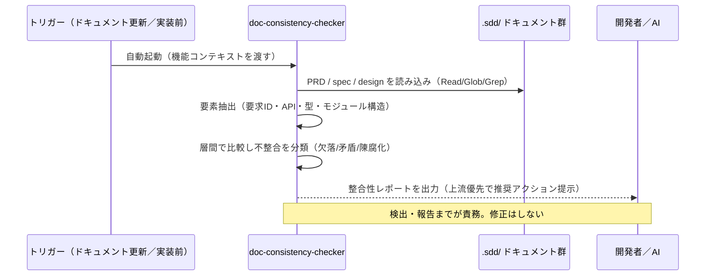

# ドキュメント間整合性チェック 抽象仕様書

**関連 Design Doc:** [doc-consistency-check_design.md](doc-consistency-check_design.md)
**関連 PRD:** [doc-consistency-check.md](../../requirement/quality-guardrails/doc-consistency-check.md)
**準拠する原則:** [CONSTITUTION.md](../../CONSTITUTION.md) の B-001（Vibe Coding 防止）, D-001（Specification-Driven）, B-002（多言語対応の一貫性）, A-001（Skills-First）, A-002（責務分離）

---

# 1. 背景 `<MUST>`

AI-SDD ワークフローでは、PRD（要求仕様書）・抽象仕様書（`*_spec.md`）・技術設計書（`*_design.md`）の
3 層のドキュメントが「真実の源（Single Source of Truth）」を形成する。上流ドキュメントを起点として
下流ドキュメントが派生し、要求 ID（UR/FR/NFR 等）による相互参照でトレーサビリティが保たれる構造である。

この 3 層構造は、更新のたびに層間の整合性が崩れやすい。具体的には、上流 PRD に定義された要求が
下流 spec に反映されない（参照欠落）、上流と下流で異なる内容が記述される（矛盾）、下流の変更が
上流に反映されない（陳腐化）といった不整合が発生する。またデータモデル・API 定義の齟齬や
用語の不統一も、ドキュメント体系の信頼性を損なう。

こうした不整合が放置されると、AI 実装者が誤ったドキュメントを真実として参照し、
仕様と実装の乖離（Vibe Coding 問題の再発）を招く。層間の不整合を人間の注意力に依存せず
自動的に検出する仕組みが必要である。

# 2. 概要 `<MUST>`

本機能は、ドキュメント更新時・実装前に AI が自動的に起動し、PRD ↔ `*_spec.md` ↔ `*_design.md`
（および design ↔ 実装）の層間の不整合を検出・報告する品質ゲートである。

**主要な設計原則:**

- **検出に専念し、自動修正しない** — 不整合の検出と報告までを責務とし、修正は開発者と AI の対話に委ねる。
  検証（レビュー）と生成の責務を分離する。
- **上流優先** — 不整合を検出した際は上流ドキュメントを優先（PRD > spec > design）し、
  一律に spec を正としない（実装が正で spec が古い場合もあるため）。
- **自動起動・直接呼び出し不可** — フック経由で自動実行される品質ゲートであり、ユーザーが直接呼び出す
  スキルではない（手動チェックが必要な場合は `/check-spec` を用いる）。
- **フラット構造・階層構造の両対応** — 親子関係（`index` と子機能）を考慮した整合性チェックを行う。
- **多言語対応** — `SDD_LANG` 環境変数に応じて EN/JA の出力テンプレートを切り替える。

**責務境界:** front matter の形式・依存方向・ID 一意性の検証は
[front-matter-validation.md](../../requirement/quality-guardrails/front-matter-validation.md)（`front-matter-reviewer` エージェント）が担い、
本機能はドキュメント本文の内容整合性に専念する。

# 3. 要求定義 `<RECOMMENDED>`

## 3.1. 機能要件 (Functional Requirements)

| ID     | 要件                                                                              | 優先度 | 根拠（上流要求）                                        |
|--------|---------------------------------------------------------------------------------|-----|-------------------------------------------------|
| FR-001 | ドキュメント更新時・実装前に AI が自動的に整合性チェックを起動する（ユーザー直接呼び出し不可）        | 必須  | PRD FR_001「トリガー方式: 自動」／ 親 UR_001（品質ゲートの自動適用） |
| FR-002 | PRD ↔ spec 間の要求 ID（UR/FR/NFR 等）参照欠落・機能要求カバレッジ・用語不統一を検出する        | 必須  | PRD FR_001／ 親 UR_003                            |
| FR-003 | spec ↔ design 間の API 定義齟齬・データモデル不一致・要求の設計判断への反映漏れ・制約考慮漏れを検出する | 必須  | PRD FR_001／ 親 UR_003                            |
| FR-004 | design ↔ 実装間のモジュール構造・インターフェース定義・技術スタックの齟齬を検出する            | 必須  | 親 UR_003（4 層の整合性維持）                             |
| FR-005 | 検出した不整合を「欠落 / 矛盾 / 陳腐化」に分類し、上流優先で報告する                       | 必須  | PRD FR_001（不整合検出）／ スコープ外（自動修正しない）              |
| FR-006 | フラット構造・階層構造の両方に対応し、階層構造では親子（`index` ↔ 子機能）関係も考慮する          | 必須  | 親 前提条件（`.sdd/` ディレクトリ構造）                        |
| FR-007 | 検出結果を所定の整合性レポート形式で出力する                                        | 必須  | PRD FR_001（不整合を報告する）                            |

## 3.2. 非機能要件 (Non-Functional Requirements) `<OPTIONAL>`

| ID      | カテゴリ   | 要件                                                              | 目標値                                       |
|---------|--------|-----------------------------------------------------------------|-------------------------------------------|
| NFR-001 | 安全性    | ドキュメント・実装を変更せず、読み取りのみで検証する（副作用なし）                | 書き込み系ツールを一切使用しない                     |
| NFR-002 | 移植性    | macOS / Linux で動作し、`SDD_LANG` による EN/JA 出力切り替えに対応する | 親 DC_004                                   |
| NFR-003 | 応答性    | フック起動を含む処理が開発フローの応答性を阻害しない                          | 親 NFR_001（フック処理の軽量性）                  |

# 4. 提供コンポーネント `<MUST>`

| 種別（skill/agent/hook/template） | 配置場所                                                          | 名前                     | 概要                                                       |
|------------------------------|---------------------------------------------------------------|------------------------|----------------------------------------------------------|
| skill                        | `skills/doc-consistency-checker/SKILL.md`                     | doc-consistency-checker | PRD ↔ spec ↔ design（+ design ↔ 実装）の内容整合性を自動検出する自動実行スキル |
| template                     | `skills/doc-consistency-checker/templates/{en,ja}/consistency_report.md` | consistency_report      | 整合性チェック結果の出力フォーマット（EN/JA）                        |
| reference                    | `skills/doc-consistency-checker/references/`                  | 参照資料群（detection_method / document_dependencies / directory_structure / prerequisites_directory_paths） | 検出手法・ドキュメント依存関係・ディレクトリ構造・パス解決の詳細補足        |

## 4.1. 入出力定義 `<OPTIONAL>`

**入力:** 本スキルはフック経由で自動起動される。ユーザー引数による直接呼び出しはできない（`user-invocable: false`）。

| 入力ソース          | 説明                                                          |
|:----------------|:--------------------------------------------------------------|
| 機能コンテキスト     | 現在作業中の機能（タスクまたはドキュメント更新から特定される）             |
| ドキュメントパス     | `SDD_*` 環境変数から自動解決される（`.sdd/requirement/`, `.sdd/specification/`） |
| `SDD_LANG`      | 出力テンプレートの言語（既定: `en`）                              |

**出力:** 整合性レポート（`templates/${SDD_LANG:-en}/consistency_report.md` 形式）。

- チェック対象ドキュメント一覧（PRD / spec / design のパスと最終更新日）
- チェック結果サマリー（PRD ↔ spec / spec ↔ design / design ↔ 実装 の整合・不整合と件数）
- 不整合の詳細（種別: 欠落 / 矛盾 / 陳腐化、上流・下流の該当箇所、推奨アクション）
- 整合確認済み項目
- 優先順位付き推奨アクション

# 5. 用語集 `<OPTIONAL>`

| 用語        | 説明                                                                              |
|-----------|---------------------------------------------------------------------------------|
| 欠落        | 上流ドキュメントに存在するが下流に反映されていない不整合                                          |
| 矛盾        | 上流と下流で異なる内容が記述されている不整合                                                 |
| 陳腐化       | 下流の変更が上流に反映されていない不整合                                                    |
| 上流優先      | 不整合検出時に PRD > spec > design の順で優先し、真実の源に近い層を基準とする方針                 |
| トレーサビリティ  | 要求 ID を介して PRD → spec → design → 実装 の派生関係を追跡できる性質                      |
| 自動実行スキル   | ユーザーが直接呼び出せず（`user-invocable: false`）、特定条件で AI が自動実行するスキル             |

# 6. 使用例 `<RECOMMENDED>`

本スキルは自動実行（`user-invocable: false`）のため、ユーザーが直接コマンドとして呼び出す使用例はない。
次のタイミングでフック経由・またはワークフロー内から自動起動される。

```
# タスク開始時   : 既存ドキュメントの存在と整合性を確認
# Plan 完了時    : spec ↔ design の整合性を確認
# 実装完了時     : design ↔ 実装 の整合性を確認
# レビュー時     : 全ドキュメント間の整合性を確認

# 手動で整合性チェックを行いたい場合は、別スキルを使用する
/check-spec           # 実装コードと design の整合性を手動チェック
```

# 7. 振る舞い図 `<OPTIONAL>`



# 8. 制約事項 `<OPTIONAL>`

- **読み取り専用:** ドキュメント・実装コードを変更しない。検出と報告に責務を限定する（自動修正はスコープ外）。
- **前提構造:** 対象プロジェクトで sdd-workflow プラグインが有効化され、`.sdd/` ディレクトリ構造
  （sdd-init による初期化）が存在すること。
- **責務分離:** front matter の形式・依存方向・ID 一意性の検証は `front-matter-reviewer` に委譲し、本機能は
  ドキュメント本文の内容整合性に専念する。
- **多言語:** 出力メッセージ・レポートは `SDD_LANG` に応じた EN/JA テンプレートに従い、ユーザーの
  グローバル言語設定で上書きしない（B-002）。

# 9. 原則との整合性 `<RECOMMENDED>`

| 原則ID  | 原則名                     | 本仕様への適用内容                                                              |
|-------|-------------------------|------------------------------------------------------------------------|
| B-001 | Vibe Coding 防止          | 層間の不整合を自動検出し、仕様書を真実の源として維持することで仕様と実装の乖離を防ぐ                |
| D-001 | Specification-Driven    | PRD → spec → design のトレーサビリティ（要求 ID 参照）を検証し、仕様駆動の構造を強制する         |
| B-002 | 多言語対応（EN/JA）の一貫性  | 出力レポートを `SDD_LANG` に応じた EN/JA テンプレートで切り替える                        |
| A-001 | Skills-First            | 本機能を skill（`doc-consistency-checker`）として提供する（legacy commands は用いない）    |
| A-002 | 責務分離                   | front matter 検証を `front-matter-reviewer` に委譲し、本機能は本文の内容整合性に専念する    |

---

# 10. PRD 整合性レビュー結果

本 spec は [doc-consistency-check.md](../../requirement/quality-guardrails/doc-consistency-check.md) の要求を以下のとおりカバーする。

| PRD 要求 ID              | 内容                                        | spec での対応              |
|:-----------------------|:------------------------------------------|:-----------------------|
| FR_001（子PRD内スコープ）    | PRD と spec と design 間の要求 ID 参照・用語の不整合を検出 | FR-001〜FR-007          |
| 親 UR_003              | PRD・仕様書・設計書・実装の整合性維持                   | FR-002〜FR-004          |
| 親 UR_001              | 品質ゲートの自動適用                              | FR-001                 |
| 親 NFR_001             | フック処理の軽量性                               | NFR-003                |
| 親 DC_004              | クロスプラットフォーム・多言語対応                       | NFR-002                |
| PRD スコープ外（自動修正しない） | 検出までを責務とし修正は開発者と AI の対話に委ねる          | NFR-001（読み取り専用・副作用なし） |

子PRD の FR_001 は親 PRD の UR_003（ドキュメント・実装間の整合性維持）から派生し、
親 PRD の全体要求図では FR_006 として定義される。
