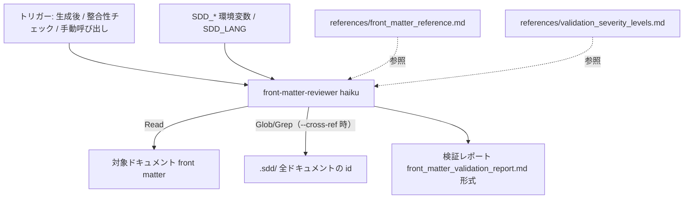

# front matter 検証 技術設計書

**関連 Spec:** [front-matter-validation_spec.md](front-matter-validation_spec.md)
**関連 PRD:** [front-matter-validation.md](../../requirement/quality-guardrails/front-matter-validation.md)
**準拠する原則:** [CONSTITUTION.md](../../CONSTITUTION.md) の B-001（Vibe Coding 防止）, B-002（多言語対応）, D-001（Specification-Driven）, T-002（plugin.json 登録）

---

# 1. 実装ステータス `<MUST>`

**ステータス:** 🟢 実装済み

## 1.1. 実装進捗 `<OPTIONAL>`

| モジュール/機能                       | ステータス | 備考                                                            |
|--------------------------------|--------|---------------------------------------------------------------|
| エージェント本体（プロンプト）             | 🟢     | `agents/front-matter-reviewer.md`（`model: haiku`）             |
| スキーマ・検証ルールの参照資料           | 🟢     | `references/front_matter_reference.md`                        |
| 重要度定義の参照資料                   | 🟢     | `references/validation_severity_levels.md`                    |
| 出力テンプレート（EN/JA）              | 🟢     | `templates/{en,ja}/front_matter_validation_report.md`         |
| 利用例                           | 🟢     | `examples/front_matter_reviewer_usage.md`                     |
| plugin.json への登録             | 🟢     | `.claude-plugin/plugin.json` の agents に登録済み（T-002）         |

---

# 2. 設計目標 `<MUST>`

- 明示的なチェックリストに基づく形式検証タスクとして、低コストモデル（haiku）で高精度・低コスト・低レイテンシを実現する（spec NFR-001 / PRD DC_003）。
- 読み取り専用（Read / Glob / Grep）に限定し、ドキュメントへの副作用を構造的に排除する（spec NFR-002）。
- `--cross-ref` 非指定時はプロジェクト横断走査をスキップし、単一/複数ドキュメント検証を高速に保つ（spec NFR-004）。
- `SDD_LANG` に応じた EN/JA 出力を一貫させる（spec NFR-003 / B-002）。
- エージェント本体を軽量に保ち、スキーマ・重要度定義・利用例は `references/` / `examples/` に外出しして参照時のみ読み込む。

---

# 3. 実装方式 `<MUST>`

| 領域（skill/agent/hook/script） | 採用方式                                        | 選定理由                                                                              |
|-----------------------------|---------------------------------------------|-----------------------------------------------------------------------------------|
| agent                       | Markdown プロンプト（`front-matter-reviewer.md`）  | 「YAML 抽出・値パターン照合・依存方向判定・ID 走査」の検証をレビューエージェントとして提供。生成（生成スキル）と検証（レビューエージェント）の責務を分離する |
| モデル                        | `model: haiku`                              | ルール基盤の形式検証は複雑推論を要さず、低コスト・低レイテンシで十分な精度を確保（spec NFR-001 / PRD DC_003） |
| ツール制約                     | `allowed-tools: Read, Glob, Grep, AskUserQuestion` | 読み取り専用に限定し書き込み系を持たせない。判断が必要な場合のみ `AskUserQuestion` で確認（spec NFR-002） |
| 委譲方針                      | Task ツール不使用・サブエージェント委譲なし             | 再帰探索によるコンテキスト爆発を回避。Read/Glob/Grep で必要ファイルを直接特定しコンテキスト効率を優先     |
| 横断チェックの分離               | `--cross-ref` オプションで有効化                   | ID 一意性・依存整合性はプロジェクト全体走査が必要なため既定では実行せず、指定時のみ実行して高速性を保つ（spec NFR-004） |
| 出力フォーマット                | `templates/{en,ja}/front_matter_validation_report.md` | B-002 に従い EN/JA を用意。ユーザーのグローバル言語設定で上書きせず `SDD_LANG` に従う                |
| 詳細情報の分割                  | `references/*.md` / `examples/*.md`         | エージェント本体を軽量化し、スキーマ・重要度定義・利用例は参照時のみ読み込む                          |

**責務分離（spec §2）:** 本エージェントは front matter（メタデータ）の検証に専念する。
ドキュメント本文の内容整合性は `doc-consistency-checker` スキルが担い、そこから full な front matter 検証が
必要な場合は本エージェント（`--cross-ref`）を別途起動する構成とする。

---

# 4. アーキテクチャ `<MUST>`

## 4.1. システム構成図



> 図中のパス（`.sdd/**` 等）は既定値による簡略表記であり、実際のパスは `SDD_*`
> 環境変数（`SDD_ROOT` / `SDD_REQUIREMENT_PATH` / `SDD_SPECIFICATION_PATH` / `SDD_TASK_PATH`）で解決される。

## 4.2. モジュール分割

| モジュール名                                | 責務                                                    | 依存関係                    | 配置場所                                                     |
|---------------------------------------|-------------------------------------------------------|-------------------------|----------------------------------------------------------|
| front-matter-reviewer.md              | 前提読込・検証手順（共通/種別固有/依存方向/横断）の統括・出力指示             | references, templates   | `agents/front-matter-reviewer.md`                        |
| references/front_matter_reference.md  | スキーマ定義・種別別フィールド・依存方向規則・検証チェックリスト・状態遷移・欠落ポリシー | —                       | `agents/references/front_matter_reference.md`            |
| references/validation_severity_levels.md | 重要度（error / warning / info）の定義                     | —                       | `agents/references/validation_severity_levels.md`        |
| templates/{en,ja}/front_matter_validation_report.md | 検証レポートの出力フォーマット（EN/JA）                      | 本体（`SDD_LANG` で選択）    | `agents/templates/{en,ja}/front_matter_validation_report.md` |
| examples/front_matter_reviewer_usage.md | 呼び出し例（単一 / 複数 / `--cross-ref`）                    | —                       | `agents/examples/front_matter_reviewer_usage.md`         |

## 4.3. 検証フロー

| ステップ | 処理                                       | 内容                                                                                      |
|:-----|:-----------------------------------------|:----------------------------------------------------------------------------------------|
| 1    | 参照読込                                    | `references/front_matter_reference.md` を読み、スキーマと検証ルールを把握                            |
| 2    | 対象読込                                    | 各対象パスを Read し、`---` 間の front matter ブロックを抽出。無ければ info を報告しスキップ（後方互換）        |
| 3    | 種別判定                                    | `type` フィールドとファイルパス（`SDD_*`）から種別を判定。type とファイル配置の不一致は error                    |
| 4    | 共通チェック                                 | 必須フィールド有無（error）／ `id` 形式（warning）／ `created`・`updated` の日付形式（warning）／ `depends-on` 方向（error） |
| 5    | 種別固有チェック                              | PRD: `priority`/`risk`、spec/design/task/impl-log: `sdd-phase`、design: `impl-status` の許容値（warning） |
| 6    | 横断チェック（`--cross-ref` 時のみ）           | Glob で全 `.md` を列挙 → Grep で `id:` 抽出 → ID レジストリ構築 → 重複（error）・`depends-on` 参照先の実在（error）を検証 |
| 7    | 出力                                       | `templates/${SDD_LANG:-en}/` のレポート形式で重要度付き結果と改善提案を出力                             |

---

# 5. データ構造 `<OPTIONAL>`

エージェントは中間データを永続化しないが、横断チェック時に構築する ID レジストリと
レポート生成時の不備レコードの論理構造は以下のとおり。

```json
{
  "id_registry": { "<id>": "<file-path>" },
  "issues": [
    {
      "document": ".sdd/specification/quality-guardrails/front-matter-validation_spec.md",
      "severity": "error | warning | info",
      "field": "id | type | status | created | updated | depends-on | priority | risk | sdd-phase | impl-status",
      "check": "required-field | id-format | type-correctness | status-validity | date-format | depends-on-direction | id-uniqueness | depends-on-integrity | ...",
      "message": "不備の要約",
      "recommendation": "改善提案"
    }
  ]
}
```

## 5.1. 検証ルール詳細（既存実装より）

**依存方向規則（error）:** `depends-on` は上流のみを指す。

```
prd ← spec (depends-on: ["prd-*"]) ← design (depends-on: ["spec-*"]) ← task (depends-on: ["design-*"])
                                                                       ← impl-log (depends-on: ["design-*"])
```

**種別別の必須フィールドと許容値:**

| 種別                | `id` パターン       | `status` 許容値                                     | 固有フィールド（許容値）                                              |
|:------------------|:------------------|:--------------------------------------------------|:-------------------------------------------------------------|
| prd               | `"prd-{name}"`    | draft / review / approved / deprecated            | `priority`（critical/high/medium/low）, `risk`（high/medium/low） |
| spec              | `"spec-{name}"`   | draft / review / approved / deprecated            | `sdd-phase: "specify"`                                       |
| design            | `"design-{name}"` | draft / review / approved / deprecated            | `sdd-phase: "plan"`, `impl-status`（not-implemented/in-progress/implemented） |
| task              | `"task-{name}"`   | pending / in-progress / completed / cancelled     | `sdd-phase: "tasks"`, `ticket`                              |
| implementation-log | `"impl-{name}"`   | in-progress / completed                           | `sdd-phase: "implement"`, `ticket`, `completed`, `implementer` |

**ID 一意性（`--cross-ref` / error）:** プロジェクト全体で `id` の重複を許さない。
**依存整合性（`--cross-ref` / error）:** `depends-on` に記載された全 ID が実在すること。

---

# 6. ファイル構成 `<OPTIONAL>`

```
plugins/sdd-workflow/
├── agents/
│   ├── front-matter-reviewer.md                        # エージェント本体（model: haiku）
│   ├── references/
│   │   ├── front_matter_reference.md                   # スキーマ・検証チェックリスト・依存方向規則
│   │   └── validation_severity_levels.md               # 重要度（error/warning/info）定義
│   ├── templates/
│   │   ├── en/front_matter_validation_report.md        # 検証レポート（EN）
│   │   └── ja/front_matter_validation_report.md        # 検証レポート（JA）
│   └── examples/
│       └── front_matter_reviewer_usage.md              # 呼び出し例
└── .claude-plugin/plugin.json                          # agents への登録（T-002）
```

---

# 7. 非機能要件実現方針 `<OPTIONAL>`

| 要件                          | 実現方針                                                                                     |
|-----------------------------|------------------------------------------------------------------------------------------|
| NFR-001（コスト最適化）          | `model: haiku` を指定。ルール基盤の形式検証はチェックリスト照合で完結し複雑推論を要さないため低コストモデルで十分（DC_003） |
| NFR-002（読み取り専用・副作用なし）  | `allowed-tools: Read, Glob, Grep, AskUserQuestion` に限定し、書き込み系（Write/Edit/Bash）を持たせない |
| NFR-003（多言語・クロスプラットフォーム）| 出力を `templates/${SDD_LANG:-en}/` から読み込み、パス解決を `SDD_*` 環境変数に統一（OS 依存の絶対パスを持たない） |
| NFR-004（応答性）             | `--cross-ref` 非指定時はプロジェクト横断走査をスキップ。Glob/Grep は `${SDD_ROOT}` 配下に限定し探索範囲を絞る |

---

# 8. テスト戦略 `<OPTIONAL>`

| テストレベル       | 対象                                                       | カバレッジ目標                                              |
|--------------|----------------------------------------------------------|------------------------------------------------------|
| デモンストレーション | 形式不正・依存方向逆転・ID 重複を仕込んだドキュメントを検証        | error/warning/info の分類と改善提案が正しく出力されること（PRD 検証方法: test に整合） |
| インスペクション   | エージェントの front matter（`model: haiku`, `allowed-tools`） | 低コストモデル指定・読み取り専用の制約が満たされていること              |
| 構文検証         | plugin.json への登録（plugin-lint / jq）                     | エージェントが `plugin.json` の agents に登録されていること（T-002） |

---

# 9. 設計判断 `<MUST>`

## 9.1. 決定事項

| 決定事項              | 選択肢                                  | 決定内容                        | 理由                                                                     |
|-------------------|--------------------------------------|-----------------------------|------------------------------------------------------------------------|
| 実装形態             | skill / agent / hook スクリプト          | レビューエージェント（agent）        | 生成と検証の責務を分離。検証はレビューとして生成スキルから独立して起動できる形が適切     |
| モデル選定            | opus / sonnet / haiku                | `haiku`                     | ルール基盤の形式検証は複雑推論を要さず、低コスト・低レイテンシで十分な精度（spec NFR-001 / DC_003） |
| ツール権限            | 読み書き可 / 読み取り専用                   | 読み取り専用（+ AskUserQuestion） | 検出専任・自動修正しない責務（spec §2）を構造的に保証                             |
| 横断チェックの扱い        | 常時実行 / オプション（`--cross-ref`）      | オプション化                     | ID 一意性・依存整合性は全走査が必要でコストが高い。既定は高速な単一検証に留める（spec NFR-004） |
| 委譲の扱い            | Task で再帰探索 / Read/Glob/Grep で完結    | Task 不使用                    | 再帰探索によるコンテキスト爆発を回避し、コンテキスト効率を優先                        |
| 欠落 front matter の扱い | error / info                        | info（違反としない）               | front matter はオプション（後方互換）。付与推奨を info で案内する（reference 欠落ポリシー） |

## 9.2. 未解決の課題 `<OPTIONAL>`

| 課題                                              | 影響度 | 対応方針                                                       |
|-------------------------------------------------|-----|------------------------------------------------------------|
| 自動起動のトリガー（生成後・整合性チェック時）の連携はエージェント単体で完結しない | 中   | 起動は呼び出し側（スキル／ワークフロー）が担い、本エージェントは起動後の検証に責務を限定する |
| `impl-status` の正確性はコード解析なしに断定できない場合がある      | 低   | 断定できない場合は error ではなく info として報告する（既存実装 Notes に明記）  |

---

# 10. 原則準拠チェックリスト `<RECOMMENDED>`

| 原則ID  | 原則名                    | 準拠状況 | 備考                                                          |
|-------|------------------------|------|-------------------------------------------------------------|
| B-001 | Vibe Coding 防止         | ✅   | front matter の機械的整合性を検証しトレーサビリティ基盤を維持              |
| B-002 | 多言語対応（EN/JA）の一貫性 | ✅   | `templates/{en,ja}/front_matter_validation_report.md` を用意し `SDD_LANG` で切替 |
| D-001 | Specification-Driven   | ✅   | `depends-on` の上流方向を検証しトレーサビリティ連鎖を保証                |
| T-002 | plugin.json 登録の徹底     | ✅   | エージェントは `plugin.json` の agents に登録済み                   |
| T-003 | 日本語出力の文字化け防止     | ✅   | JA テンプレートは文字化け・U+FFFD 混入なしを確認                       |
