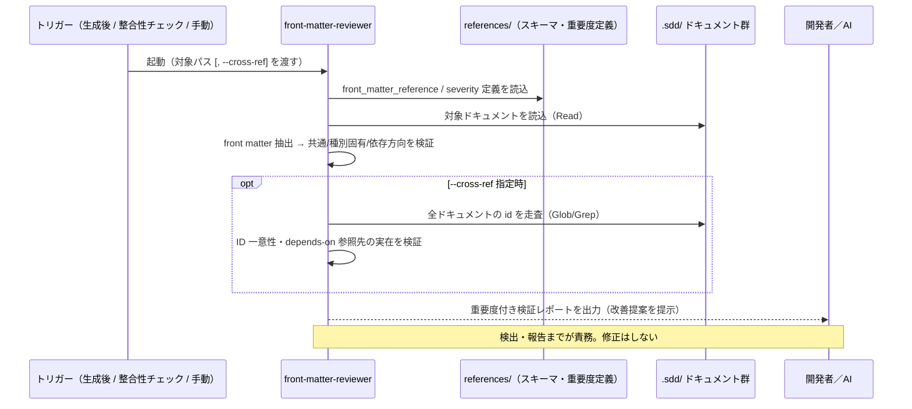

# front matter 検証 抽象仕様書

**関連 Design Doc:** [front-matter-validation_design.md](front-matter-validation_design.md)
**関連 PRD:** [front-matter-validation.md](../../requirement/quality-guardrails/front-matter-validation.md)
**準拠する原則:** [CONSTITUTION.md](../../CONSTITUTION.md) の B-001（Vibe Coding 防止）, B-002（多言語対応の一貫性）, D-001（Specification-Driven）

---

# 1. 背景

AI-SDD ドキュメント（PRD・spec・design・task・impl-log）の冒頭に付与される YAML front matter
（`id` / `type` / `status` / `depends-on` 等）は、機械的な検索・フィルタリングと依存関係追跡の基盤である。
`depends-on` による上流参照でトレーサビリティ連鎖（prd ← spec ← design ← task/impl-log）が表現され、
`id` はプロジェクト全体で一意な識別子として相互参照の起点になる。

この front matter に形式不正・依存方向の逆転（下流を参照する誤り）・ID 重複が混入すると、
ドキュメント体系の機械的整合性が損なわれ、下流の整合性チェックや検索が誤動作する。
front matter はオプション（後方互換）であるため人手で記述・更新されやすく、記述漏れや値の誤りが
発生しやすい。こうした不備を人間の注意力に依存せず自動的に検出する仕組みが必要である。

# 2. 概要

本機能は、AI-SDD ドキュメントの YAML front matter を検証し、フィールド形式・値の妥当性・
依存方向・ID 一意性の不備を検出・報告する品質ゲートである。ドキュメント生成後や整合性チェック時に
レビューとして自動起動されるほか、対象ドキュメントパスを引数に手動呼び出しもできる。

**主要な設計原則:**

- **ルール基盤の軽量検証** — 明示的なチェックリスト（フィールド有無・値パターン・許容値）に基づく
  形式検証であり、複雑な推論を要しない。低コストモデル（haiku）で十分な精度を確保する（PRD DC_003）。
- **検出に専念し、自動修正しない** — 不備の検出と改善提案までを責務とし、修正は開発者と AI の対話に委ねる。
- **後方互換** — front matter なしのドキュメントは違反ではなく info（付与の推奨）として扱う。
- **段階的なスコープ** — 単一/複数ドキュメントの検証を既定とし、プロジェクト横断の検証
  （ID 一意性・依存整合性）は `--cross-ref` オプション指定時のみ実行して高速性を保つ。
- **多言語対応** — `SDD_LANG` 環境変数に応じて EN/JA の出力テンプレートを切り替える。

**責務境界:** 本機能は front matter（メタデータ）の形式・依存方向・ID 一意性に専念する。
ドキュメント**本文**の内容整合性（要求 ID 参照・用語不統一等）は
[doc-consistency-check.md](../../requirement/quality-guardrails/doc-consistency-check.md) が担い、
ファイル名の命名規則検証は [naming-enforcement.md](../../requirement/quality-guardrails/naming-enforcement.md) が担う。

# 3. 要求定義

## 3.1. 機能要件 (Functional Requirements)

| ID     | 要件                                                                                   | 優先度 | 根拠（上流要求）                                    |
|--------|--------------------------------------------------------------------------------------|-----|---------------------------------------------|
| FR-001 | 対象ドキュメントの YAML front matter ブロックを抽出し、front matter がなければ info として報告し以降のチェックをスキップする | 必須  | PRD 前提条件（後方互換）／ Missing Front Matter Policy |
| FR-002 | 共通フィールド（`id` / `title` / `type` / `status` / `created` / `updated` / `depends-on`）の有無・形式・値を検証する | 必須  | PRD FR_001（形式検証）                            |
| FR-003 | ドキュメント種別（type）をフィールドとファイルパスから判定し、type とファイル配置の不一致を error として検出する | 必須  | PRD FR_001（形式検証）                            |
| FR-004 | 種別固有フィールドの許容値を検証する。`sdd-phase` は種別ごとの固定値（spec=`specify` / design=`plan` / task=`tasks` / impl-log=`implement`）、PRD は `priority`/`risk`、design は `impl-status` を対象とする。`impl-status` は許容値の形式検証に限定し、コードとの実態一致は判定困難時 info に留める | 必須  | PRD FR_001（値の妥当性）                           |
| FR-005 | `depends-on` が上流方向のみ（spec→prd, design→spec, task/impl-log→design）を指すことを検証し、逆転を error として検出する | 必須  | PRD FR_001（依存方向）／ 親 UR_003                  |
| FR-006 | `--cross-ref` 指定時、プロジェクト全体を走査し ID 一意性（重複禁止・error）と `depends-on` 参照先の実在（error）を検証する。あわせて status 整合性（上流 draft × 下流 approved を warning）・status 伝播（上流 status 変更時の下流レビュー要否を info）も検証する | 必須  | PRD FR_001（ID 一意性）／ 親 UR_003                |
| FR-007 | 検出結果を重要度（error / warning / info）付きで分類し、改善提案を添えて所定のレポート形式で出力する | 必須  | PRD FR_001（不備を検出・報告する）                      |

**重大度ポリシー:** 各チェックの重大度は次の原則に従う（詳細は design §4.3 に対応）。

- **error**（トレーサビリティ・機械的整合を破壊する構造的不備）: 必須フィールド欠落、`type` とファイル配置の不一致、`depends-on` の依存方向逆転、`--cross-ref` 時の ID 重複・`depends-on` 参照先の不在
- **warning**（潜在的問題・非標準値）: `id` 形式不一致、`created`/`updated` の日付形式不正、`status`/`sdd-phase`/`priority`/`risk` の許容値外、status 整合性の齟齬
- **info**（改善提案）: front matter の欠落（後方互換のため違反としない）、`impl-status` の実態一致（コード解析要）、status 伝播

## 3.2. 非機能要件 (Non-Functional Requirements)

| ID      | カテゴリ   | 要件                                                                       | 目標値                                |
|---------|--------|--------------------------------------------------------------------------|-------------------------------------|
| NFR-001 | コスト最適化 | ルール基盤の軽量検証に低コストモデル（haiku）を用い、複雑推論を要する検証とコスト階層を分離する | 親 DC_003 / PRD 検証方法（test） |
| NFR-002 | 安全性    | ドキュメントを変更せず、読み取りのみで検証する（副作用なし）                              | 書き込み系ツールを使用しない            |
| NFR-003 | 移植性    | macOS / Linux で動作し、`SDD_LANG` による EN/JA 出力切り替えに対応する         | 親 DC_004                           |
| NFR-004 | 応答性    | `--cross-ref` 非指定時はプロジェクト横断走査をスキップし検証を高速に保つ            | 親 NFR_001 の趣旨（軽量性の維持。500ms 定量基準はフックスクリプト向けで本エージェントに直接は適用されない） |

# 4. 提供コンポーネント

| 種別（skill/agent/hook/template） | 配置場所                                                        | 名前                             | 概要                                                    |
|------------------------------|-------------------------------------------------------------|--------------------------------|-------------------------------------------------------|
| agent                        | `agents/front-matter-reviewer.md`                           | front-matter-reviewer          | YAML front matter の形式・依存方向・ID 一意性を検証する haiku エージェント |
| template                     | `agents/templates/{en,ja}/front_matter_validation_report.md` | front_matter_validation_report | 検証レポートの出力フォーマット（EN/JA）                       |
| reference                    | `agents/references/front_matter_reference.md`               | front_matter_reference         | スキーマ定義・種別別フィールド・依存方向規則・検証チェックリスト・状態遷移・欠落ポリシー |
| reference                    | `agents/references/validation_severity_levels.md`           | validation_severity_levels     | 重要度（error / warning / info）の定義                   |
| example                      | `agents/examples/front_matter_reviewer_usage.md`            | front_matter_reviewer_usage    | エージェントの呼び出し例（単一 / 複数 / `--cross-ref`）        |

## 4.1. 入出力定義

**入力:**

| パラメータ            | 必須 | 説明                                                                 |
|:-----------------|:---|:-------------------------------------------------------------------|
| 対象ファイルパス（1 個以上） | 必須 | `.sdd/` 配下のドキュメントパス（PRD / spec / design / task / impl-log） |
| `--cross-ref`    | 任意 | プロジェクト横断チェック（ID 一意性・依存整合性）を有効化する                     |
| `SDD_LANG`       | 任意 | 出力テンプレートの言語（既定: `en`）                                     |
| `SDD_*` 環境変数    | 任意 | ディレクトリパス解決（`SDD_ROOT` / `SDD_REQUIREMENT_PATH` / `SDD_SPECIFICATION_PATH` / `SDD_TASK_PATH`） |

**出力:** front matter 検証レポート（`templates/${SDD_LANG:-en}/front_matter_validation_report.md` 形式）。

- 重要度（error / warning / info）付きの不備リスト
- 各不備に対する改善提案
- 実施したチェックのサマリー
- 重要度レベルの定義（レポート末尾）

# 5. 用語集

| 用語            | 説明                                                                            |
|---------------|-------------------------------------------------------------------------------|
| front matter  | ドキュメント冒頭の YAML メタデータ（`id` / `type` / `status` / `depends-on` 等）      |
| 依存方向          | `depends-on` が上流ドキュメントのみを指す規則（prd ← spec ← design ← task/impl-log）    |
| ID 一意性        | `id` がプロジェクト全体で重複しない性質                                              |
| クロスリファレンス     | `--cross-ref` で有効化するプロジェクト横断の検証（ID 一意性・`depends-on` 参照先の実在）    |
| 重要度（severity） | 検出した不備の深刻度分類（error / warning / info）                                  |
| 後方互換          | front matter なしの既存ドキュメントを違反とせず有効なまま扱う方針                          |

# 6. 使用例

```
# 単一ドキュメントの検証
front-matter-reviewer .sdd/requirement/user-login.md

# 複数ドキュメントの検証
front-matter-reviewer .sdd/specification/user-login_spec.md .sdd/specification/user-login_design.md

# プロジェクト横断チェック（ID 一意性・依存整合性）
front-matter-reviewer .sdd/specification/user-login_design.md --cross-ref
```

# 7. 振る舞い図



# 8. 制約事項

- **読み取り専用:** ドキュメントを変更しない。検出と改善提案の報告に責務を限定する（自動修正はスコープ外）。
- **探索スコープ:** Glob / Grep の走査は `${SDD_ROOT}`（既定 `.sdd/`）配下に限定し、範囲外を探索しない。
- **後方互換:** front matter なしは違反ではなく info として扱い、既存ドキュメントへの付与は明示要求時のみ。
- **委譲不使用:** Task ツールを使わず、他のサブエージェントへ委譲しない（コンテキスト効率のため Read/Glob/Grep で完結）。
- **多言語:** 出力レポートは `SDD_LANG` に応じた EN/JA テンプレートに従い、ユーザーのグローバル言語設定で上書きしない（B-002）。
- **responsibility:** 本文の内容整合性・命名規則検証はスコープ外（それぞれ doc-consistency-check / naming-enforcement が担う）。

# 9. 原則との整合性

| 原則ID  | 原則名                    | 本仕様への適用内容                                                            |
|-------|------------------------|----------------------------------------------------------------------|
| B-001 | Vibe Coding 防止         | front matter の機械的整合性を維持し、トレーサビリティ基盤の破綻による仕様乖離を防ぐ         |
| B-002 | 多言語対応（EN/JA）の一貫性 | 出力レポートを `SDD_LANG` に応じた EN/JA テンプレートで切り替える                     |
| D-001 | Specification-Driven   | `depends-on` の上流方向を検証し、prd → spec → design のトレーサビリティ連鎖を保証する    |

# 10. PRD 整合性レビュー結果

本 spec は [front-matter-validation.md](../../requirement/quality-guardrails/front-matter-validation.md) の要求を以下のとおりカバーする。

| PRD 要求 ID           | 内容                                        | spec での対応              |
|:--------------------|:------------------------------------------|:-----------------------|
| FR_001（子PRD内スコープ） | front matter の形式・依存方向・ID 一意性を検証する | FR-001〜FR-007          |
| 親 UR_003           | ドキュメント・実装間の整合性維持                   | FR-005, FR-006         |
| 親 DC_003           | ルール基盤の軽量検証に低コストモデルを使用           | NFR-001                |
| 親 NFR_001          | フック処理の軽量性                             | NFR-004（横断走査の抑制）    |
| 親 DC_004           | クロスプラットフォーム・多言語対応                   | NFR-003                |
| PRD スコープ外（自動修正しない）| 検出・報告までを責務とし修正は対話に委ねる          | NFR-002（読み取り専用・副作用なし） |

子PRD の FR_001 は親 PRD の UR_003（ドキュメント・実装間の整合性維持）から派生し、
親 PRD の全体要求図では FR_007 として定義される。
