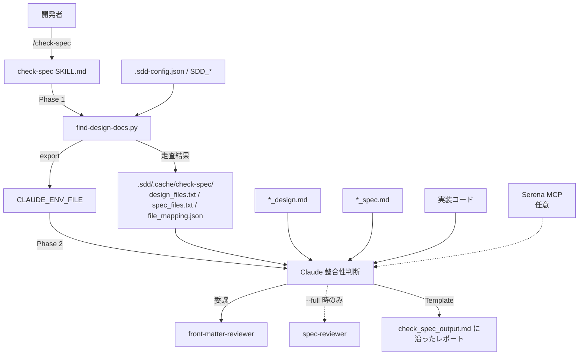

# 実装と設計の整合性チェック

**関連 Spec:** [impl-spec-check_spec.md](impl-spec-check_spec.md)
**関連 PRD:** [impl-spec-check.md](../../requirement/quality-guardrails/impl-spec-check.md)
**準拠する原則:** [CONSTITUTION.md](../../CONSTITUTION.md) の B-001, A-001, A-002, B-002, D-002, T-002, T-003

---

# 1. 実装ステータス

**ステータス:** 🟢 実装済み

本設計書は既存実装 `plugins/sdd-workflow/skills/check-spec/` を真実の源として逆算した設計記述である。

## 1.1. 実装進捗

| モジュール/機能                              | ステータス | 備考                                                        |
|---------------------------------------|--------|-----------------------------------------------------------|
| `check-spec` スキルプロンプト（SKILL.md）       | 🟢     | 処理フロー・チェック項目・分類・出力を定義                          |
| `find-design-docs.py`（Phase 1 走査）     | 🟢     | フラット/階層構造の探索・マッピング生成・環境変数エクスポート            |
| 出力テンプレート `check_spec_output.md`（en/ja） | 🟢     | EN / JA の両方を提供                                        |
| `front-matter-reviewer` 連携            | 🟢     | front matter / impl-status 検証を委譲                       |
| `spec-reviewer` 連携（`--full`）          | 🟢     | ドキュメント間整合性・品質レビューを委譲                          |
| Serena MCP 連携                         | 🟢     | 任意。未設定時は Grep / Glob へフォールバック                    |

---

# 2. 設計目標

1. **design ↔ 実装の乖離を高精度に検出する**: API シグネチャ・型定義・モジュール構成・機能実装・
   リテラル値・技術スタックの各観点で乖離を検出し、重大度で分類して報告する（spec FR-003〜FR-005）。
2. **決定的処理とAI判断の分離**: ファイル走査・マッピングという決定的処理を Shell スクリプトへ委譲し、
   Claude はトークンを判断・比較・報告に集中させる（A-002）。
3. **責務の分離**: design ↔ 実装に特化し、ドキュメント間整合性（PRD ↔ spec ↔ design）と品質レビューは
   専門エージェントへ委譲する（spec FR-006, FR-007）。
4. **読み取り専用の安全性**: 実装・ドキュメントを一切変更せず、検出・報告に徹する（spec NFR-001）。
5. **多言語・クロスプラットフォーム対応**: `SDD_LANG` による EN / JA 切り替えと Python 標準ライブラリによる cross-platform 動作を維持する
   （B-002 / spec NFR-002, NFR-003）。

---

# 3. 実装方式

| 領域（skill/agent/hook/script） | 採用方式                                             | 選定理由                                                                              |
|-----------------------------|--------------------------------------------------|-----------------------------------------------------------------------------------|
| skill                       | Markdown プロンプト（`SKILL.md`）+ 2 フェーズ実行         | 整合性チェックは意味論的判断を伴うため Claude のプロンプトで記述。決定的走査はスクリプトへ分離（A-002） |
| script                      | Python スクリプト（`find-design-docs.py`、標準ライブラリのみ） | ファイル探索・JSON マッピング生成・環境変数エクスポートは決定的処理でありスクリプト化が最適（A-002）。`pathlib` / `json` で cross-platform |
| 設定解決                     | `.sdd-config.json` + `SDD_*` 環境変数              | プロジェクトごとのディレクトリ構成に追従。`json` 標準ライブラリで解析（外部依存なし）   |
| agent 連携                   | `front-matter-reviewer`（常時）/ `spec-reviewer`（`--full`） | front matter 検証・品質レビューは既存の専門エージェントへ委譲し責務を分離                     |
| template                    | `templates/{en,ja}/check_spec_output.md`         | 出力フォーマットを言語別に外部化（B-002）                                              |
| コマンド形態                  | `skills/`（legacy `commands/` は不使用）             | Skills-First 原則（A-001）                                                          |

---

# 4. アーキテクチャ

## 4.1. システム構成図



## 4.2. モジュール分割

| モジュール名                   | 責務                                                                       | 依存関係                              | 配置場所                                                  |
|--------------------------|--------------------------------------------------------------------------|-----------------------------------|-------------------------------------------------------|
| `check-spec` SKILL.md    | 入力解釈・処理フロー制御・チェック項目定義・分類・出力指示                          | find-design-docs.py, テンプレート, 連携エージェント | `skills/check-spec/SKILL.md`                          |
| `find-design-docs.py`    | design/spec ファイルの探索、`file_mapping.json` 生成、`CHECK_SPEC_*` 環境変数エクスポート | `.sdd-config.json`（`json` 標準ライブラリ） | `skills/check-spec/scripts/find-design-docs.py`       |
| 出力テンプレート               | チェック結果レポートのフォーマット定義                                          | -                                 | `skills/check-spec/templates/{en,ja}/check_spec_output.md` |
| 参照ドキュメント群             | 前提条件（プラグイン更新確認・原則・パス解決）・ドキュメント依存関係の記述                | -                                 | `skills/check-spec/references/*.md`                   |
| 利用例                     | スコープ確認・Serena シンボル解析の出力例                                       | -                                 | `skills/check-spec/examples/*.md`                     |

---

# 5. データ構造

## 5.1. `find-design-docs.py` が生成するファイルマッピング（`file_mapping.json`）

```json
{
  "design_documents": [
    {
      "design": ".sdd/specification/quality-guardrails/impl-spec-check_design.md",
      "spec": ".sdd/specification/quality-guardrails/impl-spec-check_spec.md",
      "feature_name": "impl-spec-check"
    }
  ]
}
```

## 5.2. `$CLAUDE_ENV_FILE` へエクスポートされる環境変数

```bash
export CHECK_SPEC_CACHE_DIR="<PROJECT_ROOT>/.sdd/.cache/check-spec"
export CHECK_SPEC_DESIGN_FILES="<CACHE>/design_files.txt"
export CHECK_SPEC_SPEC_FILES="<CACHE>/spec_files.txt"
export CHECK_SPEC_MAPPING="<CACHE>/file_mapping.json"
```

## 5.3. Schema Registry（値域・閾値レジストリ）のエントリ構造（`*_spec.md` を解析）

```
{value-id, value, unit, source-requirement-id, section}
```

---

# 6. ファイル構成

```
plugins/sdd-workflow/
├── skills/check-spec/
│   ├── SKILL.md                              # スキルプロンプト本体
│   ├── scripts/
│   │   └── find-design-docs.py               # Phase 1: 走査・マッピング・エクスポート
│   ├── templates/
│   │   ├── en/check_spec_output.md           # 出力フォーマット（EN）
│   │   └── ja/check_spec_output.md           # 出力フォーマット（JA）
│   ├── references/
│   │   ├── document_dependencies.md          # ドキュメント依存関係と検証方向
│   │   ├── prerequisites_directory_paths.md  # SDD_* パス解決
│   │   ├── prerequisites_plugin_update.md    # プラグイン更新確認
│   │   └── prerequisites_principles.md       # AI-SDD 原則の読み込み
│   └── examples/
│       ├── scope_confirmation.md             # 引数なし実行時の範囲確認例
│       └── serena_symbol_analysis.md         # Serena シンボル解析の出力例
└── .claude-plugin/plugin.json                # スキル登録（T-002）
```

> `references/*.md` は複数スキルで共有される参照ドキュメントの symlink（実体は共有ディレクトリ）。
> `plugin.json` は `"skills": "./skills"` によりディレクトリ単位でスキルを自動登録する（T-002）。

---

# 7. 非機能要件実現方針

| 要件（spec）                | 実現方針                                                                                       |
|-------------------------|--------------------------------------------------------------------------------------------|
| NFR-001（読み取り専用の安全性）  | SKILL.md front matter で `allowed-tools: Read, Glob, Grep, AskUserQuestion, Bash`、`disallowed-tools: Write, Edit` を宣言 |
| NFR-002（多言語対応）        | 出力を `templates/${SDD_LANG:-en}/check_spec_output.md` から選択。EN / JA の両テンプレートを配置    |
| NFR-003（移植性）          | `find-design-docs.py` を Python 標準ライブラリ（`pathlib` / `json`）で記述し、外部コマンド非依存で macOS / Linux / Windows に対応  |
| NFR-004（効率性）          | Phase 1 の 1 回のスクリプト実行に走査を集約し、Claude の Glob / Grep 反復を削減（A-002）              |

---

# 8. テスト戦略

| テストレベル       | 対象                                                          | カバレッジ目標                                    |
|--------------|-------------------------------------------------------------|--------------------------------------------|
| 単体テスト      | `find-design-docs.py`                                       | `tests/test_check_spec_constitution_scripts.py`（pytest）を通過 |
| Lint         | `SKILL.md`（プロンプト内コードブロック・命名規則）                    | `plugin-lint.sh` を通過                       |
| デモンストレーション | `/check-spec` 実行による乖離検出（PRD FR_001 の検証方法）             | 意図的に乖離を作った design/実装で Critical/Warning を検出 |
| 手動検証        | フラット構造・階層構造・引数なし・`--full` の各分岐                    | 各分岐で対象ファイルが正しく特定されレポートが生成される       |

---

# 9. 設計判断

## 9.1. 決定事項

| 決定事項                     | 選択肢                                          | 決定内容                                       | 理由                                                                                       |
|--------------------------|----------------------------------------------|--------------------------------------------|------------------------------------------------------------------------------------------|
| トリガー方式                  | フック自動発火 / 手動スキル呼び出し                    | 手動スキル呼び出し（`/check-spec`）              | 整合性チェックは実行コストが高く任意タイミングで行うべき。PRD FR_001 の手動トリガー方式に準拠           |
| ファイル走査の担い手            | Claude の Glob/Grep / Shell スクリプト             | Shell スクリプト（`find-design-docs.py`）        | 決定的操作はスクリプトに委譲しトークンを節約（A-002）                                            |
| 自動修正の有無                | 検出のみ / 検出 + 自動修正                          | 検出・報告のみ                                | 修正判断は開発者と AI の対話に委ねる。子 PRD スコープ外。読み取り専用で安全性を担保              |
| ドキュメント間整合性の扱い        | 本スキルで実施 / 専門エージェントへ委譲                  | `--full` 時に `spec-reviewer` へ委譲            | design↔実装に責務を特化。品質レビューは既存エージェントを再利用（責務の分離）                    |
| リテラル値の権威的定義           | design 本文のみ / spec の Schema Registry 優先      | spec の Schema Registry を優先し、なければ本文抽出   | 値の真実の源を spec に一元化しトレーサビリティを確保                                            |
| 値比較の正規化                | 表記そのまま比較 / 等価表現を正規化                     | 正規化してから比較（例示: `70%`↔`0.7`、`15s`↔`15000ms`。本機能自体の閾値ではない） | 表記差による誤検出を防ぐ。報告は各層の元表記で行う                                             |
| シンボル解析                 | 常時 Serena 必須 / 任意連携                         | 任意連携（未設定時は Grep/Glob フォールバック）        | Serena 非導入環境でも言語非依存で動作させる                                                    |
| 本設計書の位置づけ             | 実装より先行 / 実装からの逆算                         | 既存実装からの逆算記述とし、以降は design を真実の源とする | 本機能自体が「実装 ↔ design の乖離検出」であるため実装が先行した特殊ケース。逆算後は通常の SDD（design が真実の源）に戻し、D-001 の例外プロセスに従い記録 |

## 9.2. 未解決の課題

| 課題                                            | 影響度 | 対応方針                                                          |
|-----------------------------------------------|-----|---------------------------------------------------------------|
| テキストベース検索（Grep/Glob）は言語によって精度が変動する         | 中   | Serena MCP 連携時にシンボル解析で補完。将来的に対応言語のガイドを拡充     |
| リテラル値の等価判定は既知の単位変換パターンに依存する            | 低   | 未知の単位・表記は Info として報告し、正規化ルールを段階的に追加            |

---

# 10. 原則準拠チェックリスト

| 原則ID | 原則名                          | 準拠状況 | 備考                                                              |
|-------|-------------------------------|------|-----------------------------------------------------------------|
| A-001 | Skills-First                    | ✅   | `skills/check-spec/` として実装。legacy `commands/` 不使用           |
| A-002 | フックとスクリプトの責務分離        | ✅   | Phase 1 を `find-design-docs.py` に委譲、Phase 2 で Claude が判断     |
| B-001 | Vibe Coding 防止                | ✅   | 設計書を真実の源とし、実装との乖離を検出して仕様駆動を維持              |
| B-002 | 多言語対応（EN/JA）の一貫性        | ✅   | `templates/{en,ja}/check_spec_output.md` を提供                    |
| D-002 | ファイル命名規則の厳守             | ✅   | `_spec.md` / `_design.md` サフィックス前提でファイルを特定             |
| T-002 | plugin.json 登録の徹底            | ✅   | `check-spec` スキルは `plugin.json` に登録済み                       |
| T-003 | 日本語出力の文字化け防止           | ✅   | JA テンプレート・本設計書ともに U+FFFD / mojibake の混入なし           |
