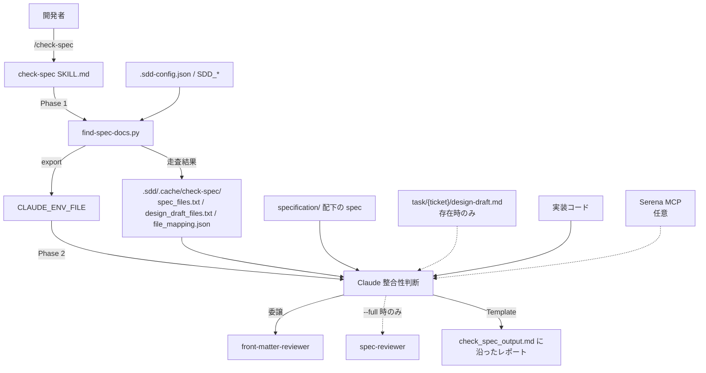

# 実装と仕様の整合性チェック

**関連 Spec:** [impl-spec-check_spec.md](impl-spec-check_spec.md)
**関連 PRD:** [impl-spec-check.md](../../requirement/quality-guardrails/impl-spec-check.md)
**準拠する原則:** [CONSTITUTION.md](../../CONSTITUTION.md) の B-001, A-001, A-002, B-002, D-001, D-002, T-002, T-003

---

# 1. 実装ステータス

**ステータス:** 🟢 実装済み

本設計書は既存実装 `plugins/sdd-workflow/skills/check-spec/` を真実の源として逆算した設計記述である。

## 1.1. 実装進捗

| モジュール/機能                              | ステータス | 備考                                                        |
|---------------------------------------|--------|-----------------------------------------------------------|
| `check-spec` スキルプロンプト（SKILL.md）       | 🟢     | 処理フロー・チェック項目・分類・出力を定義                          |
| `find-spec-docs.py`（Phase 1 走査）       | 🟢     | spec のフラット/階層構造の探索・設計ドラフト収集・マッピング生成・環境変数エクスポート |
| 出力テンプレート `check_spec_output.md`（en/ja） | 🟢     | EN / JA の両方を提供                                        |
| `front-matter-reviewer` 連携            | 🟢     | front matter / impl-status 検証を委譲                       |
| `spec-reviewer` 連携（`--full`）          | 🟢     | ドキュメント間整合性・品質レビューを委譲                          |
| Serena MCP 連携                         | 🟢     | 任意。未設定時は Grep / Glob へフォールバック                    |

---

# 2. 設計目標

1. **spec ↔ 実装の乖離を高精度に検出する**: 公開 API シグネチャ・データモデル・振る舞い・機能実装・
   リテラル値の各観点で乖離を検出し、重大度で分類して報告する（spec FR-003〜FR-005）。モジュール構成・
   技術スタックは設計ドラフトが存在する場合に限り比較する（spec FR-009）。
2. **決定的処理とAI判断の分離**: ファイル走査・マッピングという決定的処理を Shell スクリプトへ委譲し、
   Claude はトークンを判断・比較・報告に集中させる（A-002）。
3. **責務の分離**: spec ↔ 実装に特化し、ドキュメント間整合性（PRD ↔ spec ↔ adr）と品質レビューは
   専門エージェントへ委譲する（spec FR-006, FR-007）。
4. **読み取り専用の安全性**: 実装・ドキュメントを一切変更せず、検出・報告に徹する（spec NFR-001）。
5. **多言語・クロスプラットフォーム対応**: `SDD_LANG` による EN / JA 切り替えと Python 標準ライブラリによる cross-platform 動作を維持する
   （B-002 / spec NFR-002, NFR-003）。

---

# 3. 実装方式

| 領域（skill/agent/hook/script） | 採用方式                                             | 選定理由                                                                              |
|-----------------------------|--------------------------------------------------|-----------------------------------------------------------------------------------|
| skill                       | Markdown プロンプト（`SKILL.md`）+ 2 フェーズ実行         | 整合性チェックは意味論的判断を伴うため Claude のプロンプトで記述。決定的走査はスクリプトへ分離（A-002） |
| script                      | Python スクリプト（`find-spec-docs.py`、標準ライブラリのみ）   | ファイル探索・JSON マッピング生成・環境変数エクスポートは決定的処理でありスクリプト化が最適（A-002）。`pathlib` / `json` で cross-platform |
| 設定解決                     | `hook_common.load_sdd_paths`（`.sdd-config.json` + `SDD_*` 環境変数） | プロジェクトごとのディレクトリ構成に追従。フックと同じ共有リーダーを使い、`.sdd-config.json` のスキーマ知識をスキル側に複製しない |
| 走査・命名規則                | 共有モジュール（`doc_walker` / `naming`）に委譲          | 「specification/ 配下のどの `.md` が spec か」の分類ルールを単一定義源（`naming.is_design_stem`）に集約し、フック側の spec 探索（`doc_walker.find_spec_doc`）と食い違わないようにする |
| agent 連携                   | `front-matter-reviewer`（常時）/ `spec-reviewer`（`--full`） | front matter 検証・品質レビューは既存の専門エージェントへ委譲し責務を分離                     |
| template                    | `templates/{en,ja}/check_spec_output.md`         | 出力フォーマットを言語別に外部化（B-002）                                              |
| コマンド形態                  | `skills/`（legacy `commands/` は不使用）             | Skills-First 原則（A-001）                                                          |

---

# 4. アーキテクチャ

## 4.1. システム構成図


```mermaid
graph TD
    Dev[開発者] -->|/check-spec| Skill[check-spec SKILL.md]
    Skill -->|Phase 1| Script[find-spec-docs.py]
    Config[.sdd-config.json / SDD_*] --> Script
    Script -->|走査結果| Cache[".sdd/.cache/check-spec/<br/>spec_files.txt / design_draft_files.txt / file_mapping.json"]
    Script -->|export| Env[CLAUDE_ENV_FILE]
    Env -->|Phase 2| Claude[Claude 整合性判断]
    Cache --> Claude
    Spec["specification/ 配下の spec"] --> Claude
    Draft["task/{ticket}/design-draft.md<br/>存在時のみ"] -.-> Claude
    Impl[実装コード] --> Claude
    Claude -->|委譲| FMR[front-matter-reviewer]
    Claude -.->|--full 時のみ| SR[spec-reviewer]
    Claude -->|Template| Report[check_spec_output.md に沿ったレポート]
    Serena[Serena MCP<br/>任意] -.-> Claude
```

## 4.2. モジュール分割

| モジュール名                   | 責務                                                                       | 依存関係                              | 配置場所                                                  |
|--------------------------|--------------------------------------------------------------------------|-----------------------------------|-------------------------------------------------------|
| `check-spec` SKILL.md    | 入力解釈・処理フロー制御・チェック項目定義・分類・出力指示                          | find-spec-docs.py, テンプレート, 連携エージェント | `skills/check-spec/SKILL.md`                          |
| `find-spec-docs.py`      | spec ファイルの探索、設計ドラフトの収集、`file_mapping.json` 生成、`CHECK_SPEC_*` 環境変数エクスポート | 共有モジュール（`hook_common.load_sdd_paths` / `doc_walker` / `naming` / `env_export`） | `skills/check-spec/scripts/find-spec-docs.py`         |
| 出力テンプレート               | チェック結果レポートのフォーマット定義                                          | -                                 | `skills/check-spec/templates/{en,ja}/check_spec_output.md` |
| 参照ドキュメント群             | 前提条件（プラグイン更新確認・原則・パス解決）・ドキュメント依存関係の記述                | -                                 | `skills/check-spec/references/*.md`                   |
| 利用例                     | スコープ確認・Serena シンボル解析の出力例                                       | -                                 | `skills/check-spec/examples/*.md`                     |

---

# 5. データ構造

## 5.1. `find-spec-docs.py` が生成するファイルマッピング（`file_mapping.json`）

`spec_documents` が第一級の比較基準、`design_drafts` は存在する場合のみ非空になる補助入力。
`design`（v4.x 由来の永続 `{feature}_design.md`）も存在する場合のみ非空になる。

```json
{
  "spec_documents": [
    {
      "spec": ".sdd/specification/quality-guardrails/impl-spec-check_spec.md",
      "feature_name": "impl-spec-check",
      "design": ".sdd/specification/quality-guardrails/impl-spec-check_design.md"
    }
  ],
  "design_drafts": [".sdd/task/90/design-draft.md"]
}
```

## 5.2. `$CLAUDE_ENV_FILE` へエクスポートされる環境変数

```bash
export CHECK_SPEC_CACHE_DIR="<PROJECT_ROOT>/.sdd/.cache/check-spec"
export CHECK_SPEC_SPEC_FILES="<CACHE>/spec_files.txt"
export CHECK_SPEC_DESIGN_DRAFT_FILES="<CACHE>/design_draft_files.txt"
export CHECK_SPEC_MAPPING="<CACHE>/file_mapping.json"
```

## 5.3. Schema Registry（値域・閾値レジストリ）のエントリ構造（`*_spec.md` を解析）

```
{value-id, value, unit, source-requirement-id, section}
```

---

# 6. ファイル構成

```
plugins/sdd-workflow/
├── skills/check-spec/
│   ├── SKILL.md                              # スキルプロンプト本体
│   ├── scripts/
│   │   └── find-spec-docs.py                 # Phase 1: 走査・マッピング・エクスポート
│   ├── templates/
│   │   ├── en/check_spec_output.md           # 出力フォーマット（EN）
│   │   └── ja/check_spec_output.md           # 出力フォーマット（JA）
│   ├── references/
│   │   ├── document_dependencies.md          # ドキュメント依存関係と検証方向
│   │   ├── prerequisites_directory_paths.md  # SDD_* パス解決
│   │   ├── prerequisites_plugin_update.md    # プラグイン更新確認
│   │   └── prerequisites_principles.md       # AI-SDD 原則の読み込み
│   └── examples/
│       ├── scope_confirmation.md             # 引数なし実行時の範囲確認例
│       └── serena_symbol_analysis.md         # Serena シンボル解析の出力例
└── .claude-plugin/plugin.json                # skills は宣言せず標準パスの自動検出に委ねる（T-002）
```

> `references/*.md` は複数スキルで共有される参照ドキュメントの symlink（実体は共有ディレクトリ）。
> スキルは標準パス `skills/` の自動検出で読み込まれ、`plugin.json` に `skills` を宣言しない（T-002）。

---

# 7. 非機能要件実現方針

| 要件（spec）                | 実現方針                                                                                       |
|-------------------------|--------------------------------------------------------------------------------------------|
| NFR-001（読み取り専用の安全性）  | SKILL.md front matter で `disallowed-tools: Write, Edit` により書き込みを禁止。`allowed-tools`（事前承認）の `Bash` は `Bash(python3 "${CLAUDE_PLUGIN_ROOT}/skills/check-spec/scripts/find-spec-docs.py" *)` と指定子で同梱スクリプトの実行のみに絞る |
| NFR-002（多言語対応）        | 出力を `templates/${SDD_LANG:-en}/check_spec_output.md` から選択。EN / JA の両テンプレートを配置    |
| NFR-003（移植性）          | `find-spec-docs.py` を Python 標準ライブラリ（`pathlib` / `json`）で記述し、外部コマンド非依存で macOS / Linux / Windows に対応  |
| NFR-004（効率性）          | Phase 1 の 1 回のスクリプト実行に走査を集約し、Claude の Glob / Grep 反復を削減（A-002）              |

---

# 8. テスト戦略

| テストレベル       | 対象                                                          | カバレッジ目標                                    |
|--------------|-------------------------------------------------------------|--------------------------------------------|
| 単体テスト      | `find-spec-docs.py`                                         | `tests/test_check_spec_constitution_scripts.py`（pytest）を通過 |
| Lint         | `SKILL.md`（プロンプト内コードブロック・命名規則）                    | `plugin-lint.sh` を通過                       |
| デモンストレーション | `/check-spec` 実行による乖離検出（PRD FR_001 の検証方法）             | 意図的に乖離を作った spec/実装で Critical/Warning を検出 |
| 手動検証        | フラット構造・階層構造・引数なし・`--full`・設計ドラフト有無の各分岐      | 各分岐で対象ファイルが正しく特定されレポートが生成される       |

---

# 9. 設計判断

## 9.1. 決定事項

| 決定事項                     | 選択肢                                          | 決定内容                                       | 理由                                                                                       |
|--------------------------|----------------------------------------------|--------------------------------------------|------------------------------------------------------------------------------------------|
| トリガー方式                  | フック自動発火 / 手動スキル呼び出し                    | 手動スキル呼び出し（`/check-spec`）              | 整合性チェックは実行コストが高く任意タイミングで行うべき。PRD FR_001 の手動トリガー方式に準拠           |
| ファイル走査の担い手            | Claude の Glob/Grep / Shell スクリプト             | Shell スクリプト（`find-spec-docs.py`）          | 決定的操作はスクリプトに委譲しトークンを節約（A-002）                                            |
| 自動修正の有無                | 検出のみ / 検出 + 自動修正                          | 検出・報告のみ                                | 修正判断は開発者と AI の対話に委ねる。子 PRD スコープ外。読み取り専用で安全性を担保              |
| ドキュメント間整合性の扱い        | 本スキルで実施 / 専門エージェントへ委譲                  | `--full` 時に `spec-reviewer` へ委譲            | spec↔実装に責務を特化。品質レビューは既存エージェントを再利用（責務の分離）                      |
| 比較基準のドキュメント           | 永続 design / spec / 設計ドラフト                    | spec を第一級の基準とし、設計ドラフトは存在時のみ補助    | Design Doc は `task/{ticket-number}/design-draft.md` の一時ドラフトで実装完了後に削除されるため恒久的な比較基準にできない。spec は永続ドキュメントであり真実の源として安定している |
| 設計ドラフト不在時の扱い          | WARNING / エラー / 正常系                          | 正常系（ログのみ、警告なし）                       | 実装完了後は不在が通常状態であり、警告を出すと恒常的なノイズになる                              |
| リテラル値の権威的定義           | 設計ドラフト本文のみ / spec の Schema Registry 優先   | spec の Schema Registry を優先し、なければ本文抽出   | 値の真実の源を spec に一元化しトレーサビリティを確保                                            |
| 値比較の正規化                | 表記そのまま比較 / 等価表現を正規化                     | 正規化してから比較（例示: `70%`↔`0.7`、`15s`↔`15000ms`。本機能自体の閾値ではない） | 表記差による誤検出を防ぐ。報告は各層の元表記で行う                                             |
| シンボル解析                 | 常時 Serena 必須 / 任意連携                         | 任意連携（未設定時は Grep/Glob フォールバック）        | Serena 非導入環境でも言語非依存で動作させる                                                    |
| 本設計書の位置づけ             | 実装より先行 / 実装からの逆算                         | 既存実装からの逆算記述とし、以降は spec を真実の源とする   | 本機能自体が「実装 ↔ spec の乖離検出」であるため実装が先行した特殊ケース。逆算後は通常の SDD（spec が真実の源）に戻し、D-001 の例外プロセスに従い記録 |

## 9.2. 未解決の課題

| 課題                                            | 影響度 | 対応方針                                                          |
|-----------------------------------------------|-----|---------------------------------------------------------------|
| テキストベース検索（Grep/Glob）は言語によって精度が変動する         | 中   | Serena MCP 連携時にシンボル解析で補完。将来的に対応言語のガイドを拡充     |
| リテラル値の等価判定は既知の単位変換パターンに依存する            | 低   | 未知の単位・表記は Info として報告し、正規化ルールを段階的に追加            |

---

# 10. 原則準拠チェックリスト

| 原則ID | 原則名                          | 準拠状況 | 備考                                                              |
|-------|-------------------------------|------|-----------------------------------------------------------------|
| A-001 | Skills-First                    | ✅   | `skills/check-spec/` として実装。legacy `commands/` 不使用           |
| A-002 | フックとスクリプトの責務分離        | ✅   | Phase 1 を `find-spec-docs.py` に委譲、Phase 2 で Claude が判断       |
| B-001 | Vibe Coding 防止                | ✅   | 抽象仕様書を真実の源とし、実装との乖離を検出して仕様駆動を維持           |
| D-001 | Specification-Driven            | 例外 | 本機能は「実装 ↔ spec の乖離検出」機能自体で実装が先行した特殊ケース。既存実装から仕様を逆算記述し、逆算後は spec を真実の源に戻す（§9.1 参照）。CONSTITUTION の例外プロセス（理由記載・CHANGELOG 記録）に従う |
| B-002 | 多言語対応（EN/JA）の一貫性        | ✅   | `templates/{en,ja}/check_spec_output.md` を提供                    |
| D-002 | ファイル命名規則の厳守             | ✅   | `specification/` 配下はサフィックス有無の両方を spec として特定し、設計ドラフトは固定ファイル名で特定 |
| T-002 | plugin.json 登録の徹底            | ✅   | `check-spec` スキルは標準パス `skills/` の自動検出で読み込まれる（宣言不要） |
| T-003 | 日本語出力の文字化け防止           | ✅   | JA テンプレート・本設計書ともに U+FFFD / mojibake の混入なし           |
