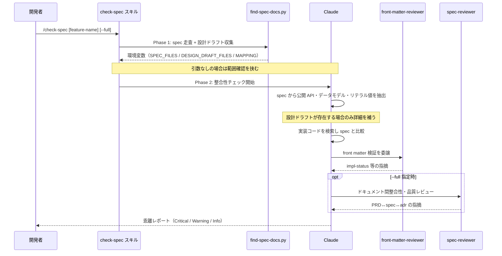

# 実装と仕様の整合性チェック

**関連 Design Doc:** [impl-spec-check_design.md](impl-spec-check_design.md)（v4.x 由来の永続 design。現行の
Design Doc は `task/{ticket-number}/design-draft.md` の一時ドラフト）
**関連 PRD:** [impl-spec-check.md](../../requirement/quality-guardrails/impl-spec-check.md)
**準拠する原則:** [CONSTITUTION.md](../../CONSTITUTION.md)（v2.0.0）の B-001, A-001, A-002, B-002, D-001, D-002

---

# 1. 背景

抽象仕様書（`specification/` 配下の spec）は「何を実現するか」の永続的な真実の源だが、実装が進むにつれて
仕様書との乖離が発生し得る。公開 API の変更、データモデルの不一致、閾値・列挙値などのリテラル値の書き換え、
仕様書に記載された機能の未実装といった乖離は、放置すると設計判断の透明性を損ない、仕様駆動の開発
サイクルを破綻させる。

技術設計書（Design Doc）は `task/{ticket-number}/design-draft.md` の一時ドラフトであり実装完了後に削除される
ため、恒久的な比較基準にはならない。したがって比較の第一級の基準は spec であり、ドラフトは存在する期間に
限って詳細を補う補助入力として扱う。

本機能は、開発者が任意のタイミングで実装コードと抽象仕様書を比較し、乖離を検出・報告することで、
親 PRD [quality-guardrails](../../requirement/quality-guardrails/index.md) の UR_003（PRD・仕様書・
設計書・実装の整合性維持）を満たす品質ガードレールを提供する。子 PRD
[impl-spec-check.md](../../requirement/quality-guardrails/impl-spec-check.md) の FR_001 を実現する。

# 2. 概要

本機能は、Claude Code プラグイン `sdd-workflow` の `check-spec` スキル（`/check-spec`）として提供する。
開発者が明示的に呼び出す**手動トリガー方式**の品質ゲートであり、実装コードと抽象仕様書の乖離を検出・
報告する。

主要な設計原則：

- **手動トリガー**: フックによる自動発火ではなく、開発者が `/check-spec` で任意のタイミングに起動する
  （実装完了時・PR 作成前・定期チェック等）。
- **検出・報告に専念**: 乖離の検出と報告までを責務とし、**自動修正は行わない**。修正の判断は開発者と
  AI の対話に委ねる（読み取り専用スキル）。
- **spec 起点**: 比較基準は `specification/` 配下の spec とし、サフィックスの有無（`{feature}.md` /
  `{feature}_spec.md`）を問わず列挙する。`task/{ticket-number}/design-draft.md` は存在する場合のみ
  補助入力として扱い、不在は正常系（エラー・警告を出さない）とする。
- **比較粒度を spec に合わせる**: spec は抽象仕様であり技術詳細を持たないため、比較対象は spec から
  読み取れる項目（公開 API・データモデル・振る舞い・リテラル値）に限定する。モジュール構成・技術スタック等
  の詳細は設計ドラフトが存在する場合に限り比較する。
- **責務の分離**: 本スキルは **spec ↔ 実装**の整合性チェックに特化する。ドキュメント間整合性
  （PRD ↔ spec ↔ adr）と品質レビューは `--full` オプション指定時に `spec-reviewer` エージェントへ
  委譲する。
- **多言語対応**: 出力は `SDD_LANG` 環境変数に応じて EN / JA を切り替える。
- **段階的検出**: リテラル値（閾値・列挙値・CHECK 制約値）を spec → 実装の 2 層（設計ドラフトが存在する
  場合は spec → design draft → 実装の 3 層）で比較し、値ドリフトを検出する。

**「何を実現するか」に焦点を当て、具体的なスクリプト構成・処理アルゴリズムの詳細は
[impl-spec-check_design.md](impl-spec-check_design.md) に委ねる。**

# 3. 要求定義

## 3.1. 機能要件 (Functional Requirements)

各要件は子 PRD [impl-spec-check.md](../../requirement/quality-guardrails/impl-spec-check.md) の
FR_001（実装コードと抽象仕様書の乖離を検出する）から派生する。

| ID     | 要件                                                                                  | 優先度 | 根拠（上流要求）                       |
|--------|-------------------------------------------------------------------------------------|-----|--------------------------------|
| FR-001 | 開発者の手動呼び出し（`/check-spec [feature-name] [--full]`）で整合性チェックを起動する               | 必須  | PRD FR_001（手動トリガー方式）           |
| FR-002 | チェック対象の抽象仕様書を `specification/` 配下からサフィックスの有無を問わず特定する（フラット構造・階層構造の両方に対応）      | 必須  | PRD FR_001 / 前提条件（`.sdd/` 構造）  |
| FR-003 | spec と実装コードを比較し、公開 API シグネチャ・データモデル・振る舞い・機能実装の乖離を検出する                     | 必須  | PRD FR_001（乖離の検出）              |
| FR-004 | リテラル値（閾値・列挙値・CHECK 制約値）を spec → 実装の 2 層で比較し、値ドリフトを検出する                      | 必須  | PRD FR_001（乖離の検出）              |
| FR-005 | 検出した乖離を重大度（Critical / Warning / Info）で分類し、未実装機能・未文書化実装とともに報告する            | 必須  | PRD FR_001（乖離の報告）              |
| FR-006 | front matter を持つ対象ドキュメントについて `front-matter-reviewer` エージェントで検証し、`impl-status` の指摘を統合する | 必須  | PRD FR_001（乖離の検出を補強する連携。親 PRD の front-matter-validation 機能を再利用） |
| FR-007 | `--full` オプション指定時に `spec-reviewer` エージェントを呼び出し、ドキュメント間整合性・品質レビューを実施する      | 推奨  | PRD FR_001（乖離の報告を拡張する連携。親 PRD の doc-consistency 機能を再利用） |
| FR-008 | 引数なし実行時は対象ファイル一覧を提示し、開発者に実行範囲を確認する                                          | 推奨  | PRD FR_001（誤操作防止）              |
| FR-009 | `task/{ticket-number}/design-draft.md` が存在する場合のみ補助入力として取り込み、モジュール構成・技術スタックの比較を追加する。不在時はエラー・警告を出さず正常終了する | 必須  | PRD FR_001（設計ドラフトの補助参照）      |
| FR-010 | 仕様書に記載され実装が見つからない機能を、spec の `impl-status` に応じて分類する（`implemented` → Critical(退行)／`not-implemented`・`in-progress` → Info(意図した先行)／未設定 → Warning(判定不能、フィールド追加を推奨)） | 必須  | PRD FR_001（乖離の検出の精度向上。「未実装」と「乖離」の区別） |

FR-010 の分岐は「仕様書に記載され実装が見つからない」場合にのみ適用する。公開 API・データモデル・振る舞いの不一致は
`impl-status` の値に関わらず常に Critical のままとする（意図した先行は免罪符にならない）。

FR-002 の「サフィックスの有無を問わず」は、`specification/` が単一種別ディレクトリであり `_spec` サフィックス
が任意になった命名規則に対応する。`{feature}_design.md`（v4.x 由来の永続 design）が残るプロジェクトでは、
spec ではなく設計ドラフトと同じ補助入力として扱う。

## 3.2. 非機能要件 (Non-Functional Requirements)

| ID      | カテゴリ  | 要件                                                                       | 目標値                              |
|---------|-------|--------------------------------------------------------------------------|----------------------------------|
| NFR-001 | 安全性   | 本スキルは読み取り専用とし、実装コード・ドキュメントを一切変更しない                          | `Write` / `Edit` ツールを禁止        |
| NFR-002 | 多言語対応 | 出力メッセージ・レポートは `SDD_LANG` に応じて EN / JA を切り替える（親 PRD DC_005 / CONSTITUTION B-002 準拠）    | `templates/{en,ja}/` の両方を提供     |
| NFR-003 | 移植性   | macOS / Linux / Windows で動作する（親 PRD DC_004 の macOS/Linux 要件を満たしつつ、Windows にも独自に対応）  | Python 標準ライブラリ（`pathlib`）で cross-platform |
| NFR-004 | 効率性   | 決定的なファイル走査を Claude のツール呼び出しではなくスクリプトに委譲し、トークン消費を抑制する（A-002） | 走査は Shell スクリプトの 1 回実行に集約 |

# 4. 提供コンポーネント

| 種別（skill/agent/hook/template） | 配置場所                                                          | 名前                       | 概要                                                            |
|------------------------------|---------------------------------------------------------------|--------------------------|---------------------------------------------------------------|
| skill                        | `skills/check-spec/SKILL.md`                                  | `check-spec`             | 実装と抽象仕様書の整合性チェック（`/check-spec`）。`user-invocable: true` |
| script                       | `skills/check-spec/scripts/find-spec-docs.py`                 | `find-spec-docs.py`      | spec ファイルの走査・設計ドラフトの収集・マッピング生成・環境変数エクスポート（Phase 1） |
| template                     | `skills/check-spec/templates/{en,ja}/check_spec_output.md`    | `check_spec_output.md`   | チェック結果レポートの出力フォーマット（EN / JA）                       |
| agent（連携）                  | `agents/front-matter-reviewer.md`                             | `front-matter-reviewer`  | front matter 検証（`impl-status` 等）を委譲                    |
| agent（連携・`--full`）        | `agents/spec-reviewer.md`                                     | `spec-reviewer`          | ドキュメント間整合性・品質レビューを委譲                            |

## 4.1. 入出力定義

### 入力

| 項目           | 種別   | 説明                                                                                       |
|--------------|------|------------------------------------------------------------------------------------------|
| `feature-name` | 引数（任意） | 対象機能名またはパス（例: `user-auth`、`auth/user-login`）。省略時は全 spec 文書が対象             |
| `--full`     | オプション | 整合性チェックに加えて `spec-reviewer` による品質レビューを実施する                              |
| `SDD_LANG`   | 環境変数 | 出力言語（`en` / `ja`）。既定値は `en`                                                        |
| `SDD_SPECIFICATION_PATH` 等 | 環境変数 | ディレクトリパス解決（未設定時は `.sdd-config.json` → 既定値の順に解決）                        |

`find-spec-docs.py` が `$CLAUDE_ENV_FILE` へエクスポートする環境変数（後続の Claude フェーズが参照）：

```bash
export CHECK_SPEC_CACHE_DIR=".sdd/.cache/check-spec"                  # キャッシュ出力先
export CHECK_SPEC_SPEC_FILES=".../spec_files.txt"                    # spec 文書一覧（第一級の比較基準）
export CHECK_SPEC_DESIGN_DRAFT_FILES=".../design_draft_files.txt"    # 設計ドラフト一覧（存在時のみ非空）
export CHECK_SPEC_MAPPING=".../file_mapping.json"                    # spec → feature → 補助 design の対応
```

### 出力

`templates/${SDD_LANG:-en}/check_spec_output.md` に従うレポート。主要構成要素：

- チェック結果サマリー表（spec ↔ 実装 / リテラル値の整合状況）
- 🔴 Critical（即座に対応が必要）
- 🟡 Warning（対応推奨、値ドリフトを含む）
- 🟢 Info（参考情報）
- 未実装機能 / 仕様書に未記載の実装
- 品質レビュー結果（`--full` オプション指定時のみ）

# 5. 用語集

| 用語             | 説明                                                                                          |
|----------------|---------------------------------------------------------------------------------------------|
| 乖離（drift）      | 抽象仕様書の記述と実装コードの実態が一致しない状態                                                    |
| リテラル値ドリフト  | 閾値・列挙値・CHECK 制約値が spec / 実装（および設計ドラフト）のいずれかの層で食い違う状態              |
| 設計ドラフト        | `task/{ticket-number}/design-draft.md`。実装期間中のみ存在する一時的な技術設計書。本機能では補助入力  |
| 手動トリガー       | フックによる自動発火ではなく、開発者が明示的にスキルを呼び出す起動方式                                 |
| Schema Registry | `*_spec.md` 内の「値域・閾値レジストリ」表。リテラル値の権威的定義（`{value-id, value, unit, source-requirement-id, section}`） |
| 2 フェーズ実行     | 決定的なファイル走査を Shell スクリプトが担い（Phase 1）、判断・比較・報告を Claude が担う（Phase 2）構成（A-002） |
| Serena MCP     | シンボル解析による高精度な整合性チェックを可能にする任意の MCP 連携                                    |

# 6. 使用例

```
/check-spec user-auth                # 特定機能の整合性チェックのみ（既定）
/check-spec auth/user-login          # 階層構造: auth ドメイン配下の user-login 機能
/check-spec auth                     # 階層構造: auth ドメイン全体
/check-spec task-management --full   # 整合性チェック + 品質レビュー
/check-spec --full                   # 全仕様書を対象に包括チェック
/check-spec                          # 引数なし: 全 spec を対象（実行前に範囲確認）
```

# 7. 振る舞い図


```mermaid
sequenceDiagram
    participant Dev as 開発者
    participant Skill as check-spec スキル
    participant Script as find-spec-docs.py
    participant Claude
    participant FMR as front-matter-reviewer
    participant SR as spec-reviewer

    Dev ->> Skill: /check-spec [feature-name] [--full]
    Skill ->> Script: Phase 1: spec 走査 + 設計ドラフト収集
    Script -->> Skill: 環境変数（SPEC_FILES / DESIGN_DRAFT_FILES / MAPPING）
    Note over Skill,Claude: 引数なしの場合は範囲確認を挟む
    Skill ->> Claude: Phase 2: 整合性チェック開始
    Claude ->> Claude: spec から公開 API・データモデル・リテラル値を抽出
    Note over Claude: 設計ドラフトが存在する場合のみ詳細を補う
    Claude ->> Claude: 実装コードを検索し spec と比較
    Claude ->> FMR: front matter 検証を委譲
    FMR -->> Claude: impl-status 等の指摘
    opt --full 指定時
        Claude ->> SR: ドキュメント間整合性・品質レビュー
        SR -->> Claude: PRD↔spec↔adr の指摘
    end
    Claude -->> Dev: 乖離レポート（Critical / Warning / Info）
```

# 8. 制約事項

- 本スキルは前提として、対象プロジェクトで `sdd-workflow` プラグインが有効化され、`.sdd/` ディレクトリ
  構造（sdd-init による初期化）が存在し、チェック対象の spec が `specification/` 配下に存在することを要する。
  設計ドラフト（`task/{ticket-number}/design-draft.md`）の存在は前提としない。
- 乖離の**検出・報告までを責務**とし、自動修正は行わない（子 PRD スコープ外）。
- spec は抽象仕様であり技術詳細を持たないため、モジュール構成・技術スタックの乖離は設計ドラフトが存在する
  場合に限り検出できる。ドラフト不在時はこれらを比較対象から外す（未検出であることを乖離と報告しない）。
- ドキュメント間（PRD ↔ spec ↔ adr）の整合性チェックは本スキル単体では行わず、`--full` 指定時に
  `spec-reviewer` へ委譲する（責務の分離）。
- Serena MCP が未設定の場合でも Grep / Glob によるテキストベース検索で動作するが、シンボル解析による
  高精度チェックは利用できない。

# 9. 原則との整合性

| 原則ID | 原則名                          | 本仕様への適用内容                                                                        |
|-------|-------------------------------|------------------------------------------------------------------------------------|
| B-001 | Vibe Coding 防止                | 抽象仕様書を真実の源とし、実装との乖離を検出することで仕様駆動の開発サイクルを維持する            |
| A-001 | Skills-First                    | `check-spec` を legacy `commands/` ではなくスキル（`skills/check-spec/`）として提供する          |
| A-002 | フックとスクリプトの責務分離        | ファイル走査を `find-spec-docs.py`（Phase 1）に委譲し、Claude は判断・比較・報告に専念（Phase 2） |
| D-001 | Specification-Driven            | **例外（記録済み）**。本機能は「実装 ↔ spec の乖離検出」機能自体であり実装が先行した特殊ケースのため、既存実装から仕様を逆算記述した。逆算後は spec を真実の源に戻す。CONSTITUTION の例外プロセス（理由記載・CHANGELOG 記録）に従う |
| B-002 | 多言語対応（EN/JA）の一貫性        | 出力テンプレートを `templates/{en,ja}/` の両方で提供し、`SDD_LANG` で切り替える              |
| D-002 | ファイル命名規則の厳守             | `specification/` 配下は `_spec` サフィックスを任意とし、サフィックス有無の両方を対象文書として特定する。設計ドラフトはファイル名固定（`design-draft.md`）で特定する |
