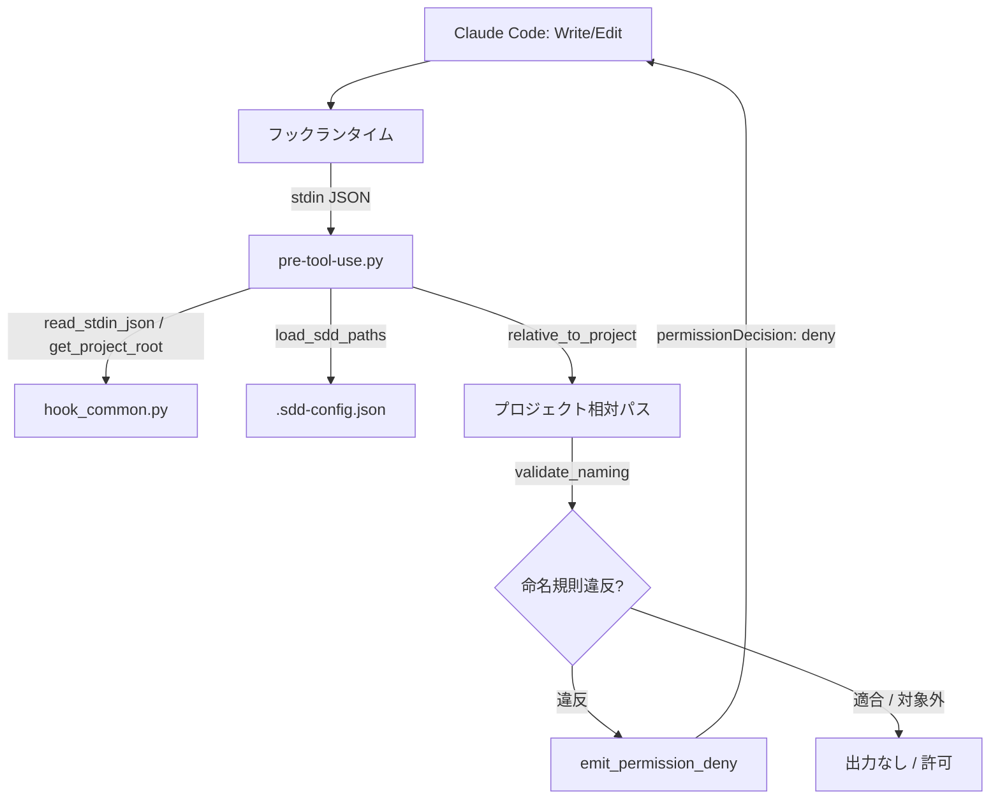

# ファイル命名規則の強制

**関連 Spec:** [naming-enforcement_spec.md](naming-enforcement_spec.md)
**関連 PRD:** [naming-enforcement.md](../../requirement/quality-guardrails/naming-enforcement.md)（親: [quality-guardrails](../../requirement/quality-guardrails/index.md)）
**準拠する原則:** [CONSTITUTION.md](../../CONSTITUTION.md) A-002（フックとスクリプトの責務分離）, D-002（ファイル命名規則の厳守）, T-003（日本語出力の文字化け防止）

---

# 1. 実装ステータス

**ステータス:** 🟢 実装済み

本設計書は既存実装（`scripts/pre-tool-use.py` の命名規則検証パート）の挙動を逆算して記述したものである。
検証対象パス・命名パターン・拒否条件は実装コードを真実の源とする。

## 1.1. 実装進捗

| モジュール/機能                       | ステータス | 備考                                                          |
|---------------------------------|--------|-------------------------------------------------------------|
| PreToolUse フックスクリプト（命名検証） | 🟢     | `scripts/pre-tool-use.py` の `validate_naming` 関数            |
| フック共通ヘルパー                     | 🟢     | `scripts/hook_common.py`（stdin 解析・パス解決・deny emit）        |
| パス設定の解決                        | 🟢     | `hook_common.load_sdd_paths`（`.sdd-config.json` 対応）         |
| フック登録                          | 🟢     | `hooks/hooks.json` の `PreToolUse`（matcher: `Write|Edit`）    |
| 回帰テスト                          | 🟢     | リポジトリルート `scripts/test-hook-scripts.sh`（適合・違反・対象外を検証。CI の `test` ジョブで実行） |

---

# 2. 設計目標

- ファイル書き込み前に**軽量・決定的**に命名規則を検証し、応答性を阻害しない（NFR-001: 500ms 以内）
- 命名規則違反を `permissionDecision: deny` で**確実にブロック**する（FR-004 / DC_001）
- 適合時・検証対象外時は一切介入しない（FR-005）
- 機械的な命名検証を Python スクリプトへ委譲し、Claude の推論を消費しない（A-002）

---

# 3. 実装方式

| 領域   | 採用方式                                       | 選定理由                                                                                   |
|------|--------------------------------------------|------------------------------------------------------------------------------------------|
| hook | Python 3 スクリプト（文字列サフィックス照合）        | 決定的・軽量な検証であり Claude の推論を要さない。A-002 に従い機械的処理をスクリプトへ委譲し 500ms 要件を満たす |
| hook | `permissionDecision: deny` によるブロック         | 命名規則違反は明確な違反条件であり、警告ではなく確実なブロックが必要（DC_001 が唯一 deny を許容する領域） |
| パス設定 | `.sdd-config.json` からのディレクトリ名解決          | プロジェクト固有の `.sdd` ルート名・ディレクトリ名にも追従する。設定なし時は既定値にフォールバック         |
| フック登録 | `hooks.json` の `PreToolUse`（matcher `Write|Edit`） | 書き込み前イベントを捕捉し、違反ファイルの生成そのものを防ぐ                                     |

---

# 4. アーキテクチャ

## 4.1. システム構成図



## 4.2. モジュール分割

| モジュール名          | 責務                                                                          | 依存関係            | 配置場所                                        |
|-------------------|-----------------------------------------------------------------------------|-----------------|-----------------------------------------------|
| pre-tool-use.py   | 書き込み対象パスを検証し、命名規則違反時に deny を emit（`validate_naming`）             | hook_common.py, os, re | `plugins/sdd-workflow/scripts/pre-tool-use.py`  |
| hook_common.py    | stdin JSON 解析・プロジェクトルート解決・`.sdd-config.json` 読み込み・deny の JSON 出力 | json, sys, os    | `plugins/sdd-workflow/scripts/hook_common.py`   |
| hooks.json        | `PreToolUse`（matcher `Write|Edit`）へのスクリプト登録                          | -               | `plugins/sdd-workflow/hooks/hooks.json`         |

`pre-tool-use.py` は命名検証に加え CONSTITUTION 原則注入も担うが、後者は別機能
（[constitution-injection.md](../../requirement/quality-guardrails/constitution-injection.md)）の責務であり本設計書のスコープ外とする。

---

# 5. データ構造

## 5.1. 検証ロジック（validate_naming）

`validate_naming(rel_path, requirement_prefix, specification_prefix)` は、違反時に理由メッセージ文字列を、
適合・対象外時に空文字列を返す。呼び出し元 `main` は事前に `relative_to_project` でプロジェクトルート外の
パスを弾き（空文字列なら検証をスキップ）、以降を相対パスで判定する。判定手順は以下のとおり。

0. パスがプロジェクトルート配下でなければ検証対象外（`main` が `relative_to_project` の空結果で `return`）
1. 拡張子が `.md` でなければ対象外（空文字列を返す）
2. ファイル名（basename）から `.md` を除いた `stem` を取り出す
3. パスが `requirement/` プレフィックス配下: `stem` が `_spec` または `_design` で終わる場合は**違反**
4. パスが `specification/` プレフィックス配下: `stem` が `_spec` にも `_design` にも該当しない場合は**違反**
5. いずれの管理対象プレフィックスにも該当しない場合は対象外（空文字列を返す）

| 対象ディレクトリ         | 判定条件                              | 違反例                              | 適合例                               |
|-------------------|-------------------------------------|------------------------------------|-------------------------------------|
| `requirement/`    | `_spec` / `_design` サフィックス**禁止** | `requirement/user-login_spec.md`   | `requirement/user-login.md`, `requirement/auth/index.md` |
| `specification/`  | `_spec` / `_design` サフィックス**必須** | `specification/user-login.md`      | `specification/user-login_spec.md`, `specification/auth/index_design.md` |

プレフィックスは `os.path.join(sdd_root, requirement_dir)` / `os.path.join(sdd_root, specification_dir)` で構築し、
`rel_path.startswith(prefix + os.sep)` で照合する（既定では `.sdd/requirement` / `.sdd/specification`）。

## 5.2. パス設定の解決（load_sdd_paths）

`hook_common.load_sdd_paths(project_root)` が `(sdd_root, requirement_dir, specification_dir)` を返す。
プロジェクトルートに `.sdd-config.json` が存在すれば `root` / `directories.requirement` /
`directories.specification` の値で上書きし、なければ既定値（`.sdd` / `requirement` / `specification`）を用いる。

## 5.3. 拒否出力（emit_permission_deny）

命名規則違反時、`hook_common.emit_permission_deny("PreToolUse", reason)` が以下の JSON を標準出力へ emit する。

```json
{
  "hookSpecificOutput": {
    "hookEventName": "PreToolUse",
    "permissionDecision": "deny",
    "permissionDecisionReason": "[AI-SDD] Naming violation: '<rel_path>'. <説明>"
  }
}
```

`json.dumps(..., ensure_ascii=False)` で出力する（T-003）。拒否理由には違反パスと、適合させるための具体例
（`requirement/`: `user-login.md`, `index.md` / `specification/`: `user-login_spec.md`, `index_design.md`）を含める。

---

# 6. ファイル構成

```
plugins/sdd-workflow/
├── scripts/
│   ├── pre-tool-use.py      # PreToolUse フック本体（validate_naming で命名検証・違反時 deny）
│   └── hook_common.py       # stdin 解析・パス解決・deny emit 共通ヘルパー
└── hooks/
    └── hooks.json           # PreToolUse（matcher: Write|Edit）へフックを登録
```

本機能はプラグインルートの `hooks.json` にフックが登録済みであり、新規スキル・エージェント追加ではないため
`plugin.json` の変更は不要（T-002）。

回帰テスト `scripts/test-hook-scripts.sh` は上記ツリー外の**リポジトリルート直下 `scripts/`** に配置され、
CI（`.github/workflows/ci.yml` の `test` ジョブ）から実行される。本設計書中の `scripts/` は文脈により
プラグイン配下（`plugins/sdd-workflow/scripts/`：フック本体）とリポジトリルート（テスト系）の 2 種を指すため注意する。

---

# 7. 非機能要件実現方針

| 要件                          | 実現方針                                                                              |
|-----------------------------|-------------------------------------------------------------------------------------|
| NFR-001（500ms 以内）          | 外部プロセス・ネットワーク・LLM 呼び出しを行わず、標準ライブラリ（`os` / `re` / `json`）の文字列照合のみで同期処理する |
| NFR-002（クロスプラットフォーム）   | POSIX 準拠の Python 3。パス区切りは `os.sep` / `os.path` を用い macOS・Linux 双方で動作する      |
| NFR-003（フックイベント仕様準拠）    | `hookSpecificOutput.permissionDecision` 形式で emit。適合・対象外は無出力・exit code 0 で許可 |

---

# 8. テスト戦略

| テストレベル       | 対象                                          | カバレッジ目標                                                        |
|----------------|---------------------------------------------|--------------------------------------------------------------------|
| 回帰テスト（hook） | リポジトリルート `scripts/test-hook-scripts.sh`   | 適合する spec 名の許可・`specification/` サフィックスなしの deny・拒否理由に違反文言を含む・`requirement/` への `_spec` の deny・`requirement/` サフィックスなしの許可・`.sdd/` 外ファイルの許可・不正 stdin の no-op |
| CI 検証          | `.github/workflows/ci.yml` の `test` ジョブ     | フックスクリプト回帰テストが CI で実行される                                    |
| 手動検証         | デモンストレーション                              | ファイル編集操作の体感遅延がない水準（NFR-001）                                 |

---

# 9. 設計判断

## 9.1. 決定事項

| 決定事項             | 選択肢                                | 決定内容                          | 理由                                                                 |
|-------------------|-------------------------------------|---------------------------------|--------------------------------------------------------------------|
| 検証の実装層          | フック（Python） / スキル（LLM）         | フック（Python スクリプト）           | A-002。決定的なサフィックス照合を LLM に委ねるとトークン浪費・応答遅延を招く            |
| ブロッキング可否       | deny でブロック / 非ブロッキング警告       | deny でブロック                     | DC_001。命名規則違反はワークフロー整合性を破壊するため確実なブロックが必要（唯一の例外領域） |
| 検証タイミング        | 書き込み前（PreToolUse） / 書き込み後       | 書き込み前（PreToolUse）             | 違反ファイルの生成そのものを防ぐ。書き込み後では違反ファイルが一度生成されてしまう        |
| 検証対象拡張子        | 全ファイル / `.md` のみ                  | `.md` のみ                        | `.sdd/` ドキュメントは Markdown。図表・補助ファイル等の非 .md は命名規則の対象外   |
| ディレクトリ名の解決    | ハードコード / `.sdd-config.json` から解決 | `.sdd-config.json` から解決（既定値あり） | プロジェクト固有のディレクトリ名に追従。設定なし時は既定値でゼロ設定動作を維持          |
| 対象外パスの挙動       | 何か出力 / 無出力                        | 管理対象外は無出力で許可               | FR-005。`.sdd/` 外・`task/` 配下等の書き込みに一切介入しない                  |

## 9.2. 未解決の課題

| 課題                                | 影響度 | 対応方針                                                    |
|-----------------------------------|-----|-----------------------------------------------------------|
| 拒否理由メッセージが英語固定             | 低   | 現状フック出力は英語のみ。`SDD_LANG` に応じた多言語化は将来の別 Issue で検討 |
| プレフィックス照合の想定外ディレクトリ構造   | 低   | `requirement/` / `specification/` 以外の構造は対象外。ネストや別名は `.sdd-config.json` で吸収 |
| MultiEdit がフック対象外                | 低   | `pre-tool-use.py` の docstring は `Write|Edit|MultiEdit` と記載するが、`hooks.json` の matcher は `Write|Edit` で MultiEdit は現状発火しない。docstring の是正または matcher への MultiEdit 追加を別途検討 |
| stem がサフィックスのみのファイル名        | 低   | `specification/_spec.md`（stem=`_spec`）等はサフィックス保有と判定され適合扱いになる。実害は小さく、退化ファイル名の扱い厳格化は将来検討 |
| front matter 内容の検証は非対象         | -   | 本機能はファイル名のみ検証。内容検証は front-matter-validation 機能の責務（スコープ外） |

---

# 10. 原則準拠チェックリスト

| 原則ID  | 原則名                    | 準拠状況 | 備考                                                        |
|-------|--------------------------|--------|-----------------------------------------------------------|
| A-002 | フックとスクリプトの責務分離   | ✅     | 機械的な命名検証を Python フックへ委譲し、Claude の推論を消費しない        |
| D-002 | ファイル命名規則の厳守       | ✅     | requirement/ サフィックス禁止・specification/ サフィックス必須を deny で強制 |
| B-001 | Vibe Coding 防止          | ✅     | ドキュメント種別を命名で識別する前提を守り、仕様書を真実の源とするフローを維持      |
| B-002 | 多言語対応（EN/JA）の一貫性  | 適用範囲外 | 本機能はフックであり `templates/{en,ja}/` を持つスキルではない。deny メッセージは英語固定で、B-002 の適用範囲（`templates/{en,ja}/` を持つ全スキル）に含まれない。多言語化は将来の別 Issue で検討 |
| T-003 | 日本語出力の文字化け防止      | ✅     | `ensure_ascii=False` で出力（拒否理由に日本語を含む場合も文字化けを防止）    |

## 10.1. PRD 制約への準拠

`DC_001` / `IR_001` は CONSTITUTION 原則ではなく、親 PRD（quality-guardrails）の設計制約（DC）・
インターフェース要件（IR）である。CONSTITUTION 原則（B/A/D/T）とは階層が異なるため上表とは分けて扱う。
本機能は以下のとおり準拠する。

| PRD 制約ID | 内容              | 準拠状況 | 備考                                                     |
|----------|------------------|--------|--------------------------------------------------------|
| DC_001   | ブロッキングの最小化  | ✅     | deny は命名規則違反のみに限定。適合・対象外は無介入               |
| IR_001   | フックイベント仕様準拠 | ✅     | `PreToolUse` の JSON Decision Control 仕様に準拠して emit    |
