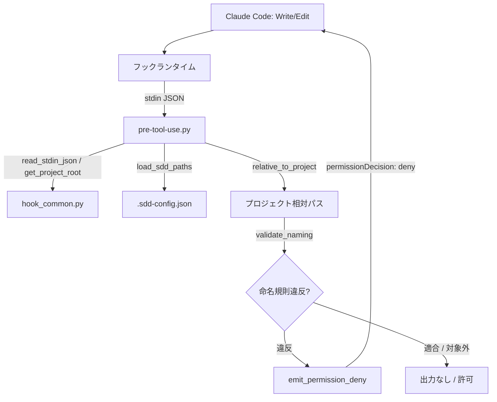

# ファイル命名規則の強制

**関連 Spec:** [naming-enforcement_spec.md](naming-enforcement_spec.md)
**関連 PRD:** [naming-enforcement.md](../../requirement/quality-guardrails/naming-enforcement.md)（親: [quality-guardrails](../../requirement/quality-guardrails/index.md)）
**準拠する原則:** [CONSTITUTION.md](../../CONSTITUTION.md) A-002（フックとスクリプトの責務分離）, D-002（ファイル命名規則の厳守）, T-003（日本語出力の文字化け防止）

---

# 1. 実装ステータス

**ステータス:** 🟢 実装済み

本設計書は既存実装（`scripts/pre-tool-use.py` の命名規則検証パート）の挙動を逆算して記述したものである。
検証対象パス・命名パターン・拒否条件は実装コードを真実の源とする。

## 1.1. 実装進捗

| モジュール/機能                       | ステータス | 備考                                                          |
|---------------------------------|--------|-------------------------------------------------------------|
| 命名規則の単一定義                    | 🟢     | `scripts/naming.py` の `validate_naming` / `determine_type` 関数。`recommend-front-matter` スキルの `determine_type` 呼び出しとも共有する |
| PreToolUse フックスクリプト（命名検証） | 🟢     | `scripts/pre-tool-use.py` が `naming.validate_naming` を呼び出して検証            |
| フック共通ヘルパー                     | 🟢     | `scripts/hook_common.py`（stdin 解析・パス解決・deny emit）        |
| パス設定の解決                        | 🟢     | `hook_common.load_sdd_paths`（`.sdd-config.json` 対応）         |
| 無視パターンの読み込み                   | 🟢     | `hook_common.load_naming_ignore_patterns`（`.sdd-config.json` の `naming.ignore_patterns` 対応） |
| フック登録                          | 🟢     | `hooks/hooks.json` の `PreToolUse`（matcher: `Write|Edit`）    |
| 回帰テスト                          | 🟢     | リポジトリルート `scripts/test-hook-scripts.sh`（適合・違反・対象外を検証。CI の `test` ジョブで実行） |

---

# 2. 設計目標

- ファイル書き込み前に**軽量・決定的**に命名規則を検証し、応答性を阻害しない（NFR-001: 500ms 以内）
- 命名規則違反を `permissionDecision: deny` で**確実にブロック**する（FR-004 / DC_001）
- 適合時・検証対象外時は一切介入しない（FR-005）
- 機械的な命名検証を Python スクリプトへ委譲し、Claude の推論を消費しない（A-002）

---

# 3. 実装方式

| 領域   | 採用方式                                       | 選定理由                                                                                   |
|------|--------------------------------------------|------------------------------------------------------------------------------------------|
| hook | Python 3 スクリプト（文字列サフィックス照合）        | 決定的・軽量な検証であり Claude の推論を要さない。A-002 に従い機械的処理をスクリプトへ委譲し 500ms 要件を満たす |
| hook | `permissionDecision: deny` によるブロック         | 命名規則違反は明確な違反条件であり、警告ではなく確実なブロックが必要（DC_001 が唯一 deny を許容する領域） |
| パス設定 | `.sdd-config.json` からのディレクトリ名解決          | プロジェクト固有の `.sdd` ルート名・ディレクトリ名にも追従する。設定なし時は既定値にフォールバック         |
| フック登録 | `hooks.json` の `PreToolUse`（matcher `Write|Edit`） | 書き込み前イベントを捕捉し、違反ファイルの生成そのものを防ぐ                                     |

---

# 4. アーキテクチャ

## 4.1. システム構成図


```mermaid
graph TD
    CC[Claude Code: Write/Edit] --> RT[フックランタイム]
    RT -->|stdin JSON| PTU[pre-tool-use.py]
    PTU -->|read_stdin_json / get_project_root| HC[hook_common.py]
    PTU -->|load_sdd_paths| CFG[.sdd-config.json]
    PTU -->|relative_to_project| REL[プロジェクト相対パス]
    REL -->|validate_naming| CHK{命名規則違反?}
    CHK -->|違反| DENY[emit_permission_deny]
    CHK -->|適合 / 対象外| PASS[出力なし / 許可]
    DENY -->|permissionDecision: deny| CC
```

## 4.2. モジュール分割

| モジュール名          | 責務                                                                          | 依存関係            | 配置場所                                        |
|-------------------|-----------------------------------------------------------------------------|-----------------|-----------------------------------------------|
| naming.py         | 命名規則の単一定義（`validate_naming` による検証、`determine_type` による種別判定、サフィックス定数 `SPEC_SUFFIX` / `DESIGN_SUFFIX` と派生ヘルパー `is_design_stem` / `feature_name`） | pathlib, fnmatch | `plugins/sdd-workflow/scripts/naming.py`        |
| pre-tool-use.py   | 書き込み対象パスを検証し、命名規則違反時に deny を emit（`naming.validate_naming` を呼び出す） | hook_common.py, naming.py, re, tempfile, pathlib | `plugins/sdd-workflow/scripts/pre-tool-use.py`  |
| hook_common.py    | stdin JSON 解析・プロジェクトルート解決・`.sdd-config.json` 読み込み（パス設定・無視パターン）・deny の JSON 出力 | json, os, sys, pathlib | `plugins/sdd-workflow/scripts/hook_common.py`   |
| hooks.json        | `PreToolUse`（matcher `Write|Edit`）へのスクリプト登録                          | -               | `plugins/sdd-workflow/hooks/hooks.json`         |

サフィックス文字列（`_spec` / `_design`）は `naming.py` にのみリテラルとして存在し、`doc_walker.find_spec_doc`
と `check-spec` の `find-spec-docs.py` はそこから import する（同じ規則が複数箇所で再宣言され食い違うのを防ぐ）。

`naming.py` は本機能専用ではなく、`recommend-front-matter` スキル（`scan-documents.py`）の `determine_type` 呼び出しとも
共有される横断モジュールである（詳細は [front-matter-recommend_design.md](../workflow-foundation/front-matter-recommend_design.md) を参照）。

`pre-tool-use.py` は命名検証に加え CONSTITUTION 原則注入も担うが、後者は別機能
（[constitution-injection.md](../../requirement/quality-guardrails/constitution-injection.md)）の責務であり本設計書のスコープ外とする。

---

# 5. データ構造

## 5.1. 検証ロジック（validate_naming）

`validate_naming(rel_path, requirement_prefix, ignore_patterns=())` は、違反時に
理由メッセージ文字列を、適合・対象外時に空文字列を返す。呼び出し元 `main` は事前に `relative_to_project`
でプロジェクトルート外のパスを弾き（空文字列なら検証をスキップ）、以降を相対パスで判定する。判定手順は
以下のとおり。

0. パスがプロジェクトルート配下でなければ検証対象外（`main` が `relative_to_project` の空結果で `return`）
1. 拡張子が `.md` でなければ対象外（空文字列を返す）
2. ファイル名（basename）が `ignore_patterns` のいずれかに `fnmatch` で一致する場合は対象外（FR-006、空文字列を返す）
3. パスが `requirement/` プレフィックス配下かつ `stem`（`.md` を除いた basename）が `_spec` または
   `_design` で終わる場合のみ**違反**
4. 上記に該当しない場合はすべて対象外（`specification/` 配下・`adr/` 配下・管理対象外パスを含め空文字列を返す）

| 対象ディレクトリ         | 判定条件                              | 違反例                              | 適合例                               |
|-------------------|-------------------------------------|------------------------------------|-------------------------------------|
| `requirement/`    | `_spec` / `_design` サフィックス**禁止** | `requirement/user-login_spec.md`   | `requirement/user-login.md`, `requirement/auth/index.md` |
| `specification/`  | サフィックス**任意**（検証しない）        | なし（常に適合）                      | `specification/user-login.md`, `specification/user-login_spec.md`, `specification/auth/index_design.md` |
| `adr/`            | サフィックス**任意**（プレフィックスを受け取らず常に対象外） | なし（常に適合）                      | `adr/user-login.md`, `adr/user-login-decisions.md` |

プレフィックスは `SddPaths.requirement_prefix`（= `str(Path(root) / requirement_dir)`）で構築し、
`Path(rel_path).is_relative_to(prefix)` で照合する（既定では `.sdd/requirement`）。パス操作はすべて
`pathlib.Path` で行い、文字列の `os.path` 操作は使わない。

## 5.2. パス設定の解決（load_sdd_paths）

`hook_common.load_sdd_paths(project_root)` が `SddPaths` データクラス
（`root` / `requirement_dir` / `specification_dir` / `adr_dir` / `task_dir` と、
それぞれの project-relative プレフィックスを返す property）を返す。プロジェクトルートに
`.sdd-config.json` が存在すれば `root` と `directories.{requirement,specification,adr,task}` の値で
上書きし、なければ既定値（`.sdd` / `requirement` / `specification` / `adr` / `task`）を用いる。

**戻り値をタプルではなくオブジェクトにする理由**: `adr` / `task` は `requirement` / `specification` より
後に追加されたディレクトリであり、位置依存のタプルを伸ばすとディレクトリ追加ごとに全呼び出し元
（`pre-tool-use.py` / `post-tool-use.py` / `sdd_index.py`）が捨て変数のために書き換わる。属性アクセスに
すれば必要なディレクトリだけを参照でき、追加は `SddPaths` 1 箇所で済む。`pre-tool-use.py` は
`paths.requirement_prefix` と `paths.root` のみを使う。

## 5.2bis. 無視パターンの解決（load_naming_ignore_patterns）

`hook_common.load_naming_ignore_patterns(project_root)` が `.sdd-config.json` の `naming.ignore_patterns`
（文字列配列）を読み込み、タプルとして返す。設定ファイルが存在しない・`naming` キーが無い・JSON が壊れている・
`ignore_patterns` の値がリストでない場合は空タプル `()` を返す（既存の `load_sdd_paths` と同じフォールバック方針）。
配列内の非文字列要素は無視して読み飛ばす。

## 5.3. 拒否出力（emit_permission_deny）

命名規則違反時、`hook_common.emit_permission_deny("PreToolUse", reason)` が以下の JSON を標準出力へ emit する。

```json
{
  "hookSpecificOutput": {
    "hookEventName": "PreToolUse",
    "permissionDecision": "deny",
    "permissionDecisionReason": "[AI-SDD] Naming violation: '<rel_path>'. <説明>"
  }
}
```

`json.dumps(..., ensure_ascii=False)` で出力する（T-003）。拒否理由には違反パスと、適合させるための具体例
（`requirement/`: `user-login.md`, `index.md`）を含める。`specification/` は deny 対象ではないため、
このメッセージ経路は `requirement/` 違反時のみ発火する。

---

# 6. ファイル構成

```
plugins/sdd-workflow/
├── scripts/
│   ├── naming.py            # 命名規則の単一定義（validate_naming / determine_type / サフィックス定数）。recommend-front-matter・doc_walker・check-spec と共有
│   ├── pre-tool-use.py      # PreToolUse フック本体（naming.validate_naming を呼び出し違反時 deny）
│   └── hook_common.py       # stdin 解析・パス解決・deny emit 共通ヘルパー
└── hooks/
    └── hooks.json           # PreToolUse（matcher: Write|Edit）へフックを登録
```

本機能はプラグインルートの `hooks.json` にフックが登録済みであり、新規スキル・エージェント追加ではないため
`plugin.json` の変更は不要（T-002）。

回帰テスト `scripts/test-hook-scripts.sh` は上記ツリー外の**リポジトリルート直下 `scripts/`** に配置され、
CI（`.github/workflows/ci.yml` の `test` ジョブ）から実行される。本設計書中の `scripts/` は文脈により
プラグイン配下（`plugins/sdd-workflow/scripts/`：フック本体）とリポジトリルート（テスト系）の 2 種を指すため注意する。

---

# 7. 非機能要件実現方針

| 要件                          | 実現方針                                                                              |
|-----------------------------|-------------------------------------------------------------------------------------|
| NFR-001（500ms 以内）          | 外部プロセス・ネットワーク・LLM 呼び出しを行わず、標準ライブラリ（`os` / `re` / `json`）の文字列照合のみで同期処理する |
| NFR-002（クロスプラットフォーム）   | POSIX 準拠の Python 3。パス操作は `pathlib.Path` を用い macOS・Linux 双方で動作する      |
| NFR-003（フックイベント仕様準拠）    | `hookSpecificOutput.permissionDecision` 形式で emit。適合・対象外は無出力・exit code 0 で許可 |

---

# 8. テスト戦略

| テストレベル       | 対象                                          | カバレッジ目標                                                        |
|----------------|---------------------------------------------|--------------------------------------------------------------------|
| 回帰テスト（hook） | リポジトリルート `scripts/test-hook-scripts.sh`   | 適合する spec 名の許可・`specification/` サフィックスなしの許可・`adr/` のサフィックスあり/なし双方の許可・拒否理由に違反文言を含む・`requirement/` への `_spec` の deny・`requirement/` サフィックスなしの許可・`.sdd/` 外ファイルの許可・不正 stdin の no-op・`.sdd-config.json` によるカスタム root/ディレクトリ名設定下での prefix 解決（custom-root 版の deny/許可） |
| CI 検証          | `.github/workflows/ci.yml` の `test` ジョブ     | フックスクリプト回帰テストが CI で実行される                                    |
| 手動検証         | デモンストレーション                              | ファイル編集操作の体感遅延がない水準（NFR-001）                                 |

---

# 9. 設計判断

## 9.1. 決定事項

| 決定事項             | 選択肢                                | 決定内容                          | 理由                                                                 |
|-------------------|-------------------------------------|---------------------------------|--------------------------------------------------------------------|
| 検証の実装層          | フック（Python） / スキル（LLM）         | フック（Python スクリプト）           | A-002。決定的なサフィックス照合を LLM に委ねるとトークン浪費・応答遅延を招く            |
| ブロッキング可否       | deny でブロック / 非ブロッキング警告       | deny でブロック                     | DC_001。命名規則違反はワークフロー整合性を破壊するため確実なブロックが必要（唯一の例外領域） |
| 検証タイミング        | 書き込み前（PreToolUse） / 書き込み後       | 書き込み前（PreToolUse）             | 違反ファイルの生成そのものを防ぐ。書き込み後では違反ファイルが一度生成されてしまう        |
| 検証対象拡張子        | 全ファイル / `.md` のみ                  | `.md` のみ                        | `.sdd/` ドキュメントは Markdown。図表・補助ファイル等の非 .md は命名規則の対象外   |
| ディレクトリ名の解決    | ハードコード / `.sdd-config.json` から解決 | `.sdd-config.json` から解決（既定値あり） | プロジェクト固有のディレクトリ名に追従。設定なし時は既定値でゼロ設定動作を維持          |
| 対象外パスの挙動       | 何か出力 / 無出力                        | 管理対象外は無出力で許可               | FR-005。`.sdd/` 外・`task/` 配下等の書き込みに一切介入しない                  |
| 無視パターンのマッチ方式 | `fnmatch`（glob） / 正規表現 / 単純な前方一致 | `fnmatch`（glob）                    | FR-006。既存実装（`find-implementation-files.py`）と同じ照合方式を採用し実装・設定記述の一貫性を保つ。正規表現よりエスケープ不要で書きやすい |

## 9.2. 未解決の課題

| 課題                                | 影響度 | 対応方針                                                    |
|-----------------------------------|-----|-----------------------------------------------------------|
| 拒否理由メッセージが英語固定             | 低   | 現状フック出力は英語のみ。`SDD_LANG` に応じた多言語化は将来の別 Issue で検討 |
| プレフィックス照合の想定外ディレクトリ構造   | 低   | `requirement/` 以外の構造（`specification/`・`adr/` を含む）は検証対象外。ネストや別名は `.sdd-config.json` で吸収 |
| MultiEdit がフック対象外                | 低   | `hooks.json` の matcher は `Write|Edit` で MultiEdit は現状発火しない。docstring（`pre-tool-use.py:2`）も `Write|Edit` のみを記載しており矛盾はないが、`MultiEdit` 対応が必要になった場合は matcher への追加を別途検討 |
| `adr/` 用プレフィックスが未実装         | 低   | `validate_naming` は `adr_prefix` を受け取らず、`adr/` は「管理対象外パス」として常に許可される。結果的にサフィックス任意という望む挙動には一致するが、明示的な `adr/` 認識ではない。将来 `adr/` 固有の検証（例: front matter `type: "adr"` との整合）が必要になった場合に再検討 |
| front matter 内容の検証は非対象         | -   | 本機能はファイル名のみ検証。内容検証は front-matter-validation 機能の責務（スコープ外） |

---

# 10. 原則準拠チェックリスト

| 原則ID  | 原則名                    | 準拠状況 | 備考                                                        |
|-------|--------------------------|--------|-----------------------------------------------------------|
| A-002 | フックとスクリプトの責務分離   | ✅     | 機械的な命名検証を Python フックへ委譲し、Claude の推論を消費しない        |
| D-002 | ファイル命名規則の厳守       | ✅     | requirement/ サフィックス禁止を deny で強制。specification/ はサフィックス任意（単一種別ディレクトリのため検証不要） |
| B-001 | Vibe Coding 防止          | ✅     | ドキュメント種別を命名で識別する前提を守り、仕様書を真実の源とするフローを維持      |
| B-002 | 多言語対応（EN/JA）の一貫性  | 適用範囲外 | 本機能はフックであり `templates/{en,ja}/` を持つスキルではない。deny メッセージは英語固定で、B-002 の適用範囲（`templates/{en,ja}/` を持つ全スキル）に含まれない。多言語化は将来の別 Issue で検討 |
| T-003 | 日本語出力の文字化け防止      | ✅     | `ensure_ascii=False` で出力（拒否理由に日本語を含む場合も文字化けを防止）    |

## 10.1. PRD 制約への準拠

`DC_001` / `IR_001` は CONSTITUTION 原則ではなく、親 PRD（quality-guardrails）の設計制約（DC）・
インターフェース要件（IR）である。CONSTITUTION 原則（B/A/D/T）とは階層が異なるため上表とは分けて扱う。
本機能は以下のとおり準拠する。

| PRD 制約ID | 内容              | 準拠状況 | 備考                                                     |
|----------|------------------|--------|--------------------------------------------------------|
| DC_001   | ブロッキングの最小化  | ✅     | deny は命名規則違反のみに限定。適合・対象外は無介入               |
| IR_001   | フックイベント仕様準拠 | ✅     | `PreToolUse` の JSON Decision Control 仕様に準拠して emit    |
