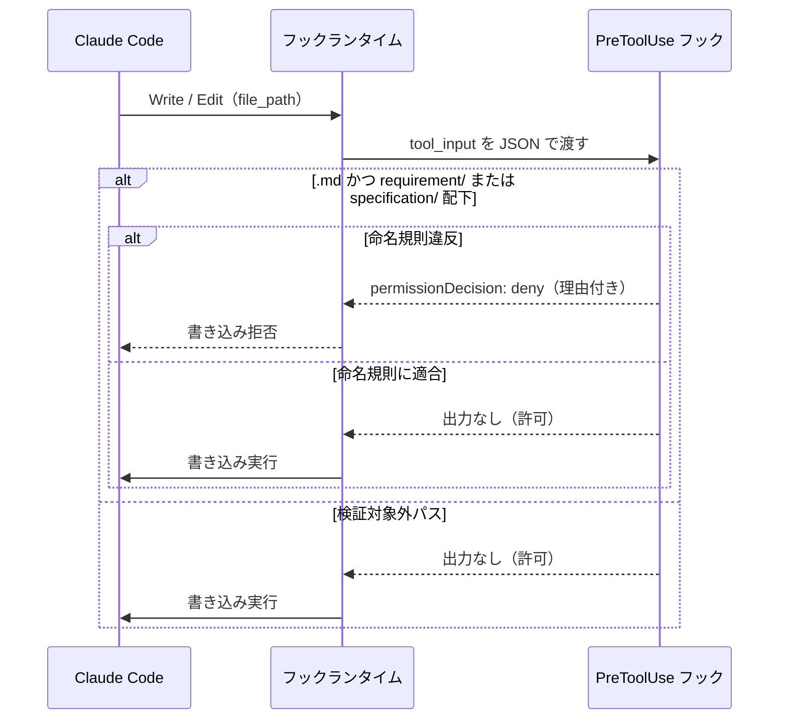

# ファイル命名規則の強制

**関連 Design Doc:** [naming-enforcement_design.md](naming-enforcement_design.md)
**関連 PRD:** [naming-enforcement.md](../../requirement/quality-guardrails/naming-enforcement.md)（親: [quality-guardrails](../../requirement/quality-guardrails/index.md)）
**準拠する原則:** [CONSTITUTION.md](../../CONSTITUTION.md) D-002（ファイル命名規則の厳守）, B-001（Vibe Coding 防止）, B-002（多言語対応の一貫性）

---

# 1. 背景 `<MUST>`

`.sdd/` 配下のドキュメントは、ディレクトリとファイル名のサフィックスによって種別が識別される。
`requirement/` 配下は要求仕様書（サフィックスなし）、`specification/` 配下は抽象仕様書（`_spec.md`）・
技術設計書（`_design.md`）として扱われる。この命名規則は AI-SDD ワークフロー全体の前提であり、
[CONSTITUTION.md](../../CONSTITUTION.md) の原則 D-002（ファイル命名規則の厳守）で非交渉原則として定義されている。

命名規則に違反したファイルが書き込まれると、ドキュメント種別の識別が破綻し、後続の整合性チェック・
ドキュメント間参照・ワークフロー自動化が機能しなくなる。人間や AI の注意力に依存した規約遵守は破られやすいため、
本機能は違反ファイルの書き込みをフックで**構造的にブロック**し、規約遵守を強制する。

# 2. 概要 `<MUST>`

本機能は、`.sdd/` 配下へのファイル書き込み・編集イベントを捕捉し、ファイル名が命名規則に違反していないかを
検証する。違反時は JSON Decision Control（`permissionDecision: deny`）により、理由を添えて書き込みを拒否する。
主要な設計原則は以下のとおり。

- **書き込み前検証**: ファイルが書き込まれる前（`PreToolUse`）に検証し、違反ファイルの生成そのものを防ぐ
- **構造的ブロック**: 命名規則違反は警告に留めず `deny` で確実にブロックする（親 PRD DC_001 が唯一ブロックを許容する領域）
- **軽量・決定的**: 判断は正規表現・文字列照合のみで完結し、LLM 推論やネットワークアクセスを行わない（NFR-001）
- **設定可能なパス**: 検証対象ディレクトリ名は `.sdd-config.json` から解決し、プロジェクト固有のディレクトリ名にも追従する

「何を検証し、どうブロックするか」を定義し、具体的な検証対象パス・判定条件・拒否メッセージ形式の詳細は
[naming-enforcement_design.md](naming-enforcement_design.md) に委ねる。

# 3. 要求定義 `<RECOMMENDED>`

## 3.1. 機能要件 (Functional Requirements)

| ID     | 要件                                                                       | 優先度 | 根拠（上流要求）                          |
|--------|--------------------------------------------------------------------------|-----|-------------------------------------|
| FR-001 | `.sdd/` 配下へのファイル書き込み・編集前に命名規則を検証する                     | 必須  | 子 PRD FR_001 / 親 PRD UR_004・FR_002 |
| FR-002 | `requirement/` 配下のファイルに `_spec` / `_design` サフィックスがあれば拒否する | 必須  | 子 PRD FR_001                        |
| FR-003 | `specification/` 配下のファイルに `_spec` / `_design` サフィックスがなければ拒否する | 必須  | 子 PRD FR_001                        |
| FR-004 | 違反時は `permissionDecision: deny` により理由付きで書き込みをブロックする         | 必須  | 子 PRD FR_001 / 親 PRD DC_001・IR_001 |
| FR-005 | 命名規則に適合する場合・検証対象外パスの場合はブロックせず開発フローに介入しない        | 必須  | 親 PRD DC_001（ブロッキングの最小化）から派生 |

検証対象は `.md` ファイルのみとする。`requirement/` / `specification/` いずれの管理対象ディレクトリにも
該当しないパス（`.sdd/` 外のソースコード、`task/` 配下等）は本機能の検証対象外とし、ブロックしない（FR-005）。

## 3.2. 非機能要件 (Non-Functional Requirements)

| ID      | カテゴリ         | 要件                                                       | 目標値                                     |
|---------|--------------|----------------------------------------------------------|--------------------------------------------|
| NFR-001 | 性能           | フック処理は軽量でファイル編集の応答性を阻害しない                 | スクリプト単体の実行時間 500ms 以内（親 PRD NFR_001） |
| NFR-002 | 互換性         | macOS / Linux で動作する                                   | 親 PRD DC_004                              |
| NFR-003 | インターフェース | Claude Code フックイベント仕様・JSON Decision Control に準拠する | 親 PRD IR_001                              |

NFR-003 について、本機能は命名規則違反という明確な違反条件に対してのみ `deny` を用いる。適合時・対象外時は
何も出力せず exit code 0 で正常終了し、書き込みを許可する（親 PRD DC_001）。

# 4. 提供コンポーネント `<MUST>`

| 種別   | 配置場所                                          | 名前                | 概要                                                                   |
|------|-----------------------------------------------|-------------------|----------------------------------------------------------------------|
| hook | `scripts/pre-tool-use.py` + `hooks/hooks.json` | PreToolUse フック    | `Write` / `Edit` の書き込み前に `.sdd/` ファイル命名規則を検証し、違反時に `deny` する（FR-001〜005） |

`pre-tool-use.py` は本機能（命名規則検証）に加え、別機能である CONSTITUTION 原則注入
（[constitution-injection.md](../../requirement/quality-guardrails/constitution-injection.md)）も担う。
本仕様書は命名規則検証パートのみを対象とし、原則注入は当該子 PRD の仕様書で扱う。

## 4.1. 入出力定義 `<OPTIONAL>`

### PreToolUse フック（命名規則検証パート）

**入力**: フックランタイムから stdin 経由で渡される JSON。少なくとも書き込み対象の `tool_input.file_path` を含む。
検証対象ディレクトリ名はプロジェクトルートの `.sdd-config.json`（存在すれば）から解決する。

**出力**: 命名規則違反を検知した場合のみ、`permissionDecision: deny` と違反理由を含む JSON を標準出力に emit する。
適合時・検証対象外時は何も出力しない（FR-005）。

```json
{
  "hookSpecificOutput": {
    "hookEventName": "PreToolUse",
    "permissionDecision": "deny",
    "permissionDecisionReason": "[AI-SDD] Naming violation: '...'. ..."
  }
}
```

# 5. 用語集 `<OPTIONAL>`

| 用語                  | 説明                                                                            |
|---------------------|-------------------------------------------------------------------------------|
| 命名規則               | `requirement/` はサフィックスなし、`specification/` は `_spec.md` / `_design.md` 必須という規約 |
| PreToolUse フック      | `Write` / `Edit` ツール実行の直前に発火する Claude Code のフックイベント                 |
| JSON Decision Control | フックがツール実行の許可・拒否を JSON 出力（`permissionDecision`）で制御する Claude Code の仕組み      |
| deny                | ツール実行をブロックする `permissionDecision` の値                                    |
| `.sdd-config.json`   | `.sdd` ルート名・`requirement` / `specification` ディレクトリ名を上書き設定するプロジェクト設定ファイル |

# 6. 使用例 `<RECOMMENDED>`

```
# specification/ にサフィックスなしのファイルを書こうとする → ブロック
Write .sdd/specification/user-login.md
  → deny: [AI-SDD] Naming violation: '.sdd/specification/user-login.md'.
    Files under specification/ require a _spec.md or _design.md suffix ...

# requirement/ に _spec サフィックス付きで書こうとする → ブロック
Write .sdd/requirement/user-login_spec.md
  → deny: [AI-SDD] Naming violation: '.sdd/requirement/user-login_spec.md'.
    Files under requirement/ must not have a _spec/_design suffix ...

# 命名規則に適合 → そのまま書き込み
Write .sdd/specification/user-login_spec.md   → （介入なし・許可）
Write .sdd/requirement/user-login.md          → （介入なし・許可）

# .sdd/ 外のソースコード → 検証対象外
Write src/main.py                             → （命名検証は介入なし）
```

# 7. 振る舞い図 `<OPTIONAL>`



# 8. 制約事項 `<OPTIONAL>`

- 本機能はファイル**名**のみを検証する。front matter の内容検証は
  [front-matter-validation.md](../../requirement/quality-guardrails/front-matter-validation.md) の責務でありスコープ外。
- 検証対象は `.md` ファイルに限定する。それ以外の拡張子は命名検証を行わない。
- 本機能の発火対象は `Write` / `Edit` ツールに限定する（`MultiEdit` は現状スコープ外）。
- ブロッキング動作（`deny`）は命名規則違反に限定する。他の品質ゲートは警告・促しに留める（親 PRD DC_001）。
- 検証対象ディレクトリの判定はパスのプレフィックス照合に基づく。`.sdd-config.json` によるディレクトリ名の
  カスタマイズには追従するが、想定外のディレクトリ構造は検証対象外として扱う。

# 9. 原則との整合性 `<RECOMMENDED>`

| 原則ID  | 原則名                    | 本仕様への適用内容                                                            |
|-------|--------------------------|------------------------------------------------------------------------|
| D-002 | ファイル命名規則の厳守       | 命名規則違反の書き込みを構造的にブロックし、規約遵守を強制する（本機能の存在意義）        |
| B-001 | Vibe Coding 防止          | ドキュメント種別を命名で識別する前提を守り、仕様書を真実の源とするワークフローを維持する    |
| B-002 | 多言語対応（EN/JA）の一貫性 | 拒否理由メッセージはフック出力の責務として定義（現状は英語固定、多言語化は将来検討）      |

---

# PRD 整合性レビュー結果

| 確認項目             | 結果                                                                     |
|--------------------|--------------------------------------------------------------------------|
| 要求カバレッジ        | 子 PRD FR_001（requirement/ 禁止・specification/ 必須・deny によるブロック）を FR-001〜FR-004 に分解してカバー（FR-005 は親 PRD DC_001 から派生した spec 固有要求） |
| 要求 ID 参照         | 各 FR に対応する子 PRD FR_001 / 親 PRD UR_004・FR_002・NFR_001・IR_001・DC_001 を「根拠」列に明記 |
| 非機能要求の反映      | 親 PRD NFR_001・IR_001・DC_001 を NFR-001〜003 および制約事項に反映            |
| 用語整合性           | 親 PRD 用語集の「JSON Decision Control」定義に統一。命名規則の定義は CLAUDE.md・D-002 に整合 |
