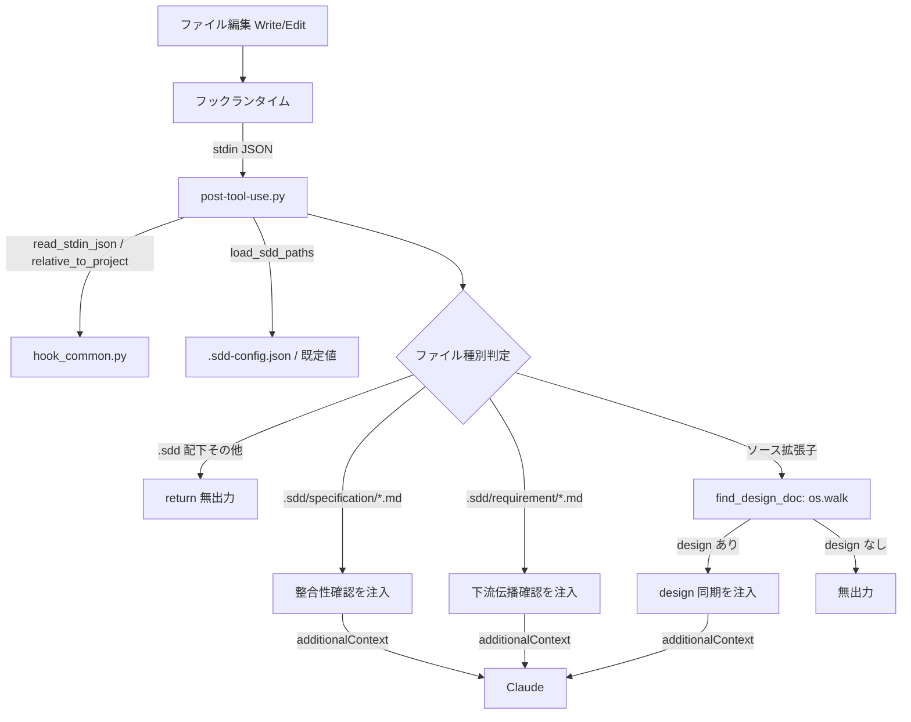

# ドキュメント更新漏れ検知

**関連 Spec:** [stale-doc-detection_spec.md](stale-doc-detection_spec.md)
**関連 PRD:** [stale-doc-detection.md](../../requirement/quality-guardrails/stale-doc-detection.md)（親: [quality-guardrails](../../requirement/quality-guardrails/index.md)）
**準拠する原則:** [CONSTITUTION.md](../../CONSTITUTION.md) A-002（フックとスクリプトの責務分離）, B-001（Vibe Coding 防止）, D-001（Specification-Driven）

---

# 1. 実装ステータス `<MUST>`

**ステータス:** 🟢 実装済み

本設計書は既存実装（`scripts/post-tool-use.py` および `scripts/hook_common.py`）の挙動を逆算して記述した
ものである。検知トリガー・検知条件・警告内容は実装コードを真実の源とする。

## 1.1. 実装進捗

| モジュール/機能                | ステータス | 備考                                                          |
|------------------------------|--------|-------------------------------------------------------------|
| PostToolUse フックスクリプト     | 🟢     | `scripts/post-tool-use.py`（3 種の検知分岐 + 無介入）             |
| フック共通ヘルパー               | 🟢     | `scripts/hook_common.py`（stdin 解析・パス解決・additionalContext emit） |
| フック登録                      | 🟢     | `hooks/hooks.json` の `PostToolUse`（matcher: `Write\|Edit`）   |
| 回帰テスト                      | 🟢     | リポジトリルート `scripts/test-hook-scripts.sh`（3 分岐 + 無介入を検証。CI の `test` ジョブで実行） |

---

# 2. 設計目標 `<MUST>`

- ファイル編集後に**軽量・決定的**に更新漏れの可能性を判定し、応答性を阻害しない（NFR-001: 500ms 以内）
- 検知は**非ブロッキング**とし、`additionalContext` によって確認・同期を促すに留める（FR-004 / DC_001）
- ファイル種別（仕様書 / 要求仕様 / ソースコード）に応じて促す内容を切り替える（FR-001〜003）
- 更新漏れの可能性がない編集には一切介入しない（FR-005）
- 機械的なパス判定（フック）と判断・検証（検証スキル）の**責務を分離**する（A-002）

---

# 3. 実装方式 `<MUST>`

| 領域   | 採用方式                                | 選定理由                                                                        |
|------|-------------------------------------|-------------------------------------------------------------------------------|
| hook | Python 3 スクリプト（パス判定 + ファイル探索） | 決定的・軽量な判定であり Claude の推論を要さない。A-002 に従い機械的処理をスクリプトへ委譲し 500ms 要件を満たす |
| hook | `additionalContext` による非ブロッキング注入 | 編集を拒否せず AI へ促しを渡すのに適合（DC_001）。`deny` は使わない                          |
| 実装同期 | `os.walk` による `{stem}_design.md` 探索  | ソースの basename から対応設計書を階層構造を問わず発見する。設計書がある場合のみ同期を促す         |

本機能は検証・修正を Claude や検証スキル（doc-consistency-checker / `/check-spec`）に委ね、フックは
「更新漏れの可能性の可視化」までを担う。

---

# 4. アーキテクチャ `<MUST>`

## 4.1. システム構成図



## 4.2. モジュール分割

| モジュール名           | 責務                                                                            | 依存関係            | 配置場所                                          |
|---------------------|-------------------------------------------------------------------------------|-------------------|-------------------------------------------------|
| post-tool-use.py    | 編集ファイルパスから種別を判定し、更新漏れの可能性に応じ additionalContext を emit（検知のみ・非ブロッキング） | hook_common.py, os, sys | `plugins/sdd-workflow/scripts/post-tool-use.py`   |
| find_design_doc     | 仕様書ディレクトリ配下を `os.walk` し、`{stem}_design.md` の相対パスを返す（なければ空文字） | os                | `post-tool-use.py` 内の関数                        |
| hook_common.py      | stdin JSON 解析・プロジェクトルート解決・`.sdd` パス解決・additionalContext emit の共通ヘルパー | json, sys, os      | `plugins/sdd-workflow/scripts/hook_common.py`      |
| hooks.json          | `PostToolUse`（matcher `Write\|Edit`）へのスクリプト登録                            | -                 | `plugins/sdd-workflow/hooks/hooks.json`            |

---

# 5. 検知ロジック `<MUST>`

## 5.1. 判定順序と検知条件

`post-tool-use.py` は編集ファイルの相対パス（`rel_path`）を求め、以下の順に判定する。最初に一致した分岐で
`additionalContext` を emit して `return` する（早期リターン）。

| 順序 | 検知条件                                                        | 動作                                       | 対応 FR |
|----|---------------------------------------------------------------|-------------------------------------------|--------|
| 0  | `file_path` が空 / プロジェクト外                                 | 何もしない（return）                         | -      |
| 1  | `.sdd/specification/` 配下かつ `.md`                             | PRD ↔ spec ↔ design の整合性確認を注入        | FR-001 |
| 2  | `.sdd/requirement/` 配下かつ `.md`（PRD）                        | 下流 spec / design への変更伝播確認を注入      | FR-002 |
| 3  | `.sdd/` 配下のその他                                             | 何もしない（return）                         | FR-005 |
| 4  | ソース拡張子（`SOURCE_EXTENSIONS`）かつ対応 `{stem}_design.md` あり | design 同期を注入                            | FR-003 |
| 5  | 上記いずれにも該当しない（対応 design なし等）                       | 何もしない                                   | FR-005 |

`.sdd` パス（`sdd_root` / `requirement_dir` / `specification_dir`）は `load_sdd_paths` により解決され、
`.sdd-config.json` があればその設定を、なければ既定値（`.sdd` / `requirement` / `specification`）を用いる。

## 5.2. ソース → 設計書の対応付け（find_design_doc）

ソースコード編集時は、編集ファイルの拡張子を除いた basename（`stem`）を用いて、仕様書ディレクトリ配下を
`os.walk` で走査し `{stem}_design.md` を探索する。発見した場合のみ design 同期を促す。

- 対応付けは basename ベースのため、ディレクトリ階層（フラット / 階層構造）を問わず発見できる
- 仕様書ディレクトリが存在しない場合（未初期化プロジェクト）は探索せず無出力

## 5.3. 警告内容（additionalContext）

いずれの分岐も `emit_additional_context("PostToolUse", <text>)` で以下の JSON を emit する。
`ensure_ascii=False` により、パスに含まれる日本語も UTF-8 のまま保持する（T-003）。

```json
{
  "hookSpecificOutput": {
    "hookEventName": "PostToolUse",
    "additionalContext": "<検知分岐に応じたメッセージ>"
  }
}
```

| 分岐   | メッセージ要旨（英語で注入）                                                                        |
|------|------------------------------------------------------------------------------------------|
| 仕様書 | `'<rel_path>' was updated.` PRD ↔ `*_spec.md` ↔ `*_design.md`（要求 ID 参照・データモデル・API 定義）の整合性確認と doc-consistency-checker スキルの実行を促す |
| PRD  | `'<rel_path>' (PRD) was updated.` 下流 `*_spec.md` / `*_design.md` への変更伝播（新規・変更された UR/FR/NFR）の確認と doc-consistency-checker スキルの実行を促す |
| ソース | `'<rel_path>' was updated and a matching design document '<design_rel>' exists.` 実装挙動が変わった場合の設計書更新（真実の源の維持）を促す |

---

# 6. ファイル構成 `<OPTIONAL>`

```
plugins/sdd-workflow/
├── scripts/
│   ├── post-tool-use.py    # PostToolUse フック本体（種別判定・検知ロジック）
│   └── hook_common.py      # stdin 解析・パス解決・additionalContext emit 共通ヘルパー
└── hooks/
    └── hooks.json          # PostToolUse（matcher: Write|Edit）へフックを登録
```

本機能はプラグインルートの `hooks.json` にフックが登録済みであり、新規スキル・エージェント追加ではないため
`plugin.json` の変更は不要（T-002）。

なお回帰テスト `scripts/test-hook-scripts.sh` は上記ツリー外の**リポジトリルート直下 `scripts/`** に配置され、
CI（`.github/workflows/ci.yml` の `test` ジョブ）から実行される。本設計書中の `scripts/` は文脈により
プラグイン配下（`plugins/sdd-workflow/scripts/`：フック本体）とリポジトリルート（テスト系）の 2 種を指すため注意する。

---

# 7. 非機能要件実現方針 `<OPTIONAL>`

| 要件                          | 実現方針                                                                                        |
|-----------------------------|-----------------------------------------------------------------------------------------------|
| NFR-001（500ms 以内）          | 外部プロセス・ネットワーク・LLM 呼び出しを行わず、標準ライブラリ（`os` / `json`）のみで同期処理する。ファイル探索は仕様書ディレクトリ配下の `os.walk` に限定する |
| NFR-002（フックイベント仕様準拠） | `hookSpecificOutput.additionalContext` 形式で emit。`deny` は使わず exit code 0 で正常終了する          |

---

# 8. テスト戦略 `<OPTIONAL>`

| テストレベル       | 対象                                        | カバレッジ目標                                                    |
|----------------|-------------------------------------------|----------------------------------------------------------------|
| 回帰テスト（hook） | リポジトリルート `scripts/test-hook-scripts.sh` | spec 編集の整合性確認・PRD 編集の下流伝播・対応 design ありソース編集の同期・対応 design なしソース編集の無介入の 4 ケース |
| CI 検証          | `.github/workflows/ci.yml` の `test` ジョブ   | フックスクリプト回帰テストが CI で実行される                              |
| 手動検証         | デモンストレーション                            | ファイル編集後の体感遅延がない水準（NFR-001）                             |

---

# 9. 設計判断 `<MUST>`

## 9.1. 決定事項

| 決定事項            | 選択肢                                | 決定内容                          | 理由                                                                 |
|------------------|--------------------------------------|---------------------------------|--------------------------------------------------------------------|
| 検知の実装層         | フック（Python）/ スキル（LLM）           | パス判定はフックに実装             | A-002。決定的なパス判定を LLM に委ねるとトークン浪費・応答遅延を招く              |
| ブロッキング可否      | deny でブロック / 非ブロッキング注入        | 非ブロッキング（additionalContext） | DC_001。編集後の更新漏れは警告に留め、修正判断は開発者と AI に委ねる               |
| 検証の責務          | フックで整合性を検証 / 促しのみ            | 促しのみ（検証は検証スキルへ誘導）    | 子 PRD スコープ外（実際の整合性検証は doc-consistency-checker 等が担う）        |
| ソース → 設計書の対応 | パスマッピング表 / basename で walk 探索   | basename で `os.walk` 探索        | 階層構造・フラット構造の双方で対応設計書を発見でき、設定不要                       |
| 検知なし時の挙動      | 常に何か出力 / 無出力                     | 該当なしは return し無出力          | FR-005。無関係な編集にノイズを出さず開発フローに介入しない                      |
| 出力エンコーディング   | `ensure_ascii=True` / `False`         | `ensure_ascii=False`（UTF-8）      | T-003。パスに含まれる日本語を additionalContext に文字化けなく含める            |

## 9.2. 未解決の課題

| 課題                                       | 影響度 | 対応方針                                                       |
|------------------------------------------|-----|-------------------------------------------------------------|
| basename 衝突（同名 stem の複数ソース）で誤った design を提示する可能性 | 低   | 最初に発見した `{stem}_design.md` を用いる。厳密なパス対応は将来検討   |
| パス規約から外れた配置のドキュメントは検知対象外            | 低   | パス判定ベースの設計上の制約。命名・配置規約は naming-enforcement で担保 |

---

# 10. 原則準拠チェックリスト `<RECOMMENDED>`

| 原則ID  | 原則名                    | 準拠状況 | 備考                                                        |
|-------|--------------------------|--------|-----------------------------------------------------------|
| A-002 | フックとスクリプトの責務分離     | ✅     | 機械的なパス判定は Python フック、整合性検証は検証スキルに分離           |
| B-001 | Vibe Coding 防止          | ✅     | 更新漏れによる仕様・実装の乖離を編集直後に検知・可視化する                 |
| D-001 | Specification-Driven      | ✅     | 関連ドキュメント（PRD / spec / design）の同期を促し真実の源を維持する    |
| T-002 | plugin.json 登録の一貫性     | ✅     | 既存フックの逆算記述であり新規コンポーネント追加なし（plugin.json 変更不要） |
| T-003 | 日本語出力の文字化け防止        | ✅     | `ensure_ascii=False` でパス中の日本語を保持                       |
