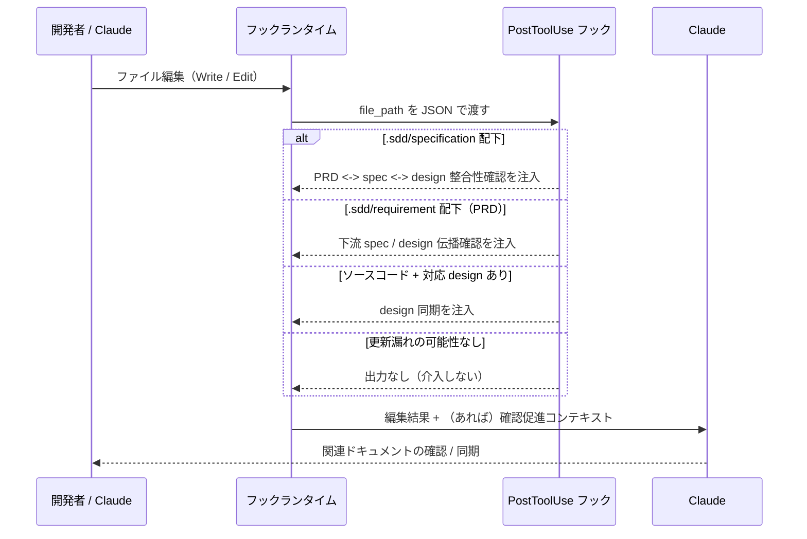

# ドキュメント更新漏れ検知

**関連 Design Doc:** [stale-doc-detection_design.md](stale-doc-detection_design.md)
**関連 PRD:** [stale-doc-detection.md](../../requirement/quality-guardrails/stale-doc-detection.md)（親: [quality-guardrails](../../requirement/quality-guardrails/index.md)）
**準拠する原則:** [CONSTITUTION.md](../../CONSTITUTION.md) A-002（フックとスクリプトの責務分離）, B-001（Vibe Coding 防止）, D-001（Specification-Driven）

---

# 1. 背景

`.sdd/` ドキュメントやソースコードの編集後に、関連ドキュメント（PRD ↔ spec ↔ design、対応する技術設計書）の
更新が漏れると、仕様と実装の乖離が静かに進行する。乖離は次に誰かがそのドキュメントを真実の源として参照した
ときに初めて顕在化し、手戻り・技術的負債・設計判断の不透明化を招く。これは [CONSTITUTION.md](../../CONSTITUTION.md) の
最上位原則 B-001（Vibe Coding 防止）・D-001（Specification-Driven）に反する。

本機能は、ファイル編集の直後（最も更新漏れが起きやすいタイミング）に自動的な検知点を設け、更新漏れの
可能性を開発者と AI に可視化する。品質保証を開発者の記憶や注意力に依存させず、構造的に促すことを狙いとする。

# 2. 概要

本機能は、ファイル編集後にファイルの種別を判定し、関連ドキュメントの更新漏れの可能性を検知して確認・同期を
促すコンテキストを注入する。主要な設計原則は以下のとおり。

- **編集後検知**: ファイル編集イベント（Write / Edit）の直後に、編集されたファイルパスから更新漏れの可能性を
  判定する
- **非ブロッキング**: 編集自体は拒否せず、確認・同期を促す情報を AI のコンテキストに追加するに留める
  （親 PRD の DC_001「ブロッキングの最小化」に準拠）
- **リマインドまでを責務とする**: 実際の整合性検証や自動修正は行わず、確認を促し検証スキルへ誘導するに留める
- **無関係な編集には介入しない**: 更新漏れの可能性がないファイル編集には何も出力せず、開発フローを妨げない

「何を検知し、どう促すか」を定義し、パス判定ロジックの具体や検知メッセージの詳細は
[stale-doc-detection_design.md](stale-doc-detection_design.md) に委ねる。

# 3. 要求定義

## 3.1. 機能要件 (Functional Requirements)

| ID     | 要件                                                                                         | 優先度 | 根拠（上流要求）                             |
|--------|--------------------------------------------------------------------------------------------|-----|-------------------------------------------|
| FR-001 | `.sdd/` 仕様書ディレクトリ（spec / design）の編集後に PRD ↔ spec ↔ design の整合性確認を促す      | 必須  | 子 PRD FR_001 / 親 PRD UR_003・FR_004    |
| FR-002 | `.sdd/` 要求仕様ディレクトリ（PRD）の編集後に下流 spec / design への変更伝播確認を促す              | 必須  | 子 PRD FR_001 / 親 PRD UR_003・FR_004    |
| FR-003 | ソースコード編集後に対応する `{stem}_design.md` が存在する場合、設計書の同期を促す                  | 必須  | 子 PRD FR_001 / 親 PRD UR_003・FR_004    |
| FR-004 | 更新漏れの検知はブロックせず、非ブロッキングで確認・同期を促すコンテキストを注入する                    | 必須  | 子 PRD（スコープ外＝自動修正しない）/ 親 PRD DC_001 |
| FR-005 | 更新漏れの可能性がない編集（対応 design のないソース編集・仕様書以外の `.sdd/` 編集）には何も出力しない | 必須  | 親 PRD DC_001（ブロッキングの最小化）から派生   |

FR-001〜FR-003 は編集されたファイルの種別（仕様書 / 要求仕様 / ソースコード）に応じて促す内容を切り替える。
本機能はリマインドまでを責務とし、整合性の実際の検証は doc-consistency-checker スキル等の検証機能に委ねる
（子 PRD スコープ外の記載に準拠）。

## 3.2. 非機能要件 (Non-Functional Requirements)

| ID      | カテゴリ         | 要件                                                       | 目標値                                     |
|---------|--------------|----------------------------------------------------------|--------------------------------------------|
| NFR-001 | 性能           | フック処理は軽量でファイル編集の応答性を阻害しない                  | スクリプト単体の実行時間 500ms 以内（親 PRD NFR_001） |
| NFR-002 | インターフェース | Claude Code フックイベント仕様・additionalContext 仕様に準拠する | 親 PRD IR_001                              |

NFR-002 について、本機能は JSON Decision Control 仕様に準拠しつつ、非ブロッキング方針（DC_001）のため
`deny` は用いず `additionalContext` のみを注入する。

# 4. 提供コンポーネント

| 種別   | 配置場所                                        | 名前                | 概要                                                                                     |
|------|---------------------------------------------|-------------------|----------------------------------------------------------------------------------------|
| hook | `scripts/post-tool-use.py` + `hooks/hooks.json` | PostToolUse フック | ファイル編集（Write / Edit）後にファイル種別を判定し、更新漏れの可能性に応じて確認・同期を促す `additionalContext` を注入する（FR-001〜005） |

## 4.1. 入出力定義

### PostToolUse フック

**入力**: フックランタイムから stdin 経由で渡される JSON。少なくとも編集対象の `tool_input.file_path`
（および `cwd`）を含む。

**出力**: 更新漏れの可能性を検知した場合のみ、`additionalContext` を含む JSON を標準出力に emit する。可能性が
ない場合は何も出力しない（FR-005）。注入するコンテキストは、更新すべき関連ドキュメントの範囲と、
doc-consistency-checker スキル等の検証手段への誘導文を含む。

```json
{
  "hookSpecificOutput": {
    "hookEventName": "PostToolUse",
    "additionalContext": "[AI-SDD] '<rel_path>' was updated. Verify consistency across PRD <-> *_spec.md <-> *_design.md ..."
  }
}
```

# 5. 用語集

| 用語                | 説明                                                                                  |
|-------------------|-------------------------------------------------------------------------------------|
| 更新漏れ            | ファイル編集後に、それと整合すべき関連ドキュメントが更新されず乖離が生じる状態                        |
| PostToolUse フック  | Claude Code がツール（Write / Edit）実行後に発火するフックイベント                          |
| additionalContext | フックが AI のコンテキストに追加情報を注入する Claude Code の仕組み                          |
| 非ブロッキング        | 編集やツール実行を拒否せず、警告・促しに留める動作                                            |
| design 同期        | ソースコードの実装挙動が変わった際に、対応する技術設計書（`{stem}_design.md`）を真実の源として更新すること |

# 6. 使用例

本機能はフックとして自動発火するため直接呼び出せない。以下はファイル編集後に想定される動作。

```
# spec を編集 → PRD <-> spec <-> design の整合性確認を促す
Edit: .sdd/specification/auth/user-login_spec.md
  → [AI-SDD] '...user-login_spec.md' was updated. Verify consistency across
    PRD <-> *_spec.md <-> *_design.md ... Consider running the doc-consistency-checker skill.

# PRD を編集 → 下流 spec / design への変更伝播を促す
Edit: .sdd/requirement/auth/user-login.md
  → [AI-SDD] '...user-login.md' (PRD) was updated. Verify that downstream
    *_spec.md / *_design.md documents reflect the change ...

# 対応 design を持つソースを編集 → 設計書の同期を促す
Edit: src/auth/user_login.py（.sdd/specification/**/user_login_design.md が存在）
  → [AI-SDD] '...user_login.py' was updated and a matching design document
    '...user_login_design.md' exists. ... update the design document ...

# 対応 design のないソースを編集 → 何も出力しない
Edit: src/util/logger.py（対応 design なし）
  → （出力なし）
```

# 7. 振る舞い図



# 8. 制約事項

- 整合性の実際の検証は本機能のスコープ外。検知・促しまでを責務とし、検証は doc-consistency-checker スキルや
  `/check-spec` 等に委ねる（子 PRD スコープ外の記載に準拠）
- 検知した更新漏れの自動修正は行わない。修正は開発者と AI の対話に委ねる
- ファイル種別・パスの判定に基づくため、パス規約から外れた配置のドキュメントは検知対象外となりうる
- 編集前のガード（命名規則の強制・原則注入）は本機能のスコープ外（親 PRD の他の子 PRD で扱う）

# 9. 原則との整合性

| 原則ID  | 原則名               | 本仕様への適用内容                                                                 |
|-------|---------------------|--------------------------------------------------------------------------------|
| A-002 | フックとスクリプトの責務分離 | 機械的なパス判定（フック）と整合性検証（検証スキル）の責務を分離し、フックは更新漏れの検知・可視化に専念する |
| B-001 | Vibe Coding 防止     | 更新漏れによる仕様・実装の乖離を編集直後に検知・可視化し、暗黙的な乖離の進行を抑止する         |
| D-001 | Specification-Driven | 編集後に関連ドキュメント（PRD / spec / design）の同期を促し、仕様書を真実の源とするフローを維持する |

---

# PRD 整合性レビュー結果

| 確認項目          | 結果                                                                                       |
|-----------------|--------------------------------------------------------------------------------------------|
| 要求カバレッジ     | 子 PRD FR_001 の 2 つのトリガー方式（.sdd 編集 / ソース編集）を FR-001〜FR-003 でカバー（FR-004・FR-005 は親 PRD DC_001 から派生した spec 固有要求） |
| 要求 ID 参照      | 各 FR に対応する子 PRD / 親 PRD（UR_003・FR_004・DC_001・NFR_001・IR_001）の要求 ID を「根拠」列に明記 |
| 非機能要求の反映   | 親 PRD NFR_001・IR_001・DC_001 を NFR-001〜002 および制約事項に反映                             |
| 用語整合性        | 親 PRD 用語集の「フック」「additionalContext」定義に整合。本機能固有の「更新漏れ」「design 同期」を追加定義 |
| スコープ整合性     | 子 PRD スコープ外（整合性検証・自動修正・編集前ガード）を制約事項として明記                          |
